# AutoScaling

[뒤로가기](../)

## AutoScaling 구성

(1) 시작 템플릿 생성\
AutoScaling은 시작 템플릿을 기반으로 EC2를 생성해준다.\

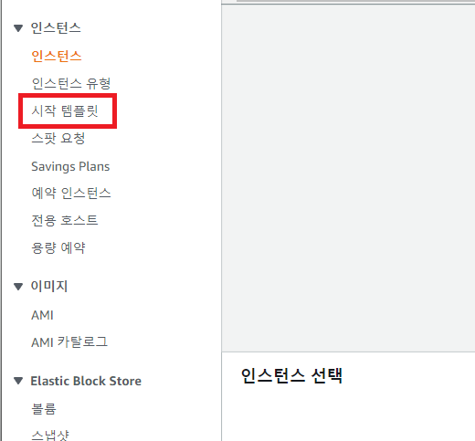\
(시작 템플릿 -> 시작 템플릿 생성 클릭)\

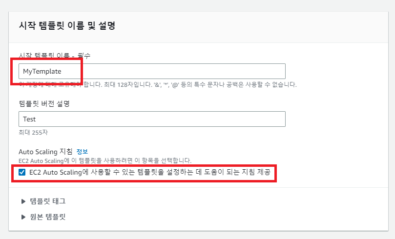\
(템플릿 이름과 AutoScaling 지침 체크)

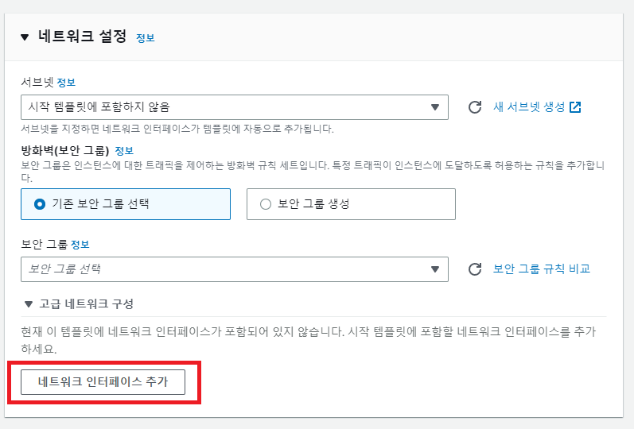\
(네트워크 인터페이스 추가)

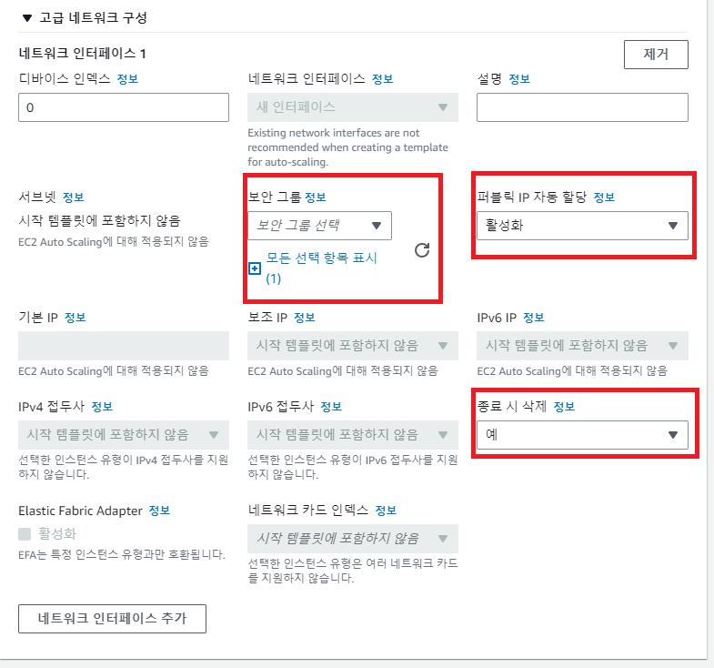\
(보안 그룹은 Default로 하고 다음과 같이 설정)\
\

#### AMI, 인스턴스 유형, 키페어는 기존 EC2 설정과 같이 설정한다.

그리고 시작 템플릿 생성\

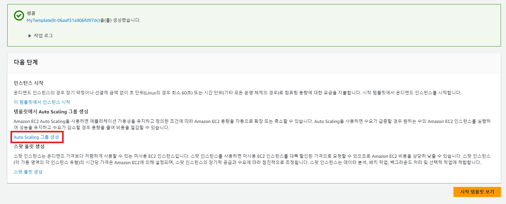\
(생성되면 다음과 같은 창이 뜨고 여기서 AutoScaling 그룹 생성을 클릭)\

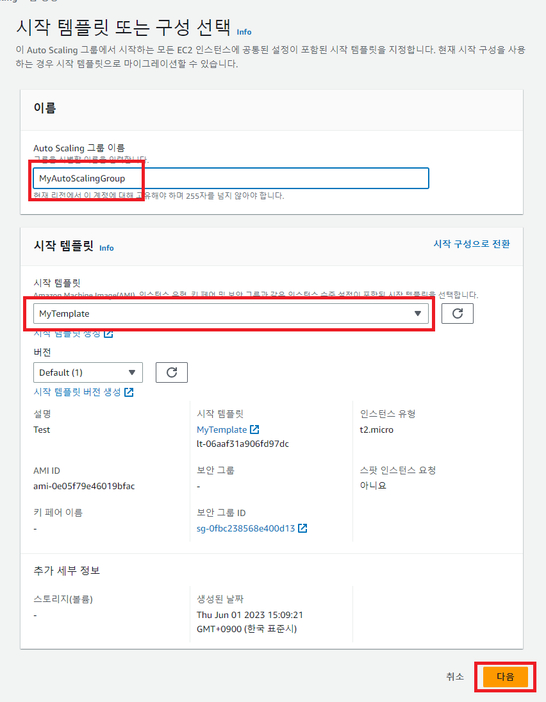\
(그룹 명을 입력하고 방금 생성한 템플릿을 선택한뒤 다음을 클릭)\

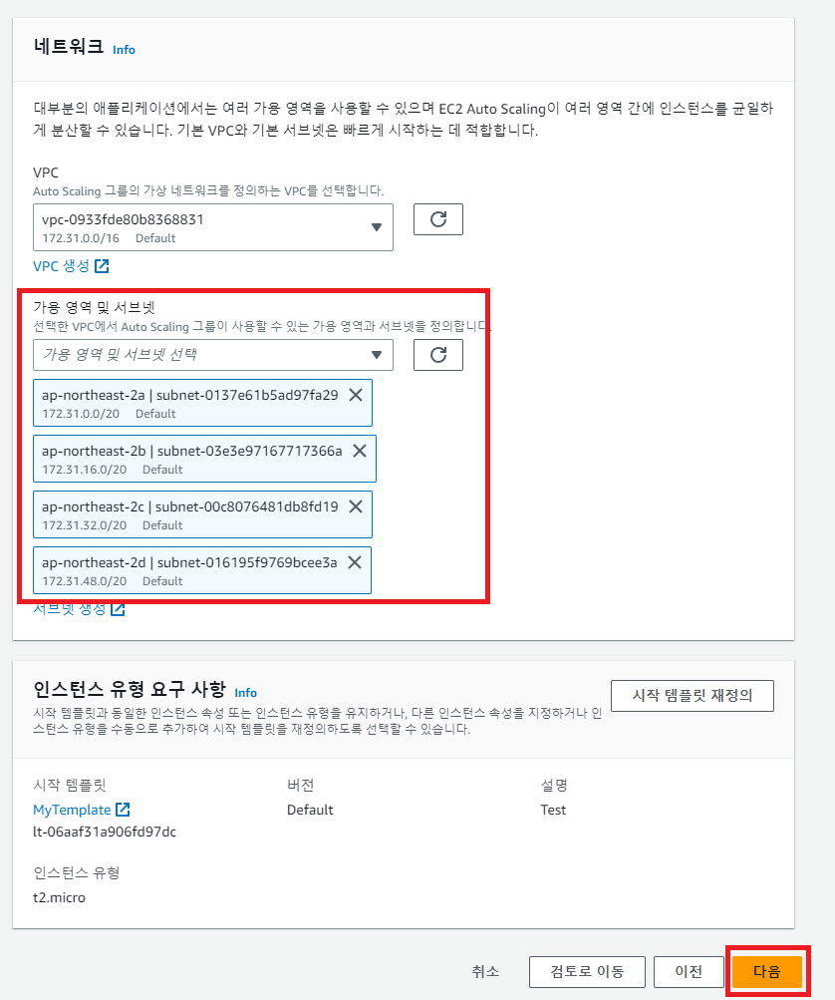\
(원하는 가용 영역을 선택한뒤 다음)\

#### 태그 추가 구성까지 모두 스킵한다.  

\
태그를 추가하게되면 AutoScaling 그룹에서 생성된 모든 인스턴스에 적용이 된다.\
(다음과 같이 태그를 추가한뒤 입력하고 다음으로 넘어가자)\

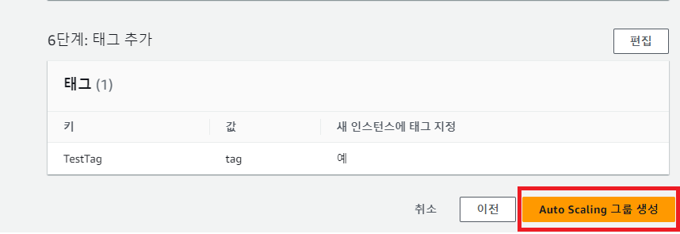\
(창을 내려 그룹 생성을 클릭한다.)

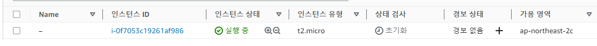\
(다음과 같이 인스턴스가 자동으로 1개 생성된 것을 볼 수 있다.)\

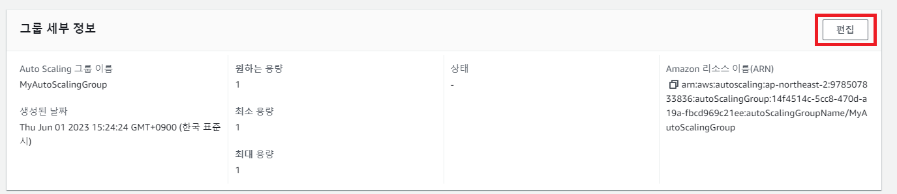\
(생성한 Autoscaling구성에서 그룹 세부 정보 편집을 클릭한뒤)\

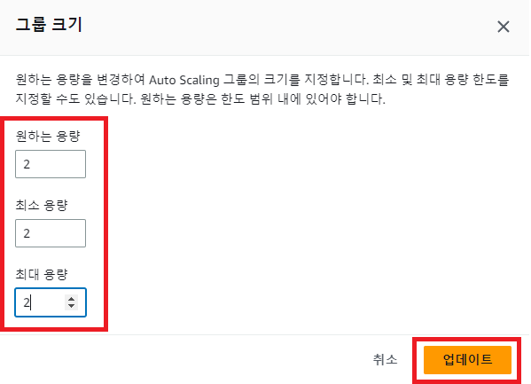\
(2개로 설정하고 업데이트를 해보자)\

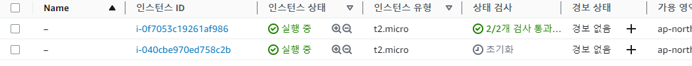\
(자동으로 1개가 더 추가된것을 볼 수 있다.) (만약 1개를 종료하면 자동으로 다시 1개를 생성하게 된다.)\

#### 추가 기능 (사용자 데이터)

\
(생성한 그룹을 클릭)\

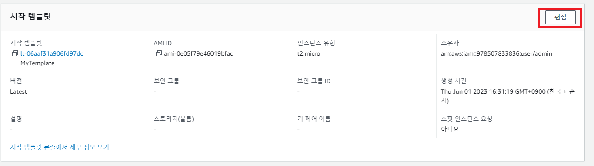\
(시작 템플릿 편집 클릭)\

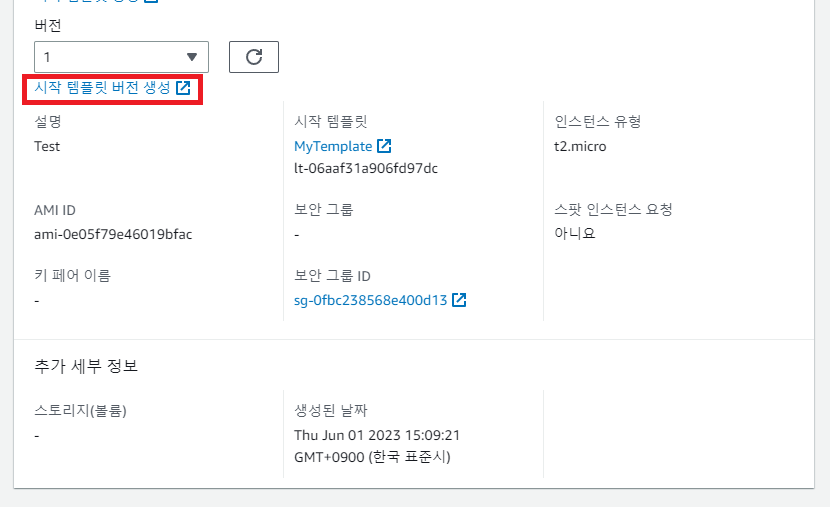\
(시작 템플릿 버전 생성 클릭)

\
(체크하고 밑으로 내려 고급 세부 정보 클릭)\

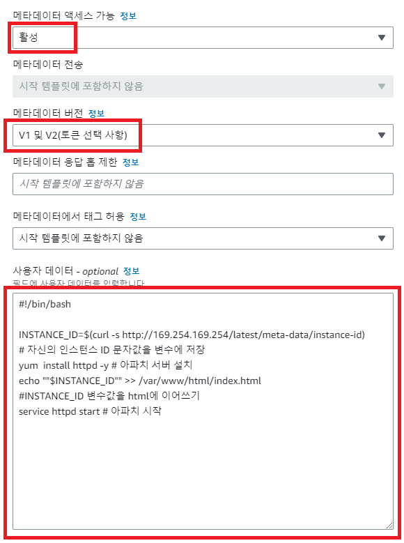\
(메타데이터 액세스 가능 : 활성\
메타데이터 버전 : V1 및 V2(토큰 선택사항)\
사용자 데이터는 다음과 같이 입력)\
V2 이후로 토큰을 발행해야 인스턴스의 메타 데이터에 접근이 가능하다.\

> \#!/bin/bash\
>
>
> INSTANCE\_ID=$(curl -s http://169.254.169.254/latest/meta-data/instance-id)\
> \# 자신의 인스턴스 ID 문자값을 변수에 저장\
> yum install httpd -y # 아파치 서버 설치\
> echo ""$INSTANCE\_ID"" >> /var/www/html/index.html\
> \#INSTANCE\_ID 변수값을 html에 이어쓰기\
> service httpd start # 아파치 시작\
>

이렇게 설정하면 인스턴스가 생성되자마자 해당 Bash가 실행 된다.\

그리고 템플릿 버전 생성 클릭\

\
(다시 시작 템플릿 편집을 클릭)\

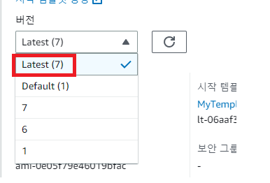\
(버전에서 Latest로 변경하고 밑으로 내려 업데이트를 클릭)\

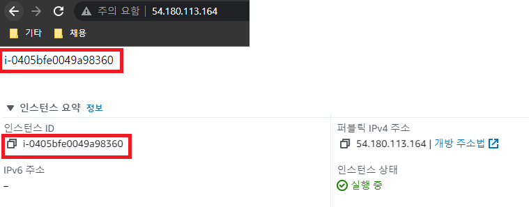\
(인스턴스 ID를 출력하는걸 볼 수 있다.)\
