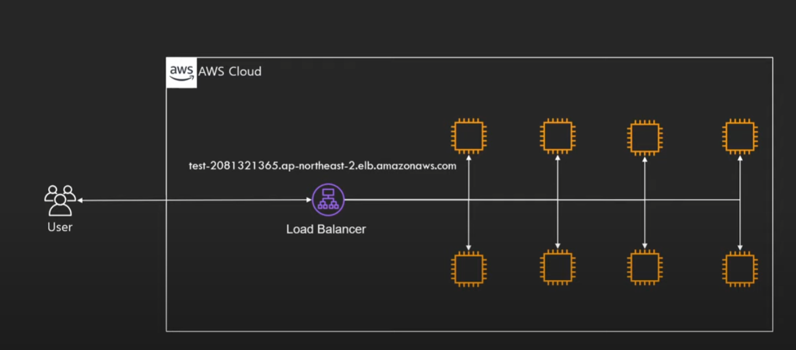
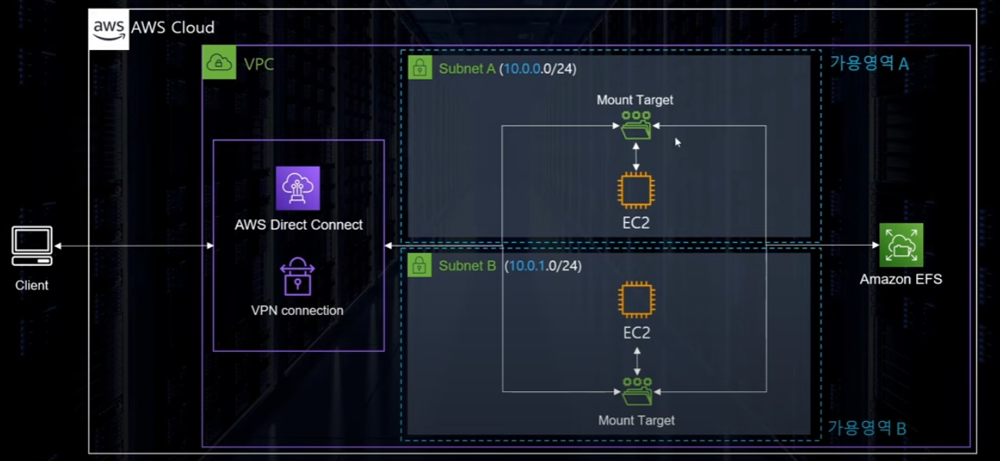

<<<<<<< HEAD
# AWS

[뒤로가기](../../)

## AWS

[AWS 강의실](https://www.youtube.com/@AWSClassroom) (AWS 강의실 영상을 참고해 정리함)\

200개가 넘는 데이터센터로 완벽한 기능의 서비스를 제공하는 클라우드 플랫폼\

### 구조

AWS Cloud는 각 나라 별(리전)로 가용 영역을 제공하며 글로벌 서비스로는 IAM, Amazon CloudFront 리전영역에 속하지만 가용영역에는 없는 VPC, S3가 있다.  리전 : AWS의 서비스가 제공되는 서버의 물리적 위치 전 세계에 흩어져 있으며 각 리전마다 코드가 부여됨\
예시) 서울 리전은 ap-northeast-2\
리전(지역) 별로 지원하는 서비스가 다르다.\

리전을 선택할때 고려할 점)\

=======
[뒤로가기](../../README.md)

# AWS

[AWS 강의실](https://www.youtube.com/@AWSClassroom)
(AWS 강의실 영상을 참고해 정리함) 

200개가 넘는 데이터센터로 완벽한 기능의 서비스를 제공하는 클라우드 플랫폼 

## 구조

AWS Cloud는 각 나라 별(리전)로 가용 영역을 제공하며
글로벌 서비스로는 IAM, Amazon CloudFront
리전영역에 속하지만 가용영역에는 없는 VPC, S3가 있다.

리전 : AWS의 서비스가 제공되는 서버의 물리적 위치
전 세계에 흩어져 있으며 각 리전마다 코드가 부여됨 
예시) 서울 리전은 ap-northeast-2 
리전(지역) 별로 지원하는 서비스가 다르다. 

리전을 선택할때 고려할 점) 
>>>>>>> parent of 4d4a984 (GITBOOK-5: change request with no subject merged in GitBook)

1. 지연 속도
2. 국가 정책 (데이터, 서비스 제공)
3. 사용 가능한 AWS 서비스

<<<<<<< HEAD
가용 영역 : 리전의 하부 단위 (데이터 센터 건물)\
가용 영역들의 연결은 매우 빠른 네크워크로 연결되며 반드시 일정 거리 만큼 떨어져 있다.\
(재해, 보안을 대비하기 위해)

엣지 로케이션 : 임시 데이터 저장소 (CDN)

AWS는 서비스가 제공되는 지역의 기반에 따라 글로벌 서비스와 리전 서비스로 분류 한다.\
=======
가용 영역 : 리전의 하부 단위 (데이터 센터 건물) 
가용 영역들의 연결은 매우 빠른 네크워크로 연결되며 반드시 일정 거리 만큼 떨어져 있다.  (재해, 보안을 대비하기 위해)

엣지 로케이션 : 임시 데이터 저장소 (CDN)

AWS는 서비스가 제공되는 지역의 기반에 따라 글로벌 서비스와 리전 서비스로 분류 한다. 
>>>>>>> parent of 4d4a984 (GITBOOK-5: change request with no subject merged in GitBook)
글로벌 서비스 : 데이터 및 서비스를 전 세계의 모든 인프라가 공유

1. CloudFront
2. IAM
3. Route53
<<<<<<< HEAD
4. WAF\

=======
4. WAF 
>>>>>>> parent of 4d4a984 (GITBOOK-5: change request with no subject merged in GitBook)

지역 서비스 : 특정 리전을 기반으로 데이터 및 서비스를 제공

1. S3(파일을 저장하는 서비스) : 전 세계에 동일하게 사용하나 데이터 자체는 리전에 종속
2. 그외 서비스들

ARN : AWS 모든 리소스의 고유 아이디

<<<<<<< HEAD
### AWS 기본 환경

### 사용자

루트 유저\

생성한 계정의 모든 권한을 가진 유저\
생성시 만든 이메일 주소로 로그인\
잃어버릴 경우 복구가 힘들기에 MFA 설정이 필수\
루트 유저는 관리용으로만 이용한다. (계정 설정 변경, 빌링 등등)\
AWS API 호출 불가 (액세스 키, 스크릿 키 부여 불가)\

IAM 유저\

IAM을 통해 생성한 유저 만들 때 주어진 아이디로 로그인\
기본 권한이 없어 따로 권한을 부여해야 한다.\
예시) 관리자 IAM, 개발자 IAM, 디자이너 IAM, 회계팀 IAM\
AWS API 호출 가능\
액세스 키 : 아이디\
시크릿 키 : 패스워드\
AWS의 관리를 제외한 모든 작업은 관리용 IAM 유저를 만들어 사용한다.\

***

### IAM (AWS Identity and Access Management)

AWS 서비스와 리소스에 대한 액세스를 안전하게 관리할 수 있다.\

=======
## AWS 기본 환경

## 사용자

루트 유저 

생성한 계정의 모든 권한을 가진 유저 
생성시 만든 이메일 주소로 로그인 
잃어버릴 경우 복구가 힘들기에 MFA 설정이 필수 
루트 유저는 관리용으로만 이용한다. (계정 설정 변경, 빌링 등등) 
AWS API 호출 불가 (액세스 키, 스크릿 키 부여 불가) 

IAM 유저 

IAM을 통해 생성한 유저
만들 때 주어진 아이디로 로그인 
기본 권한이 없어 따로 권한을 부여해야 한다. 
예시) 관리자 IAM, 개발자 IAM, 디자이너 IAM, 회계팀 IAM  
AWS API 호출 가능 
액세스 키 : 아이디 
시크릿 키 : 패스워드 
AWS의 관리를 제외한 모든 작업은 관리용 IAM 유저를 만들어 사용한다. 

---

## IAM (AWS Identity and Access Management)

AWS 서비스와 리소스에 대한 액세스를 안전하게 관리할 수 있다. 
>>>>>>> parent of 4d4a984 (GITBOOK-5: change request with no subject merged in GitBook)

1. AWS 계정 관리 및 리소스, 사용자, 서비스 권한 제어 (서비스 사용 인증 정보 부여)
2. 사용자의 생성 및 관리 및 계정 보안 (일정 시간마다 사용자의 패스워드를 변경할 수 있다.)
3. 다른 계정과의 리소스 공유
4. 계정 별명 부여 가능 (로그인 주소 생성 가능)
5. IAM은 글로벌 서비스임

<<<<<<< HEAD
\[IAM 구성] 
=======
[IAM 구성]

>>>>>>> parent of 4d4a984 (GITBOOK-5: change request with no subject merged in GitBook)

1. 사용자 : 실제 AWS를 사용하는 유저
2. 그룹 : 유저 집합, 그룹에 속한 유저에 따라 권한 부여
3. 정책 : 유저의 역할에 관한 문서 (JSON형식으로 정의)
<<<<<<< HEAD
4. 역할\
   (1) AWS 리소스에 부여하여 AWS 리소스가 무엇을 할 수 있는지 정의\
   (2) 다른 사용자가 역할을 부여 받아 사용\
   (3) 다른 자격에 대해서 신뢰관계를 구축 가능\
   (4) 역할을 바꾸며 서비스 사용 가능\

IAM 권한 검증 과정1  IAM 권한 검증 과정2 

#### IAM 정책의 종류

* 자격 기반 정책 (IAM유저, 그룹, 역할에 부여하는 정책)
* 리소스 기반 정책 (S3,SQS,VPC-Endpoint, KMS에 부여하는 정책)

#### IAM 자격 증명 보고서

\
계정의 모든 사용자, 암호, 액세스키, MFA장치등의 증명 상태를 문서화한 보고서\
4시간 단위로 생성 가능하며, AWS 콘솔, CLI, API에서 생성 요청 및 다운로드 가능\

#### IAM을 사용할때 주의 사항
=======
4. 역할  
   (1) AWS 리소스에 부여하여 AWS 리소스가 무엇을 할 수 있는지 정의 
   (2) 다른 사용자가 역할을 부여 받아 사용 
   (3) 다른 자격에 대해서 신뢰관계를 구축 가능 
   (4) 역할을 바꾸며 서비스 사용 가능 

IAM 권한 검증 과정1

IAM 권한 검증 과정2

### IAM 정책의 종류

- 자격 기반 정책 (IAM유저, 그룹, 역할에 부여하는 정책)
- 리소스 기반 정책 (S3,SQS,VPC-Endpoint, KMS에 부여하는 정책)

### IAM 자격 증명 보고서

 
계정의 모든 사용자, 암호, 액세스키, MFA장치등의 증명 상태를 문서화한 보고서 
4시간 단위로 생성 가능하며, AWS 콘솔, CLI, API에서 생성 요청 및 다운로드 가능 

### IAM을 사용할때 주의 사항
>>>>>>> parent of 4d4a984 (GITBOOK-5: change request with no subject merged in GitBook)

1. 루트 계정은 사용하지 않는다.
2. 불필요한 유저 만들기 않기
3. 그룹과 정책을 사용한다.
4. 최소한의 권한만 부여
5. MFA 활성화
6. 액세스키 대신 역할을 활용 (되도록 액세스키는 사용하지 않는다.)
7. IAM 자격 증명 보고서 활용

<<<<<<< HEAD
#### [계정 설정 방법](AWSaccount.md)

***

### 가상화

단일 컴퓨터의 하드웨어 요소를 일반적으로 VM이라고 하는 다수의 가상 컴퓨터로 분할하는 기술\

HVM : 3세대 가상화 머신(하드웨어에서 직접 가상화를 지원)\
직접 OS가 하드웨어와 통신에 속도가 빠르다.\

AWS 클라우드 환경에서 리소스를 작은 단위로 빠르게 구성할 수 있는 원동력은 가상화\

### EC2

안전하고 크기 조정이 가능한 컴퓨팅 파워를 클라우드에서 제공하는 웹 서비스\

용도 : 서버, 데이터베이스, 머신 러닝, 비트 코인 채굴, 연구용 프로그램\

구성\
인스턴스 - 컴퓨팅\
하드디스크 - EBS\
랜카드 - ENI\

EC2 가격 모델\
(1) on-Demand : 초당 컴퓨팅 파워로 측정된 가격 지불 (쓴 만큼 지불)\
(2) Spot-Instance : 경매 형식으로 시장에 남은 인스턴스를 싸게 구매하는 방식 단, 언제 다시 반납될지 모름\
(3) 예약 인스턴스 : 미리 일정 기간 약정해서 쓰는 방식\
(4) 전용 호스트 : 실제 물리적인 서버를 임대하는 방식\

EC2의 유형과 크기\
(1) 유형 => 직업\
(2) 사이즈 => 레벨\
(각 인스턴스 별로 사용 목적에 따라 최적화 : 메모리 위주, CPU 위주, 그래픽 카드 위주)\
(3) 타입별로 이름 부여 (t타입, m타입, inf타입)\
(4) 타입별 세대별로 숫자 부여 (m5 = m인스턴스 5세대)\
(5) 아키텍쳐 및 사용 기술에 따라 접두사\
t4g = t4인스턴스 중 AWS Graviton 프로세서를 사용(g)\

크기 : 인스턴스의 CPU갯수, 메모리 크기, 성능 등으로 사이즈를 결정\
 크기가 클 수록 cpu 갯수, 메모리 크기가 커지는걸 볼 수 있다.

m5a.xlarge = 인스턴스타입-세대-접두사 . 사이즈\

EBS : EC2 인스턴스에 사용할 영구 블록 스토리지 볼륨 (가상 하드 드라이브)\
(1) 인스턴스가 종료되어도 계속 유지 가능\
(인스턴스랑 EBS는 분리 되어 네트워크로 통신한다.)\
(2) EC2와 같은 가용 영역이 존재\
(3) 5가지 타입을 제공\
( 범용(SSD), 프로비저닝 된 IOPS, 쓰루풋 최적화, 콜드 HDD, 마그네틱 )\

Snapshot : 특정 시간에 EBS 상태를 저장함 (복구용)\
S3(AWS 파일 저장소)에 증분식 저장 방식으로 보관한다.\
증분식 : 변화된 부분만 저장

AMI : EC2 인스턴스를 실행하기 위해 필요한 정보를 모은 단위\
(OS, 아키텍쳐 타입(32bit), 저장공간 용량 등)\
AMI를 사용하여 EC2를 복제하거나 다른 리전 or 계정으로 전달 가능\
스냅샷을 기반으로 AMI 구성 가능\

보안 그룹 : 가상의 방화벽\

AMI 구성\

1. 1개 이상의 EBS 스냅샷\

2. 인스턴스 저장 루트 볼륨에 대한 템플렛(운영체제, 서버)\

3. 사용 권한\

4. 블록 디바이스 맵핑(EBS가 몇개 붙는지)\

AMI 타입\
EBS 기반 : EBS와 EBS 볼륨이 네크워크로 연결되어 분리 되어있음 (속도가 느림)\
\[스냅샵을 기반으로 루트 디바이스 생성]\
인스턴스 저장 기반 : 인스턴스 저장소에 저장 되어 있음 (속도가 빠름 단, 인스턴스가 삭제되면 같이 삭제됨)\
\[S3에 저장된 템플릿을 기반으로 생성]\

AMI 생성 과정\
\

#### [EC2 생성하기](EC2.md)

#### [EC2 이미지 복제](EC2\_Img.md)

***

### Autoscaling

(Verticla Scale)Scale up (EC2의 성능을 높이는것)\
단, 성능을 높여도 똑같이 비용이 비례해서 증가하지 않고 기하급수적으로 비용이 증가할 수 있다.\

(Horizontal Scale)Scale out : cpu의 갯수를 늘리는것(인스턴스를 늘리는것)\
이럴 경우 성능과 비용이 비례한다.\

그리고 Horizontal Scale 서비스를 제공하기 위해 등장한게 Autoscaling이다.\

\

#### EC2 Autoscaling의 목표 

정확한 수의 EC2 인스턴스를 보유하도록 보장\

1. 그룹의 최소 인스턴스 숫자 및 최대 인스턴스 숫자를 설정할 수 있다.
2. 다양한 스케일링 정책 적용 가능 (CPU의 부하에 따라 인스턴스 크기를 늘리기)
3. 가용영역에 인스턴스가 골고루 분산 될 수 있도록 인스턴스를 분배 (서비스 장애를 최소화 시킬 수 있음)

시작 구성 (무엇을 실행할지 -> 시작 템플릿을 기반으로 생성한다.)\

=======
### [계정 설정 방법](./AWSaccount.md)

---

## 가상화

단일 컴퓨터의 하드웨어 요소를 일반적으로 VM이라고 하는
다수의 가상 컴퓨터로 분할하는 기술 

HVM : 3세대 가상화 머신(하드웨어에서 직접 가상화를 지원) 
직접 OS가 하드웨어와 통신에 속도가 빠르다. 

AWS 클라우드 환경에서 리소스를 작은 단위로 빠르게 구성할 수 있는 원동력은 가상화 

## EC2

안전하고 크기 조정이 가능한 컴퓨팅 파워를 클라우드에서 제공하는 웹 서비스 

용도 : 서버, 데이터베이스, 머신 러닝, 비트 코인 채굴, 연구용 프로그램 

구성 
인스턴스 - 컴퓨팅 
하드디스크 - EBS 
랜카드 - ENI 

EC2 가격 모델 
(1) on-Demand : 초당 컴퓨팅 파워로 측정된 가격 지불
(쓴 만큼 지불) 
(2) Spot-Instance : 경매 형식으로 시장에 남은 인스턴스를 싸게 구매하는 방식 단, 언제 다시 반납될지 모름 
(3) 예약 인스턴스 : 미리 일정 기간 약정해서 쓰는 방식 
(4) 전용 호스트 : 실제 물리적인 서버를 임대하는 방식 

EC2의 유형과 크기 
(1) 유형 => 직업 
(2) 사이즈 => 레벨 
(각 인스턴스 별로 사용 목적에 따라 최적화 : 메모리 위주, CPU 위주, 그래픽 카드 위주) 
(3) 타입별로 이름 부여 (t타입, m타입, inf타입) 
(4) 타입별 세대별로 숫자 부여 (m5 = m인스턴스 5세대) 
(5) 아키텍쳐 및 사용 기술에 따라 접두사 
t4g = t4인스턴스 중 AWS Graviton 프로세서를 사용(g) 

크기 : 인스턴스의 CPU갯수, 메모리 크기, 성능 등으로 사이즈를 결정 

크기가 클 수록 cpu 갯수, 메모리 크기가 커지는걸 볼 수 있다.

m5a.xlarge = 인스턴스타입-세대-접두사 . 사이즈 

EBS : EC2 인스턴스에 사용할 영구 블록 스토리지 볼륨 (가상 하드 드라이브) 
(1) 인스턴스가 종료되어도 계속 유지 가능 
(인스턴스랑 EBS는 분리 되어 네트워크로 통신한다.) 
(2) EC2와 같은 가용 영역이 존재 
(3) 5가지 타입을 제공 
( 범용(SSD), 프로비저닝 된 IOPS, 쓰루풋 최적화, 콜드 HDD, 마그네틱 ) 

Snapshot : 특정 시간에 EBS 상태를 저장함 (복구용) 
S3(AWS 파일 저장소)에 증분식 저장 방식으로 보관한다. 
증분식 : 변화된 부분만 저장

AMI : EC2 인스턴스를 실행하기 위해 필요한 정보를 모은 단위 
(OS, 아키텍쳐 타입(32bit), 저장공간 용량 등) 
AMI를 사용하여 EC2를 복제하거나 다른 리전 or 계정으로 전달 가능 
스냅샷을 기반으로 AMI 구성 가능 

보안 그룹 : 가상의 방화벽 

AMI 구성 

1. 1개 이상의 EBS 스냅샷 
2. 인스턴스 저장 루트 볼륨에 대한 템플렛(운영체제, 서버) 
3. 사용 권한 
4. 블록 디바이스 맵핑(EBS가 몇개 붙는지) 

AMI 타입 
EBS 기반 : EBS와 EBS 볼륨이 네크워크로 연결되어 분리 되어있음 (속도가 느림)  [스냅샵을 기반으로 루트 디바이스 생성] 
인스턴스 저장 기반 : 인스턴스 저장소에 저장 되어 있음 (속도가 빠름 단, 인스턴스가 삭제되면 같이 삭제됨)  [S3에 저장된 템플릿을 기반으로 생성] 

AMI 생성 과정 
 

### [EC2 생성하기](./EC2.md)

### [EC2 이미지 복제](./EC2_Img.md)

---

## Autoscaling

(Verticla Scale)Scale up (EC2의 성능을 높이는것) 
단, 성능을 높여도 똑같이 비용이 비례해서 증가하지 않고 기하급수적으로 비용이 증가할 수 있다. 

(Horizontal Scale)Scale out : cpu의 갯수를 늘리는것(인스턴스를 늘리는것) 
이럴 경우 성능과 비용이 비례한다. 

그리고 Horizontal Scale 서비스를 제공하기 위해
등장한게 Autoscaling이다. 

 

### EC2 Autoscaling의 목표 

정확한 수의 EC2 인스턴스를 보유하도록 보장 

1. 그룹의 최소 인스턴스 숫자 및 최대 인스턴스 숫자를 설정할 수 있다.
2. 다양한 스케일링 정책 적용 가능 (CPU의 부하에 따라 인스턴스 크기를 늘리기)
3. 가용영역에 인스턴스가 골고루 분산 될 수 있도록 인스턴스를 분배
   (서비스 장애를 최소화 시킬 수 있음)

시작 구성 (무엇을 실행할지 -> 시작 템플릿을 기반으로 생성한다.) 
>>>>>>> parent of 4d4a984 (GITBOOK-5: change request with no subject merged in GitBook)

1. EC2의 타입, 사이즈
2. AMI
3. 보안 그룹, Key, IAM
4. 유저 데이터

<<<<<<< HEAD
모니터링 (언제 실행할지, 상태 확인)\
예시) CPU 점유율이 일정 수준 넘을때 추가로 실행\
CloudWatch 와 ELB가 연계된다.\

설정 (얼마나 실행할지)\
최대 / 최소 원하는 인스턴스 숫자\
ELB와 연동된다.\

#### [AutoScaling 구성하기](AutoScaling.md)

***

### ELB (Elastic Load Balancer)

\
다음과 같이 AutoScaling 기능으로 많은 EC2를 생성했지만 클라이언트에서는 각 EC2의 IP주소를 알아야 사용이 가능하다.\
심지어 인스턴스한개를 재생성하면 IP주소가 달라져 관리가 힘들다.\

\
그래서 여러 인스턴스들을 한대로 묶어서 트래픽을 하나의 경로로 분산해주는 LoadBlancer를 제공한다.\

결국 하나의 주소로 접속만 해도 Loadbalancer가 알아서 분산해서 연결해준다.\

=======
모니터링 (언제 실행할지, 상태 확인) 
예시) CPU 점유율이 일정 수준 넘을때 추가로 실행 
CloudWatch 와 ELB가 연계된다. 

설정 (얼마나 실행할지) 
최대 / 최소 원하는 인스턴스 숫자 
ELB와 연동된다. 

### [AutoScaling 구성하기](../Document/AutoScaling.md)

---

## ELB (Elastic Load Balancer)

 
다음과 같이 AutoScaling 기능으로 많은 EC2를 생성했지만 클라이언트에서는 각 EC2의 IP주소를 알아야 사용이 가능하다. 
심지어 인스턴스한개를 재생성하면 IP주소가 달라져 관리가 힘들다. 

 
그래서 여러 인스턴스들을 한대로 묶어서 트래픽을 하나의 경로로 분산해주는 LoadBlancer를 제공한다. 

결국 하나의 주소로 접속만 해도 Loadbalancer가 알아서 분산해서 연결해준다. 
>>>>>>> parent of 4d4a984 (GITBOOK-5: change request with no subject merged in GitBook)

1. 다수의 서비스의 트래픽을 분산 시켜주는 서비스
2. Health Check : 직접 트래픽을 발생시켜 인스턴스가 살아있는지 체크
3. AutoScaling과 연동 가능
4. 여러 가용영역에 분산 가능
<<<<<<< HEAD
5. 지속적으로 IP주소가 바뀌며 IP를 고정할 수 없다.\
   (도메인을 기반으로 사용한다.)

### Load Balancer 종류

#### Appilcation Load Balancer

트래픽을 모니터링 하여 라우팅 가능\
예시)\
image.sample.com -> 이미지 서버로 전송\
web.sample.com -> 웹서버로 전송\
하는등의 트래픽 분산이 가능\

#### Network Load Balancer

TCP 기반 빠른 트래픽 분산, Elastic IP 할당 가능

#### Classci Load Balancer

현재는 잘 사용하지 않음

#### Gateway Load Balancer

트래픽을 먼저 확인하고 가상 어플라이언스로 배포/확장을 관리하는 서비스\

\
(다음과 같이 트래픽을 검사하고 EC2에 전송한다.)\

#### (ALB) Appilcation Load Balancer가 라우팅할 집합

구성\

=======
5. 지속적으로 IP주소가 바뀌며 IP를 고정할 수 없다. 
   (도메인을 기반으로 사용한다.)

## Load Balancer 종류

### Appilcation Load Balancer

트래픽을 모니터링 하여 라우팅 가능 
예시)  image.sample.com -> 이미지 서버로 전송 
web.sample.com -> 웹서버로 전송 
하는등의 트래픽 분산이 가능 

### Network Load Balancer

TCP 기반 빠른 트래픽 분산, Elastic IP 할당 가능

### Classci Load Balancer

현재는 잘 사용하지 않음

### Gateway Load Balancer

트래픽을 먼저 확인하고 가상 어플라이언스로 배포/확장을 관리하는 서비스 

 
(다음과 같이 트래픽을 검사하고 EC2에 전송한다.) 

### (ALB) Appilcation Load Balancer가 라우팅할 집합

구성  
>>>>>>> parent of 4d4a984 (GITBOOK-5: change request with no subject merged in GitBook)

1. 인스턴스
2. Private IP
3. Lambda
4. ALB (다른 ALB)

<<<<<<< HEAD
#### [ELB 구성하기](ELB.md)

***

### EFS (Elastic File System)

간단하고 확장가능하며 탄력적인 완전 관리형 NFS 파일 시스템\
애플리케이션을 중단하지 않고 On-demand 방식으로 패타바이트 규모까지 확장하도록 구축되어 파일 추가,제거를 할때 규모에 맞게 용량을 자동으로 관리해준다.\

\
일반적으로 EBS는 하나의 인스턴스와 연동을 한다.\
=======
### [ELB 구성하기](./ELB.md)

---

## EFS (Elastic File System)

간단하고 확장가능하며 탄력적인 완전 관리형 NFS 파일 시스템 
애플리케이션을 중단하지 않고 On-demand 방식으로 패타바이트 규모까지 확장하도록 구축되어
파일 추가,제거를 할때 규모에 맞게 용량을 자동으로 관리해준다. 

 
일반적으로 EBS는 하나의 인스턴스와 연동을 한다. 
>>>>>>> parent of 4d4a984 (GITBOOK-5: change request with no subject merged in GitBook)
하지만 EFS를 사용하면서 다중 인스턴스의 데이터를 관리하고 공유가 가능하다.

1. 따로 용량을 지정할 필요없이 사용한 만큼 용량이 증가
2. 페타바이트 단위까지 확장 가능
3. 몇 천개의 동시 접속 유지 가능
4. 데이터는 여러 AZ에 나누어 분산 저장
5. 쓰기 후 읽기 일관성
6. Private 서비스여서 AWS외부에서 접속 불가능
7. 각 가용영역에 Mount Target을 두고 각각의 가용영역에서 해당 Mount Target으로 접근
8. 리눅스 전용

<<<<<<< HEAD
\
(이렇게 각 가용영역에 Mount Target을 둬서 각 인스턴스들이 Mount Target에 접근해서 EFS를 이용하게 된다.)\

EFS 모드

1. General Purpos : 가장 보편적인 모드 (거의 대부분의 경우 사용 권장)
2. MAX IO : 매우 높은 IOPS가 필요한 경우 (빅데이터)

스토리지 클래스\
EFS Standard : 3개 이상의 가용 영역에 보관\
EFS Standard-IA : 3개 이상의 가용 영역에 보관, 비용이 저렴하지만 데이터를 가져올때 비용이 발생\
EFS One Zone : 하나의 가용 영역에 보관\
EFS One Zone -IA : 하나의 가용 영역, 데이터를 가져올때 비용 발생(가장 저렴)\

FSx for Windows : EFS의 윈도우즈 버전\

#### [EFS를 활용한 스토리지 공유](EFS.md)

***

### VPC = 가상 데이터 센터

사용자의 AWS 계정 전용 가상 네트워크\
대부분의 AWS서비스는 외부에서 접근이 가능하나 VPC는 외부에서 격리된 서비스를 구축할 수 있다.\
VPC는 AWS 클라우드에서 다른 가상 네트워크와 분리되어 있다.\
EC2와 같은 AWS 리소스를 VPC에서 실행하며 IP주소 범위와 VPC 범위를 설정하고 서브넷을\
추가하고 보안그룹을 연결한 다음 라우팅 테이블을 구성한다.\
EC2, RDS, Lambda 등의 AWS의 컴퓨팅 서비스 실행\

VPC 구성 요소\
\

1. 서브넷 : VPC의 하위 단위로 VPC에 할당된 IP를 더 작은 단위로 분할하기 위한 개념\
   (하나의 서브넷은 하나의 가용영역안에 위치)\
   CIDR block range로 IP 구성\
   AWS는 사용 가능 IP숫자는 5개를 제외하고 계산한다.\
   10.0.0.0/24라면,\
   10.0.0.0: 네트워크 어드레스\
   10.0.0.1: VPC Router\
   10.0.0.2: DNS Server\
   10.0.0.3: 임시 IP\
   10.0.0.255: 네트워크 브로드캐스트 어드래스\
   \
   퍼블릭 서브넷: 외부에서 인터넷 게이트웨이를 통해 연결할 수 있는 서브넷 \[웹 서버]\
   프라이빗 서브넷 : 외부에서 접근이 불가능한 서브넷 \[데이터베이스 서버]\

2. 인터넷 게이트웨이 : VPC가 외부의 인터넷과 통신할 수 있도록 경로를 만들어주는 리소스\
   기본적으로 확정성과 고가용성이 확보됨\

3.  NACL/보안그룹\
    보안 그룹 : NACL와 함께 방화벽의 역할을 하는 서비스\

    * PORT 허용\

    * 기본적으로 모든 포트는 비활성화\

    * 선택적으로 트래픽이 Port와 Source를 설정 가능\

    * Deny는 불가능 -> NACL로 가능\

    * 하나의 인스턴스에 하나 이상의 SG 설정 가능\

    * NACL의 경우 서브넷 단위\

    NACL: 보안그룹처럼 방화벽 역할을 담당

    * 서브넷 단위
    * 포트 및 아이피를 직접 Deny 가능 \[외부 공격을 받거나 IP를 블록할때 사용]
    * NACL 규칙
4. 라우트 테이블 : 트래픽이 어디로 가야할지 알려주는 표
5. NAT Instance/ NAT Gateway : 프라이빗 서브넷에 있는 인스턴스에서 인터넷에 쉽게 연결할 수 있도록 하는 기능\
   NAT Instance -> 단일 EC2 인스턴스\
   모두 서브넷 단위이다.\
   퍼블릭 서브넷에 있어야함\

6. Bastion Host : Private 인스턴스에 접근하기 위한 EC2 인스턴스\
   \[하지만 Sesstion Manager로 보통 접근한다.]\

7. VPC Endpoint

#### [VPC 생성하기](VPC.md)

### S3 = 객체 스토리지 서비스

1. S3 파일 보관만 가능 <-> Bock Storage Service(EBS, EFS) \[프로그램 설치 가능]
2. 글로벌 서비스 단, 데이터는 리전에 저장
3. 무제한 용량 -> 하나의 객체는 5TB까지 저장 가능

#### 버킷

* S3의 저장공간을 구분하는 단위
* 디렉토리/폴더와 같은 개념
* 버킷이름은 전 세계에서 고유 값이다. (중복된 이름으로 생성 불가)

S3의 객체 구성\

* Owner : 소유자
* Key : 파일의 이름
* Value : 파일의 데이터
* Version Id : 파일의 버전 아이디
* Metadata : 파일의 정보를 담은 데이터
* ACL : 파일의 권한 데이터
* Torrents : 토렌트 공유를 위한 데이터

S3의 내구성\

* 최소 3개의 가용영역에 데이터를 분산 저장
* 99%의 내구성 \[S3로 파일을 잃어버릴 확률이 거의 없음]
* 99% SLA 가용성

보안 설정\

* S3의 모든 버킷은 새로 생성시 기본적으로 Private
* 보안 설정은 객체 단위와 버킷 단위로 구성\
  Bucket Policy : 버킷 단위(요즘은 객체도 가능해서 굳이 ACL을 안씀)
* MFA를 활용한 객체 삭제 방지 가능
* Versioning을 통해 파일 관리 가능
* 액세스 로그 생성 및 전송 가능

#### [S3 버킷 생성](S3-Bucket.md)

### S3 스토리지 클래스

클래스별로 저장의 목적, 비용에 따라 다른 저장 방법을 적용한다.\

#### S3 Standard

* 99.99%의 가용성 \[내가 원할때 파일을 쓸 수 있는것]
* 99.999999%의 내구성
* 최소 3개 이상의 가용 영역에 분산 보관
* 최소 보관 기간 없음, 최소 보관 용량 없음
* 파일 요청 비용 없음 (전송 요금은 발생)

#### S3 Standard IA

* 자주 사용되지 않는 데이터를 저렴한 가격에 저장
* 최소 3개 이상의 가용 영역에 분산 보관
* 최소 저장 용량: 128Kb
* 최소 저장 기간: 30일 -> 1일만 저장해도 30일의 요금 발생
* 데이터 요청 비용 발생 : 데이터를 불러올 때 비용 발생

#### S3 One Zone-IA

* 자주 사용되지 않고 중요하지 않는 데이터를 저장
* 한개의 가용 영역에만 보관
* 복구가 가능한 파일들을 주로 저장

#### S3 Glacier Instant Retrieval

* 아카이브용 저장소
* 최소 저장 기간 : 90일
* 바로 액세스 가능

#### S3 Glacier Flexible Retrieval

* 아카이브용 저장소
* 분\~시간 단위 이후 액세스 가능
* 장애 복구용 , 백업 데이터를 저장하는데 주로 사용

#### S3 Glacier Deep Archive

* 아카이브용 저장소
* 데이터를 가져오는데 12\~48시간 소요
* 오래된 로그 및 법적으로 보관해야하는 서류 등을 저장

\-> 하지만 보관한 파일도 많고 클래스별로 구분하며 보관하기는 현실적으로 힘들다.

#### S3 Intelligent-Tiering

* 머신러닝을 사용해 자동으로 파일을 식별해 클래스를 변경해줌
* 퍼포먼스 손해/오버헤드 없이 요금 최적화
=======
 
(이렇게 각 가용영역에 Mount Target을 둬서
각 인스턴스들이 Mount Target에 접근해서 EFS를 이용하게 된다.) 

EFS 모드

1. General Purpos : 가장 보편적인 모드
   (거의 대부분의 경우 사용 권장)
2. MAX IO : 매우 높은 IOPS가 필요한 경우
   (빅데이터)

스토리지 클래스 
EFS Standard : 3개 이상의 가용 영역에 보관 
EFS Standard-IA : 3개 이상의 가용 영역에 보관, 비용이 저렴하지만 데이터를 가져올때 비용이 발생 
EFS One Zone : 하나의 가용 영역에 보관 
EFS One Zone -IA : 하나의 가용 영역, 데이터를 가져올때 비용 발생(가장 저렴) 

FSx for Windows : EFS의 윈도우즈 버전 

### [EFS를 활용한 스토리지 공유](./EFS.md)

---

## VPC = 가상 데이터 센터

사용자의 AWS 계정 전용 가상 네트워크 
대부분의 AWS서비스는 외부에서 접근이 가능하나 VPC는 외부에서 격리된 서비스를 구축할 수 있다. 
VPC는 AWS 클라우드에서 다른 가상 네트워크와 분리되어 있다. 
EC2와 같은 AWS 리소스를 VPC에서 실행하며 IP주소 범위와 VPC 범위를 설정하고 서브넷을  추가하고 보안그룹을 연결한 다음 라우팅 테이블을 구성한다. 
EC2, RDS, Lambda 등의 AWS의 컴퓨팅 서비스 실행 

VPC 구성 요소 
 

1. 서브넷 : VPC의 하위 단위로 VPC에 할당된 IP를 더 작은 단위로 분할하기 위한 개념 
   (하나의 서브넷은 하나의 가용영역안에 위치) 
   CIDR block range로 IP 구성 
   AWS는 사용 가능 IP숫자는 5개를 제외하고 계산한다. 
   10.0.0.0/24라면, 
   10.0.0.0: 네트워크 어드레스 
   10.0.0.1: VPC Router 
   10.0.0.2: DNS Server 
   10.0.0.3: 임시 IP 
   10.0.0.255: 네트워크 브로드캐스트 어드래스  
   퍼블릭 서브넷: 외부에서 인터넷 게이트웨이를 통해 연결할 수 있는 서브넷 [웹 서버] 
   프라이빗 서브넷 : 외부에서 접근이 불가능한 서브넷 [데이터베이스 서버] 

2. 인터넷 게이트웨이 : VPC가 외부의 인터넷과 통신할 수 있도록 경로를 만들어주는 리소스 
   기본적으로 확정성과 고가용성이 확보됨 

3. NACL/보안그룹 
   보안 그룹 : NACL와 함께 방화벽의 역할을 하는 서비스 

   - PORT 허용 
   - 기본적으로 모든 포트는 비활성화 
   - 선택적으로 트래픽이 Port와 Source를 설정 가능 
   - Deny는 불가능 -> NACL로 가능 
   - 하나의 인스턴스에 하나 이상의 SG 설정 가능 
   - NACL의 경우 서브넷 단위 

   NACL: 보안그룹처럼 방화벽 역할을 담당

   - 서브넷 단위
   - 포트 및 아이피를 직접 Deny 가능 [외부 공격을 받거나 IP를 블록할때 사용]
   - NACL 규칙

4. 라우트 테이블 : 트래픽이 어디로 가야할지 알려주는 표
5. NAT Instance/ NAT Gateway : 프라이빗 서브넷에 있는 인스턴스에서 인터넷에 쉽게 연결할 수 있도록 하는 기능 
   NAT Instance -> 단일 EC2 인스턴스  
   모두 서브넷 단위이다. 
   퍼블릭 서브넷에 있어야함 

6. Bastion Host : Private 인스턴스에 접근하기 위한 EC2 인스턴스 
   [하지만 Sesstion Manager로 보통 접근한다.] 
7. VPC Endpoint

### [VPC 생성하기](../Document/VPC.md)

## S3 = 객체 스토리지 서비스

1. S3 파일 보관만 가능 <-> Bock Storage Service(EBS, EFS) [프로그램 설치 가능]
2. 글로벌 서비스 단, 데이터는 리전에 저장
3. 무제한 용량 -> 하나의 객체는 5TB까지 저장 가능

### 버킷

- S3의 저장공간을 구분하는 단위
- 디렉토리/폴더와 같은 개념
- 버킷이름은 전 세계에서 고유 값이다. (중복된 이름으로 생성 불가)

S3의 객체 구성 

- Owner : 소유자
- Key : 파일의 이름
- Value : 파일의 데이터
- Version Id : 파일의 버전 아이디
- Metadata : 파일의 정보를 담은 데이터
- ACL : 파일의 권한 데이터
- Torrents : 토렌트 공유를 위한 데이터

S3의 내구성 

- 최소 3개의 가용영역에 데이터를 분산 저장
- 99%의 내구성 [S3로 파일을 잃어버릴 확률이 거의 없음]
- 99% SLA 가용성

보안 설정 

- S3의 모든 버킷은 새로 생성시 기본적으로 Private
- 보안 설정은 객체 단위와 버킷 단위로 구성 
  Bucket Policy : 버킷 단위(요즘은 객체도 가능해서 굳이 ACL을 안씀)
- MFA를 활용한 객체 삭제 방지 가능
- Versioning을 통해 파일 관리 가능
- 액세스 로그 생성 및 전송 가능

### [S3 버킷 생성](../Document/S3-Bucket.md)

## S3 스토리지 클래스

클래스별로 저장의 목적, 비용에 따라 다른 저장 방법을 적용한다. 

### S3 Standard

- 99.99%의 가용성 [내가 원할때 파일을 쓸 수 있는것]
- 99.999999%의 내구성
- 최소 3개 이상의 가용 영역에 분산 보관
- 최소 보관 기간 없음, 최소 보관 용량 없음
- 파일 요청 비용 없음 (전송 요금은 발생)

### S3 Standard IA

- 자주 사용되지 않는 데이터를 저렴한 가격에 저장
- 최소 3개 이상의 가용 영역에 분산 보관
- 최소 저장 용량: 128Kb
- 최소 저장 기간: 30일 -> 1일만 저장해도 30일의 요금 발생
- 데이터 요청 비용 발생 : 데이터를 불러올 때 비용 발생

### S3 One Zone-IA

- 자주 사용되지 않고 중요하지 않는 데이터를 저장
- 한개의 가용 영역에만 보관
- 복구가 가능한 파일들을 주로 저장

### S3 Glacier Instant Retrieval

- 아카이브용 저장소
- 최소 저장 기간 : 90일
- 바로 액세스 가능

### S3 Glacier Flexible Retrieval

- 아카이브용 저장소
- 분~시간 단위 이후 액세스 가능
- 장애 복구용 , 백업 데이터를 저장하는데 주로 사용

### S3 Glacier Deep Archive

- 아카이브용 저장소
- 데이터를 가져오는데 12~48시간 소요
- 오래된 로그 및 법적으로 보관해야하는 서류 등을 저장

-> 하지만 보관한 파일도 많고 클래스별로 구분하며 보관하기는 현실적으로 힘들다.

### S3 Intelligent-Tiering

- 머신러닝을 사용해 자동으로 파일을 식별해 클래스를 변경해줌
- 퍼포먼스 손해/오버헤드 없이 요금 최적화
>>>>>>> parent of 4d4a984 (GITBOOK-5: change request with no subject merged in GitBook)
