<<<<<<< HEAD
# AWSaccount

[뒤로가기](../../)

### AWS 계정 설정 방법

1. AWS 회원 가입 (생략)
2. 루트 사용자로 로그인\
   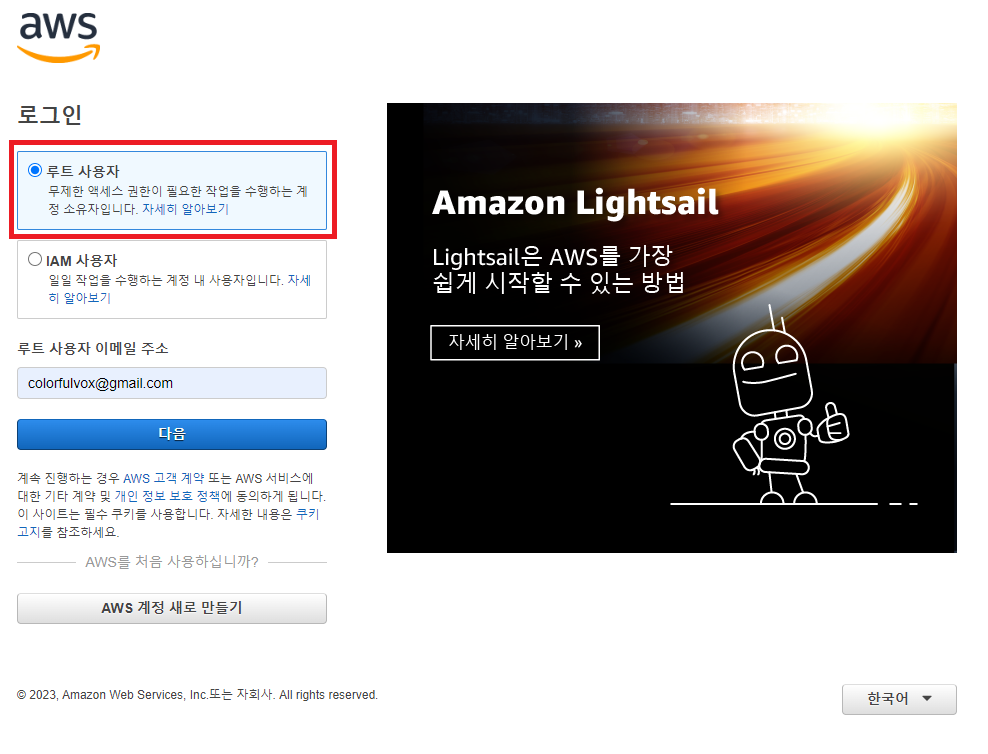\
   \

3. MFA 할당 및 닉네임 설정\
   (1) 보안 자격 증명 클릭\
   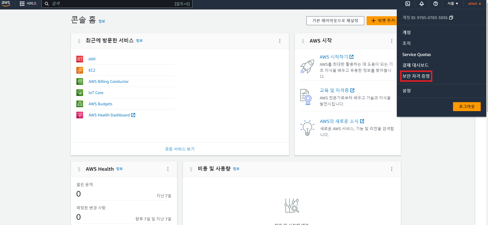\
   (2) MFA 디바이스 할당 클릭\
   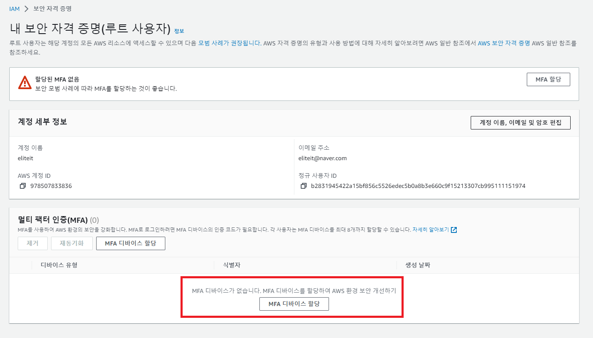\
   (3) 디바이스 이름 설정 및 인증 관리자 앱 체크\
   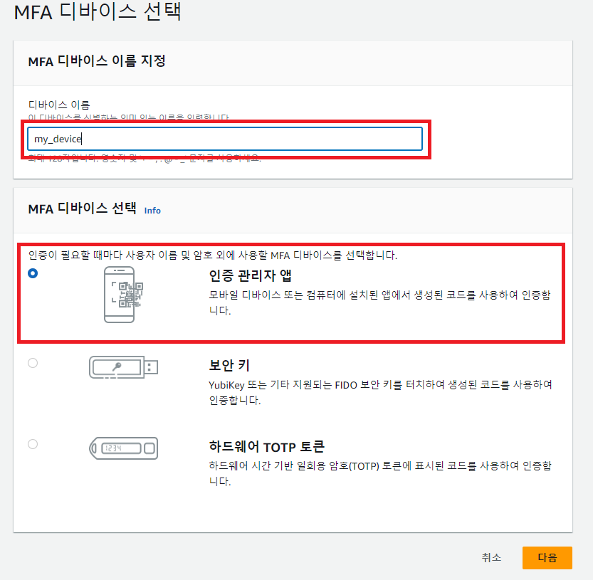\
   (4) 핸드폰으로 구글 OTP앱을 설치하여 QR코드 인식 및 MFA 추가 클릭\
   (해당 QR코드는 이미지로 저장하면 좋으며, 공유 되면 안됨)\
   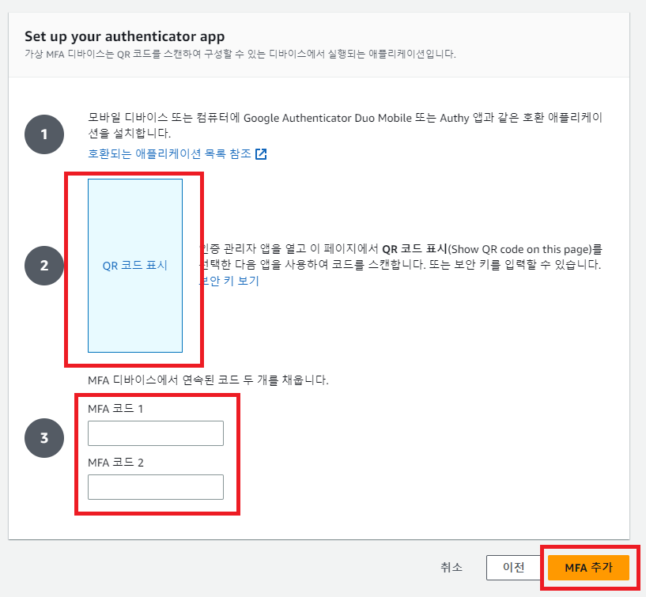\
   (5) 대시보드 클릭\
   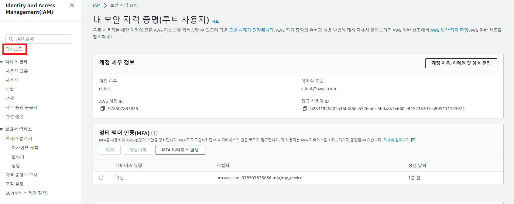\
   (6) 생성 클릭 및 닉네임 생성\
   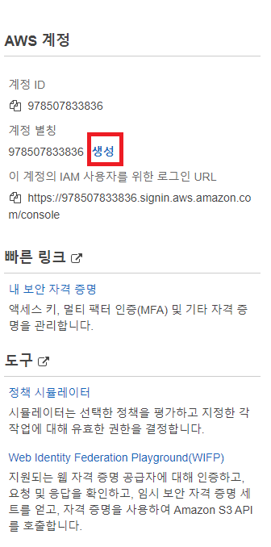\
   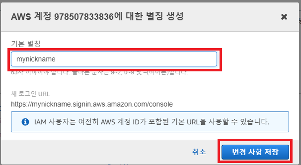\
   (7) 이제 해당 URL로 쉽게 로그인이 가능하다.\
   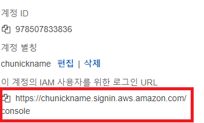\

4. IAM 사용자 생성\
   (1) 사용자 클릭 및 사용자 추가\
   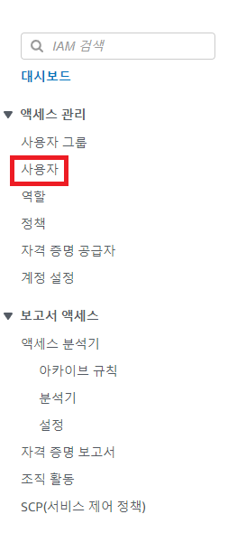\
   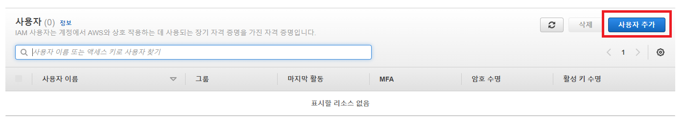\
   (2) 사용자 이름 설정 및 IAM 사용자 생성 체크, 암호 입력\
   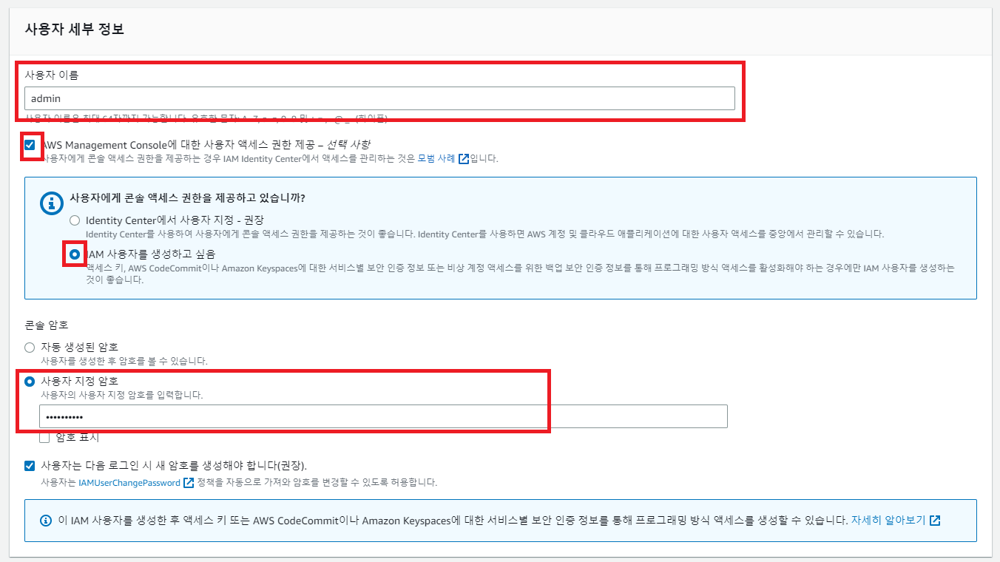\
   (3) 권한 부여\
   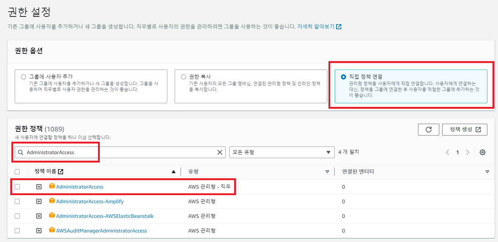\
   (4) 사용자 생성\
   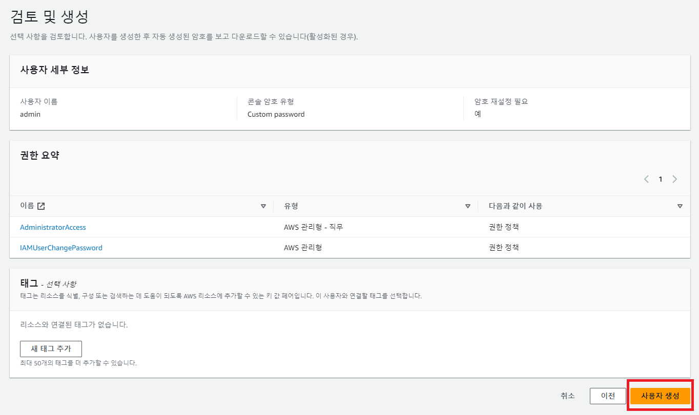\
   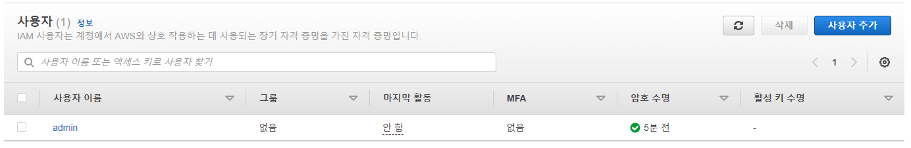\
   (5) MFA 할당\
   (루트 사용자 MFA 할당과 같은 방식)\
   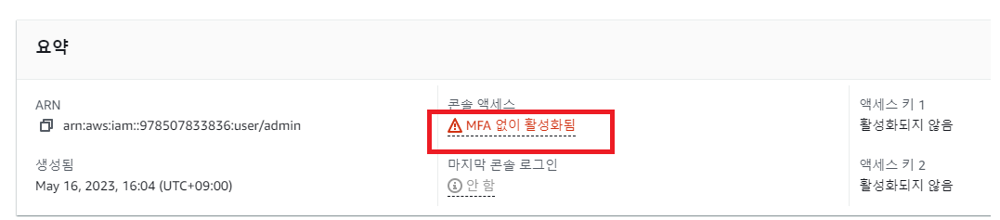\
=======
[뒤로가기](../../README.md)

## AWS 계정 설정 방법

1. AWS 회원 가입 (생략)
2. 루트 사용자로 로그인 
     
3. MFA 할당 및 닉네임 설정 
   (1) 보안 자격 증명 클릭 
    
   (2) MFA 디바이스 할당 클릭 
    
   (3) 디바이스 이름 설정 및 인증 관리자 앱 체크 
    
   (4) 핸드폰으로 구글 OTP앱을 설치하여 QR코드 인식 및 MFA 추가 클릭  (해당 QR코드는 이미지로 저장하면 좋으며, 공유 되면 안됨) 
    
   (5) 대시보드 클릭 
    
   (6) 생성 클릭 및 닉네임 생성 
    
    
   (7) 이제 해당 URL로 쉽게 로그인이 가능하다. 
    

4. IAM 사용자 생성 
   (1) 사용자 클릭 및 사용자 추가 
    
    
   (2) 사용자 이름 설정 및 IAM 사용자 생성 체크, 암호 입력 
    
   (3) 권한 부여 
    
   (4) 사용자 생성 
    
    
   (5) MFA 할당  
   (루트 사용자 MFA 할당과 같은 방식) 
    
>>>>>>> parent of 4d4a984 (GITBOOK-5: change request with no subject merged in GitBook)
   이제 루트 계정을 사용할 필요 없이 방금 생성한 IAM으로 로그인해서 관리하면 된다.
