[뒤로가기](../../README.md)

# AutoScaling 구성

(1) 시작 템플릿 생성 
AutoScaling은 시작 템플릿을 기반으로 EC2를 생성해준다. 

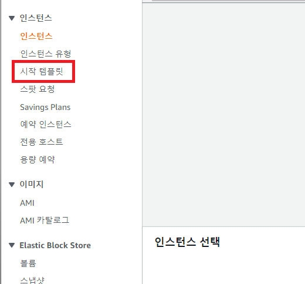 
(시작 템플릿 -> 시작 템플릿 생성 클릭) 

 
(템플릿 이름과 AutoScaling 지침 체크)

 
(네트워크 인터페이스 추가)

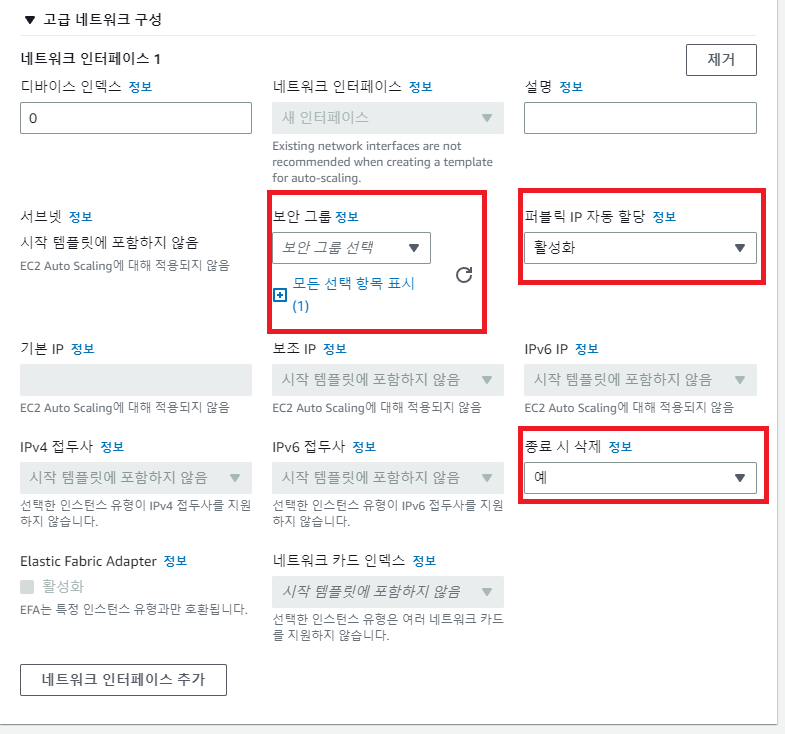 
(보안 그룹은 Default로 하고 다음과 같이 설정)  

### AMI, 인스턴스 유형, 키페어는 기존 EC2 설정과 같이 설정한다.

그리고 시작 템플릿 생성 

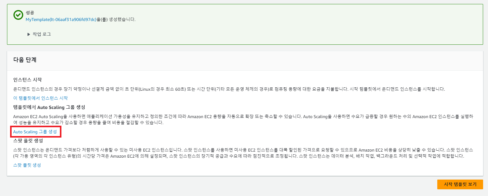 
(생성되면 다음과 같은 창이 뜨고 여기서 AutoScaling 그룹 생성을 클릭) 

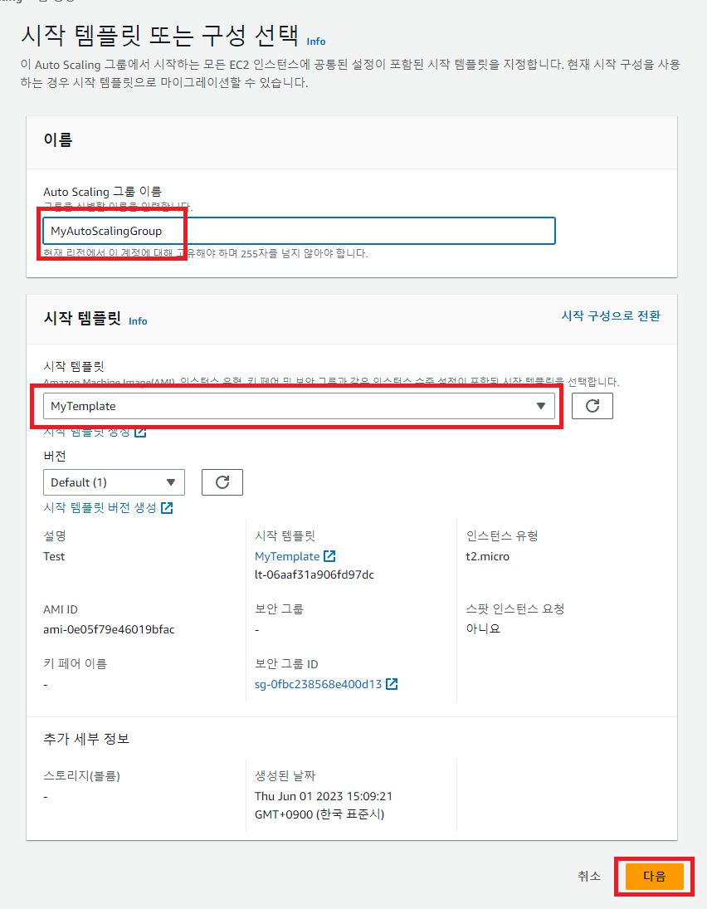 
(그룹 명을 입력하고 방금 생성한 템플릿을 선택한뒤 다음을 클릭) 

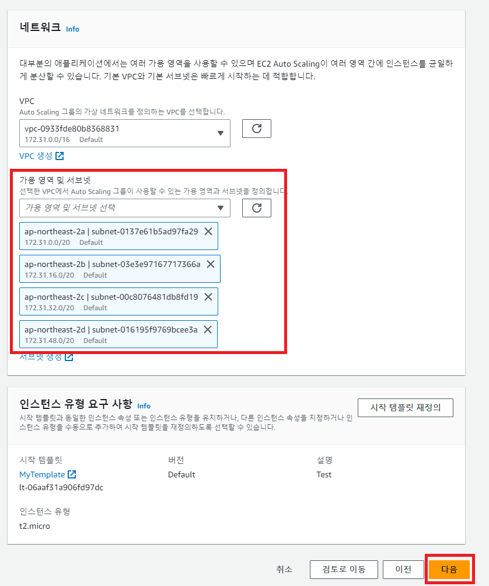 
(원하는 가용 영역을 선택한뒤 다음) 

### 태그 추가 구성까지 모두 스킵한다.  

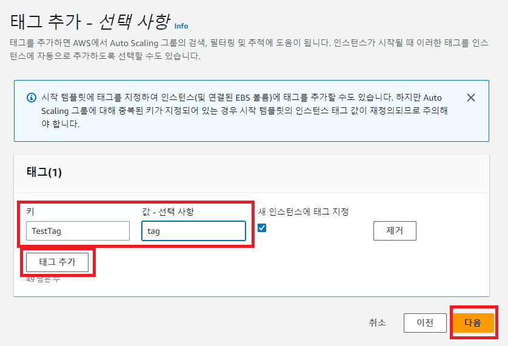 
태그를 추가하게되면 AutoScaling 그룹에서 생성된 모든 인스턴스에 적용이 된다. 
(다음과 같이 태그를 추가한뒤 입력하고 다음으로 넘어가자) 

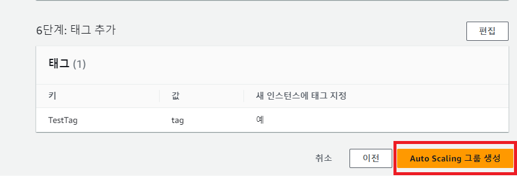 
(창을 내려 그룹 생성을 클릭한다.)

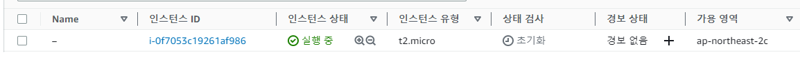 
(다음과 같이 인스턴스가 자동으로 1개 생성된 것을 볼 수 있다.) 

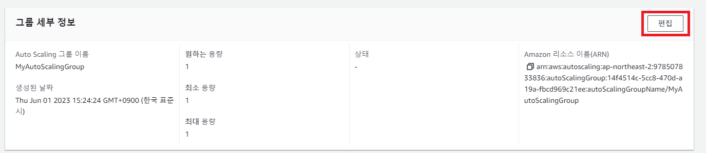 
(생성한 Autoscaling구성에서 그룹 세부 정보 편집을 클릭한뒤) 

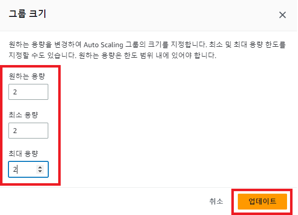 
(2개로 설정하고 업데이트를 해보자) 

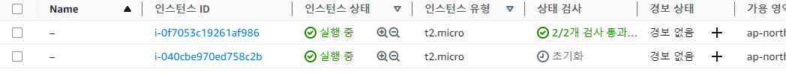 
(자동으로 1개가 더 추가된것을 볼 수 있다.)
(만약 1개를 종료하면 자동으로 다시 1개를 생성하게 된다.) 

### 추가 기능 (사용자 데이터)

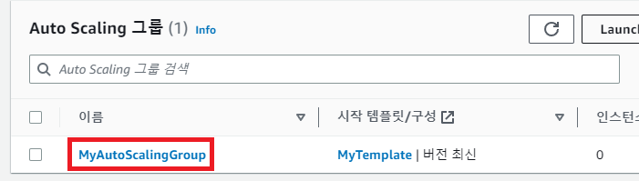 
(생성한 그룹을 클릭) 

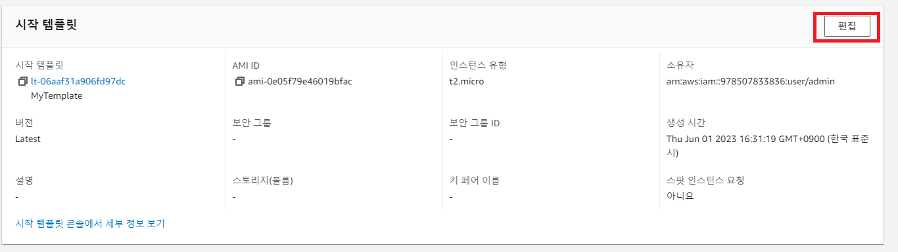 
(시작 템플릿 편집 클릭) 

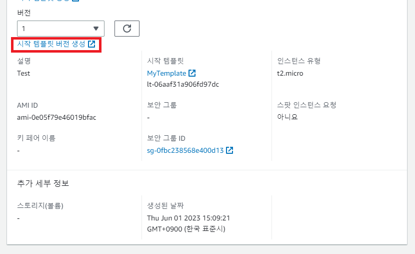 
(시작 템플릿 버전 생성 클릭)

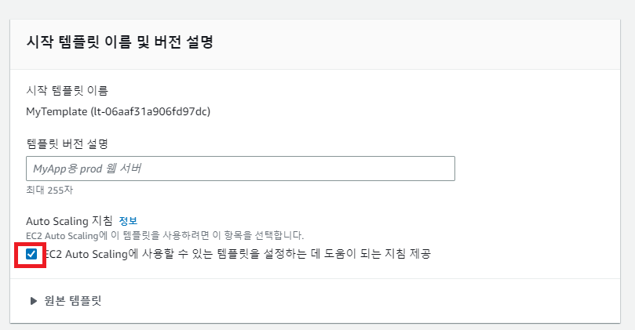 
(체크하고 밑으로 내려 고급 세부 정보 클릭) 

 
(메타데이터 액세스 가능 : 활성 
메타데이터 버전 : V1 및 V2(토큰 선택사항) 
사용자 데이터는 다음과 같이 입력) 
V2 이후로 토큰을 발행해야 인스턴스의 메타 데이터에 접근이 가능하다. 

> #!/bin/bash 
>
> INSTANCE_ID=$(curl -s http://169.254.169.254/latest/meta-data/instance-id)  # 자신의 인스턴스 ID 문자값을 변수에 저장 
yum  install httpd -y # 아파치 서버 설치 
echo ""$INSTANCE_ID"" >> /var/www/html/index.html  #INSTANCE_ID 변수값을 html에 이어쓰기 
> service httpd start # 아파치 시작 

이렇게 설정하면 인스턴스가 생성되자마자 해당 Bash가 실행 된다. 

그리고 템플릿 버전 생성 클릭 

 
(다시 시작 템플릿 편집을 클릭) 

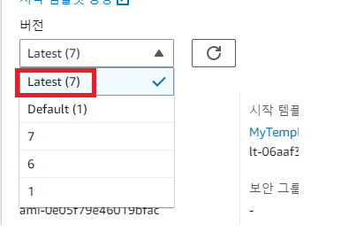 
(버전에서 Latest로 변경하고 밑으로 내려 업데이트를 클릭) 

 
(인스턴스 ID를 출력하는걸 볼 수 있다.) 
