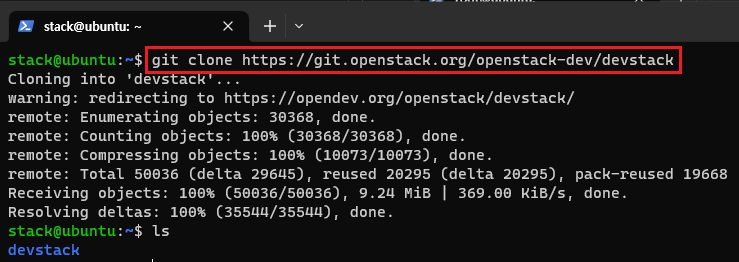
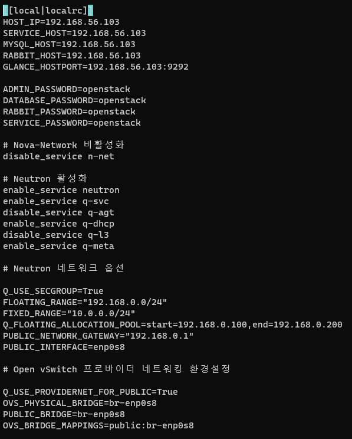
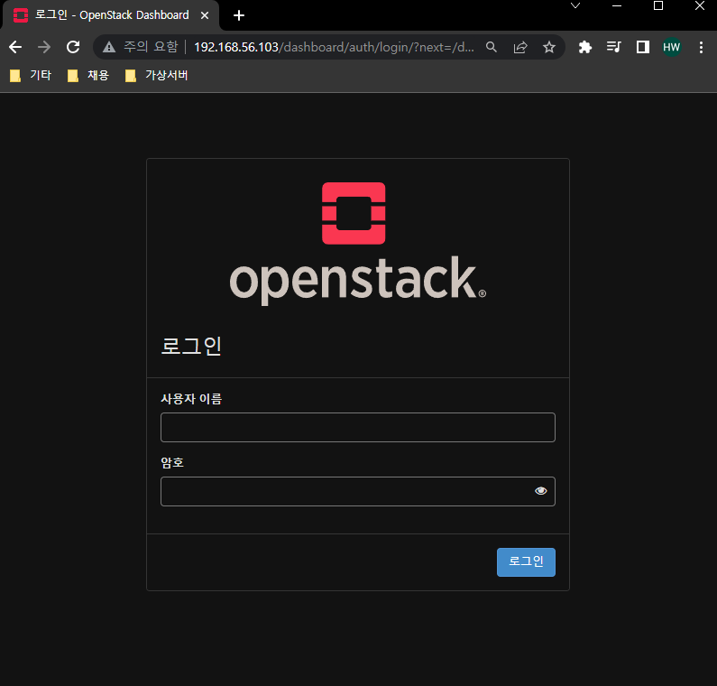

[뒤로가기](../../README.md) 

# Devstack 설치

### 1. stack계정 생성

Devstack을 설치하려면 stack계정이 필요하다. 

 

> useradd -U -G sudo -s /bin/bash -m stack 

sudo 권한이 있는 stack 계정을 추가한다. 

> echo "stack ALL=(ALL) NOPASSWD:ALL" >> /etc/sudoers 

패스워드를 입력하지않고도 sudo를 사용할 수 있게 설정한다. 

> passwd stack 

stack계정의 패스워드를 설정한다. 

 

> su stack 
> cd 

stack 계정으로 전환한다. 

### 2. devstack 환경 설정 및 설치

 

> git clone https://git.openstack.org/openstack-dev/devstack 

git 명령어로 devstack를 다운받는다. 

 

> cd devstack/ 
> vi local.conf 

devstack 폴더로 이동한뒤 local.conf를 연다. 
오픈스택의 기본 정보와 nova-network 서비스를 비활성화, Neutron 서비스를 활성화한다. 

 

> [[local|localrc]] 
> HOST_IP=192.168.56.103 
> SERVICE_HOST=192.168.56.103 
> MYSQL_HOST=192.168.56.103 
> RABBIT_HOST=192.168.56.103 
> GLANCE_HOSTPORT=192.168.56.103:9292 
>
> ADMIN_PASSWORD=openstack 
> DATABASE_PASSWORD=openstack 
> RABBIT_PASSWORD=openstack 
> SERVICE_PASSWORD=openstack 
>
> \# Nova-Network 비활성화 
> disable_service n-net 
>
> \# Neutron 활성화 
> enable_service neutron 
> enable_service q-svc 
> disable_service q-agt 
> enable_service q-dhcp 
> disable_service q-l3 
> enable_service q-meta 
>
> \# Neutron 네트워크 옵션 
>
> Q_USE_SECGROUP=True 
> FLOATING_RANGE="192.168.0.0/24" 
> FIXED_RANGE="10.0.0.0/24" 
> Q_FLOATING_ALLOCATION_POOL=start=192.168.0.100,end=192.168.0.200 
> PUBLIC_NETWORK_GATEWAY="192.168.0.1" 
> PUBLIC_INTERFACE=enp0s8 
>
> \# OpenVSwitch 프로바이더 네트워킹 환경설정 
>
> Q_USE_PROVIDERNET_FOR_PUBLIC=True 
> OVS_PHYSICAL_BRIDGE=br-enp0s8 
> PUBLIC_BRIDGE=br-enp0s8 
> OVS_BRIDGE_MAPPINGS=public:br-enp0s8 

다음과 같이 입력한다. 

FLOATING_RANGE는 Public IP 대역을 말하며 VM이 생성될때 처음 할당받는 
Private IP는 Fixed IP이며 동적으로 할당하여 외부 인터넷과 통신 할 수 있는  IP가 FLOATING IP이다.

Q_USE_SECGROUP=True -> 보안 그룹 사용을 허용  
FLOATING_RANGE="192.168.0.0/24 -> 외부 네트워크로 사용될 enp0s8 IP범위 설정  
Q_FLOATING_ALLOCATION_POOL=start=192.168.0.100,end=192.168.0.200 -> FLOATING IP 범위에서 인스턴스에 할당할 IP범위를 설정  
PUBLIC_NETWORK_GATEWAY="192.168.0.1"  -> FLOATING IP 범위의 실제 물리 게이트웨이 보통 게이트웨이는 자신의 IP에서 마지막 값인 1로 설정한다.  
PUBLIC_INTERFACE=enp0s8 -> FLOATING IP가 사용할 실제 물리 네트워크 디바이스  
OVS_PHYSICAL_BRIDGE=br-enp0s8 
PUBLIC_BRIDGE=br-enp0s8 
OVS_BRIDGE_MAPPINGS=public:br-enp0s8 
-> 네트워크 브릿지 이름 설정 

 

> ./stack.sh

stack.sh을 실행해 devstack을 설치한다.

<<<<<<< HEAD
#### \[트러블 슈팅]

설치 관련해서 오류가 많다.\
오류가 날경우,\

=======
### [트러블 슈팅]

설치 관련해서 오류가 많다. 
오류가 날경우, 
>>>>>>> parent of 4d4a984 (GITBOOK-5: change request with no subject merged in GitBook)

1. ./unstack.sh을 하여 서비스 관련 구성 및 네트워크를 정리한다.
2. ./clean.sh을 하여 openstack 관련 남은 파일을 모두 삭제한다.
3. sudo apt-get update로 패키지를 업데이트 해준다.

<<<<<<< HEAD
\
vi /etc/netplan의 yaml파일이 정확하게 입력되었는지 그리고\
local.conf의 PUBLIC\_NETWORK\_GATEWAY="192.168.0.1"이 제대로 입력되었는지 확인한다.\

\[설치중 git clone에서 멈추고 종료]\
local.conf에\

> GIT\_BASE=${GIT\_BASE:-https://git.openstack.org}

를 추가한다.\
하지만, 안될 수 있다.\
그래서 다시 unstack.sh를 하고 stack.sh으로 다시 설치하면서 될때까지 하면 되긴 한다.\

다른 오류관련해서는 구글링을 해야된다.\
(ChatGPT에 물어보면 도움이 된다.)\

\
설치완료 화면이다.\
설치가 완료되면 http://192.168.56.103/dashboard 와같이 openstack 대쉬보드 URL을 출력해준다.\

실제로 접속하면,\
\
접속이 되는것을 확인할 수 있다.\

#### \[중요]

현재 상태를 스냅샷으로 저장해두자.\

\
해당 가상 머신을 오른쪽 클릭한뒤 스냅샷을 클릭한다.

\
찍기를 누른뒤 다음과 같이 입력한뒤 확인을 누른다.\
=======
 
vi /etc/netplan의 yaml파일이 정확하게 입력되었는지 그리고 
local.conf의 PUBLIC_NETWORK_GATEWAY="192.168.0.1"이
제대로 입력되었는지 확인한다. 

[설치중 git clone에서 멈추고 종료]  
local.conf에 

> GIT_BASE=${GIT_BASE:-https://git.openstack.org}

를 추가한다. 
하지만, 안될 수 있다. 
그래서 다시 unstack.sh를 하고 stack.sh으로 다시 설치하면서 될때까지 하면 되긴 한다. 

다른 오류관련해서는 구글링을 해야된다. 
(ChatGPT에 물어보면 도움이 된다.) 

 
설치완료 화면이다. 
설치가 완료되면 http://192.168.56.103/dashboard 와같이
openstack 대쉬보드 URL을 출력해준다. 

실제로 접속하면, 
 
접속이 되는것을 확인할 수 있다. 

### [중요]

현재 상태를 스냅샷으로 저장해두자. 

 
해당 가상 머신을 오른쪽 클릭한뒤 스냅샷을 클릭한다.

 
찍기를 누른뒤 다음과 같이 입력한뒤 확인을 누른다. 
>>>>>>> parent of 4d4a984 (GITBOOK-5: change request with no subject merged in GitBook)
