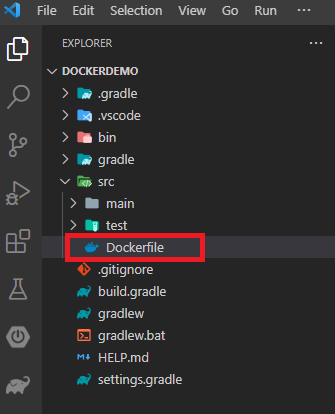
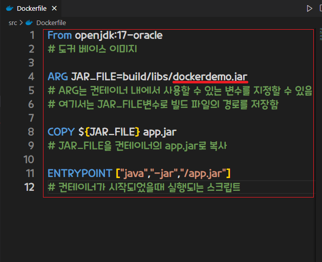
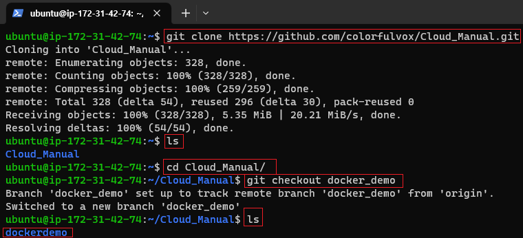
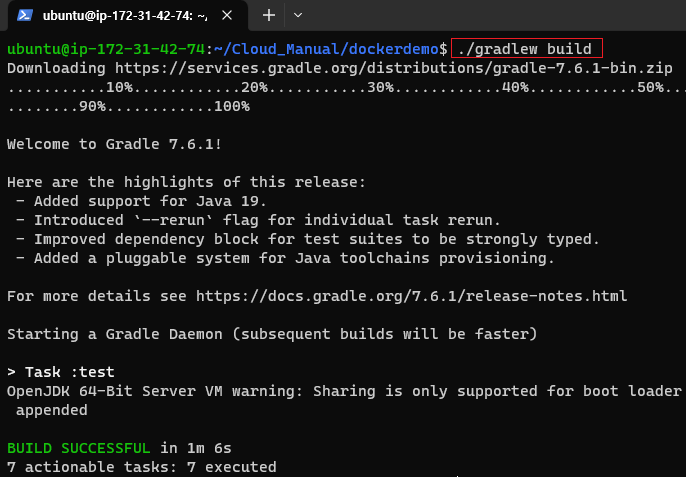

[뒤로가기](../../README.md) 

# Docker [SpringBoot]

Github에서 SpringBoot 프로젝트를 clone한뒤
우분투 환경에서 Dokcer 이미지를 빌드해 컨테이너를 구동시켜 서버 배포 

## 구성도

## 사전 세팅

1. AWS EC2 Ubuntu 생성 및 환경 설정 [AWS EC2 생성](../Document/EC2.md)
2. Springboot 프로젝트 생성 [SpringBoot 프로젝트 생성](../Document/Local%20%5BSpringBoot%5D.md)
3. SpringBoot 프로젝트 Github에 저장 [여기서는 docker_demo 브랜치를 사용함]
4. ubuntu에 도커 설치 [Docker 설치](../Document/Docker.md)

## 환경

[Java SE-17](https://www.oracle.com/java/technologies/javase/jdk17-archive-downloads.html) 
VSCode 

1. Spring Boot Extension Pack
2. Extension Pack for Java
3. Gradle for Java

EC2 - Ubuntu (AWS EC2 생성 과정 참조) [EC2](../Document/EC2.md)

## 시작

### (1) springboot 프로젝트 폴더에 Dockerfile 생성

 
(프로젝트 루트 경로에 Dockerfile 생성) 

 
(Dockerfile에 다음과 같이 입력 단, 빌드 파일 이름은 본인이 빌드한 파일 이름으로 작성) 

### (2) git clone 받기

 

### (3) gradlew 빌드

 
