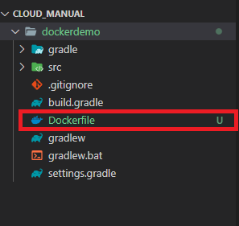
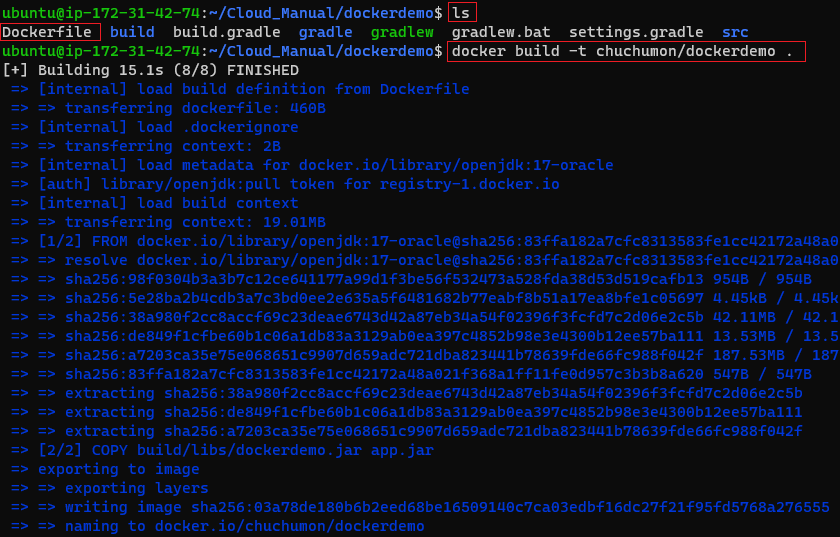
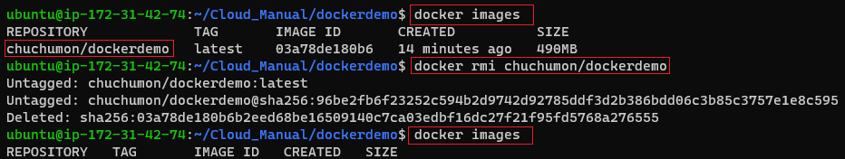

<<<<<<< HEAD
# Docker \[Springboot]

## Docker \[SpringBoot]

Github에서 SpringBoot 프로젝트를 clone한뒤 우분투 환경에서 Dokcer 이미지를 빌드해 컨테이너를 구동시켜 서버 배포

### 구성도

### 사전 세팅

1. AWS EC2 Ubuntu 생성 및 환경 설정 [AWS EC2 생성](EC2.md)
2. Springboot 프로젝트 생성 [SpringBoot 프로젝트 생성](<Local \[SpringBoot].md>)
3. SpringBoot 프로젝트 Github에 저장 \[여기서는 docker\_demo 브랜치를 사용함]
4. ubuntu에 도커 설치 [Docker 설치](Docker.md)

### 환경

[Java SE-17](https://www.oracle.com/java/technologies/javase/jdk17-archive-downloads.html)\
VSCode
=======
[뒤로가기](../../README.md) 

# Docker [SpringBoot]

Github에서 SpringBoot 프로젝트를 clone한뒤
우분투 환경에서 Dokcer 이미지를 빌드해 컨테이너를 구동시켜 서버 배포 

## 구성도

## 사전 세팅

1. AWS EC2 Ubuntu 생성 및 환경 설정 [AWS EC2 생성](../Document/EC2.md)
2. Springboot 프로젝트 생성 [SpringBoot 프로젝트 생성](../Document/Local%20%5BSpringBoot%5D.md)
3. SpringBoot 프로젝트 Github에 저장 [여기서는 docker_demo 브랜치를 사용함]
4. ubuntu에 도커 설치 [Docker 설치](../Document/Docker.md)

## 환경

[Java SE-17](https://www.oracle.com/java/technologies/javase/jdk17-archive-downloads.html) 
VSCode 
>>>>>>> parent of 4d4a984 (GITBOOK-5: change request with no subject merged in GitBook)

1. Spring Boot Extension Pack
2. Extension Pack for Java
3. Gradle for Java

<<<<<<< HEAD
EC2 - Ubuntu (AWS EC2 생성 과정 참조) [EC2](EC2.md)

### 시작

#### (1) springboot 프로젝트 폴더에 Dockerfile 생성

<figure><figcaption>
(프로젝트 루트 경로에 Dockerfile 생성)
</figcaption></figure>

<figure><figcaption>
 (Dockerfile에 다음과 같이 입력 단, 빌드 파일 이름은 본인이 빌드한 파일 이름으로 작성)
</figcaption></figure>

#### (2) git clone 받기

<figure><figcaption></figcaption></figure>

#### (3) gradlew 빌드

<figure><figcaption></figcaption></figure>

#### (4) 실행 테스트

<figure><figcaption></figcaption></figure>

#### (5) 도커 이미지 빌드

<figure><figcaption>
(프로젝트 폴더내에 Dockerfile이 있는지 확인 "docker build -t 도커허브본인아이디/도커허브저장소이름 ." 입력해 빌드)
</figcaption></figure>

<figure><figcaption>
(이미지가 생성되었는지 확인)
</figcaption></figure>

#### (6) 도커허브에 이미지 Push

<figure><figcaption>
(도커허브에서 로그인한뒤 저장소 생성 클릭 저장소 이름은 방금 생성한 이미지 이름으로 입력 후 생성)
</figcaption></figure>

<figure><figcaption>
(우분투에 저장된 도커 이미지 삭제 도커허브에 저장한 이미지를 불러와 컨테이너 구동 할것임)
</figcaption></figure>

#### (7) 컨테이너 구동

<figure><figcaption>
 (-p 8080:8080은 로컬 네트워크와 컨테이너 내부 네크워크를 연결 시켜주는 작업임)
</figcaption></figure>
=======
EC2 - Ubuntu (AWS EC2 생성 과정 참조) [EC2](../Document/EC2.md)

## 시작

### (1) springboot 프로젝트 폴더에 Dockerfile 생성

 
(프로젝트 루트 경로에 Dockerfile 생성) 

 
(Dockerfile에 다음과 같이 입력 단, 빌드 파일 이름은 본인이 빌드한 파일 이름으로 작성) 

### (2) git clone 받기

 

### (3) gradlew 빌드

 

### (4) 실행 테스트

 

### (5) 도커 이미지 빌드

 
(프로젝트 폴더내에 Dockerfile이 있는지 확인 
"docker build -t 도커허브본인아이디/도커허브저장소이름 ."
입력해 빌드) 

 
(이미지가 생성되었는지 확인) 

### (6) 도커허브에 이미지 Push

 
(도커허브에서 로그인한뒤 저장소 생성 클릭  
저장소 이름은 방금 생성한 이미지 이름으로 입력 후 생성) 

 
(도커 이미지 push  
정상적으로 올라갔는지 확인) 

 
(우분투에 저장된 도커 이미지 삭제 
도커허브에 저장한 이미지를 불러와 컨테이너 구동 할것임) 

### (7) 컨테이너 구동

 
-p 8080:8080은 로컬 네트워크와 컨테이너 내부 네크워크를 연결 시켜주는 작업임 
>>>>>>> parent of 4d4a984 (GITBOOK-5: change request with no subject merged in GitBook)

현재는 도커 컨테이너에 저장해 배포하는 모든 과정을 수동으로 진행하고 있음
