# Docker

[뒤로가기](../../)

## Docker

컨테이너 기반 오픈소스 가상화 플랫폼\
다양한 프로그램, 실행 환경을 컨테이너로 추상화하고 동일한 인터페이스를 제공하여\
프로그램의 배포 및 관리를 단순하게 해준다.\

가상 머신은 호스트 OS위에 게스트 OS 전체를 가상화 하여 사용하는 방식이다. 이 방식을 통해 HVM 가상화 기술도 등장했지만,\
여전히 성능에 문제가 있다.\
그래서 이를 개선하기위해 프로세스 격리 방식을 선택하게 된다.

하나의 서버에 여러개의 컨테이너를 실행하면 서로 영향을 미치지 않고 독립적으로\
실행되어 마치 VM을 사용하는 느낌을 준다.

도커에서 가장 중요한 개념은 컨테이너, 이미지 이다.\
컨네이너 : 격리된 공간에서 프로세스가 동작하는 기술\
이미지 : 컨테이너 실행에 필요한 파일과 설정값을 포함한 것\

### Docker 설치

(0) 필수 패키지 설치

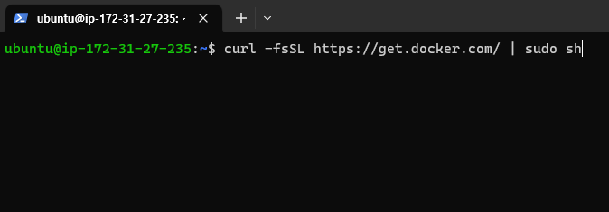\

> sudo apt-get update

(패키지 업데이트부터 해주자)

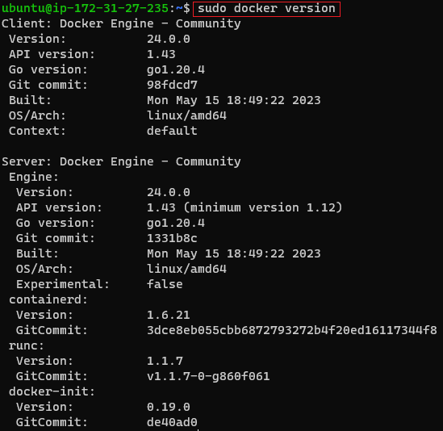\

> sudo apt-get install -y \\\
> ca-certificates \\\
> curl \\\
> gnupg \\\
> lsb-release

(필수 패키지 설치)\
ca-certificates : certificate authority에서 발행되는 디지털 서명으로 SSL 인증서의 PEM파일이 포함되어 있어 SSL 기반 앱이 SSL 연결이 되었는지 확인 할 수 있다.\
curl : 웹사이트에서 파일을 다운 받을때 사용한다.\
gnupg : 데이터를 암호화하고 정보 보안에 쓰이는 디지털 서명을 생성하는데 사용되는 GNU 도구\
lsb-release : 리눅스의 상세 정보를 출력하는 리눅스 명령어\

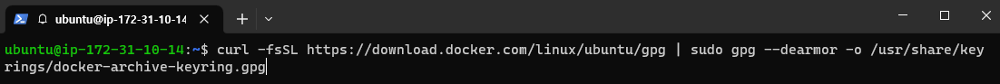\

> curl -fsSL https://download.docker.com/linux/ubuntu/gpg | sudo gpg --dearmor -o /usr/share/keyrings/docker-archive-keyring.gpg

(Docker GPG Key 추가)

\

echo \\\
"deb \[arch=$(dpkg --print-architecture) signed-by=/usr/share/keyrings/docker-archive-keyring.gpg] https://download.docker.com/linux/ubuntu \\\
$(lsb\_release -cs) stable" | sudo tee /etc/apt/sources.list.d/docker.list > /dev/null\

(apt로 Docker를 설치 하기위해 Docker stable 레파지토리를 추가 여기서 환경에 따라 명령어가 다르다.)

***

\[x86\_64/amd64]\
echo \\\
"deb \[arch=amd64 signed-by=/usr/share/keyrings/docker-archive-keyring.gpg] https://download.docker.com/linux/ubuntu \\\
$(lsb\_release -cs) stable" | sudo tee /etc/apt/sources.list.d/docker.list > /dev/null\

\[armhf]\
echo \\\
"deb \[arch=armhf signed-by=/usr/share/keyrings/docker-archive-keyring.gpg] https://download.docker.com/linux/ubuntu \\\
$(lsb\_release -cs) stable" | sudo tee /etc/apt/sources.list.d/docker.list > /dev/null\

\[arm64]\
echo \\\
"deb \[arch=arm64 signed-by=/usr/share/keyrings/docker-archive-keyring.gpg] https://download.docker.com/linux/ubuntu \\\
$(lsb\_release -cs) stable" | sudo tee /etc/apt/sources.list.d/docker.list > /dev/null

***

\

> sudo apt-get update

(다시 패키지 업데이트)

\

> sudo apt-get install -y docker-ce docker-ce-cli containerd.io

(도커 설치)

(2) 우분투 컨테이너 생성\
docker run ubuntu:16.04\
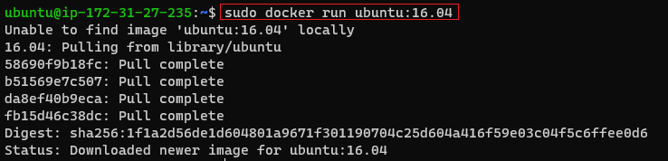\
run 명령어는 사용할 이미지가 저장되어 있는지 확인하고 없다면 설치한 후\
컨테이너를 생성하고 시작해줌\
지금은 생성이 되었지만 별다른 명령어가 없어 자동으로 종료된다.\

(3) 컨테이너 실행\
docker run --rm -it ubuntu:16.04 /bin/bash\
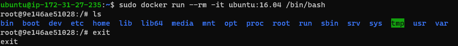\

(4) centos 이미지 풀\
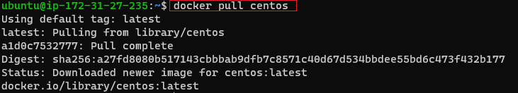\
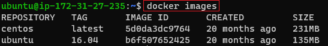\
(현재 이미지 확인)\

(5) Dockerfile로 이미지 만들기\
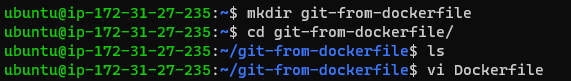\
(폴더 생성 뒤 Dockerfile 생성한 후 vi 작성)\
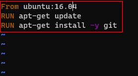\
ubuntu:16.04 이미지를 생성하고 update한뒤 git을 설치하라\

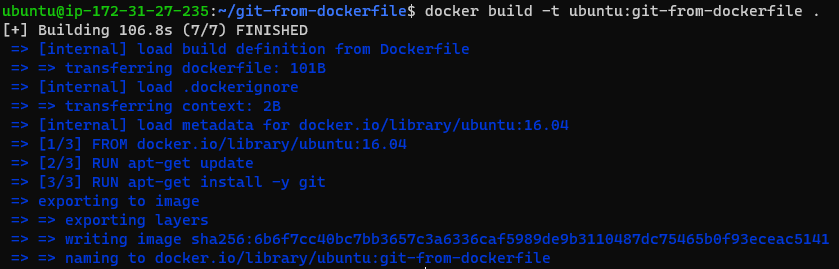\

### \[명령어] 

docker run \[OPTIONS] IMAGE\[:TAG|@DIGEST] \[COMMAND] \[ARG...]\
(OPTIONS)\
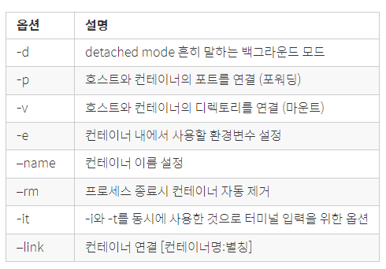\

docker ps // 실행중인 컨테이너 목록\
docker images //이미지 확인\

/- docker 그룹에 사용자 추가 -/\
sudo usermod -aG docker $USER\
sudo su - $USER\
/---------------------------------/\
docker rm 컨테이너 tag or id //컨테이너 삭제 dokcer rmi tag or id //이미지 삭제

### Docker Hub

자신이 만든 도커 이미지를 저장할 수 있는 클라우드 저장소\

#### [Docker Hub](https://hub.docker.com/)

(1) 회원가입 생략\
(2) 저장소 생성\
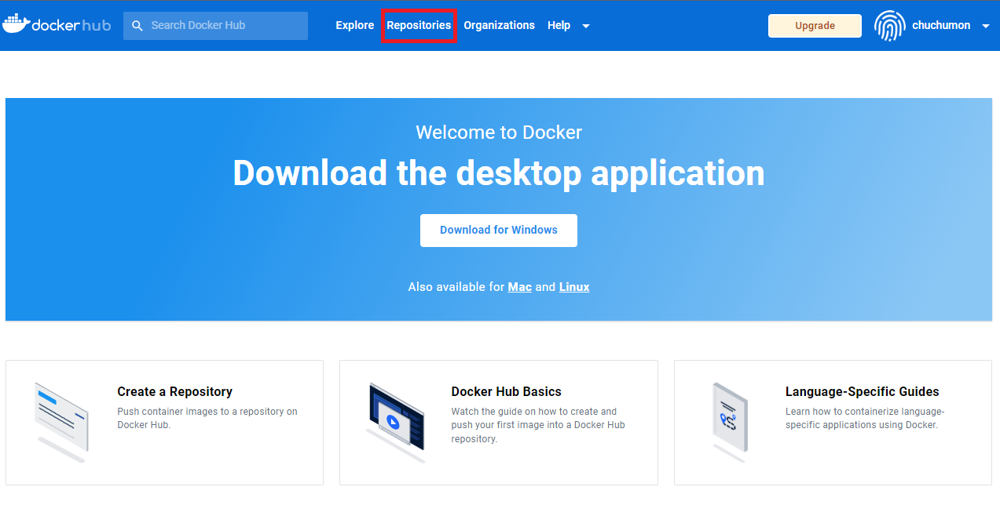\
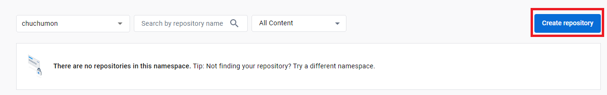\
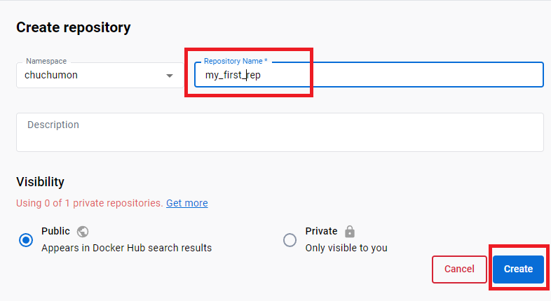\

(3) 도커 이미지 업로드\
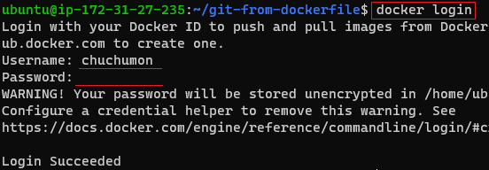\
(docker 로그인)\
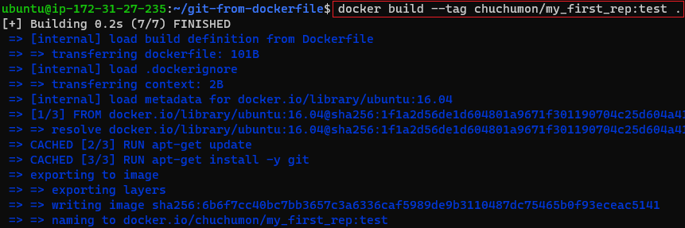\
(반드시 빌드시 이미지 이름을 유저이름/레파지토리:태그 형식으로 저장한다.)\
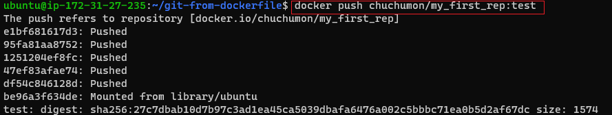\
(저장소에 해당 이미지 Push)\
\
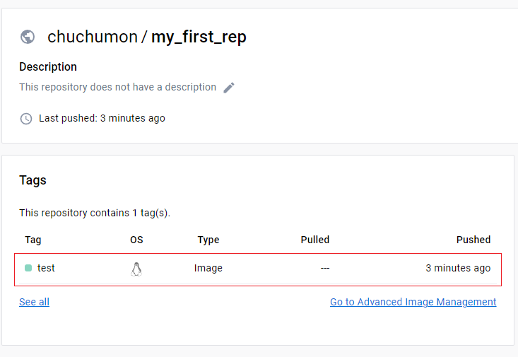\
