<<<<<<< HEAD
# EC2

[뒤로가기](../../)

### EC2 생성하기
=======
[뒤로가기](../../README.md)

## EC2 생성하기
>>>>>>> parent of 4d4a984 (GITBOOK-5: change request with no subject merged in GitBook)

구축 순서

1. AMI 선택
2. EC2 유형 및 사이즈 선택
3. EBS 설정 (가상 하드드라이브)
4. 보안 그룹 설정
5. EC2 생성

<<<<<<< HEAD
(1) EC2 검색 후 인스턴스 창 이동 및 인스턴스 시작 클릭\
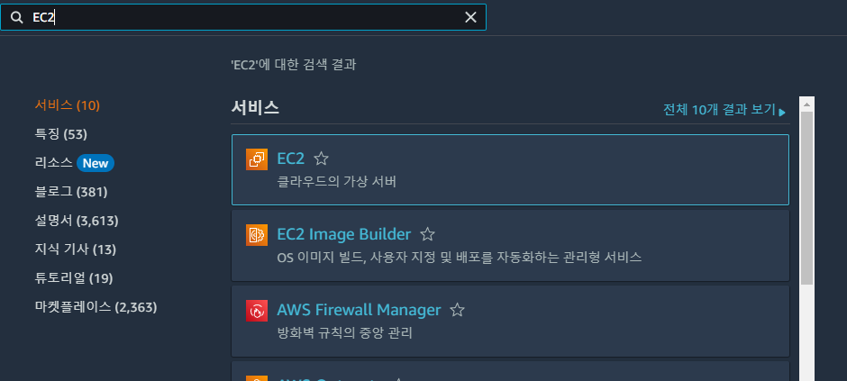\

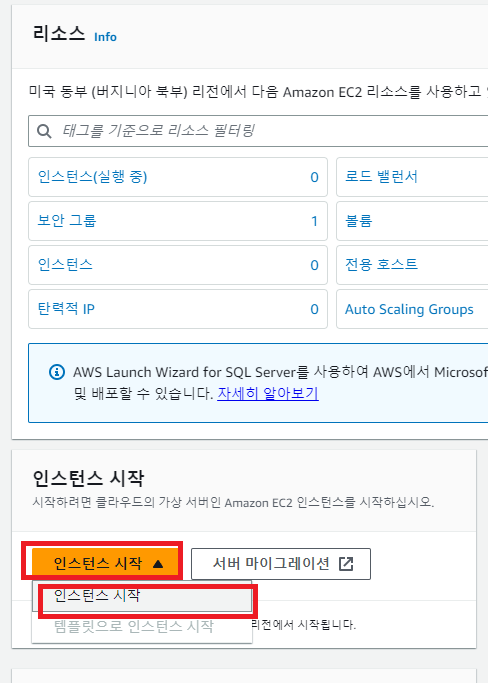\

(2) 이름 작성 및 키페어 생성\
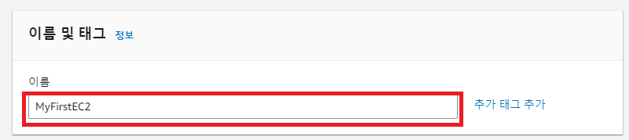\
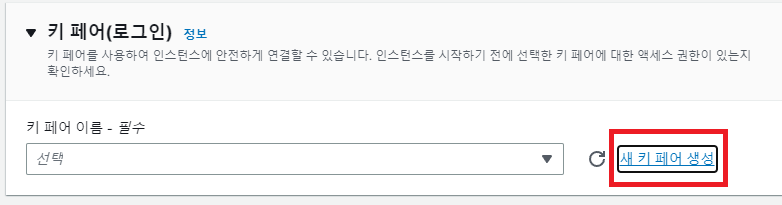\
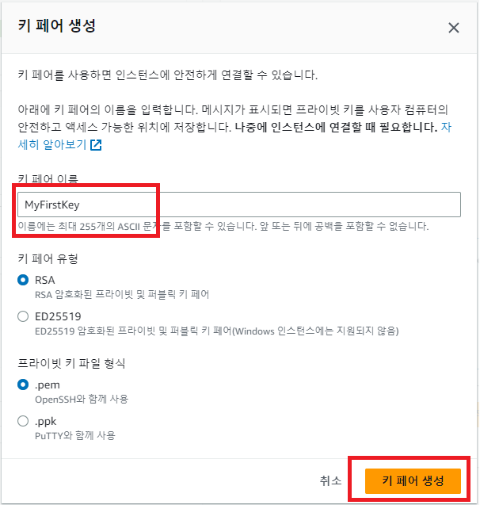\
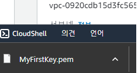\
(키 페어는 잃어버리면 안된다.)\
\
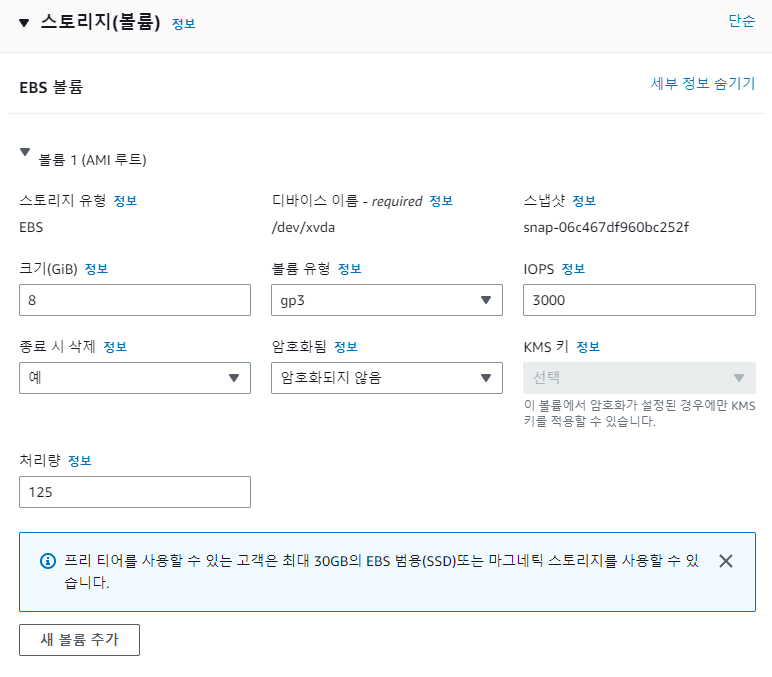\
(EBS 관련 정보 일단 이대로 둔다.)\
\
(3) 인스턴스 시작 및 확인\
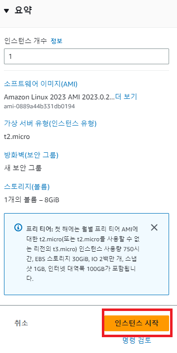\
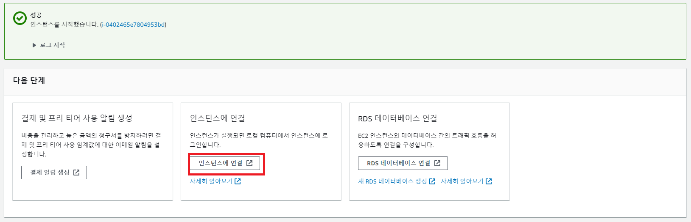\
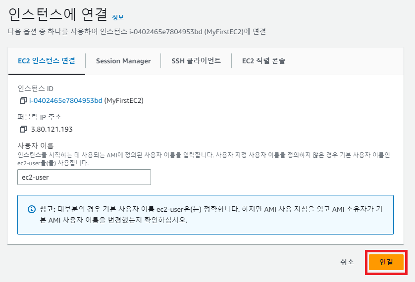\
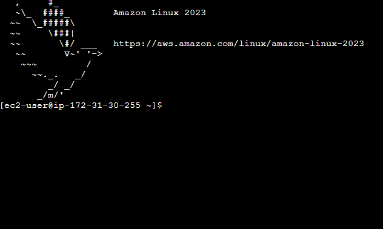\

### [윈도우 터미널로 접속하기](터미널.md)
=======
(1) EC2 검색 후 인스턴스 창 이동 및 인스턴스 시작 클릭  
 

 

(2) 이름 작성 및 키페어 생성 
 
 
 
 
(키 페어는 잃어버리면 안된다.)  
 
(EBS 관련 정보 일단 이대로 둔다.)  
(3) 인스턴스 시작 및 확인 
 
 
 
 

## [윈도우 터미널로 접속하기](./%ED%84%B0%EB%AF%B8%EB%84%90.md)
>>>>>>> parent of 4d4a984 (GITBOOK-5: change request with no subject merged in GitBook)
