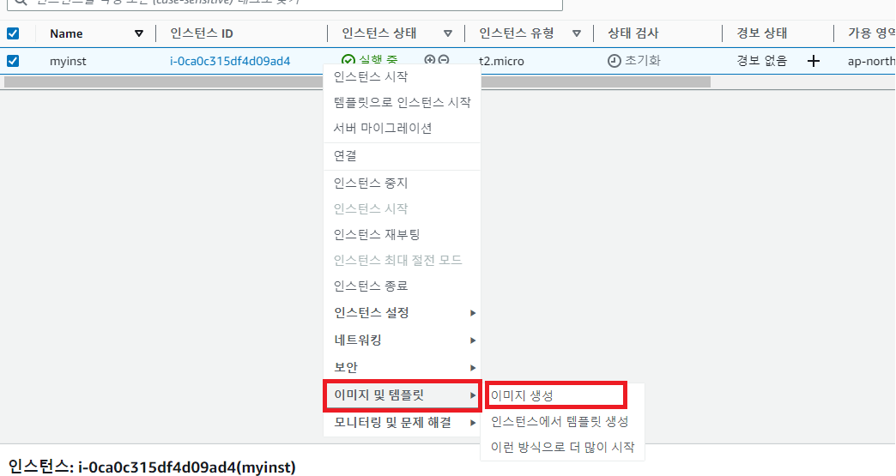
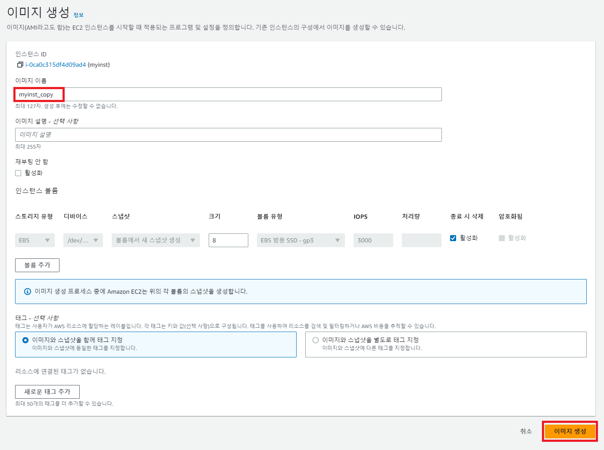
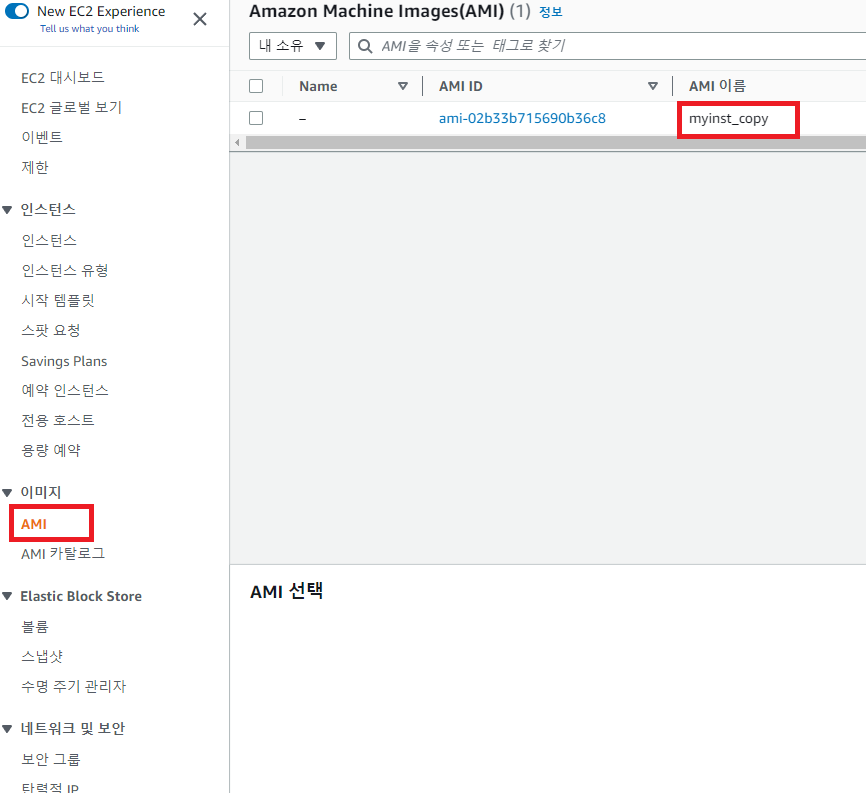
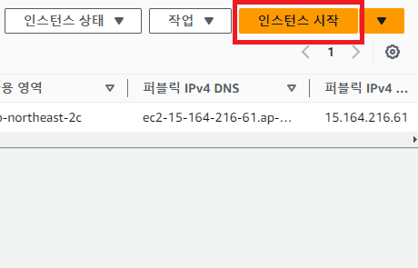
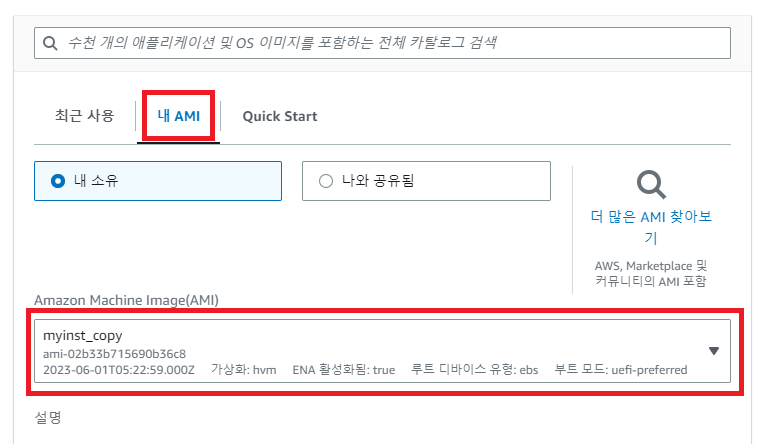

# EC2\_Img

[뒤로가기](../../)

## EC2 복제

\
(복제하고 싶은 인스터스를 오른쪽 클릭한뒤 이미지 생성을 누른다.)\

\
(이미지 이름을 입력 -> 이미지 생성)\

\
(이미지-> AMI를 확인하면 복제된 인스턴스가 있다.)\

\
(다시 인스턴스를 새로 만들때)\

\
(다음과 같이 내 AMI에서 복사한 EC2의 이미지로 새로 만들 수 있다.)\
