[뒤로가기](../../README.md)

# EFS를 활용한 스토리지 공유

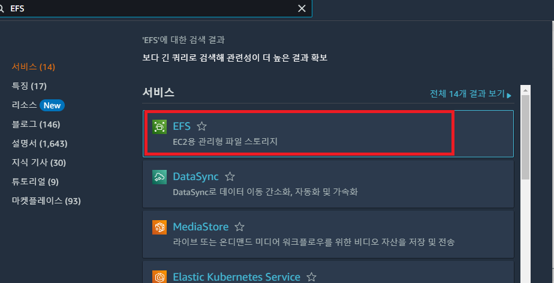 
(AWS에서 EFS 검색한뒤 클릭) 

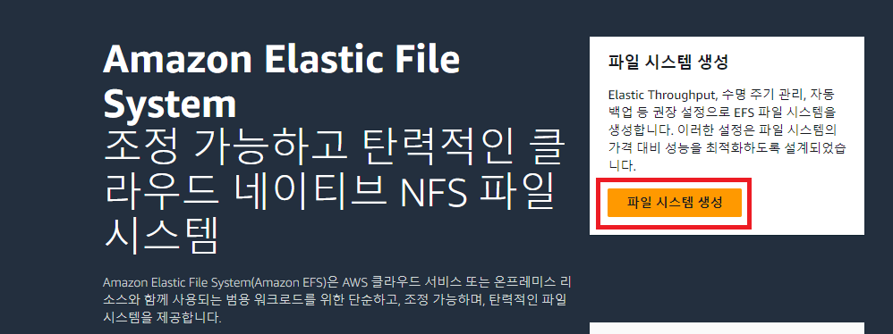 
(파일 시스템 생성) 

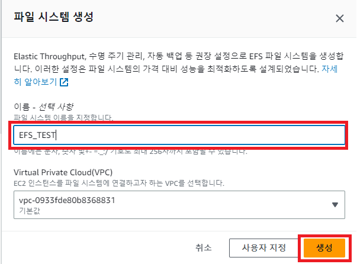 
(이름 입력 후 생성) 

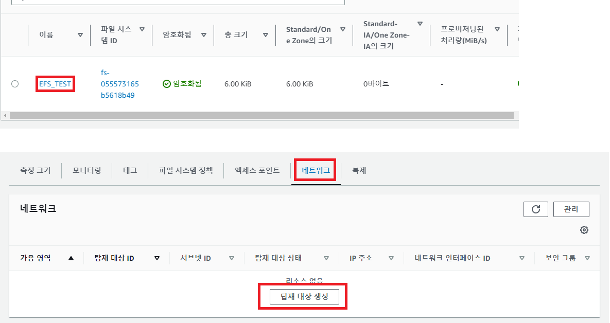 
(가용 영역을 추가해주기 위해 탑재 대상 생성을 누른다.) 

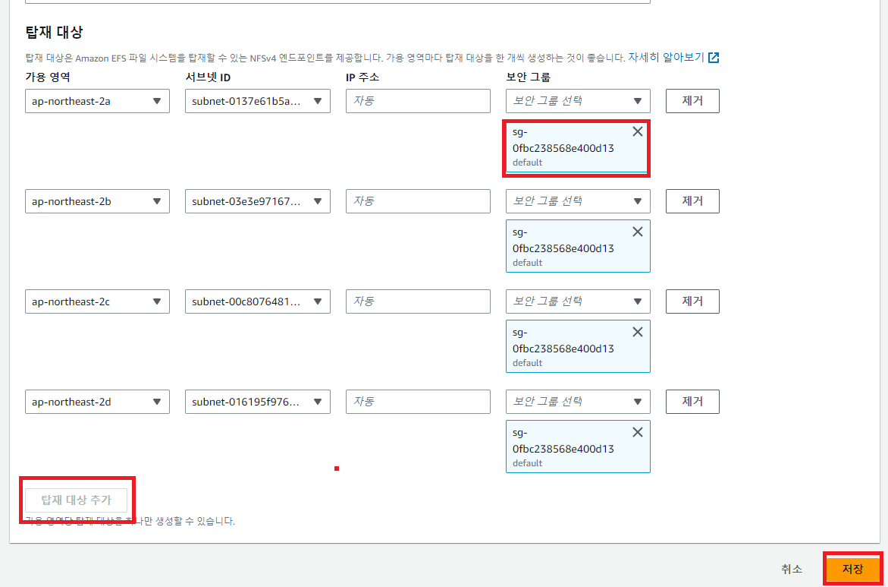
(탑재 대상 추가가 비활성화 될때까지 클릭하고 
각 가용 영역의 서브넷ID를 추가하고 보안 그룹은 모두 Default로 한뒤 저장한다.) 

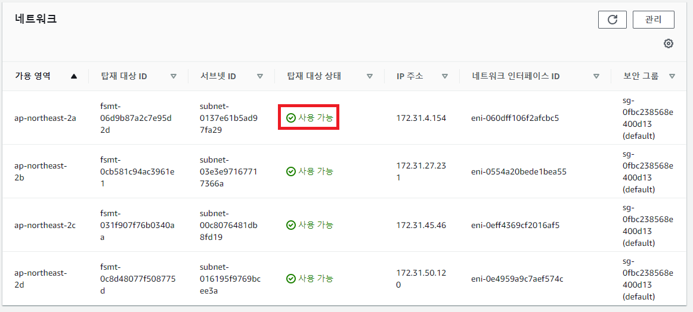
(사용 가능 상태가 될때까지 기다린다.) 

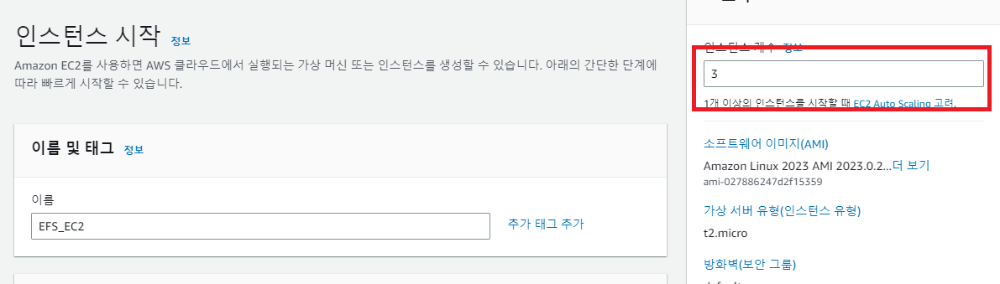
(새 인스턴스를 생성하고 생성 갯수는 3개로 설정한다.) 

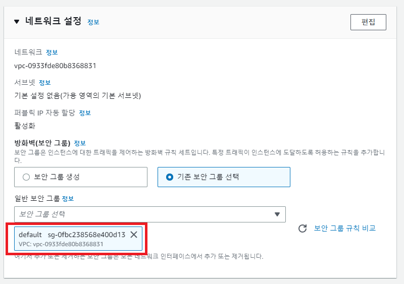
(보안 그룹은 EFS와 같이 Default로 해준다.) 

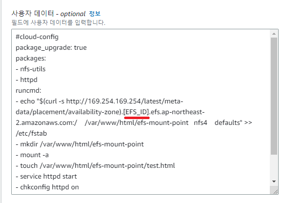 
(그리고 고급세부정보에 사용자 데이터에 다음과 같이 입력 해준다.) 

> #cloud-config 
> package_upgrade: true 
> packages:  > \- nfs-utils  > \- httpd 
> runcmd:  > \- echo "$(curl -s http://169.254.169.254/latest/meta-data/placement/availability-zone).[EFS_ID].efs.ap-northeast-2.amazonaws.com:/ /var/www/html/efs-mount-point nfs4 defaults" >> /etc/fstab  > \- mkdir /var/www/html/efs-mount-point  > \- mount -a  > \- touch /var/www/html/efs-mount-point/test.html  > \- service httpd start  > \- chkconfig httpd on  > \- mkdir /var/www/html/efs-mount-point/sampledir  > \- chown ec2-user /var/www/html/efs-mount-point/sampledir  > \- chmod -R o+r /var/www/html/efs-mount-point/sampledir 

- nfs-utils : EFS는 NFS기반이여서 NFS를 설치

- echo "$(curl -s http://169.254.169.254/latest/meta-data/placement/availability-zone).[EFS_ID].efs.ap-northeast-2.amazonaws.com:/ /var/www/html/efs-mount-point nfs4 defaults" >> /etc/fstab 
  : EC2가 위치한 EFS의 마운트 포인트를 검색한뒤 마운트할 수 있도록 Default로 설정함

- mkdir /var/www/html/efs-mount-point : 공용 저장소 폴더 생성

- mount -a : 해당 폴더를 마운트

단, [EFS_ID]는 
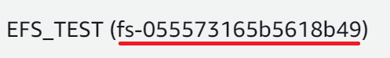 
(본인이 생성한 EFS의 해당 부분을 복사해 붙여준다.) 

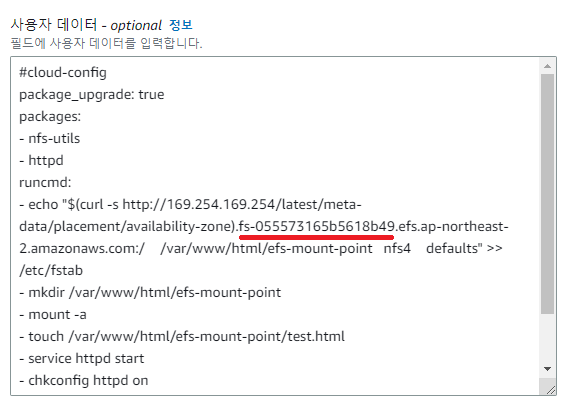 

이렇게 설정한 후 인스턴스를 시작한다. 

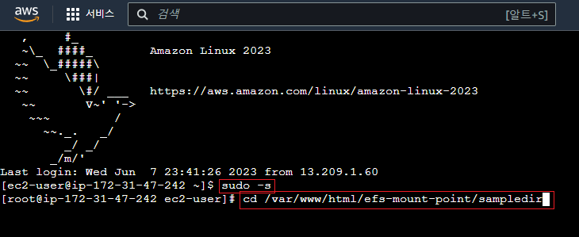 
(실제로 폴더가 생성되었는지 확인) 

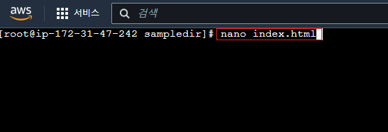 
(해당 경로에 index.html 파일을 생성한다.) 

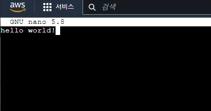 
(원하는 것을 입력한뒤 저장한다.) 

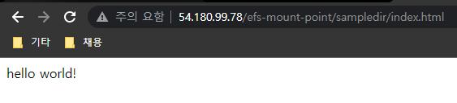 
(EC2의 IP주소/efs-mount-point/sampledir/index.html 경로를 검색하면 다음과 같은 화면이 나온다.) 
http://54.180.99.78/efs-mount-point/sampledir/index.html

다른 EC2 IP로 입력하면 동일하게 사이트가 열리는 것을 볼수 있다.
