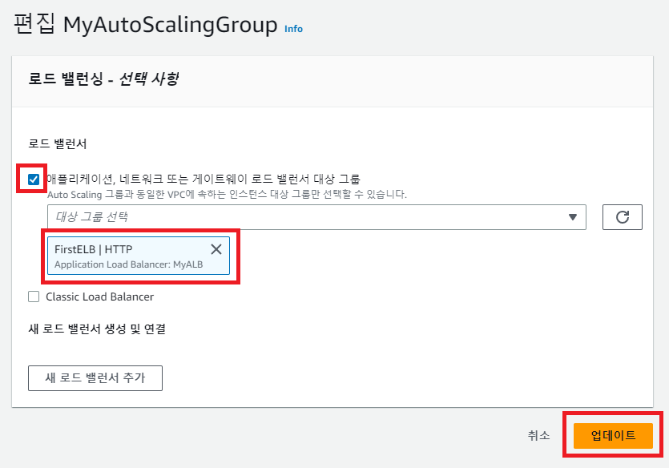

[뒤로가기](../../README.md)

# ELB 구성하기

Autoscaling을 구성 했다 가정
[AutoScaling 구성하기](../Document/AutoScaling.md)

 
(대상 그룹 생성 클릭) 

 
(이름을 설정한뒤 생성 클릭) 

 
(생성한 그룹의 대상을 클릭하고 편집을 클릭) 

 
(AutoScaling으로 생성된 인스턴스를 모두 선택하고 등록된 항목에 추가한뒤 저장) 

 
(이제 로드밸런서를 생성하기위해 이동) 

 
(ALB 생성 클릭) 

 
(이름 입력) 

 
(가용 영역 모두 활성 체크한 다음 보안 설정 구성으로 이동) 

 
(무시하고 다음) 

 
(보안 그룹을 Default로 하고 다음) 

 
(방금 생성한 대상 그룹을 선택한뒤 다음) 

 
(인스턴스가 제대로 있는지 확인하고 다음 클릭) 

 
(생성 클릭) 

 
(생성한 ALB의 상태가 프로비저닝 중에서 활성이 되면
해당 DNS이름을 URL에 복사해 이동) 

 
(F5를 눌러 새로고침을 하면 값이 바뀌는것을 보면 로드밸런서가 2개의 인스턴스를 번갈아가며 트래픽을 분산해줌) 

## 해당 ALB를 생성한 AutoScaling그룹에 붙이기

 
(생성한 Autoscaling 그룹을 클릭한뒤 창을 내려 로드밸런서 편집을 클릭) 

 
(체크하고 방금 생성한 ALB를 선택한뒤 업데이트 클릭) 

 
(이제 용량을 3으로 늘리고 새 인스턴스를 생성하면 자동으로
ALB에 해당 인스턴스를 포함한체로 트래픽을 분산해줌) 

 
(조금 기다리면 인스턴스가 자동으로 한개 생성되고 대상 그룹에도 포함되어 DNS주소로 입력하면 분산되는것을 볼 수 있음) 

## [주의사항]

 
 
ALB는 각 인스턴스에게 트래픽을 분산해주는 역할을 한다. 
하지만 인스턴스의 서버가 중지되도 아무런 조치를 취하지 않는다. 

그래서, AutoScaling그룹에서 ALB의 상태도 확인하며 서버를 복구 시켜주게 해주자. 

---

### 참고

AutoScaling으로 생성하는 인스턴스 갯수 제한이 3개인것 같다. 
그래서 실습에서는 AutoScaling그룹에서 생성하는 인스턴스 갯수를 2개로 조정한다. 
 

---

 
(생성한 Autoscaling 그룹의 상태 확인의 편집을 클릭) 

 
(ELB의 상태 체크에 따라 복구할 수 있도록 체크한뒤 업데이트 한다.) 

 
(자동으로 Autoscaling에서 ELB에서 상태가 안좋은 인스턴스를 검사해 기존 인스턴스를 제거하고 새 인스턴스를 생성해준다.) 

 
(새 인스턴스가 대상 그룹에 등록된것도 확인할 수 있고
비정상적인 인스턴스는 기다리면 자동으로 삭제 된다.) 
