[뒤로가기](../../README.md) 

# ESXi - CLI를 통한 VM 관리

지금까지 vSphere Client를 통해서 VM을 생성했다. 
여기서는 명령어를 통해 VM을 관리하는 법을 배운다. 

## 시작

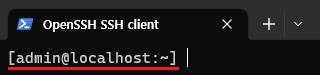 
호스트 터미널을 통해 ESXi로 SSH 접속한다.

### vim-cmd

VMware 환경을 관리하기 위한 CLI 인터페이스

### (1) VM 목록 확인

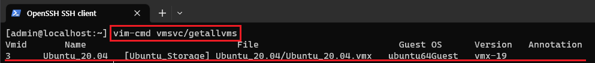 

> vim-cmd vmsvc/getallvms

vmsvc는 ESXi CLI에서 VM과 관련된 작업을 수행할때 추가하는 서브 커맨드이다. 
그래서 VM을 관리 CLI에서는 반드시 vmsvc가 붙는다. 

과거에 생성한 ubuntu 20.04가 있는것을 확인할 수 있다. 

### (2) 특정 VM 상태 확인

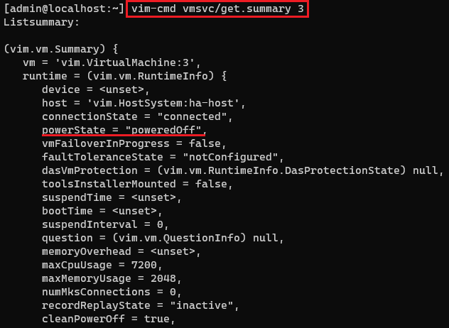 

> vim-cmd vmsvc/get.summary 3

여기서 3은 우분투 20.04의 VM_ID이다. 
이렇게 VM_ID를 통해 VM을 식별하거나 VM의 이름을 통해서도 가능하다. 
현재 VM이 꺼져있으니 CLI로 켜보도록 한다. 

### (3) VM Power On/Off

[power.on] 

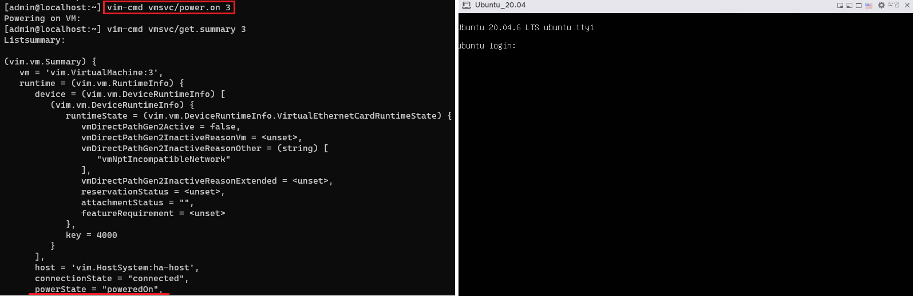 

> vim-cmd vmsvc/power.on 3

[power.off] 

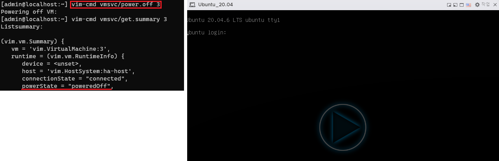 

> vim-cmd vmsvc/power.off 3

[power.reboot] 
재시작은 VM이 실행중일때 작동한다. 

> vim-cmd vmsvc/power.reboot 3

### (4) VM 생성/삭제

CLI를 통해 VM을 생성 및 삭제를 진행한다. 
일단 기존의 Ubuntu 20.04 VM을 삭제해본다. 

[VM 삭제] 

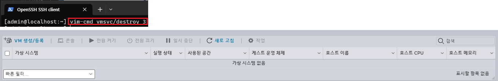 

> vim-cmd vmsvc/destroy 3

기존 우분투 20.04 VM을 삭제한다. 

[VM 생성] 
이번엔 CLI를 통해 우분투 20.04를 다시 생성해본다. 

### [dummyvm 생성]

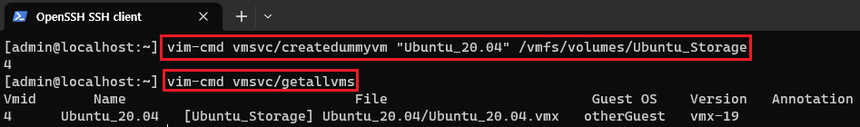 

> vim-cmd vmsvc/createdummyvm "Ubuntu_20.04" /vmfs/volumes/Ubuntu_Storage

createdummyvm : 실제 운영체제를 가지지 않는 빈 가상 머신을 생성한다. 
그리고 가상 머신의 이름 : Ubuntu_20.04를 입력하고 
생성할 데이터스토어 경로(/vmfs/volumes/Ubuntu_Storage)를 등록한다. 

생성을 하면 자동으로 VM_ID가 출력되며 실제로 VM 리스트를 확인하면 생성된것을 확인 할 수 있다. 

### [VM 구성 설정]

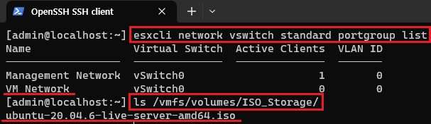 

> esxcli network vswitch standard portgroup list

ESXi의 표준 가상 스위치에 속한 네트워크 포트 그룹을 표시한다. 
VM Network를 VM의 네트워크로 구성한다. 

> ls /vmfs/volumes/ISO_Storage/

VM에 등록할 ISO이미지를 확인한다. 

### [VM의 가상 디스크 크기 조정]

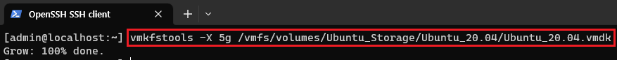 

> vmkfstools -X 5g /vmfs/volumes/Ubuntu_Storage/Ubuntu_20.04/Ubuntu_20.04.vmdk

vmkfstools : 가상 디스크 파일을 관리할때 사용하는 CLI 명령어 도구 모음이다. 
-X 5g : 가상 디스크 크기를 5G로 조정한다. 
Ubuntu_20.04.vmdk : Dummy VM을 생성할때 생성되는 가상 디스크 파일이다. 

해당 디스크 파일의 크기를 5G로 확장해 VM의 저장 공간을 확보한다. 
5G 크기는 Ubuntu_Storage 데이터스토어의 저장 용량을 고려한 수치이다. 

### [dummy VM 구성 정보 초기화]

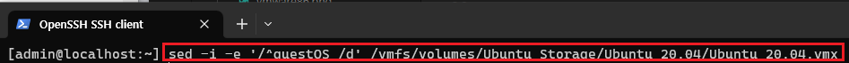 

> sed -i -e '/^guestOS /d' /vmfs/volumes/Ubuntu_Storage/Ubuntu_20.04/Ubuntu_20.04.vmx

VM을 구성하기전 Sed 명령어를 통해 Dummy VM이 생성되면서 구성된 정보를 삭제한다.
 

### [VM 구성]

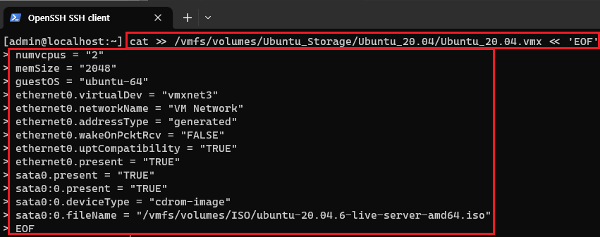 

> cat >> /vmfs/volumes/Ubuntu_Storage/Ubuntu_20.04/Ubuntu_20.04.vmx << 'EOF'

Ubuntu_20.04.vmx의 구성 정보를 EOF 종료 구분자까지 수정한다.

> numvcpus = "2"

VM의 CPU 갯수를 2개로 설정한다.

> memSize = "2048"

VM의 메모리 사이즈를 2048MB로 설정한다.

> guestOS = "ubuntu-64"

VM의 게스트 운영 체제를 ubuntu-64로 설정한다. 
(vSphere Clinet에서 VM을 생성할때 운영체제를 선택한 것과 같은 구성) 

> ethernet0.virtualDev = "vmxnet3"

VM의 네트워크 어댑터를 vmxnet3로 설정한다.

> ethernet0.networkName = "VM Network"

VM의 네트워크 구성을 VM Network로 설정한다.

> ethernet0.addressType = "generated"

MAC주소를 자동으로 생성한다.

> ethernet0.wakeOnPcktRcv = "FALSE"

Wake-on-LAN은 전원이 꺼져도 네트워크 패킷을 수신하여 컴퓨터를 원격으로 켤 수 있는 기능이다.  ethernet0.uptCompatibility = "TRUE"

VM 내부의 가상 네트워크 어댑터를 호스트 시스템(ESXi)의 네트워크 드라이버의 
물리적 네트워크 디바이스(NIC)간의 더 높은 호환성을 제공한다. 
VM의 네트워크 어댑터가 ESXi의 NIC를 직접 사용하게 설정한다. 

> ethernet0.present = "TRUE"

네트워크 어댑터를 사용하도록 설정한다.

> sata0.present = "TRUE"

SATA 컨트롤러를 사용하는것으로 설정한다.

> sata0:0.present = "TRUE"

SATA 컨트롤러 첫 번째 장치를 사용하도록 설정한다.

> sata0:0.deviceType = "cdrom-image"

SATA 컨트롤러 첫 번째 장치의 디바이스 타입을 CD/DVD 이미지로 설정한다. 
(ISO 이미지 파일을 위한 설정) 

> sata0:0.fileName = "/vmfs/volumes/ISO_Storage/ubuntu-20.04.6-live-server-amd64.iso"

이미지 파일 경로를 설정한다. 
(데이터스토어의 우분투 이미지 파일) 

> EOF

설정을 마친다. 

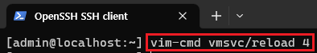 

> vim-cmd vmsvc/reload 4

VM의 구성 정보를 로드한다. 

> vim-cmd vmsvc/power.on 4

그리고 VM을 시작한다. 

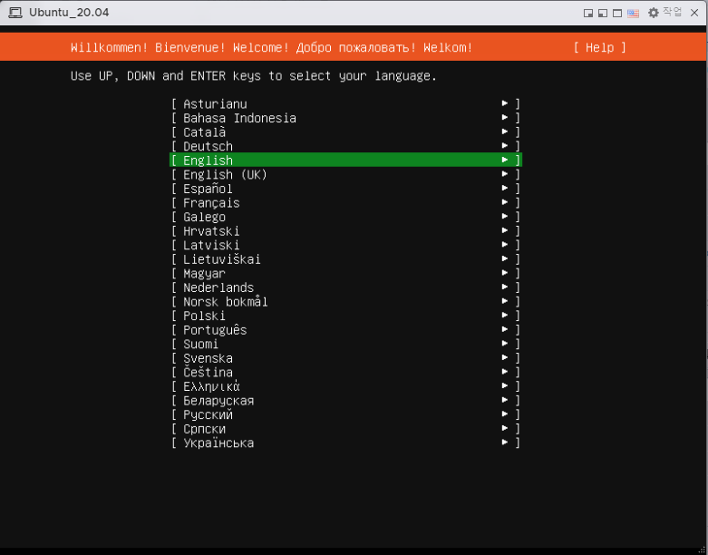 

다음과 같이 Ubuntu가 실행되는것을 볼 수 있다. 
