[뒤로가기](../../README.md) 

# ESXi - 계정 관리

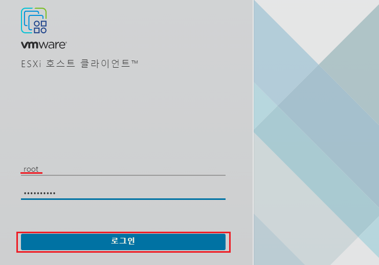 
관리자 ID인 root는 보안적으로 취약해 새로운 관리자 ID를 생성하고 
root ID의 권한을 삭제하는것이 좋다. 

## 사용자 추가

일단, vSphere Client를 통해 root 아이디로 로그인하자. 

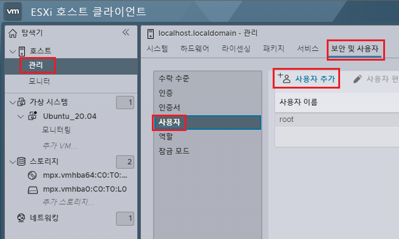 
관리 -> 보안 및 사용자 -> 사용자 -> 사용자 추가를 누른다. 

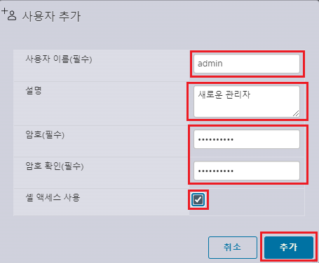 
새로운 사용자 이름, 설명, 암호를 입력한다. 
그리고 쉘 액세스 사용을 체크한뒤 추가를 한다. 

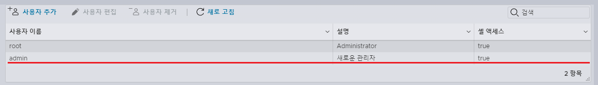 
이렇게 계정이 정상적으로 추가가 되었지만, ESXi 시스템의 권한이 없어서
접속이 안된다. 
권한 할당을 진행한다. 

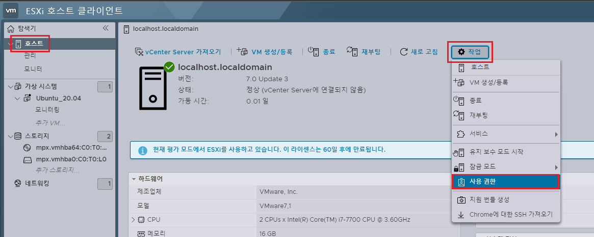 
호스트 -> 작업 -> 사용 권한을 클릭한다. 

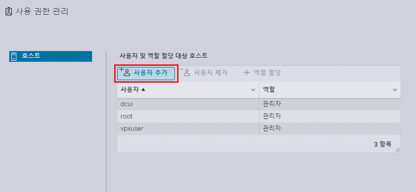 
사용자 추가를 클릭한다. 

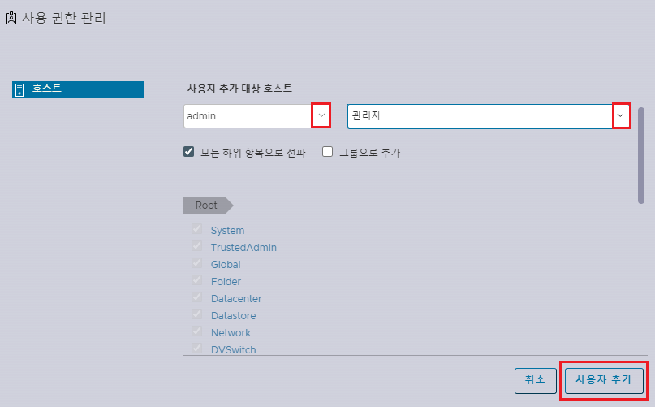 
추가하려는 사용자를 찾아 선택하고 권한 할당 목록에서 관리자를 선택한뒤
사용자 추가를 클릭한다. 
이제 방금 생성한 사용자로 접속이 가능하다. 

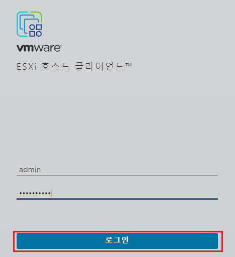 
방금 생성한 사용자로 로그인 해보자. 

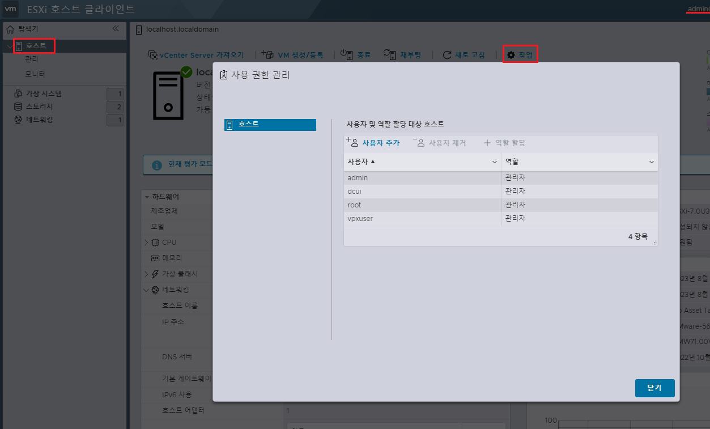 
로그인이 완료되면 다시 사용 권한 관리에 들어간다. 
(root 사용자의 권한을 해제할것이다.) 

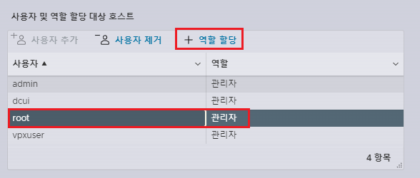 
root 사용자를 클릭한뒤, 역할 할당을 누른다. 

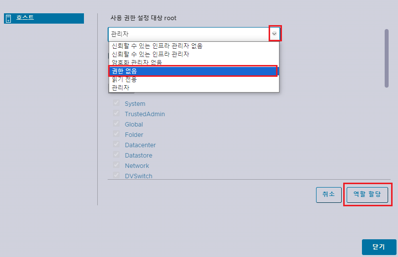 
권한 할당 탭에서 권한 없음을 선택한뒤 역할 할당을 클릭한다. 

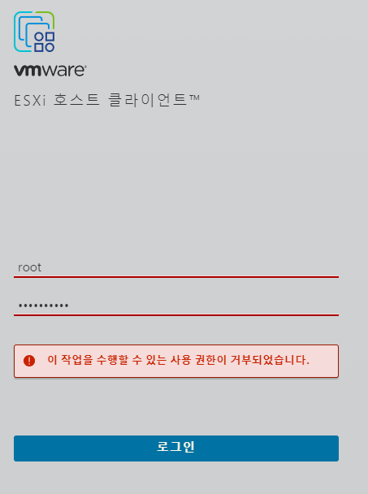 
이렇게 root 사용자로 로그인이 불가능하다. 

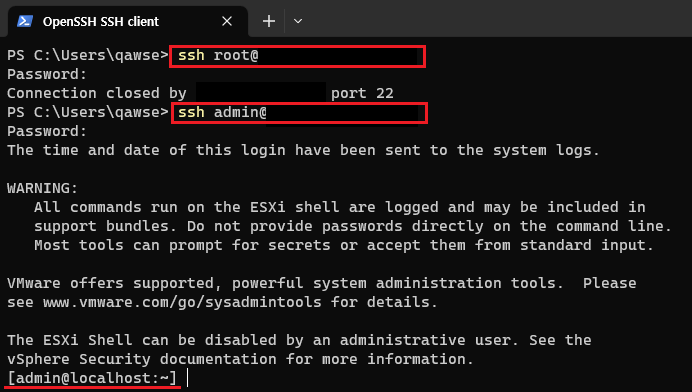 
또한, root 계정의 SSH 접근도 불가능하다. 
대신 admin 사용자를 생성할때 쉘 액세스 허용 체크를 하여
SSH 접속도 가능하다. 
