[뒤로가기](../../README.md) 

# ESXi - 우분투 VM 생성

생성한 ESXi에 우분투 VM을 생성한다. 

### [ubuntu 20.04 LTS](https://releases.ubuntu.com/focal/)

우분투 ISO 를 호스트 PC에 다운받는다. 

## 시작

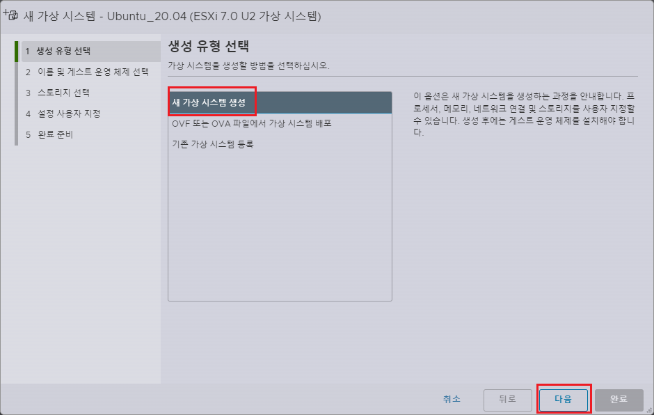 
데이터스토어는 ESXi에서 VM을 저장하기 위한 저장소 역할을 한다. 
그래서 VM의 위치를 논리적으로 구별하기 쉽게 스토리지 볼륨 생성과  연결할 경우
Lable을 부여할 수 있다.

데이터스토어 종류

1. VMFS 
   ESXi에서 가상 머신의 디스크를 저장하는 저장소로 가장 많이 선택한다. 
   VMFS는 파일 시스템으로 포맷된 스토리지 볼륨을 나타낸다. 
   그래서 가상 머신 디스크 파일(VMDK)는 VMFS 볼륨 위에 저장되며,  각 개별 VM들은
   VMDK 파일은 SCSI 디스크로 인식하게 된다. 
2. NFS 
   VMFS와 같이 가상 머신 디스크를 저장하기 위한 저장소로 사용된다. 
   하지만 VMFS와 달리 블록 기반이 아니며, 운영체제가 제공하는 파일 기반의
   공유 서비스를 사용한다. 
   그래서 SCSI 명령을 통해 데이터 전송을 하는것이 아니여서 VMFS 파일 시스템을 생성할 필요가 없다. 
3. RDM 
   VMFS, NFS 처럼 가상 머신 디스크 파일을 저장하지 않고 스토리지 시스템에서 제공하는 LUN을 직접 액세스 할때 사용한다. 
   RDM을 사용하는 대표적인 경우 
   - 대량의 파일 크기로 인해 가상 디스크로 데이터 이전이 힘들경우
   - 가상 머신을 MS Cluster Service을 이용하여 Cluster를 구성할 경우
   - VM에 SAN 스토리지 관리 소프트웨어를 직접 실행하는 경우

여기서는 기본적으로 생성된 datastor1에 우분투 ISO파일을 업로드 한다. 
(하지만, 데이터스토어 분할 문제로 ESXi를 재설치할 것이다. 
그래도 계속 진행하면서 vSphere에 익숙해지자.) 

### (1) ESXi에 우분투 ISO 파일 업로드

### [vSphere Client 방식]

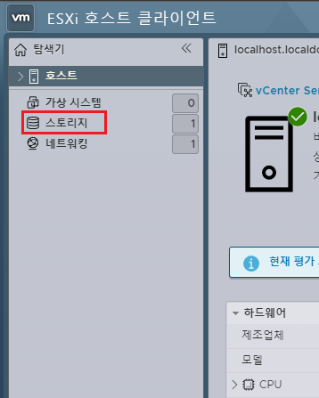 
vSphere Client에 접속한뒤 스토리지를 클릭한다. 

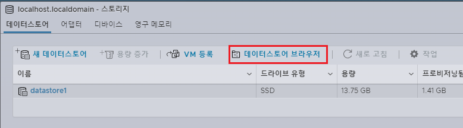 
데이터스토어 브라우저를 클릭한다. 

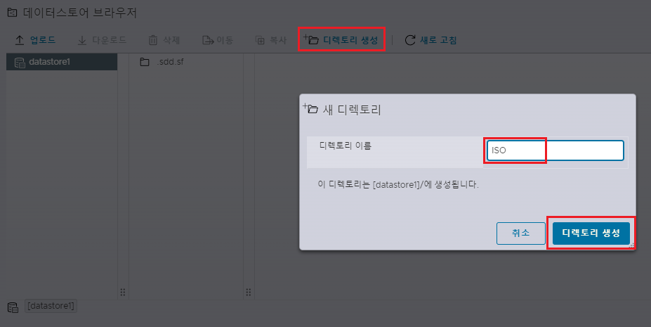 
디렉토리 생성 클릭 -> 이름 입력 -> 생성을 누른다. 

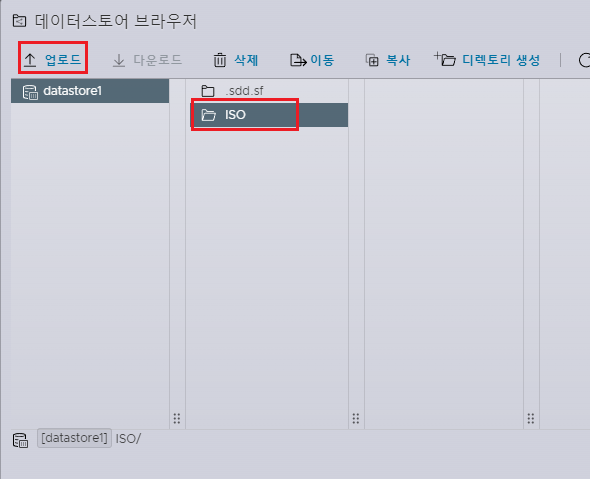 
생성한 폴더를 누른뒤 업로드를 클릭한다. 

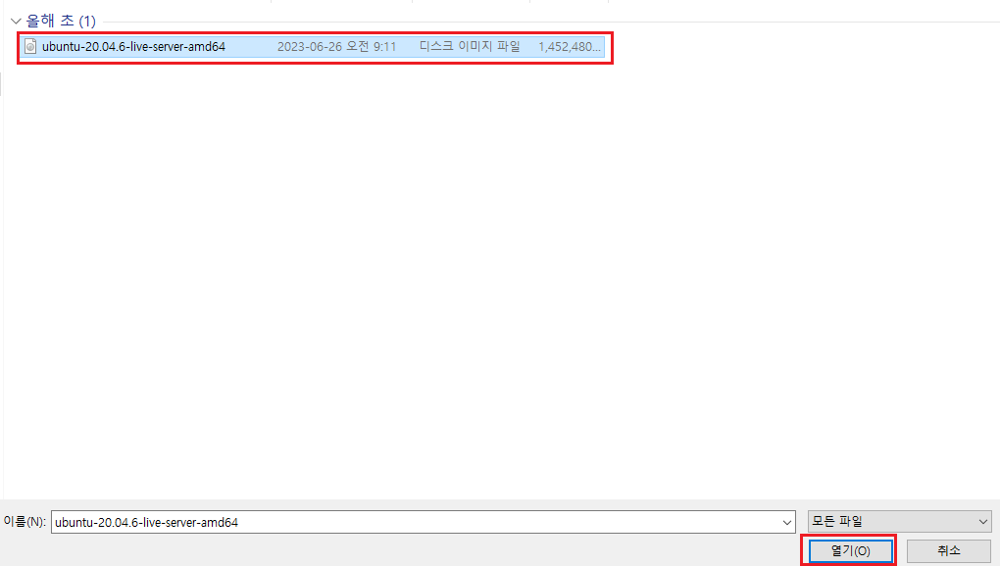 
다운받은 ISO를 업로드한다. 

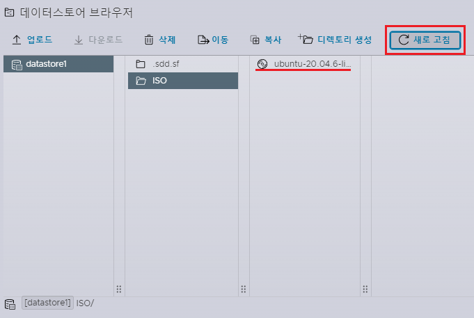 
새로고침하면 업로드된것을 확인할 수 있다. 

---

### [주의사항]

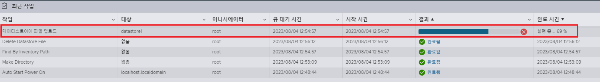 
파일 업로드가 완료될때까지 기다리고 VM을 생성하자. 

---

### [SSH 방식]

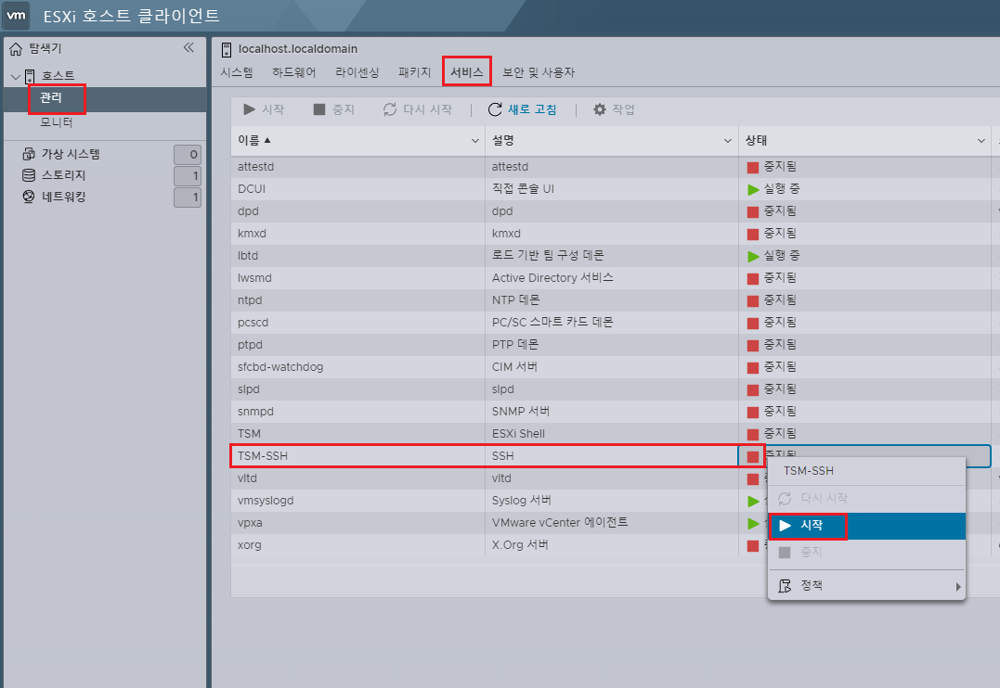 
관리 -> 서비스로 들어간뒤, TSM-SSH를 오른쪽 클릭해 시작을 누른다. 

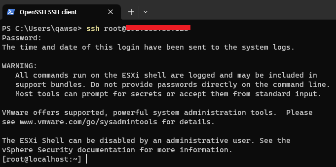 

호스트 PC에서 터미널을 연다. 

> ssh root@ESXi IP

를 입력한뒤 root계정의 비밀번호를 입력후 접속한다. 

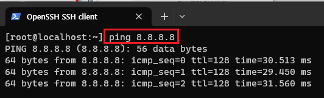 

> ping 8.8.8.8

그래도 외부와 통신을 하는지 확인한다. 

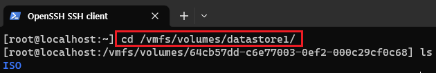 

> cd /vmfs/volumes/datastore1/

datastore1 경로로 이동한다. 
확인하면 vSphere Client에서 생성한 ISO 폴더가 있는것을 확인할 수 있다. 

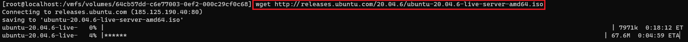 

> wget http://releases.ubuntu.com/20.04.6/ubuntu-20.04.6-live-server-amd64.iso

wget 명령어로 우분투를 다운받는다. 

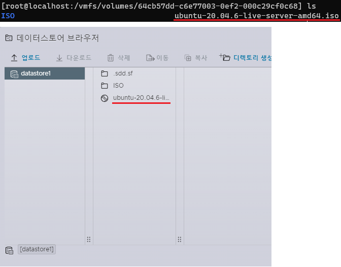 
다운이 완료되면, 다음과 같이 ISO파일이 저장되고 데이터스토에도 보이는것을 확인할 수 있다. 

---

### (2) 우분투 저장 공간 확보를 위한 ESXi 재설치

우분투 VM를 생성하기전에 
우분투 VM의 저장소를 확보하기위해 새 데이터스토어를
생성하려 한다. 

하지만, 
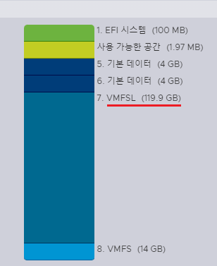 
다음과 같이 실제 디스크의 VMFSL의 저장소 크기가 120GB이고
사용가능한 VMFS의 저장소 크기가 14GB밖에 없다.

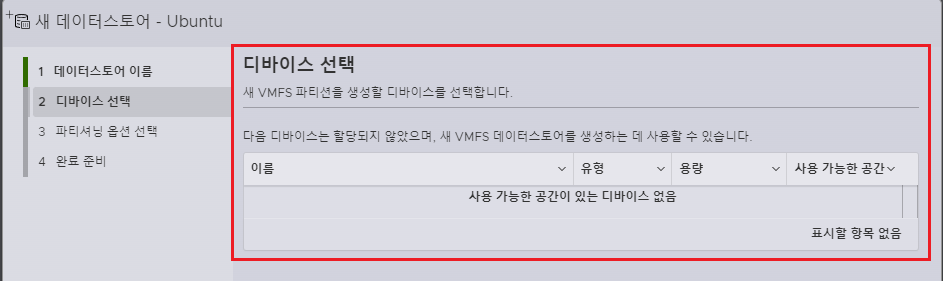 
그래서 새 데이터스토어를 생성할때 사용 가능한 공간이 없어 
다음과 같이 생성이 안된다. 

여기서는 두가지 방법이 있는것 같다. 

1. 이미 생성된 datastore1을 Ubuntu 저장소로 사용한다.
2. ESXi를 다시 설치해 여유 공간을 확보한다. 
   (이미 설치된 ESXi의 디스크 파티션 변경이 불가능)

여기서는 ESXi를 다시 설치해 여유 공간을 확보하겠다. 
또한, ESXi 메모리 크기도 16GB로 수정한다.

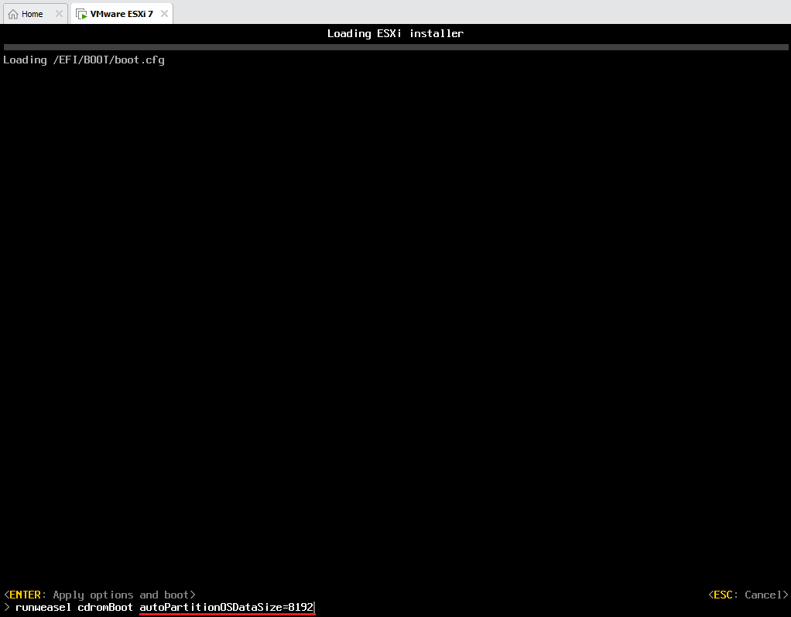 
다음과 같이 ESXi를 처음 부팅할때 5초정도 기다리는데 
그때 Shift + O를 누른다. 

> autoPartitionOSDataSize=8192

그리고 다음과 같이 입력해 ESXi 설치 공간을 8GB로 설정하고 ESXi를 설치한다. 

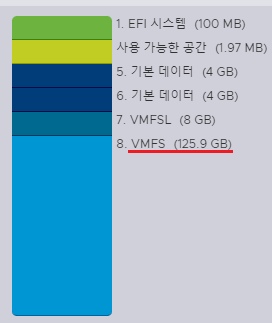 
설치를 완료하면 다음과 같이 VMFS의 용량이 확보된다. 

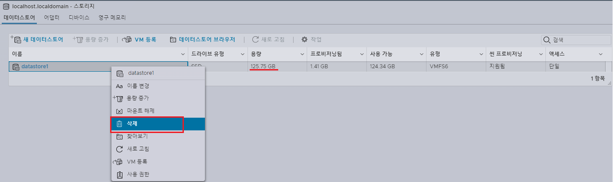 
하지만, 기본적으로 생성된 datastore1이 모든 공간을 차지하고 있다. 
삭제해 새로 만들어보자 

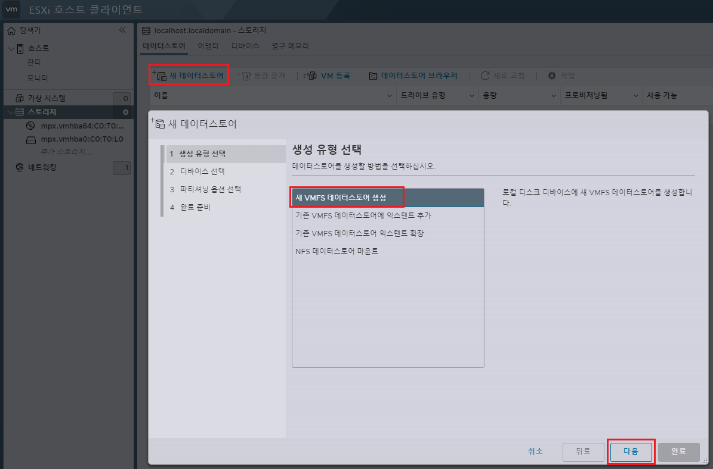 
삭제한뒤 새 데이터스토어를 클릭한뒤, 새 VMFS 데이터스토어 생성을 선택하고
다음으로 넘어간다. 

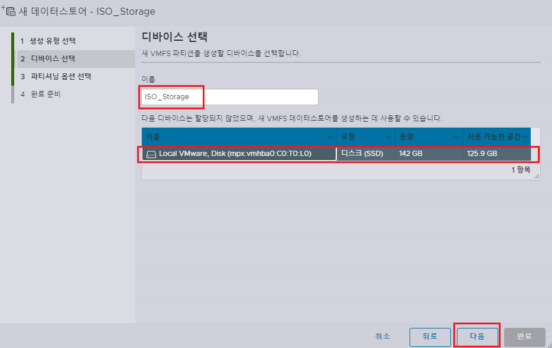 
처음 생성할것은 ISO 저장소 공간이다. 
이름을 입력하고 디바이스를 선택한뒤 다음으로 넘어간다. 

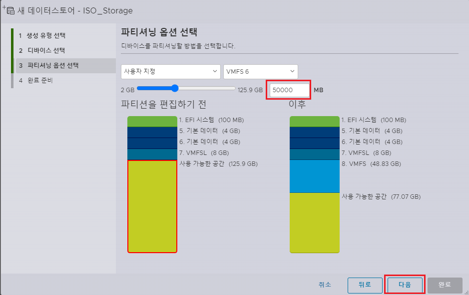 
ISO 저장 공간은 50GB를 확보한다. (48.83GB가 실제 저장 공간) 
다음과 같이 입력하고 다음으로 넘어간다. 

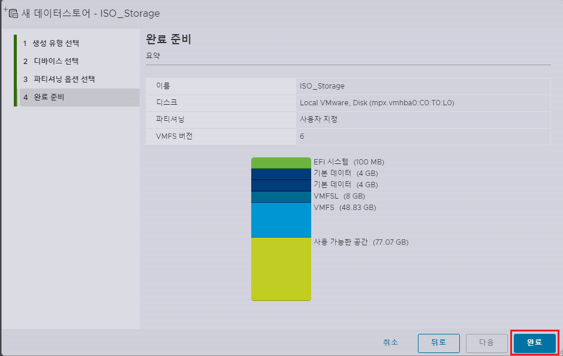 
구성 정보를 확인하고 완료를 누른다. 

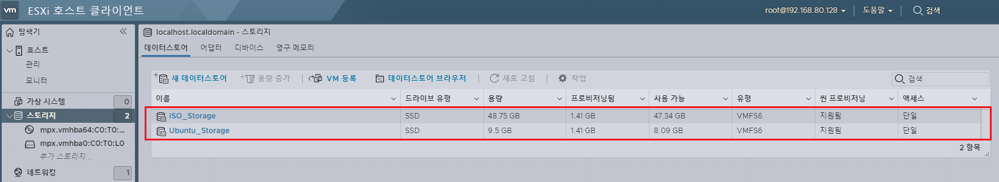 
이렇게 Ubuntu_Storage도 생성한다.  (10GB로 설정했다.)

### ISO_Storage에 ubuntu 20.04를 다시 업로드 해놓자.

### [주의사항]

새 데이터스토어 생성시에 디바이스가 안보이는 오류가 있다. 
그때는 "기존 VMFS 데이터스토어 익스텐트 확장" 을 누르고 취소한 다음 
"새 VMFS 데이터스토어 생성"을 하면 디바이스가 보인다. 

---

### (3) 우분투 VM 생성

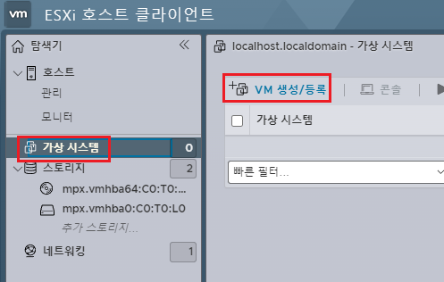 
가상 시스템에 들어간뒤, VM 생성/등록을 누른다. 

 
새 가상 시스템 생성을 선택하고 다음으로 넘어간다. 

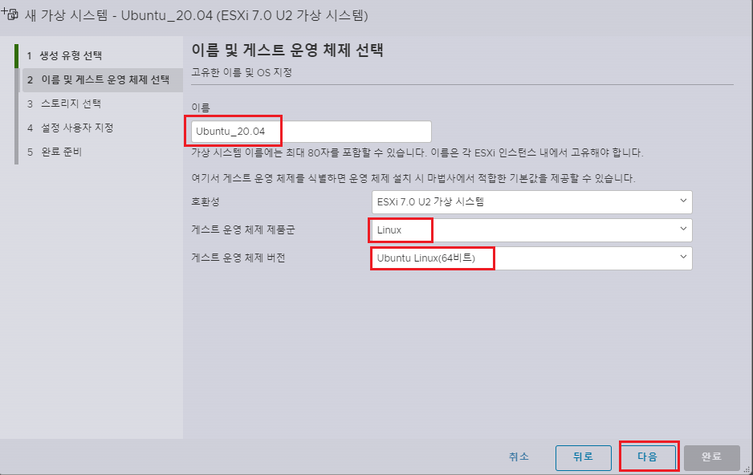 
이름을 입력하고 운영체제 제품군은 Linux, 운영 체제 버전은 Ubuntu Linux(64비트를)
선택하고 다음으로 넘어간다. 

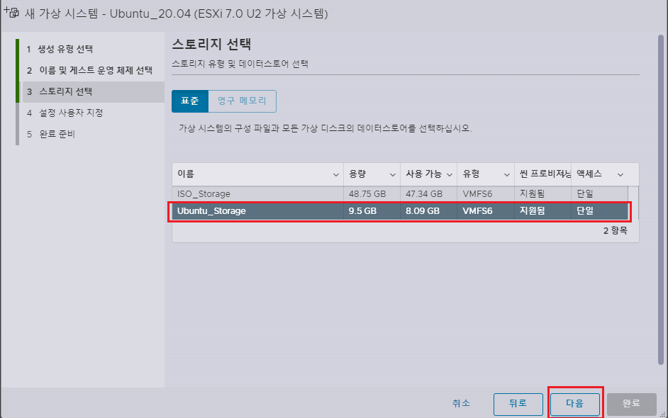 
생성한 Ubuntu_Storage를 저장소로 선택하고 다음으로 넘어간다. 

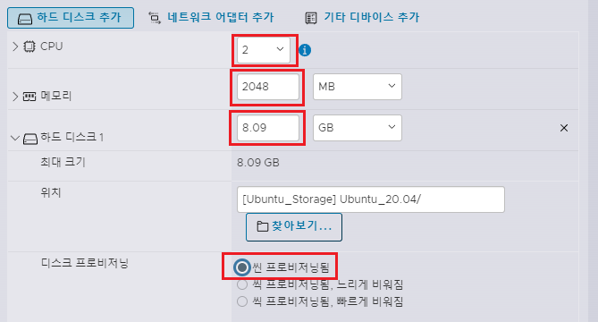 

CPU 2, 메모리 2048, 하드 디스크 8.09GB(최대)로 설정한다. 
그리고 씬 프로비저닝됨으로 선택한다. 

### [디스크 프로비저닝]

씬 프로비저닝 : 미리 설정된 5GB 공간은 최대 공간일 뿐 실제로 확보된 공간은
실제로 사용한 공간만큼한 확보한다. 
미리 확보되지 않기에 쓰레기값을 그때그때 계속 치우게 된다. 
(개발 서버에 적합) 

씩 프로비저닝, 느리게 비워짐 : 미리 설정된 디스크 공간을 확보하고 VM안의 쓰레기값들을 치우지 않고 새로운 데이터가 들어올때만 필요한 공간을 청소한다. 

씩 프로비저닝, 빠르게 비워짐 : 미리 설정된 디스크 공간을 확보하고 저장소의 쓰레기값을 모두 치우고 사용하게 된다.  (실제 서비스 서버에 적합) 

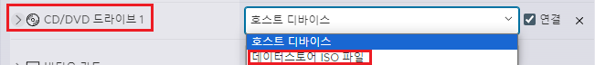 
아래로 내려 CD/DVD 드라이브1에서 데이터스토어 ISO 파일을 선택한다. 

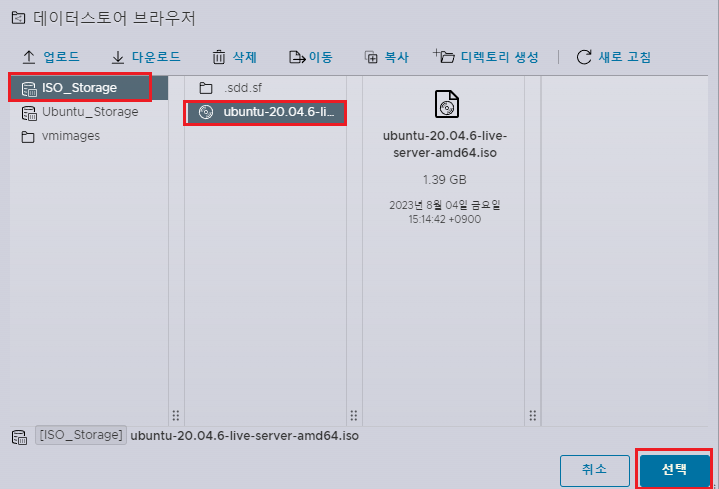 
ISO_Storage에 저장한 ubuntu iso파일을 선택한다. 

그리고 다음으로 넘어간다. 

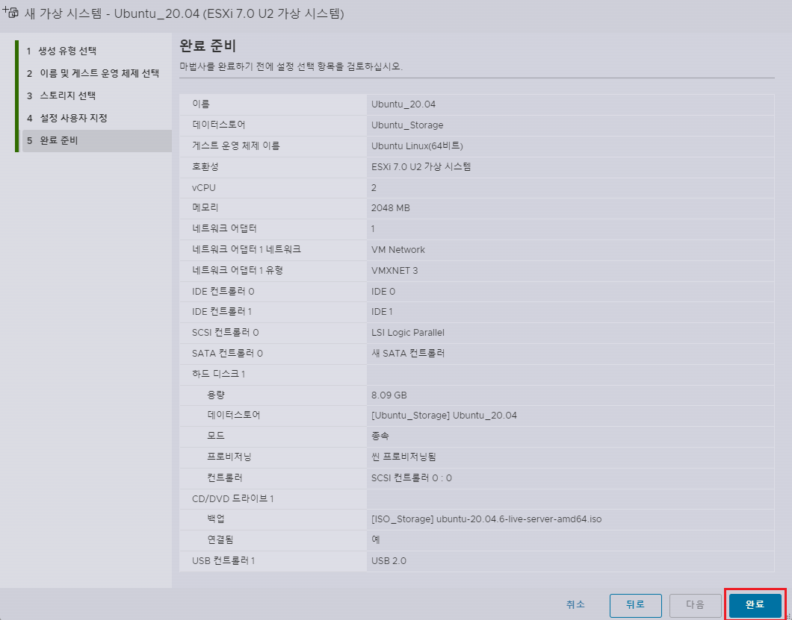 
구성 정보를 확인하고 완료한다. 

### (4) 우분투 VM 시작

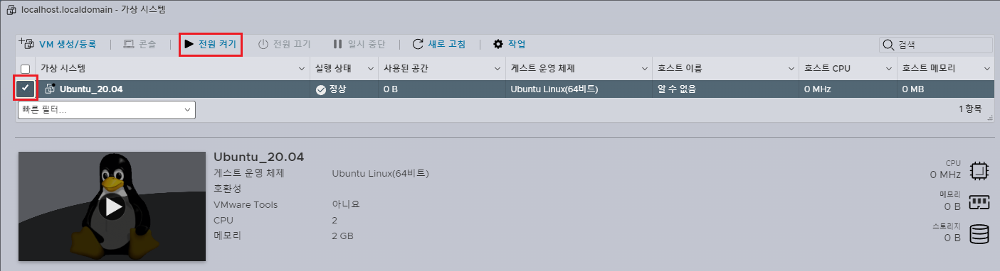 
생성이 완료되면 생성한 Ubuntu_20.04를 선택한뒤 전원을 켜보자. 

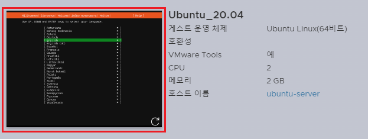 
다음과 같이 미리보기로 화면이 보인다. 
해당 미리보기를 클릭하면 윈도우창으로 볼 수 있다. 

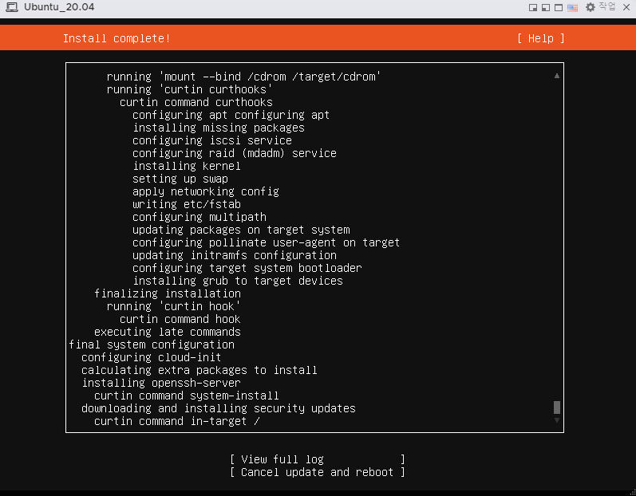 
우분투 설치를 해보자. 

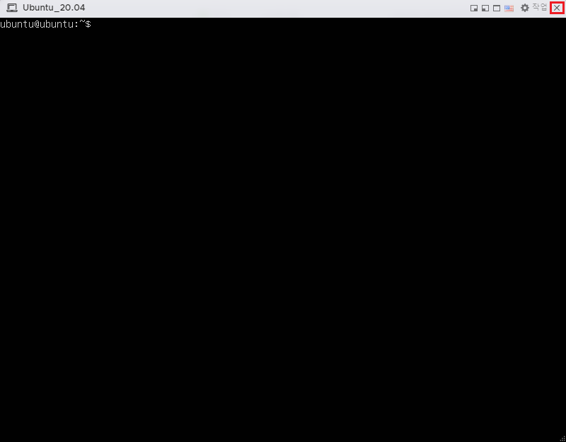 
설치가 완료되고 접속도 되면 우분투를 종료한다. 

### [참고]

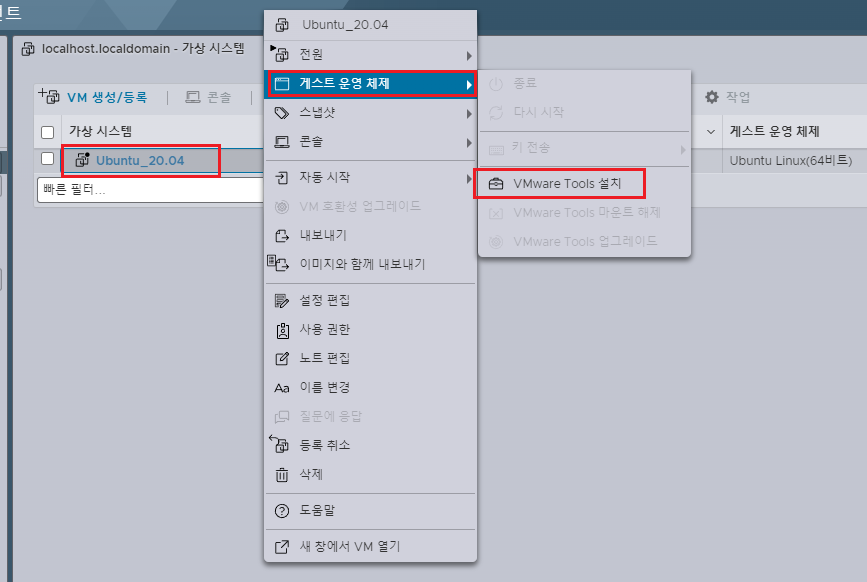 
사실 VM을 생성하면 VMTools를 설치해야한다.

하지만, 
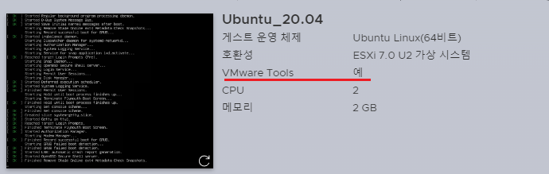 
ubuntu 20.04는 기본적으로 open-vm-tools가 포함되어 있어 설치가 필요없다. 

VMware Tools는 Guest OS에 설치해서 가상 환경에 최적화 시켜주는 유틸리티 모음이다. 
대표적인 기능이다.

- 콘솔 마우스 성능 향상 : Windows 가상머신은 VMTools가 없으면 웹 콘솔에서 마우스가 아예 먹히지 않는다.
- 정지 상태 스냅샷 생성
- 가상 머신 Guest OS 종료/재부팅 작업
- Guest OS IP, DNS 등의 정보 GUI 표기
- vSphere HA VM 모니터링
- 호스트와 게스트 시간 동기화
- Guest OS VMXNET3 네트워크 어댑터 인식
