[뒤로가기](../../README.md) 

# Github [SpringBoot]

Github에서 SpringBoot 프로젝트를 clone한뒤
우분투 환경에서 빌드해 서버 배포 

## 구성도

## 사전 세팅

1. AWS EC2 Ubuntu 생성 및 환경 설정 [AWS EC2 생성](../Document/EC2.md)
2. Springboot 프로젝트 생성 [SpringBoot 프로젝트 생성](../Document/Local%20%5BSpringBoot%5D.md)
3. SpringBoot 프로젝트 Github에 저장 [여기서는 github_demo 브랜치를 사용함]

## 환경

[Java SE-17](https://www.oracle.com/java/technologies/javase/jdk17-archive-downloads.html) 
VSCode 

1. Spring Boot Extension Pack
2. Extension Pack for Java
3. Gradle for Java

EC2 - Ubuntu (AWS EC2 생성 과정 참조) [EC2](../Document/EC2.md)

## 시작

### (1) java, git 설치 및 버전 확인

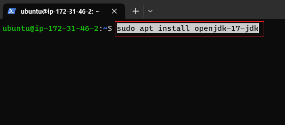 
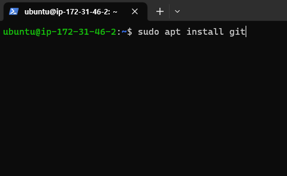 

### (2) git 정보 입력

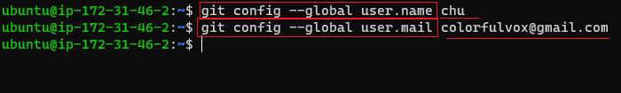 

### (3) git clone 받기

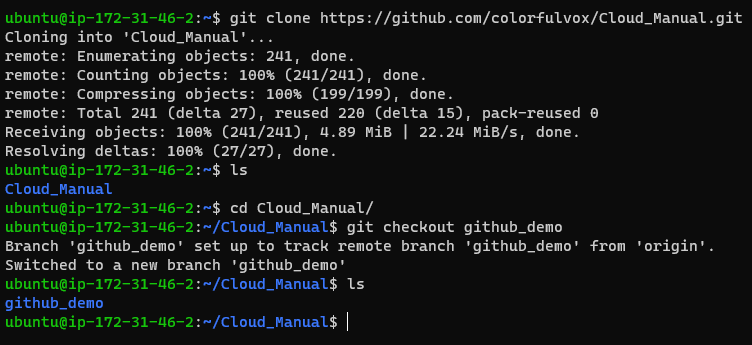 
(프로젝트가 있으면 clone을 받고 여기서는 github_demo 브랜치를 사용함) 

### (4) gradlew 사용 권한

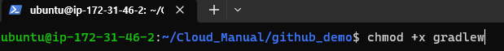 
(chmod +x gradlew 를 입력해 사용 권한을 받음) 

### (5) gradlew 빌드

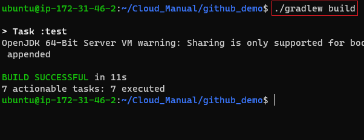 
(./gradlew build 를 입력 후 빌드) 
[프로젝트 폴더 내에서 해당 명령어 수행] 

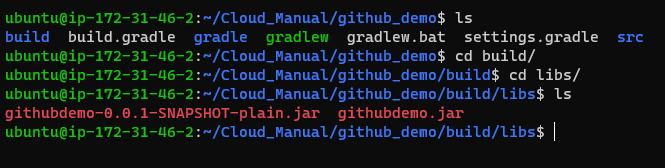 
(build -> libs 폴더로 이동 후 빌드된 파일을 확인) 

### (6) 서버 실행 및 확인

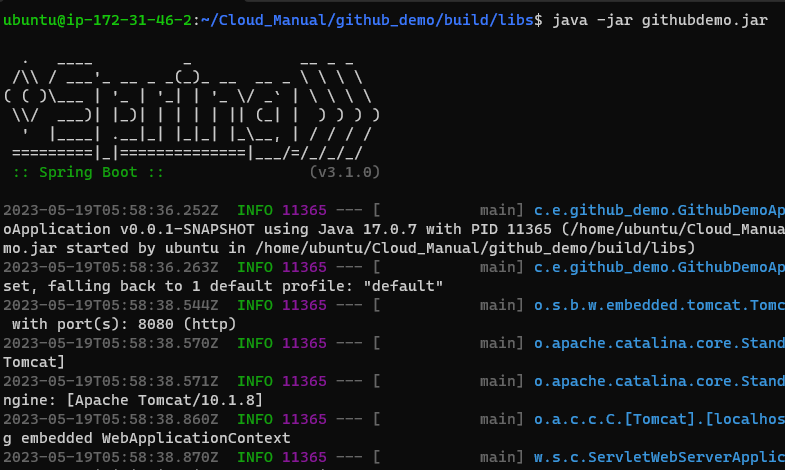 
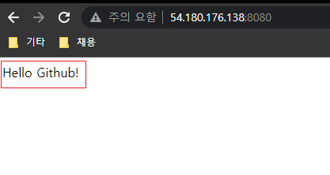 

### (7) 빌드 과정 Bash로 수행하기

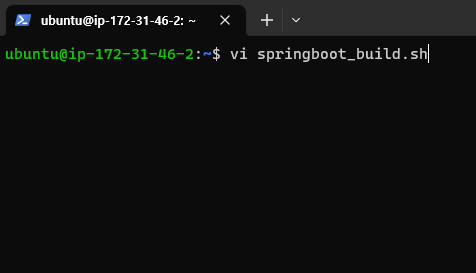 
(bash 쉘 스크립트 생성)

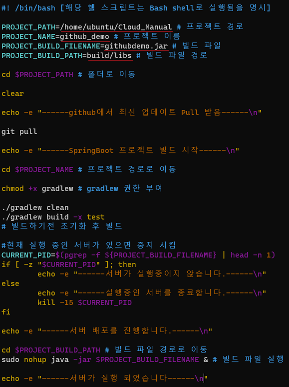 
(다음과 같이 입력) 
단, PROJECT 경로와 파일명은 본인의 프로젝트 경로에 맞춰 작성 

 
(쉘스크립 실행) 

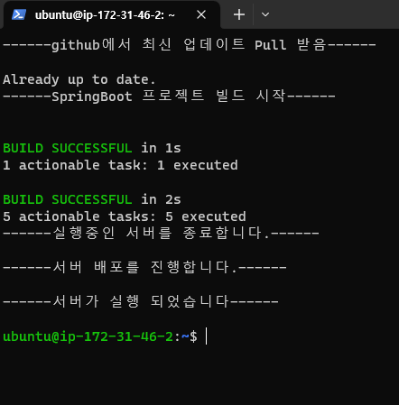 
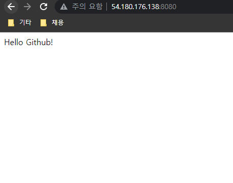 
(결과 확인) 

## [테스트]

github에 저장된 springboot프로젝트를 수정한뒤 Pull 받아 결과 확인하기

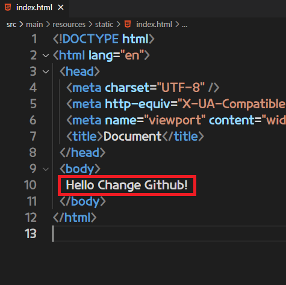 
(springboot프로젝트에서 body부분 변경) 
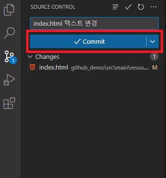 
(github에 커밋 후 동기화) 
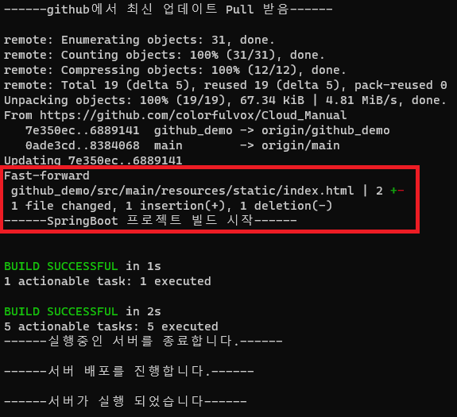 
(다시 우분투로 가서 쉘스크립트 실행) 
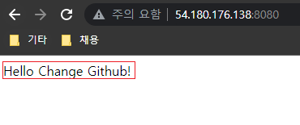 
(결과 확인) 
