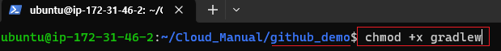
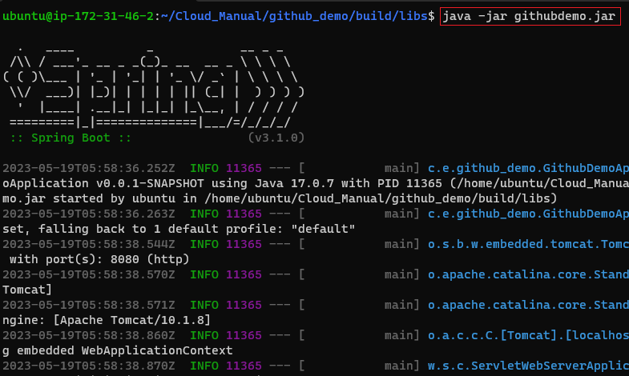
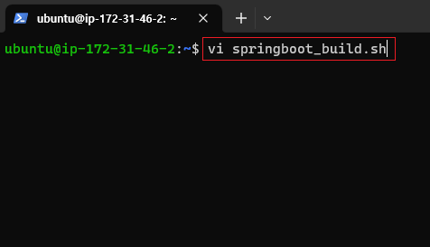
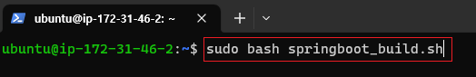
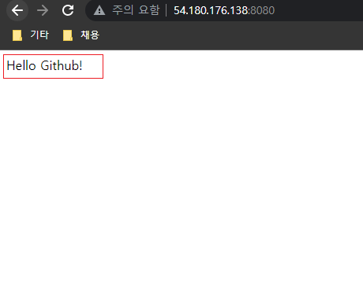

# Github \[SpringBoot]

[뒤로가기](../../)\

## Github \[SpringBoot]

Github에서 SpringBoot 프로젝트를 clone한뒤 우분투 환경에서 빌드해 서버 배포\

### 구성도

### 사전 세팅

1. AWS EC2 Ubuntu 생성 및 환경 설정 [AWS EC2 생성](EC2.md)
2. Springboot 프로젝트 생성 [SpringBoot 프로젝트 생성](<Local \[SpringBoot].md>)
3. SpringBoot 프로젝트 Github에 저장 \[여기서는 github\_demo 브랜치를 사용함]

### 환경

[Java SE-17](https://www.oracle.com/java/technologies/javase/jdk17-archive-downloads.html)\
VSCode\

1. Spring Boot Extension Pack
2. Extension Pack for Java
3. Gradle for Java

EC2 - Ubuntu (AWS EC2 생성 과정 참조) [EC2](EC2.md)

### 시작

#### (1) java, git 설치 및 버전 확인

\
\

#### (2) git 정보 입력

\

#### (3) git clone 받기

\
(프로젝트가 있으면 clone을 받고 여기서는 github\_demo 브랜치를 사용함)\

#### (4) gradlew 사용 권한

\
(프로젝트 폴더로 이동한 뒤\
chmod +x gradlew 를 입력해 사용 권한을 받음)\

#### (5) gradlew 빌드

\
(./gradlew build 를 입력 후 빌드)\
\[프로젝트 폴더 내에서 해당 명령어 수행]\

\
(build -> libs 폴더로 이동 후 빌드된 파일을 확인)\

#### (6) 서버 실행 및 확인

\
\

#### (7) 빌드 과정 Bash로 수행하기

\
(bash 쉘 스크립트 생성)

\
(다음과 같이 입력)\
단, PROJECT 경로와 파일명은 본인의 프로젝트 경로에 맞춰 작성\

\
(쉘스크립 실행)\

\
\
(결과 확인)\

### \[테스트]

github에 저장된 springboot프로젝트를 수정한뒤 Pull 받아 결과 확인하기

\
(springboot프로젝트에서 body부분 변경)\
\
(github에 커밋 후 동기화)\
\
(다시 우분투로 가서 쉘스크립트 실행)\
\
(결과 확인)\
