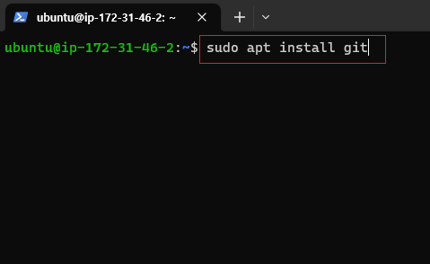
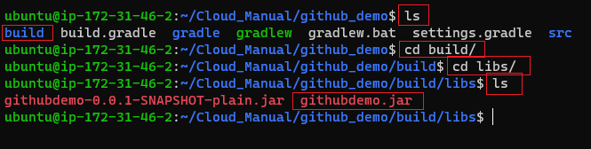

[뒤로가기](../../README.md)

# Github [SpringBoot]

Github에서 SpringBoot 프로젝트를 pull받아
우분투 환경에서 빌드한뒤 서버 배포

## 구성도

## 사전 세팅

1. AWS EC2 Ubuntu 생성 및 환경 설정 [AWS EC2 생성](../Document/EC2.md)
2. Springboot 프로젝트 생성 [SpringBoot 프로젝트 생성](../Document/Local%20%5BSpringBoot%5D.md)
3. SpringBoot 프로젝트 Github에 저장
4. 우분투에 openjdk17이 설치됨

## 환경

[Java SE-17](https://www.oracle.com/java/technologies/javase/jdk17-archive-downloads.html) 
VSCode 

1. Spring Boot Extension Pack
2. Extension Pack for Java
3. Gradle for Java

EC2 - Ubuntu (AWS EC2 생성 과정 참조) 
[EC2](../Document/EC2.md)

## 시작

### (1) java, git 설치 및 버전 확인

 
 

### (2) git 정보 입력

 

### (3) git clone 받기

 
(프로젝트가 있으면 clone을 받고 여기서는 샘플 프로젝트 브랜치로 이동함) 

### (4) gradlew 사용 권한

 
(chmod +x gradlew 를 입력해 사용 권한을 받음) 

### (5) gradlew 빌드

 
(./gradlew build 를 입력 후 빌드) 
[프로젝트 폴더 내에서 해당 명령어 수행] 

 
(build -> libs 폴더로 이동 후 빌드된 파일을 확인) 

### (6) 서버 실행 및 확인

 
