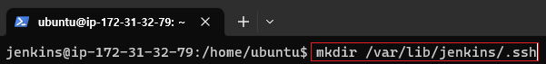
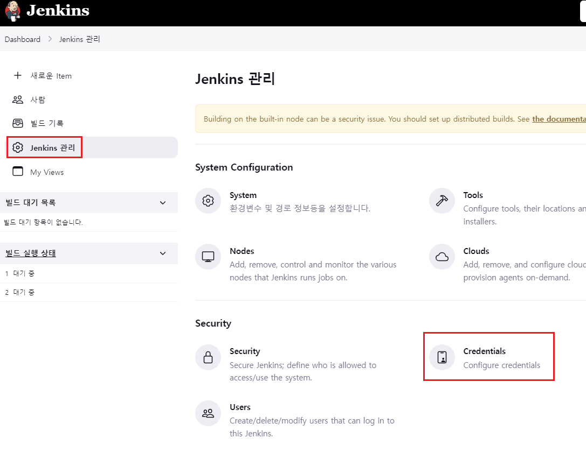
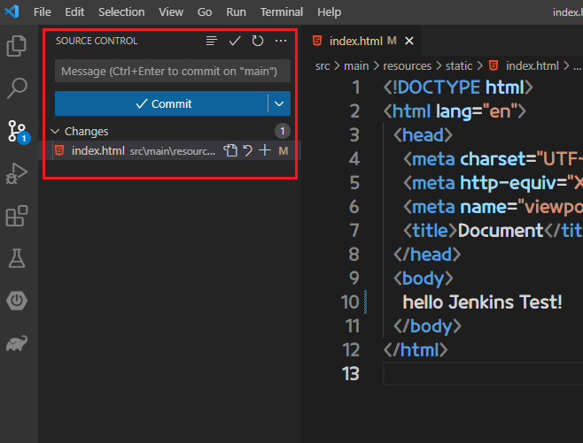
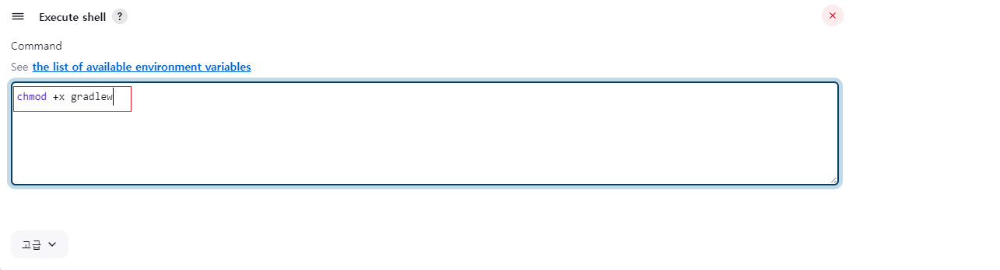
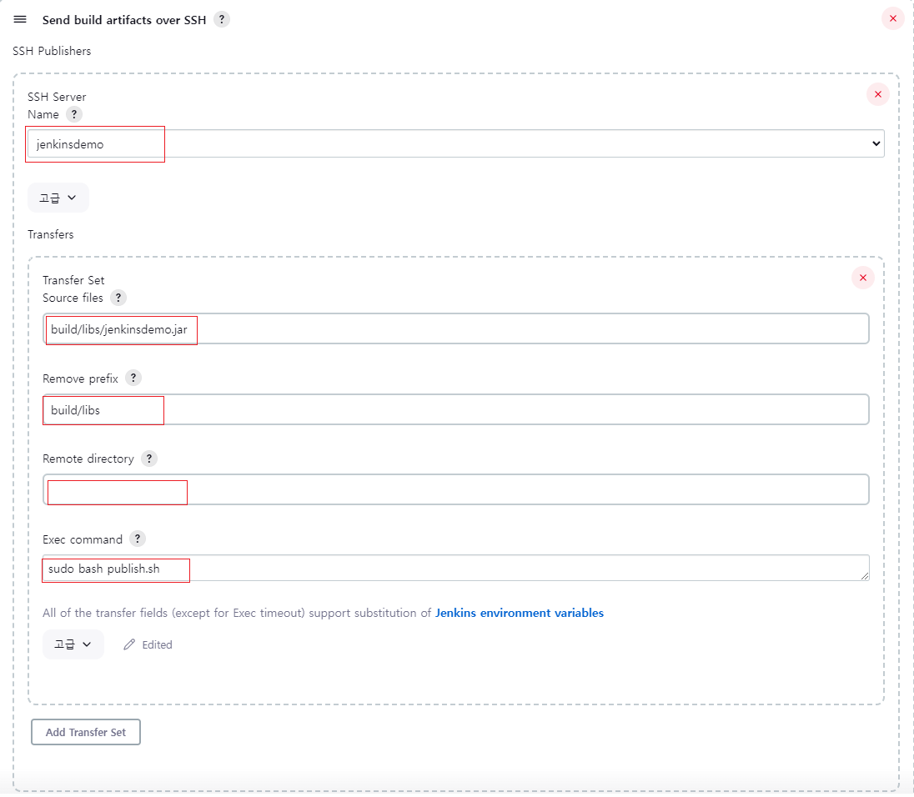

[뒤로가기](../../README.md) 

# Jenkins [SpringBoot]

Jenkins서버와 Github을 연동해 자동으로 빌드를 진행하고,
WAS서버에 빌드 파일을 전달해 서버 배포  

## 구성도

## 사전 세팅

1. AWS EC2 Ubuntu 생성 및 환경 설정 [AWS EC2 생성](../Document/EC2.md)
2. Springboot 프로젝트 생성 [SpringBoot 프로젝트 생성](../Document/Local%20%5BSpringBoot%5D.md)
3. SpringBoot 프로젝트 Github에 저장
4. Jenkins 설치 완료 [Jenkins 설치](../Document/Jenkins.md)

## 환경

1. Jenkins 서버용 EC2
2. WAS 서버용 EC2
   [Java SE-17](https://www.oracle.com/java/technologies/javase/jdk17-archive-downloads.html) 
3. VSCode 
   (1) Spring Boot Extension Pack 
   (2) Extension Pack for Java 
   (3) Gradle for Java 

## 시작

### Jenkins 서버와 Github 연동

Webhook은 특정 이벤트가 발생할때 특정 서비스에게 알림을 보내는 기능이다. 
Webhook을 활용해 Github 저장소의 업데이트가 발생하면
Jenkins가 반응하여 처리를 하도록 구현한다. 
하지만, github 저장소에 접근하기 위해서는 credentail 등록이 필요하며 서버에서 깃허브 아이디, 비밀번호를 인증하는 방식은 위험하므로 저장소에 SSH키를 생성하여 Github에 등록해 연동시킨다. 

### (1) 키파일 생성 

 
(jenkins가 실행중인지 확인) 

 
(jenkins 계정으로 bash shell 접속)

 
 
(/var/lib/jenkins 경로에 .ssh폴더 생성 및 이동)

 
ssh-keygen -t rsa -f /var/lib/jenkins/.ssh/github_ansible-in-action 
(해당 명령어로 ssh키 생성 및 비밀번호는 모두 엔터,
설치가 되었는지 확인
)  

### (2) Github에 public 키 등록 

 
( "cat 생성된 키.pub" 를 입력해서 키 값을 복사) 

 
(연동할 프로젝트의 Settings로 이동) 

 
(Deploy keys -> Add deploy key 클릭) 

 
(복사한 키값을 붙여놓고 Add key 클릭) 

### (3) jenkins에 private 키 등록 

 
("cat 생성된 키" 를 입력해서 키 값을 복사) 

 
(젠킨스 웹으로 이동해 Jenkins관리 -> Credentials로 이동) 

 
(global 클릭 -> Add credentials 클릭) 

 
Kind는 "SSH username with private key"로 설정 
Scope는 Global 
ID는 본인이 생성한 키 이름으로 설정 
Username은 원하는 이름으로 설정 
Private Key에서 Enter directly를 클릭하고 오른쪽의 Enter을 클릭한뒤 빈칸에 복사한 키값을 붙여넣기 

 
(생성 완료) 

### (4) jenkins Item 생성 

 
(새로운 Item 클릭) 

 
(이름은 원하는 대로 작성, Freestyle project 선택한뒤 ok 클릭) 

 
소스 코드 관리 -> Git을 클릭 
Repository URL : 본인 프로젝트 HTTPS URL 
Credentials : 방금 생성한 키 
\*/master -> \*/main 으로 변경 
그리고 저장 

### (5) 빌드 테스트 

 
(실행 버튼을 클릭한뒤 F5로 새로고침하여 정상적으로 빌드가 되었는지 확인) 

### Github & Jenkins webhook 설정

### (1) Github webhook 설정

 
(Settings -> Webhooks -> Add webhook 클릭) 

 
(Payload URL은 Webhook이 발생할대 데이터를 전달할 URL을 의미함 
Jenkins서버 IP:8080/github-webhook/ 으로 작성
) 
(아직 연동이 안되어 불이 안들어와 있을 것임) 

### (2) Jenkins webhook 설정

 
(방금 생성한 Item클릭) 

 
(구성 클릭) 

 
(빌드 유발에서 Github hook trigger 체크하고 저장) 

 
(Dashboard에서 Jenkins관리 클릭) 

 
(Plugins 클릭) 

 
(Available plugins -> github integration 검색 -> 항목 체크 -> Download now and install restart 클릭) 

 
(Github 페이지를 새로고침하면 다음과 같이 활성화가 됨 
안되면 삭제하고 다시 생성) 

### (3) 테스트

 
(순서대로 수행했을 경우 다음과같이 빌드가 1회만 수행 되었을거임) 

 
(프로젝트에서 파일 수정후 Github에 커밋 보내기) 

 
(정상적으로 빌드된 것을 확인) 

 
(빌드는 되지만 빌드된 파일을 어떻게 할지 정하지 않아서
Build폴더자체가 생성되지 않음) 

### WAS 서버 배포

Jenkins서버에서 빌드한 jar파일을 publish over ssh 플러그인을
활용하여 WAS 서버에 전달해 배포 

 
(플러그인에서 publish over ssh 설치) 

 
(설치한뒤 Jenkins 관리 -> System으로 이동) 

 
(내려보면 Publish over SSH 항목이 있음 
Key에 WAS 서버인 EC2의 pem키 값을 붙여넣음 
그리고 SSH Servers 추가
) 

 
Name은 원하는대로 작성 
Hostname : WAS 서버 IP 
username : WAS 서버에서 사용되는 계정 
(EC2 Ubuntu는 기본적으로 계정이름이 ubuntu) 
Remote Directory : WAS서버에 접속하면 수행할 폴더 장소 

마지막으로 Test Configuration을 클릭해 "Success"가 나오면 정상적으로 연결이 된것임 

저장하고 닫기 

 
(생성한 Item을 클릭한뒤 구성 클릭) 

 
(내려보면 Build Steps 항목이 있음 
Add build step을 눌러 Invoke Gradle script 클릭) 

 
(현재 Springboot 프로젝트내에 gradle Wrapper가 있기때문에 
Use Gradle Wrapper를 클릭하고 Tasks에서 clean build 입력) 

 
(빌드 후 조치에서 "Send build artifacts over SSH"를 클릭)

 
Souces files : 전송할 파일 (Jenkins workspace 기준으로 작성) 
Remove prefix : 기본적으로 작업공간/빌드된 파일로 구성됨 
작업공간/A/B/test.jar가 있을때 B/test.jar로 배포한다면 A를 입력함 
지금 같은 경우는 build/libs/jenkinsdemo.jar이기에 build/libs를 제거 
Remote directory : 저장할 위치 
SSH 서버 설정 경로를 기준으로 작성해야됨 현재는 /home/ubuntu이기에
그 장소에 저장하는걸로 명시 
Exec command : 전송한 뒤 실행할 명령어를 작성하는 부분 
publish.sh를 실행한다고 적었으니 
WAS 서버의 해당 경로에 publish.sh가 있어야됨 

작성후 저장 

### (1) was 서버에 publish.sh 스크립트 작성

 
(publish.sh 스크립트 생성)

 
(다음과 같이 입력후 저장) [shell 작성법](../Document/Github%20%5BSpringBoot%5D.md)

### (2) 빌드 테스트
