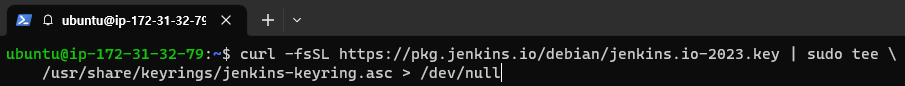
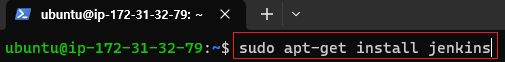
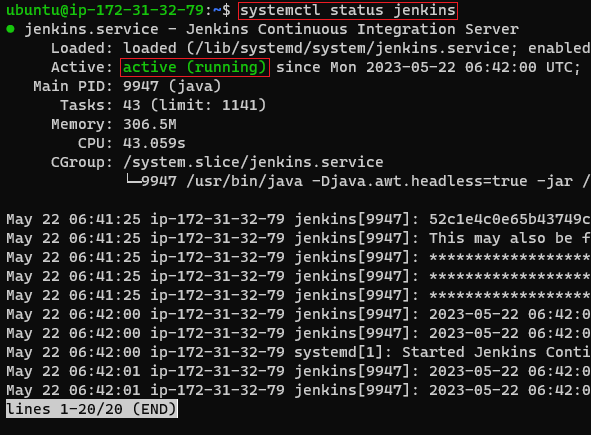
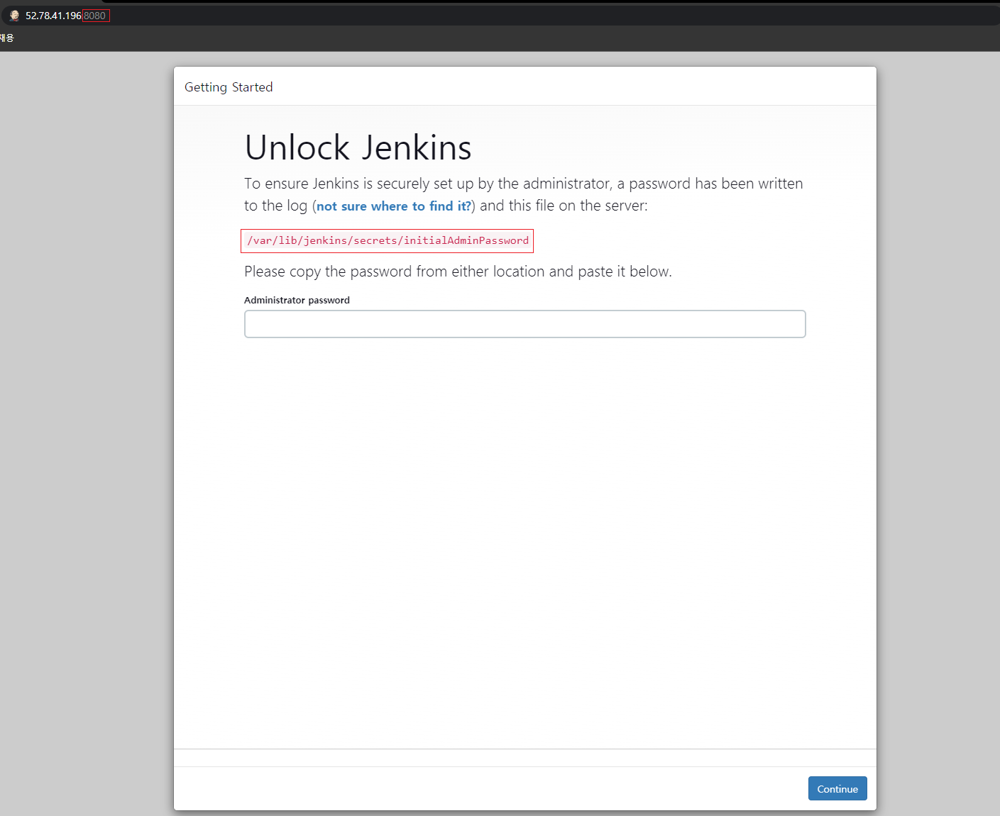
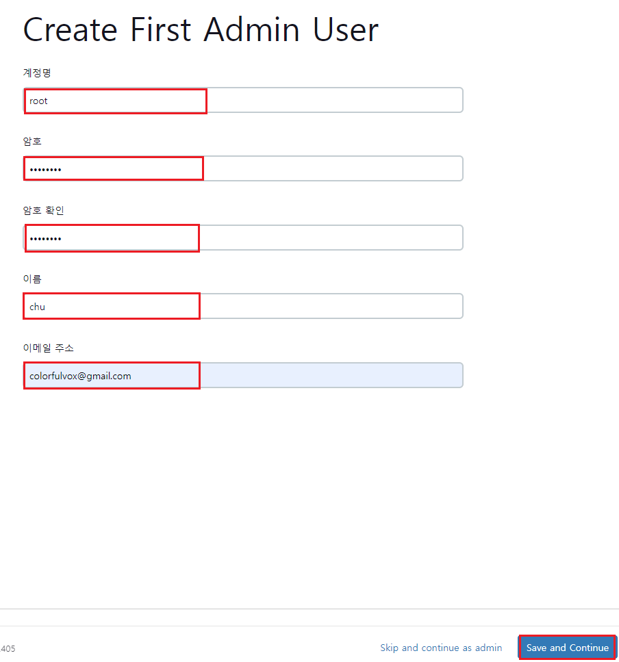
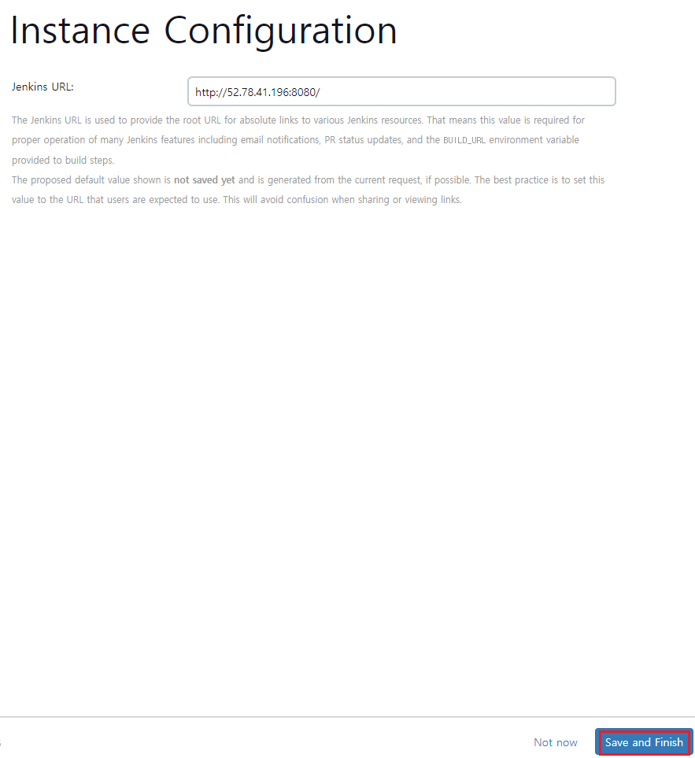
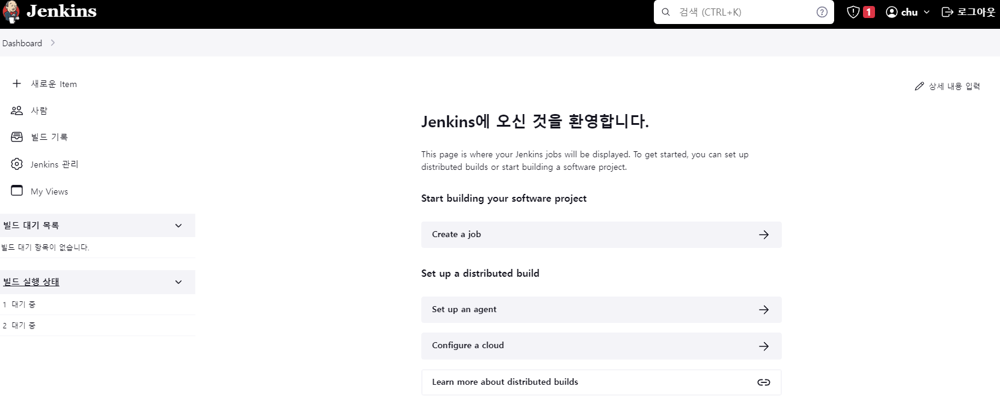

<<<<<<< HEAD
# Jenkins

[뒤로가기](../../)\

## Jenkins

지속적인 통합(CI) , 지속적인 배포(CD) 환경을 구축하기 위한 도구\
빌드, 테스트, 배포 프로세스를 자동화하여 소프트웨어 품질과 개발 생산성을 높일 수 있다.\

### 설치

#### 환경
=======
[뒤로가기](../../README.md) 

# Jenkins

지속적인 통합(CI) , 지속적인 배포(CD) 환경을 구축하기 위한 도구 
빌드, 테스트, 배포 프로세스를 자동화하여 소프트웨어 품질과
개발 생산성을 높일 수 있다. 

## 설치

### 환경
>>>>>>> parent of 4d4a984 (GITBOOK-5: change request with no subject merged in GitBook)

1. 우분투 22.04
2. java 11

<<<<<<< HEAD
#### (1) JDK 설치

\
(현재 jenkins는 java 11버전이 필요하다.)\

#### (2) Jenkins 저장소 key 등록

\
curl -fsSL https://pkg.jenkins.io/debian/jenkins.io-2023.key | sudo tee \\\
/usr/share/keyrings/jenkins-keyring.asc > /dev/null

#### (3) apt 저장소에 추가

\
echo deb \[signed-by=/usr/share/keyrings/jenkins-keyring.asc] \\\
https://pkg.jenkins.io/debian binary/ | sudo tee \\\
/etc/apt/sources.list.d/jenkins.list > /dev/null

#### (4) 패키지 업데이트

\

#### (5) jenkins 설치

\

\[참고] [설치가 느릴겨우](Linux.md)

#### (6) 설치 확인

\

#### (7) 접속 및 환경 설정

\
(젠킨스 서버 포트는 기본적으로 8080이다.\
자신의 IP:8080 으로 접속하자.\
그리고 다음과 같은 화면에서\
/var/lib/jenkins/secrets/initialAdminPassword 해당 줄을 복사한다.)\

\
(파일의 내용을 출력하면 다음과 같은 암호가 나온다.\
해당 암호를 방금전 사이트에 복사해서 붙여넣는다. )\

\

\
(플러그인 설치 화면이다. 일단, 추천하는 플러그인으로 설치한다.)\

\
(설치가 완료되면 계정을 생성해준다.)\

\
(젠킨스 URL 접속 주소이다. 기본으로 둔다.)\

\
(설치 완료)\
=======
### (1) JDK 설치

 
(현재 jenkins는 java 11버전이 필요하다.) 

### (2) Jenkins 저장소 key 등록

 
curl -fsSL https://pkg.jenkins.io/debian/jenkins.io-2023.key | sudo tee \\\
 /usr/share/keyrings/jenkins-keyring.asc > /dev/null

### (3) apt 저장소에 추가

 
echo deb [signed-by=/usr/share/keyrings/jenkins-keyring.asc] \\\
 https://pkg.jenkins.io/debian binary/ | sudo tee \\\
 /etc/apt/sources.list.d/jenkins.list > /dev/null

### (4) 패키지 업데이트

 

### (5) jenkins 설치

 

[참고] [설치가 느릴겨우](../Document/Linux.md)

### (6) 설치 확인

 

### (7) 접속 및 환경 설정

 
(젠킨스 서버 포트는 기본적으로 8080이다. 
자신의 IP:8080 으로 접속하자. 
그리고 다음과 같은 화면에서 
/var/lib/jenkins/secrets/initialAdminPassword 해당 줄을 복사한다.) 

 
(파일의 내용을 출력하면 다음과 같은 암호가 나온다. 
해당 암호를 방금전 사이트에 복사해서 붙여넣는다.
) 

 

 
(플러그인 설치 화면이다. 일단, 추천하는 플러그인으로 설치한다.) 

 
(설치가 완료되면 계정을 생성해준다.) 

 
(젠킨스 URL 접속 주소이다. 기본으로 둔다.) 

 
(설치 완료) 
>>>>>>> parent of 4d4a984 (GITBOOK-5: change request with no subject merged in GitBook)
