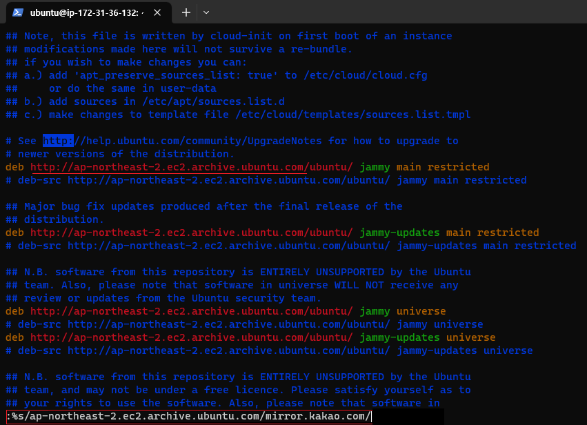

# [패키지 설치가 느릴 경우]

저장소 설정 파일인 /etc/apt/sources.list를 수정해서
국내에서 제공하는 미러 사이트로 변경하여 속도를 높인다.

## (1) apt 저장소 변경 

 
sudo vi /etc/apt/sources.list 로 진입 

## (2) apt 저장소 변경 

 
:%s/ap-northeast-2.ec2.archive.ubuntu.com/mirror.kakao.com/ 을 입력후 엔터

## (3) sudo apt-get update 
