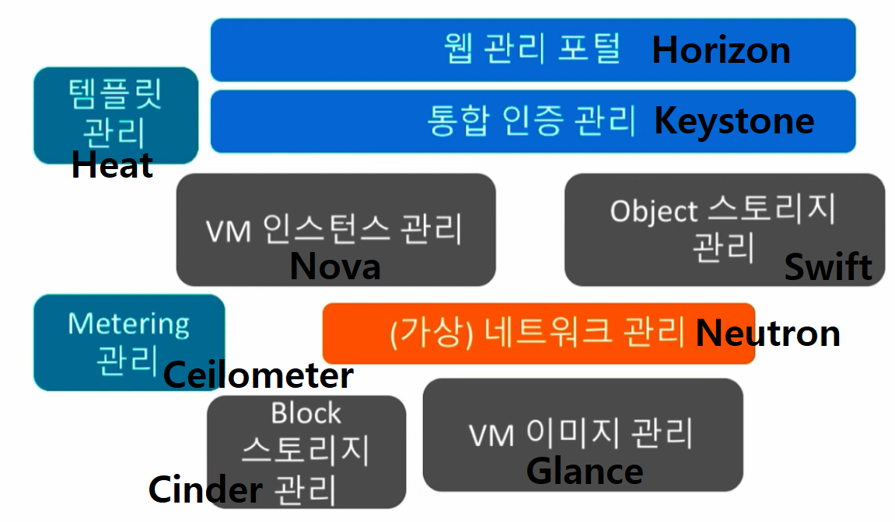

[뒤로가기](../../README.md) 

# OpenStack

클라우드 구축을 위한 공개 소프트웨어 
Python으로 구현된 클라우드 관리를 위한 오픈 소스 

1. public, private 클라우드 구축이 가능하다.
2. 서버, 스토리지, 네트워크들과 같은 자원들을 모두 제어하고 운영을 위한 클라우드 OS
3. IaaS형태의 클라우드 컴퓨팅 오픈 소스 프로젝트

 
openstack은 여러 하위 프로젝트를 모아 클라우드
컴퓨팅을 관리한다. 

## [OpenStack 구성 요소]

 

## OpenStack 환경 설치

### [Ubuntu 가상 서버 준비](../Document/VM.md)
