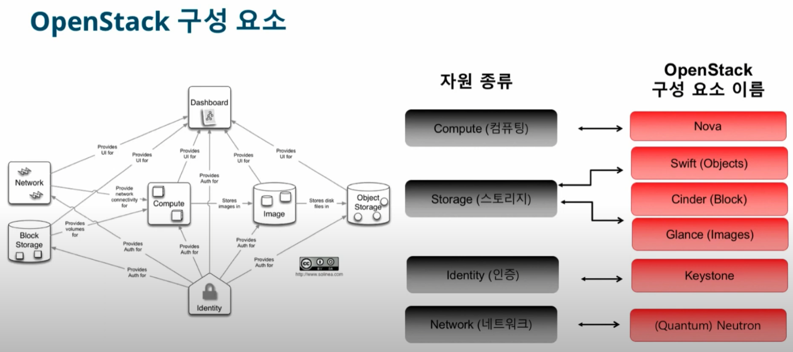

# OpenStack

[뒤로가기](../../)\

## OpenStack

클라우드 컴퓨팅 환경을 만드는 오픈 소스 플랫폼

1. public, private 클라우드 구축이 가능하다.
2. 서버, 스토리지, 네트워크들과 같은 자원들을 모두 제어하고 운영을 위한 클라우드 OS
3. IaaS형태의 클라우드 컴퓨팅 오픈 소스 프로젝트

\
openstack은 여러 하위 프로젝트를 모아 클라우드 컴퓨팅을 관리한다.\

### \[OpenStack 구성 요소]

\

#### Nova

하이퍼바이저, 메세지 Queue, 인스턴스 접속을 하는 등 다양한 기능이 연결되어 가상 서버를 생성할 수 있는 시스템을 구성\

#### Swift

클라우드 스토리지 서비스\

#### Glance

인스턴스의 운영체제 이미지를 관리 \[그래서 Nova와 같이 움직인다.]\

#### Keystone

인증 토큰, 테넌트, 사용자 관리, 서비스의 엔드포인트 URL을 관리\
\[Keystone인증이 안되면 오픈스택의 서비스를 이용할 수 없음]\

#### Neutron

SDN 개념의 등장으로 나온 네트워크 서비스 \[네트워크 프로젝트로 분리]\
이전 버전인 Mitaka에서는 기존 네트워크 서비스인 Nova-Network를 사용했다.\
하지만, 네트워크 서비스로 할당할 수 있는 IP개수가 제한되어 Neutron이 등장했다.\
Neutron은 다양한 SDN 스위치 플러그인과 VLAN, 터널링, VxLAN등의 네트워크 방식을 지원한다.\
\

* VLAN : 일반적으로 스위치 한대로 랜 하나를 구성할 수 있다.\
  하지만, VLAN을 통해 스위치 한대로 여러개의 랜을 구성할 수 있다.\
  오픈스택에서는 Neutron의 ML2 플러그인으로 사용할 수 있다.\

* 터널링 프로토콜 GRE
* VxLAN : 대규모 클라우드 컴퓨팅을 구축할때 확장성을 해결하는 네트워크 기술

#### Cinder

블록 스토리지 서비스 \[ISCSI 기반 LVM]\

#### Horizon

오픈스택 대시보드 서비스 \[웹UI로 인스턴스 생성, 삭제, 관리등을 빠르게 처리 가능]\

#### Ceilometer

클라우드에서 배포된 자원의 사용량과 성능을 측정해 사용자가 자원 상태를 모니터링할 수 있는 기능\

#### Heat

오케스트레이션 서비스 \[자원 관리, 배치, 정렬을 자동화] - 템플릿 기반\

#### Trove

오픈스택의 데이터베이스 서비스 \[RDBMS]\

#### Sahara

오픈스택에서 빅데이터 앱인 Hadoop, Spark을 쉽게 사용할 수 있게 제공하는 서비스\

#### Ironic

물리적인 컴퓨터를 관리하고 자원을 제공하는 구성 모음\[베어메탈 서비스]\

***

### \[Devstack 환경 설치]

Devstack은 Ubuntu 환경에서 Openstack을 자동으로 설치하는 도구이다.\
여기서는 ML2로 데브스택을 설치한다.\

\[참고] - Neutron에서는 물리 네트워크와 연결되는 브리지 네트워크가 필요하다.\

#### 1. [Ubuntu 가상 서버 준비](VM.md)

#### 2. [가상 머신 설정](openstack-vmset.md)

\[VirtualBox의 네트워크 속성]

* NAT : VM이 외부 네트워크에 접근할 수 있는 가장 간단한 방법이다.\
  VM이 생성되면 기본적으로 할당되는 네트워크이며,\
  첫 생성시 자동으로 10.0.2.0/24범위가 붙고 그다음에는 10.0.3.0/24 범위가 할당된다.\

* NAT Network : 공유기 같은 환경을 만드는 설정이다.\
  VM여러개를 동일한 네트워크에 속하게 한다.\

* Bridge Network : VirturalBox가 호스트에 있는 네트워크 디바이스를\
  직접적으로 사용하는 네트워크\
  즉, VM이 호스트와 동일한 물리적 네트워크를 사용하게된다.
* Internal Networking : NAT Network처럼 VM간의 네트워크가 가능하지만 인터넷 연결이 되지 않는다.\
  따라서 VM사이에서만 통신할때 쓰인다.
* Host-only Networking : Internal Networking과 기능은 동일하지만,\
  호스트와 연결이 가능하다.\

* Generic Driver

#### 3. [Devstack 설치](Devstack.md)

***

Devstack은 서버를 재부팅하면 서비스를 재시작하기 어렵다.\
또한, 개발중인 소스를 받아서 사용하기도 불안정하다.\
그래서, 실제 서비스가 가능한 오픈스택 환경을 구성한다.\

### [Openstack 구축](OpenStack구축.md)
