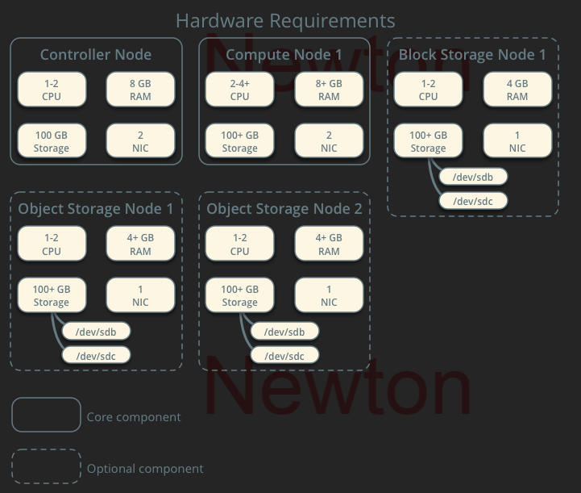

# OpenStack구축

[뒤로가기](../../)\

## \[OpenStack 구축]

### 시스템 구성도

\
오픈스택 공식 매뉴얼에서 제안하는 하드웨어 구성안이다.\

Controller Node는 오픈스택 서비스를 관리하는 노드로\
네트워크 타임 프로토콜, 데이터베이스 등 각 서비스의 서버에 해당하는 컴포넌트를 설치한다.\
여기서 NIC(네트워크 인터페이스 카드)는 관리용 1개, 외부용 1개로 구성된다.\

Compute Node는 가상 서버를 생성할 수 있는 하이퍼바이저가 설치되는 노드로 즉, 인스턴스이다.\

Block Storage Node는 인스턴스에 연결되는 하드 디스크를\
생성하고 관리하는 노드로 오픈스택 서비스 중 Cinder를 설치한다.\
기본적으로 LVM을 사용하며 인스턴스와 Compute Node, Controller Node를\
서로 연동하므로 관리용 NIC가 1개 필요하다.\

Object Storage Node는 파일을 관리하는 노드로 오픈스택 서비스중 Swift를 설치한다.\

### 환경

* Openstack : yoga
* Controller Node
  * VirtualBox
  * CPU : 2
  * Memory : 4096MB
  * Network Device : Host(enp0s3), Bridge(enp0s8), NAT(enp0s9)
  * Storage : SATA 20GB(운영체제)
  * Ubuntu : ubuntu-20.04.6-live-server-amd64
* Compute Node
  * VirtualBox
  * CPU : 2
  * Memory : 5012MB
  * Network Device : Host(enp0s3), Bridge(enp0s8), NAT(enp0s9)
  * Storage : SATA 20GB(운영체제), 8GB(블록 Storage), 8GB \* 3 (오브젝트 Storage)
  * Ubuntu : ubuntu-20.04.6-live-server-amd64

### [가상 머신 생성 및 환경 설정](<가상 머신 생성 및 환경 설정.md>)

### [Openstack패키지 설치 및 DB 구성](<Openstack패키지 설치 및 DB 구성.md>)

### [Openstack 메시지 큐 RabbitMQ 설치](<Openstack 메시지 큐 RabbitMQ 설치.md>)

### [인증서비스 KeyStone 설치](Openstack\_keystone.md)
