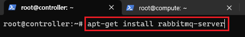
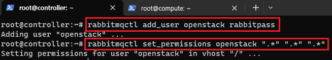
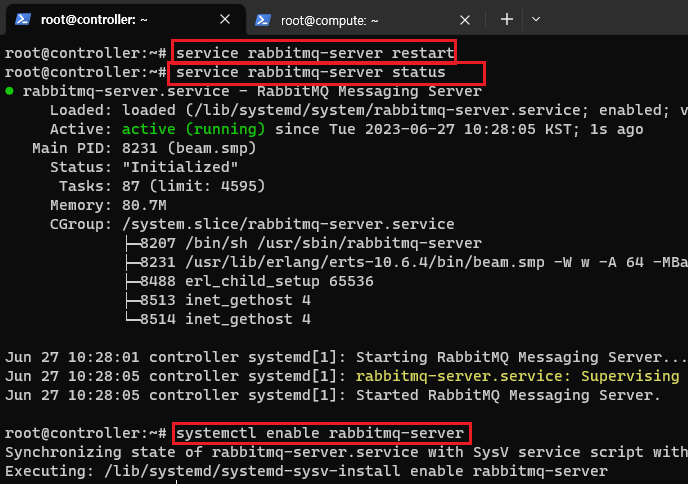
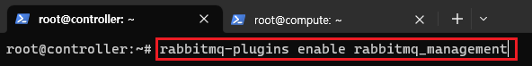
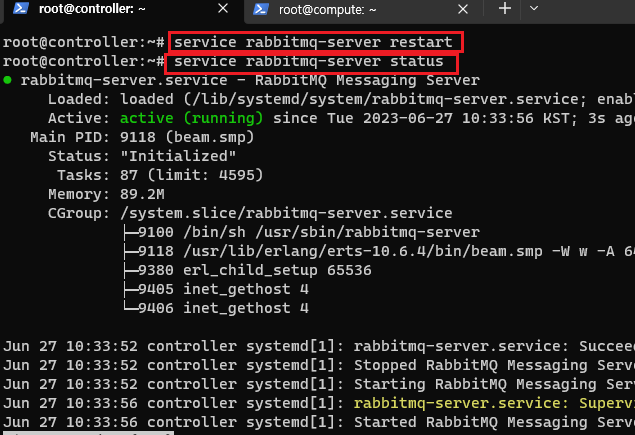
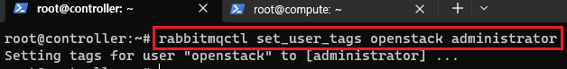
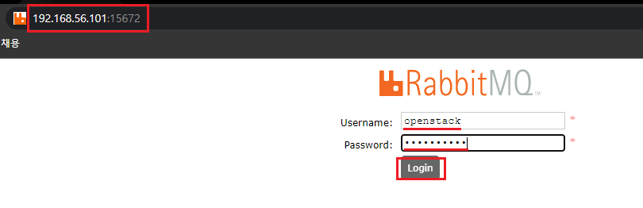
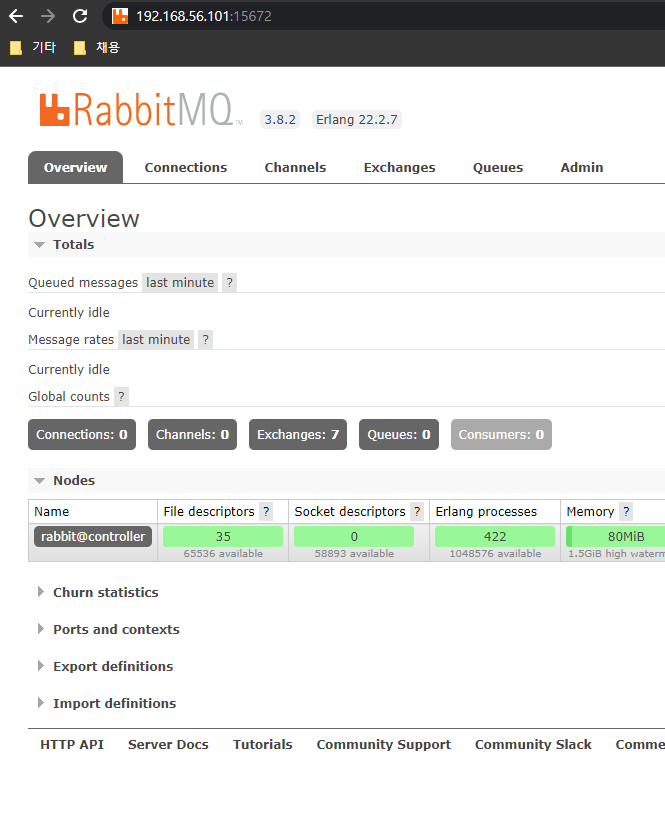

[뒤로가기](../../README.md)

# Openstack 메시지 큐 RabbitMQ 설치

Openstack은 OS가 프로세스를 처리할때 스케줄링을 하는것처럼
모든 명령어를 스케줄링한다. 
그리고 스케줄링과 각 서비스간의 통신 도구인 RabbitMQ는 Openstack의 기본 메시지 큐 서비스이다. 

## 환경

- Openstack : yoga
- Controller Node

  - VirtualBox
  - CPU : 2
  - Memory : 4096MB
  - Network Device : Host(enp0s3), Bridge(enp0s8), NAT(enp0s9)
  - Storage : SATA 20GB(운영체제)
  - Ubuntu : ubuntu-20.04.6-live-server-amd64

- Compute Node
  - VirtualBox
  - CPU : 2
  - Memory : 5012MB
  - Network Device : Host(enp0s3), Bridge(enp0s8), NAT(enp0s9)
  - Storage : SATA 20GB(운영체제), 8GB(블록 Storage), 8GB \* 3 (오브젝트 Storage)
  - Ubuntu : ubuntu-20.04.6-live-server-amd64

## 시작

### (1) RabbitMQ 설치 [Controller]

 

> apt-get install rabbitmq-server

rabbitmq를 설치한다. 

 

> rabbitmqctl add_user openstack rabbitpass

rabbitmqctl add_user 명령어로 새로운 사용자를 추가한다. 
openstack이라는 사용자 이름으로 비밀번호는 rabbitpass로 설정했다. 

> rabbitmqctl set_permissions openstack ".\*" ".\*" ".\*"

rabbitmqctl set_permissions 명령어로 openstack 사용자에게  가상 호스트와 큐등 RabbitMQ의 모든 작업 권한을 부여한다. 

 

> service rabbitmq-server restart 
> service rabbitmq-server status 
> systemctl enable rabbitmq-server 

rabbitmq를 재시작하고 정상적으로 실행되는지 확인한다. 
그리고 부팅시 자동으로 실행되도록 설정한다. 

### (2) RabbitMQ 대시보드 [Controller]

RabbitMQ는 메시지와 자원등을 모니터링할 수 있는 대시보드를 제공한다. 

 

> rabbitmq-plugins enable rabbitmq_management

RabbitMQ 플러그인에서 매니저먼트를 활성화한다. 

 

> service rabbitmq-server restart
> service rabbitmq-server status

RabbitMQ를 재시작하고 상태를 확인한다. 

 

> rabbitmqctl set_user_tags openstack administrator

rabbitmqctl set_user_tags 명령어로 기존 openstack 사용자에게 
RabbitMQ의 관리 기능에 대한 전체적인 접근 권한을 부여한다. 

 

http://192.168.56.101:15672/ 으로 접속한뒤
사용자 계정 및 비밀번호를 입력 후 로그인한다. 

 

## [참고]

### 각 서비스를 설치한뒤 반드시 VM의 스냅샷을 찍어 기록해두자.

Openstack 설치 과정에서 에러가 날 경우 다시 복원할 수 있어야한다. 
