<<<<<<< HEAD
# Openstack패키지 설치 및 DB 구성

[뒤로가기](../../)

## OpenStack 패키지 설치 및 DB 구성

Openstack 패키지 중 yoga를 설치하고 메타데이터와 로그를 저장할 DB들을 설치한다.\

### 환경

* Openstack : yoga
* Controller Node
  * VirtualBox
  * CPU : 2
  * Memory : 4096MB
  * Network Device : Host(enp0s3), Bridge(enp0s8), NAT(enp0s9)
  * Storage : SATA 20GB(운영체제)
  * Ubuntu : ubuntu-20.04.6-live-server-amd64
* Compute Node
  * VirtualBox
  * CPU : 2
  * Memory : 5012MB
  * Network Device : Host(enp0s3), Bridge(enp0s8), NAT(enp0s9)
  * Storage : SATA 20GB(운영체제), 8GB(블록 Storage), 8GB \* 3 (오브젝트 Storage)
  * Ubuntu : ubuntu-20.04.6-live-server-amd64

#### (1) Yoga 설치 \[Controller, Compute]

\

=======
[뒤로가기](../../README.md)

# OpenStack 패키지 설치 및 DB 구성

Openstack 패키지 중 yoga를 설치하고
메타데이터와 로그를 저장할 DB들을 설치한다. 

## 환경

- Openstack : yoga
- Controller Node

  - VirtualBox
  - CPU : 2
  - Memory : 4096MB
  - Network Device : Host(enp0s3), Bridge(enp0s8), NAT(enp0s9)
  - Storage : SATA 20GB(운영체제)
  - Ubuntu : ubuntu-20.04.6-live-server-amd64

- Compute Node

  - VirtualBox
  - CPU : 2
  - Memory : 5012MB
  - Network Device : Host(enp0s3), Bridge(enp0s8), NAT(enp0s9)
  - Storage : SATA 20GB(운영체제), 8GB(블록 Storage), 8GB \* 3 (오브젝트 Storage)
  - Ubuntu : ubuntu-20.04.6-live-server-amd64

### (1) Yoga 설치 [Controller, Compute]

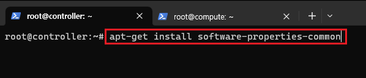 
>>>>>>> parent of 4d4a984 (GITBOOK-5: change request with no subject merged in GitBook)

> apt-get install software-properties-common

소프트웨어 저장소 관리를 설치

<<<<<<< HEAD
\

> add-apt-repository cloud-archive:yoga

명령어를 입력한뒤 Enter를 누르면 yoga가 저장소에 추가된다.\

\

만약 이런 에러가 발생하면 재부팅한뒤에 다시 하면 된다.\

\

> apt-get update && apt-get dist-upgrade

패지키 업데이트와 dist-upgrade 명령어로 업그레이드를 진행한다.\
dist-upgrade : 패키지간의 의존성 문제를 해결하기 위한 upgrade보다 더 강력한 알고리즘을 사용한다.\
(패키지가 삭제되거나 변경된다.)\

\

=======
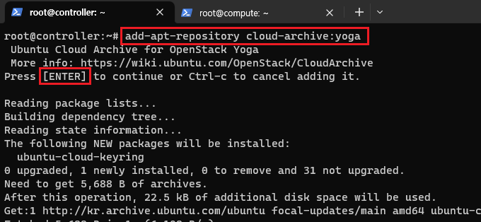 

> add-apt-repository cloud-archive:yoga

명령어를 입력한뒤 Enter를 누르면 yoga가 저장소에 추가된다. 

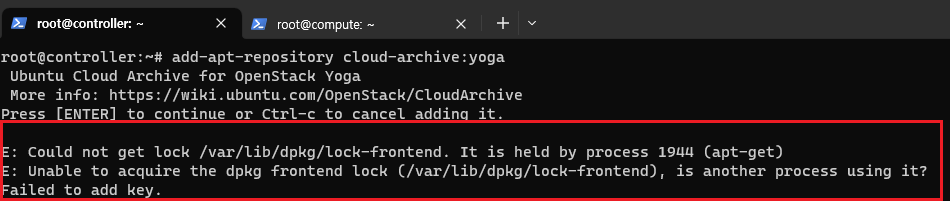 

만약 이런 에러가 발생하면 재부팅한뒤에 다시 하면 된다. 

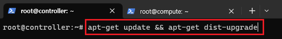 

> apt-get update && apt-get dist-upgrade

패지키 업데이트와 dist-upgrade 명령어로 업그레이드를 진행한다. 
dist-upgrade : 패키지간의 의존성 문제를 해결하기 위한 upgrade보다 더 강력한 알고리즘을 사용한다.  (패키지가 삭제되거나 변경된다.) 

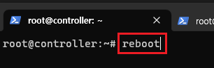 
>>>>>>> parent of 4d4a984 (GITBOOK-5: change request with no subject merged in GitBook)

> reboot

재부팅한다.

<<<<<<< HEAD
\

> sudo apt-get install -y python3-openstackclient

python3-openstackclient : Openstack에서 사용되는 Python기반 명령줄 인터페이스 도구\
Openstack은 Python으로 개발되었으며 해당 도구로 클라우드 리소스를 관리하고 제어할 수 있다.\

#### Compute에도 똑같이 수행한다.

#### (2) MariaDB 설치 \[Controller]

오픈스택은 DB에 메타데이터를 저장하고 관리한다.\
인스턴스, 네트워크, 스토리지 등 오픈스택의 모든 인프라 자원 정보를 저장하기 때문에 매우 중요하다.\
DB는 Contoller 노드에만 설치한다.\

\

> apt-get install mariadb-server python3-pymysql

mariadb-server : MariaDB 데이터베이스 서버 패키지\
(MySQL의 fork로서, MySQL과 호환되는 오픈 소스 관계형 데이터베이스 관리 시스템)\

python3-pymysql : Python에서 MySQL DB와 상호 작용하기 위한 패키지\

\

> vi /etc/mysql/conf.d/openstack.cnf

MariaDB에 Openstack 서버의 설정을 하기위해 설정파일을 생성\

\

> \[mysqld] # MariaDB 서버의 설정을 지정하는 섹션\
> bind-address = 192.168.56.101 # MariaDB가 수신 대기할 IP주소를 지정(바인딩)\
>
>
> default-storage-engine = innodb\
> \# MariaDB에서 사용할 기본 스토리지 엔진을 지정\
> \# innodb는 트랜잭션 지원 및 높은 안정성을 제공하는 스토리지 엔진\
>
>
> innodb\_file\_per\_table\
> \# InnoDB 스토리지 엔진이 각 테이블을 별도의 파일로 저장하도록 설정함\
> \# 이 설정을 통해 테이블 간의 공간을 더욱 효율적인 관리가 가능\
>
>
> collation-server = utf8\_general\_ci\
> \# 정렬 규칙을 설정함\
> \# utf8\_general\_ci는 UTF-8 문자 인코딩을 사용하고, 일반적인(대소문자를 구분하지 않는) 비교 및 정렬 규칙\
>
>
> character-set-server = utf8 # DB에서 사용하는 문자 집합을 지정\
>

\

> service mysql restart

저장한뒤 mariadb를 재시작한다.\

\

> mysql\_secure\_installation

mariaDB 서버의 보안 설정을 한다.\

\

#### (3) MongoDB 설치 \[Controller]

Opentstack의 Ceilometer는 자원 모니터링을 수집함 해당 수집 정보를 저장할 DB가 필요하다.\
로그 정보를 저장하기에 비관계형 MongoDB를 설치\

\

> apt-get install mongodb-server mongodb-clients python3-pymongo

mongoDB 설치\

\

> vi /etc/mongodb.conf

mariaDB처럼 mongodb도 환경 설정을 수행\

\

해당 부분을 수정\

기본적으로 mongoDB는 저널링을 생성할때 크기가 1GB인 저널 파일을 생성함\
smallfiles = true로 설정하면 저널 파일의 크기를 128MB까지 줄일 수 있음\
저널링 : MongoDB의 데이터 변경 작업을 로그로 기록하는것\

\

> service mongodb restart\
> service mongodb status\
>

mongodb를 재시작하고 정상적으로 동작하는지 확인\
=======
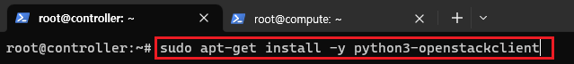 

> sudo apt-get install -y python3-openstackclient

python3-openstackclient : Openstack에서 사용되는 Python기반 명령줄 인터페이스 도구 
Openstack은 Python으로 개발되었으며 해당 도구로 클라우드 리소스를 관리하고 제어할 수 있다. 

### Compute에도 똑같이 수행한다.

### (2) MariaDB 설치 [Controller]

오픈스택은 DB에 메타데이터를 저장하고 관리한다. 
인스턴스, 네트워크, 스토리지 등 오픈스택의 모든 인프라 자원 정보를 저장하기 때문에 매우 중요하다. 
DB는 Contoller 노드에만 설치한다. 

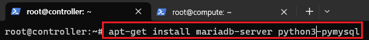 

> apt-get install mariadb-server python3-pymysql

mariadb-server : MariaDB 데이터베이스 서버 패키지 
(MySQL의 fork로서, MySQL과 호환되는 오픈 소스 관계형 데이터베이스 관리 시스템) 

python3-pymysql : Python에서 MySQL DB와 상호 작용하기 위한 패키지 

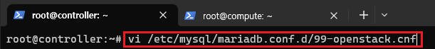 

> vi /etc/mysql/conf.d/openstack.cnf

MariaDB에 Openstack 서버의 설정을 하기위해 설정파일을 생성  

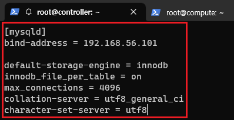 

> [mysqld] # MariaDB 서버의 설정을 지정하는 섹션 
> bind-address = 192.168.56.101 # MariaDB가 수신 대기할 IP주소를 지정(바인딩)  
>
> default-storage-engine = innodb  # MariaDB에서 사용할 기본 스토리지 엔진을 지정  # innodb는 트랜잭션 지원 및 높은 안정성을 제공하는 스토리지 엔진 
>
> innodb_file_per_table  \# InnoDB 스토리지 엔진이 각 테이블을 별도의 파일로 저장하도록 설정함  # 이 설정을 통해 테이블 간의 공간을 더욱 효율적인 관리가 가능 
>
> collation-server = utf8_general_ci  \# 정렬 규칙을 설정함   \# utf8_general_ci는 UTF-8 문자 인코딩을 사용하고, 일반적인(대소문자를 구분하지 않는) 비교 및 정렬 규칙 
>
> character-set-server = utf8 # DB에서 사용하는 문자 집합을 지정 

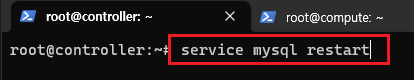 

> service mysql restart

저장한뒤 mariadb를 재시작한다. 

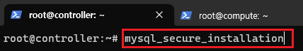 

> mysql_secure_installation

mariaDB 서버의 보안 설정을 한다. 

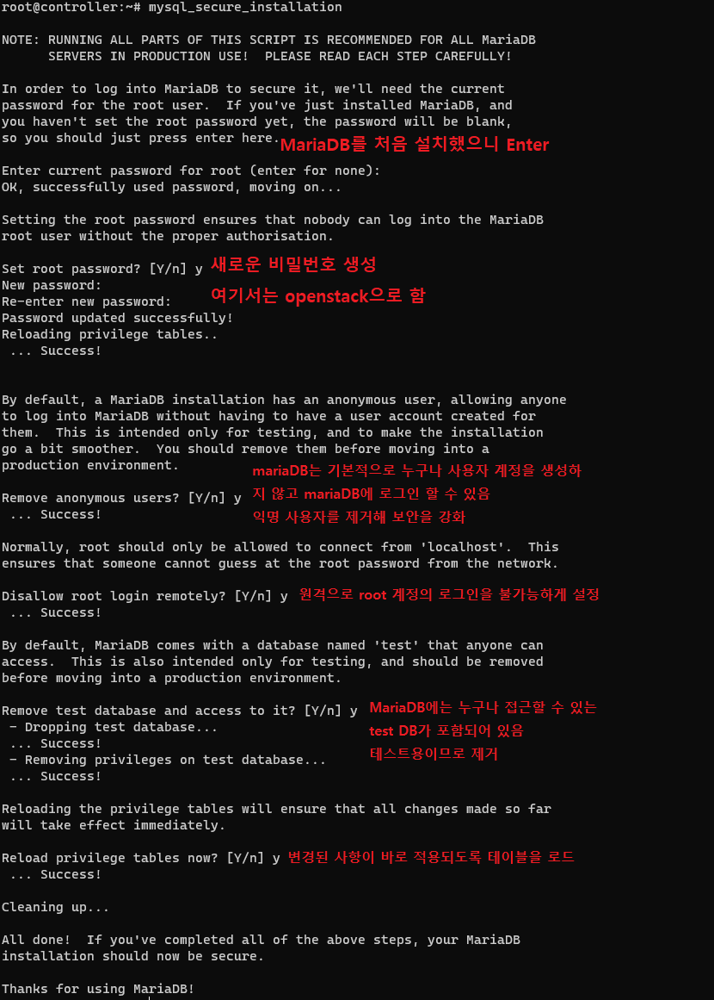 

### (3) MongoDB 설치 [Controller]

Opentstack의 Ceilometer는 자원 모니터링을 수집함
해당 수집 정보를 저장할 DB가 필요하다. 
로그 정보를 저장하기에 비관계형 MongoDB를 설치 

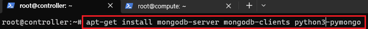 

> apt-get install mongodb-server mongodb-clients python3-pymongo

mongoDB 설치 

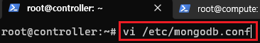 

> vi /etc/mongodb.conf

mariaDB처럼 mongodb도 환경 설정을 수행 

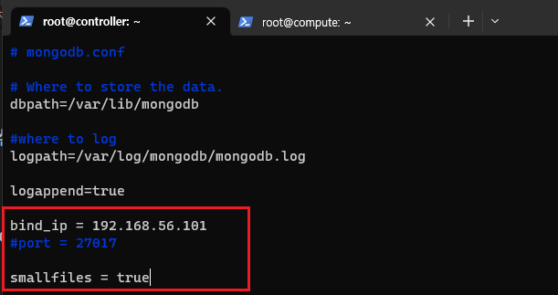 

해당 부분을 수정 

기본적으로 mongoDB는 저널링을 생성할때 크기가 1GB인 저널 파일을 생성함  smallfiles = true로 설정하면 저널 파일의 크기를 128MB까지 줄일 수 있음 
저널링 : MongoDB의 데이터 변경 작업을 로그로 기록하는것 

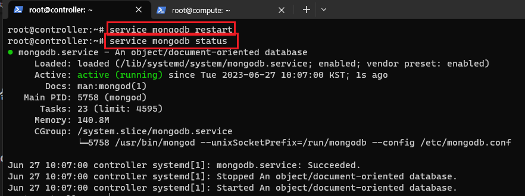 

> service mongodb restart 
> service mongodb status 

mongodb를 재시작하고 정상적으로 동작하는지 확인 
>>>>>>> parent of 4d4a984 (GITBOOK-5: change request with no subject merged in GitBook)
