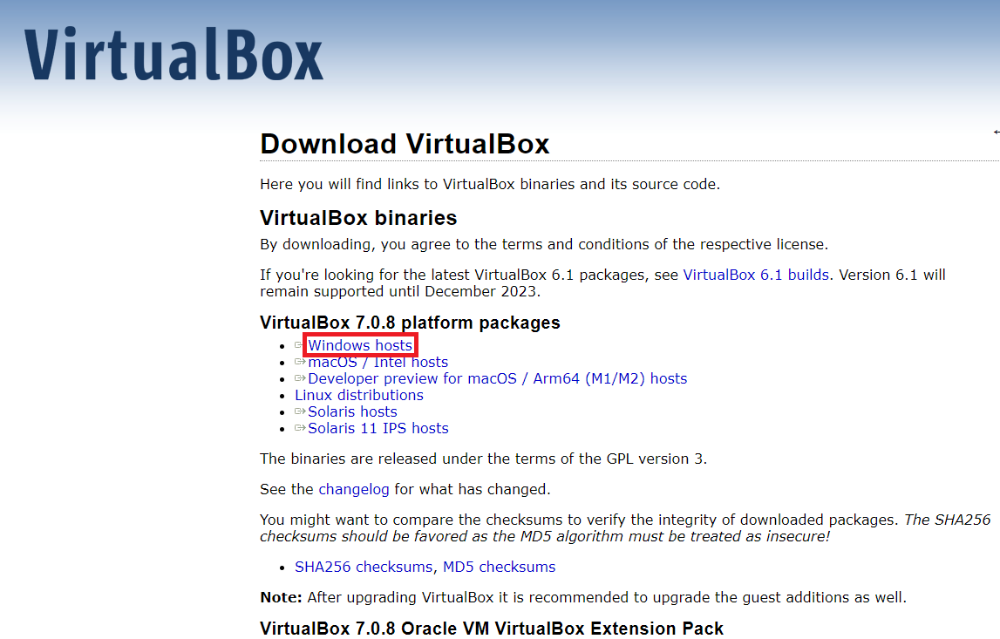
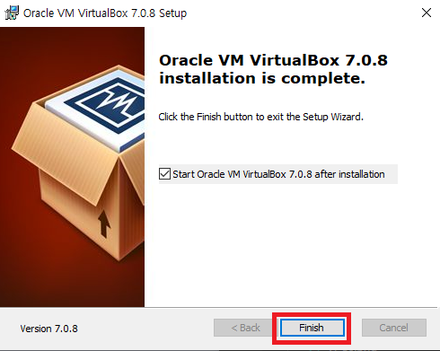
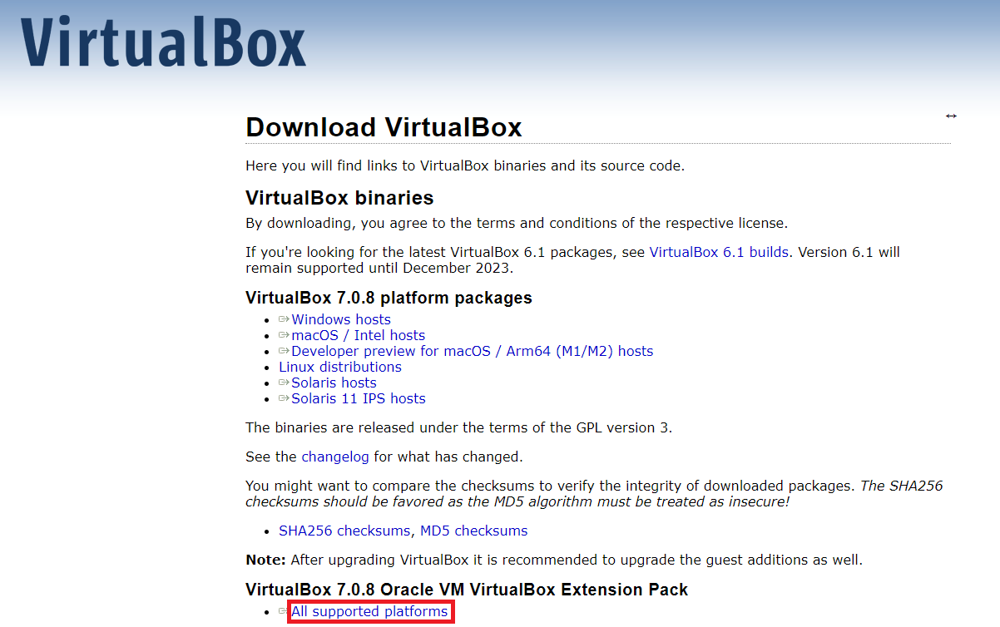
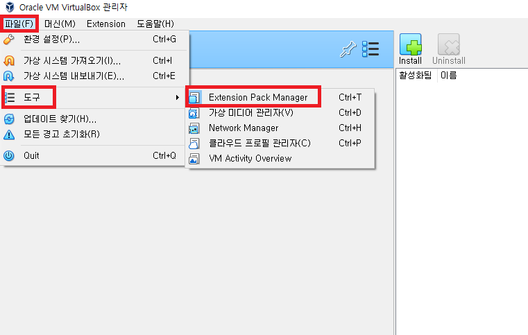
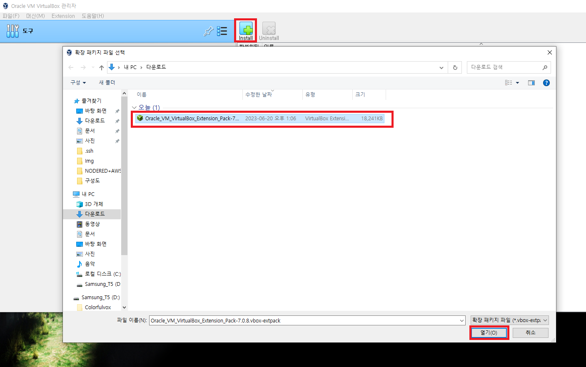
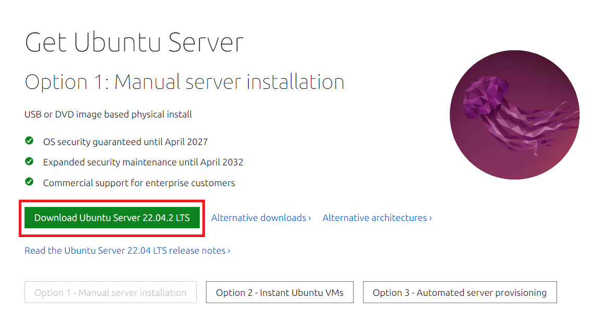
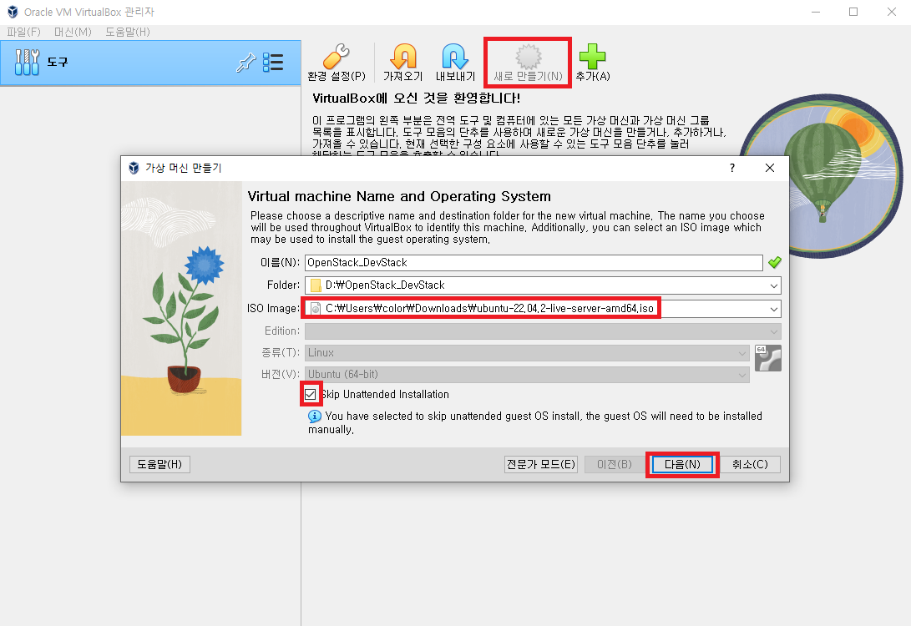
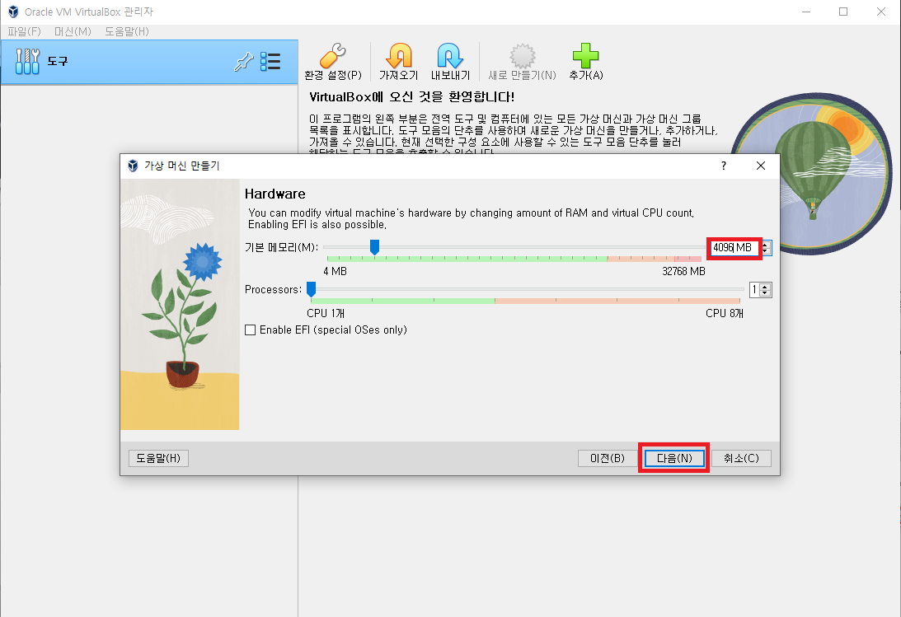
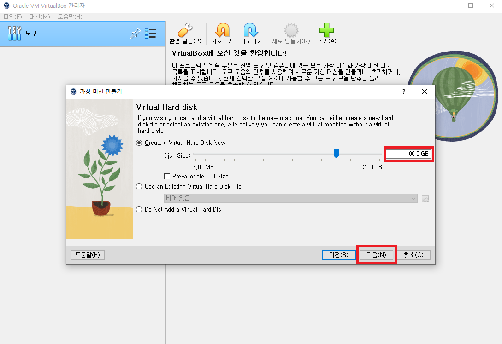
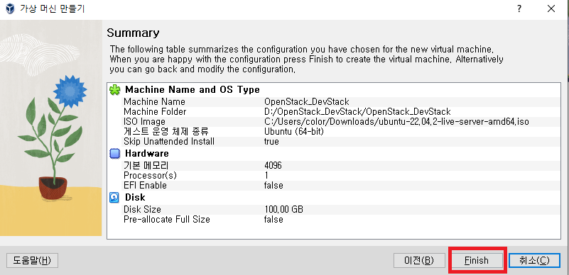

# VM

[뒤로가기](../../)\

### 1. VM 설치

Ubuntu Server 이미지로 생성하는 과정이다.\
다른 이미지 생성과정과 비슷하다.\

#### [VirtualBox](https://www.virtualbox.org/wiki/Downloads)

\
\
\
\
\

### 2. 우분투 서버 만들기

#### [Ubuntu Server](https://ubuntu.com/download/server)

\
\
\
\
\
