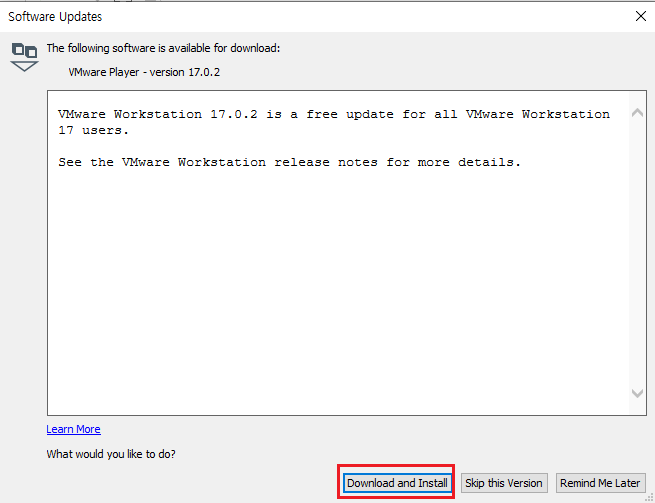

[뒤로가기](../../README.md) 

# VMware Workstation (Pro) 설치

[VMware Workstation 17](https://www.vmware.com/products/workstation-player/workstation-player-evaluation.html) 
해당 사이트에 접속한다. 

 
DOWNLOAD NOW> 를 누르면 다운로드가 진행된다. 

다운이 완료되면 실행한다. 

 
Next 클릭 

 
체크하고 Next 클릭 

 
첫번째는 고급 키보드 기능으로 키보드로 VM을 제어할때 더 편한 기능을 제공한다. 
두번째는 콘솔 도구 시스템 환경 변수 설정이다. 
여기서는 두번째만 체크하고 Next한다. (첫번째는 선택사항이다.) 

 

새 버전 업데이트 알림과 서비스 개선을 위한 정보 수집 동의이다. 
원하는대로 선택하고 Next 

 

바탕화면 바로 가기 생성 및 시작 메뉴에 바로가기 생성이다. 
원하는대로 선택한뒤 Next 

 
설치한다. 

 
설치가 끝나면 Finish를 누른다. 

 
처음 VMware Workstation을 실행하면 다음과 같은 화면이 뜬다. 
우리는 무료 버전을 써야되니 이대로 Continue를 누른다. 

그리고 Finsish를 누르면 

 
실행된다. 

 
기다리니 바로 update요청이 떠서 설치했다. 

## VMware Workstation 무료? 유료?

VMware Workstation은 Player, Pro 버전이 있다. 

 

다음과 같이 Player는 무료 버전을 제공하지만 상업용으로 쓰려면 라이센스가 필요하다. 
Pro는 시리얼 키를 등록하거나 평가판(30일 무료)으로 사용 가능하다. 

 
Player은 스냅샷을 지원하지 않는다...

 
지원하는 기능만 보더라도 vSphere의 ESXi을 설치할 환경이
Pro가 더 좋아보인다. 
그래서 Pro 버전을 쓰기로 한다. 

## VMware Workstation Pro 설치

### (Pro 버전은 30일 동안 무료로 이용이 가능하니 주의하자.) 

[VMware Workstation 17 Pro](https://www.vmware.com/kr/products/workstation-pro/workstation-pro-evaluation.html) 
해당 사이트로 접속한다. 

 
지금 다운로드>를 클릭하면 다운로드가 진행된다. 

 
설치 과정은 아까 설치한 VMware Workstation 17과 비슷하다. 

 
설치를 완료한뒤 VMware Workstation Pro를 실행하면
다음과 같은 화면이 뜬다. 
30일 동안 쓰는 걸로 체크하고 실행한다. 

 
실행 화면이다. 

### 다음 파트에서 ESXi를 설치한다. 
