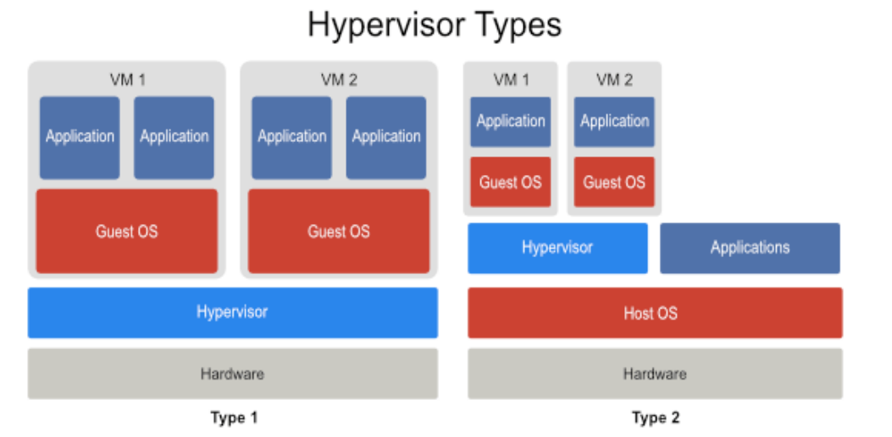
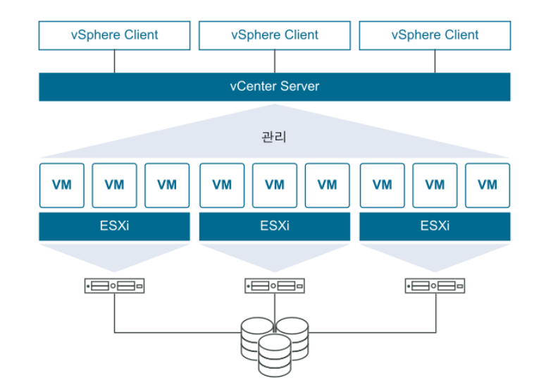

[뒤로가기](../../README.md) 

# VMware

가상화 솔루션 및 클라우드 컴퓨팅 소프트웨어를 제공한다. 
가상화 기술을 이용하여 기업과 개인 사용자의 IT 인프라를 효율적으로 관리하고
사용할 수 있도록 제공한다. 

## 대표적인 S/W

### VMware ESXi

VMware에서 만든 Type 1 하이퍼바이저(가상화 OS)이다. 
맞춤형 베어메탈 하이퍼바이저로 물리적 서버에 바로 설치된다. 

 
Type1이 ESXi, Type2는 VMware Workstation 

예를들어 

기본적인 VM 구성 방법이다. 

[ 하드웨어 -> 운영체제 -> 가상화 프로그램(VMware Workstation, virtualbox) -> 가상 Guest OS ] 

ESXi를 통한 구성 방법이다. 

[ 하드웨어 -> ESXi -> 가상 운영체제 ] 

ESXi는 윈도우, 리눅스등의 별도의 운영체제없이 VM생성이 가능하며 관리가 가능하다. 
또한, 여러개의 VM으로 서버를 분할할 수 있다. 

이 방식은 VM으로 구성한 가상 운영체제들에 대한 하드웨어 리소스를 100% 사용할 수 있는 장점을 가진다.  (하드웨어 바로 위에 ESXi가 동작하기에) 
그래서 VMKernel이라 불리기도 하며 ESXi의 VMKernel은 VM의 리소스 사용 요청을 
VMM(Virtual Machine Monitor)을 통해 받게된다. 
그리고 그 요청을 물리적 하드웨어에게 전달한다. 

ESXi 서버에서 VM 생성, 수정, 삭제 등의 실제 관리는 vSphere Client를 액세스 하게된다.

### VMware vCenter (Server)

 

가상화 구축도 결국은 물리적인 서버(ESXi)에서 시작한다. 
가상화 구축의 목적은 결국 여러 컴퓨터를 사용하기 위함이다. 
그리고 이런 다수의 물리적인 서버(ESXi))를 하나로 통합해 관리하는 시스템이
vCenter 이다. 

vCenter Server는 웹을 통해 vSphere Client에 접속해야 한다. 

[vCenter의 대표적인 기능] 

1. vMotion 
   ESXi 서버위에 동작하는 VM을 다른 ESXi 호스트에 VM 중단없이 이동시키는 기능이다. 
   유지보수, 시스템 업그레이드 등을 위해 사용된다. 

2. vSphere HA (High-Availability) 
   VM의 가용성을 보장하기 위해 클러스터로 구성된 여러 ESXi 호스트를 사용하여
   운영 중단으로 부터 빠르게 복구한다. 

   vSphere HA 클러스트를 생성하면 단일 호스트는 마스터 호스트로 자동 구성된다. 
   그리고 마스터 호스트는 vCenter Server와 통신해 모든 VM과 슬레이브 호스트의 상태를 모니터링한다. 
   그리고 특정 호스트에 장애가 발생할 경우 다른 호스트에 해당 VM들을 자동으로 다시 시작한다. 

   -> k8s같다. 

3. vSphere DRS 
   vSphere HA와 같이 많이 사용된다. 
   클러스터 내 호스트 리소스를 자동으로 조정하여 VM의 성능을 최적하시키는 기능이다. 
   vMotion을 통해 VM을 여러 호스트에서 (vMotion network을 통해) 로드밸런싱하여 VM의 부하를 모니터링하고 자동으로 호스트 간에 이동하거나 리소스를 재배치한다. 

4. Clone & Template 
   VM을 복제하거나 템플릿으로 저장하는 기능이다. 

### VMware vSphere

가상화 환경을 위한 S/W를 모두 포함한 패키지이다. 
ESXi, vCenter와 같은 모든 제품을 포함한 패키지이며, 
vSphere를 설치한다는 뜻은 결국 ESXi, vCenter를 설치한다고 생각하면 된다. 

### VMware Workstation

윈도우나 리눅스 등의 일반 운영체제위에서 작동하는 하이퍼바이저이다. 
(VirtualBox와 같은) 

### VMware Horizon

가상 데스크톱 인프라(VDI)이며 원격으로 VM에 접근할 수 있게한다. 

# VMware vSphere 설치

VMware Workstation을 활용해 vSphere을 설치한다.
