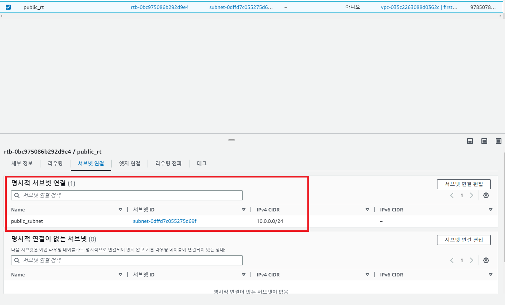

[뒤로가기](../../README.md)

# VPC 생성

 
(AWS에서 VPC검색후 접속) 

 
(VPC생성 클릭) 

 
(VPC만 체크하고 이름, IPv4 CiDR는 다음과 같이 입력하고 생성 클릭) 

## 서브넷 생성

 
(서브넷 생성 클릭) 

 
(방금 생성한 VPC, 가용 영역을 선택, 서브넷 이름과 IPv4 CiDR 입력한뒤 서브넷 생성 클릭) 

 
(private 서브넷도 생성)

 
-> 생성한 서브넷에게는 AWS가 NACL와 라우팅 테이블을 연결시켜 준다. 이제 명시적으로 연결 시켜주자.  

### 라우팅 테이블 생성

 
(작업에서 서브넷 연결 편집을 누른다.) 

 
(private만 선택하고 연결한다.) 

 
(public은 따로 라우팅 테이블을 생성해 연결하자. 라우팅 테이블을 생성한다.) 

 
(이름과 생성한 VPC를 선택하고 라우팅 테이블을 생성한다.) 

 
(생성한 라우팅 테이블에 Public 서브넷을 연결시켜주자) 

-> public 서브넷은 외부와 연결이 되어야하므로 인터넷 게이트웨이를 연결 시켜줘야 한다.

### 인터넷 게이트웨이 생성

 
(인터넷 게이트웨이 생성 클릭) 

 
(이름을 입력후 생성을 클릭) 

 
(VPC연결을 누르거나 작업에서 VPC 연결을 클릭한다.) 

 
(생성한 VPC를 선택한후 연결을 클릭) 

 
(라우팅 테이블에서 생성한 라우팅을 선택하고 라우팅 편집을 클릭) 

 
(라우팅 추가를하고 모든 IP 접근이 가능하게 한뒤 대상에서 "인터넷 게이트웨이"를 검색하면  방금 생성한 게이트웨이가 선택에서 뜬다. 선택한뒤 저장을 한다.) 

### 테스트

### Public

 
(EC2를 새로 생성할때 네트워크 설정에서 생성한 VPC, 서브넷은 생성한 public 서브넷으로 선택한다.)

 
(생성이 되었지만 보안 그룹이 Default여서 아직 연결이 안된다.
보안 그룹을 수정하자.)

 
(기존 규칙을 삭제하고 다음과같이 설정해 저장하자) 

 
(이제 EC2에 접속한뒤)

> curl -v naver.com

을 입력하자 다음과 같이 외부로 통신이 되는것을 볼 수 있다. 

### Private

 
(이번엔 키페어도 연결해주고 퍼블릭 IP 자동 할당도 Private이기에 필요없어 비활성화를 해준다.) 
[private 서브넷으로 설정해야한다.] 

 
(Private ec2는 연결이 불가능하다.  만약 퍼블릭 ip를 활성화 했다해도 연결이 불가능하다.) 

-> 그래서 Bastion Host로 public EC2를 통해 접속해보자.
 
 
(아까 생성한 키페어를 복사한다.) 

 
(아까 생성한 public ec2로 접속해 키페어를 생성한뒤)

 
(복사한 키페어 내용을 붙여넣어 저장한다.) 

 
(키페어의 권한을 부여한다.)

 
(private ec2의 프라이빗 ip주소를 복사한다.) 

 
public ec2에서 

> ssh -i "생성한키페어.pem" ec2-user@프라이빗 ip주소

를 입력해 접속한다. 

 
(연결을 했지만 외부로 접속이 안되는것을 볼 수 있다.) 

-> NAT 게이트웨이를 통해서 외부로 접속할 수 있도록 설정하자. 

 
(VPC에서 NAT 게이트웨이 생성을 클릭) 

 
(이름을 입력하고 서브넷같은 경우 퍼블릭을 통해서 접근하기때문에 생성한 public 서브넷으로 선택한다.  그리고 탄력적 IP가 없으면 할당을 해준다.) 

 
(현재 private은 외부로 가는 통로가 없다.
그래서 private 라우팅 테이블에서 통로를 추가해주자.)

 
(0.0.0.0/0으로 모든 경로로 설정하고 대상에서 "NAT 게이트웨이"를 검색하면  방금 생성한 NAT이 목록에 뜬다.
선택한뒤 저장한다.) 

 
(private ec2도 public을 거쳐 외부로 연결이 되는 것을 볼 수 있다.) 
