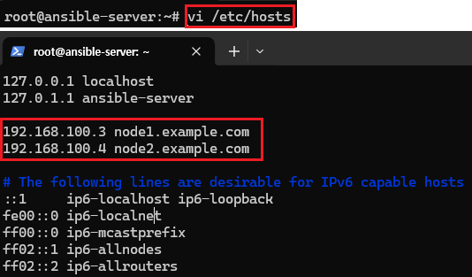
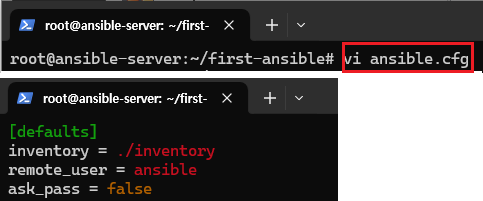
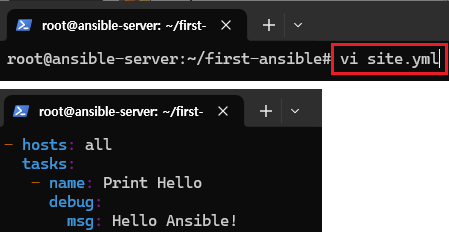

# Ansible 환경 구성 및 설치
Virutal Box를 활용해 Ansible 환경을 구축한다. <br>

## 환경

- Server
    - CPU : 2
    - Memory : 2048MB
    - Network : NAT 네트워크(NatNetwork, 포트포워딩) [192.168.100.2]
    - Storage : 10GB
    - Ubuntu : ubuntu-20.04.6-live-server-amd64

- Node 1,2
    - CPU : 2
    - Memory : 2048MB
    - Network : NAT 네트워크(NatNetwork) [192.168.100.3, 192.168.100.4]
    - Storage : 10GB
    - Ubuntu : ubuntu-20.04.6-live-server-amd64

## 시작

### (1) 우분투 설치 및 구성 [Server, Node1,2]

버츄얼박스에서 VM 생성하는 과정은 생략한다.<br>
하지만 네트워크는 Server와 Node간의 통신을 위해 Nat 네트워크로 구성하고
같은 서브넷 대역으로 구성한다.<br>
또한, 다른 Node들은 호스트 PC로 접근할 필요 없지만, <br>Server는 Ansible 제어를 위해 포트포워딩하여 SSH 접속을 허용하도록 한다.<br>

<br>
버츄얼박스의 네트워크에서 NAT Networks를 클릭하여 생성한뒤, <br>
IPv4를 192.168.100.0/24로 설정한다.<br>
그리고 포트포워딩에서 새로운 Rule을 생성한뒤 호스트의 IP 와 등록할 Server의 IP와
연결해준다.<br>
그리고 호스트포트는 임의로 하고 22포트로 SSH 접속을 허용하도록 한다. <br>

<br>
다음과 같이 각 VM의 네트워크에서 생성한 NatNetwork를 등록해준뒤 설치를 시작한다.<br>

[Server VM의 네트워크 구성]
<br>
우분투 설치를 진행할때 네트워크 구성을 다음과 같이 설정한다.

<br>
Node 1,2 같은 경우 192.168.100.3-4 순서로 IP주소를 등록했다.

### [주의사항]
<br>
Save를 누른뒤 반드시 Done이 되면 다음으로 넘어간다.

### [Node1,2의 유저 이름 관련]
<br>
ansible에서 각 Node들에 접근할때 SSH 접속을 통해 접속한다.<br>
하지만, Node의 유저 계정으로 접속하기에 모두 동일하게 계정명을 ansible로 한다.<br>
(루트 계정접속이 가능하지만, 보안을 위해 루트 계정 접속은 안한다.) 
<br>

<br>
3개의 VM에 우분투를 설치한다.

### (2) Ansible 설치 [Server]

<br>
설치가 완료되면, 호스트 PC의 터미널로 Server VM에 접속한다.

> ssh server@[자신의 PC 호스트 IP] -p [호스트포트]

<br>

> sudo apt-get update

> sudo apt-get install ansible

기본적인 업데이트와 ansible을 설치한다.

<br>
루트 계정으로 전환한다.

<br>

> ansible localhost -m ping

ansible의 설치와 실행이 잘되는지 자신에게 Ping을 날려본다.

### (3) 도메인 설정 및 SSH 키 복사

<br>
IP입력보다 도메인 네임이 더 편하기에 각 노드의 IP의 도메인을 설정한다.

>  vi /etc/hosts

> 192.168.100.3 node1.example.com <br>
> 192.168.100.4 node2.example.com

<br>
SSH 접속을 해야하기에 SSH 키를 생성한다.

> ssh-keygen

<br>

> cd .ssh <br>
> ls

루트 폴더위치의 .ssh폴더에서 퍼블릭, 프라이빗키가 생성되었는지 확인한다.

<br>
퍼블릭키를 각 Node1,2 서버의 키에 복사해줘야한다.<br>

> for i in {3..4}; do ssh-copy-id ansible@192.168.100.$i; done

<br>

### (4) Node 접속 테스트

> ansible all -m ping

ansible에 등록된 모든 호스트에 ping을 날려보았다.<br>
하지만, 아직 등록된 호스트가 없다는 표시가 뜬다.<br>
ansible의 호스트를 수정한다.<br>

> vi /etc/ansible/hosts

<br>

```
[web]
node1.example.com
node2.example.com
```
아무 위치에 web 그룹으로 각 노드들의 도메인을 입력한다.<br>

<br>
다시 ping을 보내본다.<br>
하지만, 이제 각 node들의 계정으로 접근해야하기에 -u ansible을 추가로 입력한다.<br>

> ansible all -m ping -u ansible

접근이 잘되는것을 확인할 수 있다.

### (5) 인벤토리 생성

<br>
직접 인벤토리를 생성해 호스트를 관리해보자.<br>
아까 수정한 anisble의 호스트 파일의 내용을 지운다.<br>

> vi /etc/ansible/hosts

<br>
앤서블 폴더를 생성하고 인벤토리 파일을 생성한다.

> mkdir first-ansible<br>
> cd first-ansible<br>
> vi inventory<br>

<br>
web이라는 그룹에 node 1~2를 등록한다.<br>
[1:2] 를 통해 범위 설정이 가능하다.<br>
children은 생성한 그룹들을 묶을때 사용할 수 있다.<br>
(web말고 db 그룹도 같이 포함할 수 있다는 뜻)<br>
다음과 같이 입력한다.<br>

```
[web]
node[1:2].example.com

[all:children]
web

```

<br>
방금 생성한 인벤토리가 작성이 잘되었는지 Json형태로 출력해본다.

> ansible-inventory -i ./inventory --list

<br>
ansible을 사용하기전 환경 설정을 해본다.<br>
방금 생성한 인벤토리를 등록하고 접근할 계정 정보등의 내용이 입력된다.<br>

> vi ansible.cfg

```
[defaults]
inventory = ./inventory
remote_user = ansible
ask_pass = false
```

<br>

web 그룹에게 ping 요청을 보내본다.

> ansible -m ping web

### (6) 플레이북 테스트

<br>
ping요청이 잘되면 플레이북도 작성해보자.

> vi site.yml

```
- hosts: all
  tasks:
   - name: Print Hello
     debug:
       msg: Hello Ansible!
```

<br>
작성한 플레이북의 작성이 잘되었는지 체크를 할 수 있다.<br>
다음과 같이 아무 내용이 없으면 잘 된것이다.
> ansible-playbook --syntax-check site.yml

<br>
플레이북을 실행해본다.

> ansible-playbook site.yml
