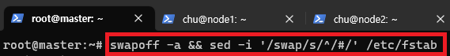

[뒤로가기](../../README.md) 

# 쿠버네티스 설치

master, node1, node2 3개의 가상 머신을 구성한뒤
쿠버네티스를 설치하여 master에 노드들을 Join한다. 

## 환경

VM 가상 머신 
ubuntu - 20.04 

### (1) Master, Node1, Node2 네트워크 설정

 

 
만들기를 클릭한뒤 새로운 네트워크의 Name과
IPv4 Prefix : 10.100.0.0/24를 입력한다. 

 
포트 포워딩을 클릭한뒤, 
node1 | TCP | 127.0.0.1 | 101 | 10.100.0.101 | 22 
node2 | TCP | 127.0.0.1 | 102 | 10.100.0.102 | 22 
master | TCP | 127.0.0.1 | 104 | 10.100.0.104 | 22 
를 입력해 적용한다. 

### (2) Ubuntu 가상 서버 생성

[VM 환경] 
name : k8s-master 
cpu : 2 core 
memory : 4096MB -> k8s를 설치한뒤 2GIB로 줄일것이다. 
network : nat network 
disk size : 20GIB 

[Ubuntu 서버 만들기](../Document/VM.md) -> 여기서는 [Ubntu 20.04](https://releases.ubuntu.com/focal/) 버전을 사용한다. 

MASTER VM을 만들어 환경 설정을 한뒤 node1, node2도 복제해 만들것이다. 

 
네트워크는 생성한 VM의 설정에서 NAT 네트워크를 선택한뒤
방금 생성한 네트워크로 설정한다. 

### (3) Ubuntu 환경 설정

 
가상 머신을 실행한다. 

 
처음 환경 설정은 생략 -> 계속하기 클릭하면서 설치 한다. 

 
설치가 완료되면 설정-> 네트워크로 들어간다. 

 
유선의 톱니바퀴를 클릭해 설정에 들어간다. 

 
IPv4탭에서 방식을 수동으로 설정 
주소 
10.100.0.104 | 24 | 10.100.0.1 
DNS 
10.100.0.1 
로 설정한다. (master 기준) 

 
바탕화면에서 터미널을 연뒤

> sudo vi /etc/hostname

명령어로 호스트 네임을 변경한다. 

 
기존 내용을 지운뒤,

> master.example.com

으로 입력한뒤 저장한다. 

 

> sudo vi /etc/hosts

을 입력한뒤 현재 호스트네임과 다른 호스트도 등록 해준다. 

 
다음과 같이 입력하고 저장한다. 

### (4) 패키지 설치

필요한 패키지를 설치하기전,
 
소프트웨어 업데이트가 모두 끝난뒤 설치한다. 

 
그리고 터미널을 열어

> sudo apt-get install -y openssh-server curl vim tree

입력해 설치한다. 

### (5) 터미널 연결

 

> ssh master@127.0.0.1 -p 104

을 입력해 master vm에 접속한다. 

### (6) 도커 설치 - 생략

[Docker 설치](../Document/Docker.md)

### (7) 가상 머신 복제

 
master 가상 머신을 오른쪽 클릭해 복제를 클릭한다. 

 
k8s-node1으로 입력하고,
MAC Address Policy는
모든 네트워크 어댑터의 새 MAC 주소 생성을 선택 

그 다음 완전 복제를 선택한뒤 Finish한다. 

 
복제가 완료되면 생성된 우분투를 시작해준다. 

 

> sudo vi /etc/hostname

으로 들어가 node1.example.com 으로 변경한다.

 
네트워크 주소도 바꿔준다. 

[참고] - 우분투 계정이 헷갈릴 수 있어
우분투 계정명을 master에서 chu로 변경했다. 
 

 
그리고 터미널로 접속이 가능한지 확인한다. 

 
node2도 똑같이 복제해 생성한다. 
그리고 node1,node2의 메모리 크기를 2048MB로 변경한다. 

 
최종적으로 master,node1,node2모두 접속이 가능한지 확인한다. 

### (8) 가상 머신 snapshot 저장

 
모든 가상 머신을 끈뒤 master부터 스냅샷을 클릭한뒤
찍기를 누른다. 

 
현재 docker만 설치된 상태이기에 설명에 다음과 같이 작성한뒤 확인을 눌러 저장한다. 

node1, node2도 똑같이 스냅샷을 만들어 저장한다. 

### (9) 쿠버네티스 설치

 
다시 모든 가상머신에 접속한다. 

### [쿠버네티스 공식 문서](https://kubernetes.io/docs/setup/production-environment/tools/kubeadm/install-kubeadm/)

 
공식 문서에 보면 다음과 같이 swap을 비활성화 해야된다. 

 

> sudo -i

master를 관리자 계정으로 변경한다. 

 

> swapoff -a && sed -i '/swap/s/^/#/' /etc/fstab

swap을 영구 비활성화 한다.

 

br_netfilter는 방화벽인 iptables가 bridge driver를 사용하여 통신을 하는 패킷을 filter 할수 있도록 해준다. 
해당 기능을 활성화해야 Docker가 default로 사용하는  bridge driver를 사용하여 생성되는 container들간의 통신이 가능해진다. 
쿠버네티스에서는 이런 container를 포함하는게 Pod라한다. 
결론적으로 Pod끼리의 통신을 가능하게 하기 위한 설정이다. 

> lsmod | grep br_netfilter 
> modinfo br_netfilter 
> sudo modprobe br_netfilter 

하지만, 현재 확인한것과 같이 br_netfilter 커널이 존재하지만
사용되지 않고 있다. 
그리고 bridge 모듈에 의존해서 동작한다고 나온다. 

그래서, br_netfilter 모듈을 iptables가 사용할 수 있도록 설정하자. 

 

> cat \<\<EOF > /etc/sysctl.d/k8s.conf  
> net.bridge.bridge-nf-call-ip6tables = 1  
> net.bridge.bridge-nf-call-iptables = 1  
> EOF 

> sysctl --system 

 

> systemctl stop firewalld 
> systemctl disable firewalld 

firewall 방화벽이 존재하면 비활성화 한다. 

[주의사항] 
이제 k8s를 설치할텐데 현재 공식 문서에서
ubuntu 22.04 이전 버전에서는 /etc/apt/keyrings가 없다고 한다. 
그래서 설치하기전에 

> sudo mkdir -p /etc/apt/keyrings

해당 명령어로 keyrings폴더를 생성해둔다. 

> sudo apt-get update 
> sudo apt-get install -y apt-transport-https ca-certificates curl 

패키지를 업데이트 한뒤 k8s apt 레파지토리를 사용하는데 필요한 패키지 설치 

> curl -fsSL https://packages.cloud.google.com/apt/doc/apt-key.gpg | sudo gpg --dearmor -o /etc/apt/keyrings/kubernetes-archive-keyring.gpg 

Google Cloud 공개 서명 키 설치 

> echo "deb [signed-by=/etc/apt/keyrings/kubernetes-archive-keyring.gpg] https://apt.kubernetes.io/ kubernetes-xenial main" | sudo tee /etc/apt/sources.list.d/kubernetes.list 

k8s apt 레파지토리 추가 

> sudo apt-get update 
> sudo apt-get install -y kubelet kubeadm kubectl 

> sudo apt-mark hold kubelet kubeadm kubectl 

k8s를 설치하고 해당 버전을 고정 

 

> sudo systemctl daemon-reload 
> sudo systemctl restart kubelet

시스템을 재구성하고 kubelet을 재시작

node1, node2에도 이 과정을 모두 수행한다.

### (10) 쿠버네티스 구성 - master에서만 실행

### 컴포넌트 초기화

 

> kubeadm init

으로 초기화를 진행한다. 

 
여기서 다음과 같은 에러가 뜰 경우 

> sudo rm /etc/containerd/config.toml 
> sudo systemctl restart containerd 

해당 명령어를 입력한다.  [containerd설정 파일인 config.toml 파일을 삭제] 

 
해당 결과가 출력되면 성공이다. 

 
다음과 같이 추후에 워커노드들을 연결하기 위해 토큰을 홈폴더에 저장한다. 

 

> mkdir -p \$HOME/.kube 
> sudo cp -i /etc/kubernetes/admin.conf \$HOME/.kube/config  
> sudo chown \$(id -u):$(id -g) $HOME/.kube/config 
> cat > token.txt  
> 결과로 나온 token 정보

### Weave-Net 설치

> kubectl apply -f https://github.com/weaveworks/weave/releases/download/v2.8.1/weave-daemonset-k8s.yaml

 
설치되었는지 확인하다. 

> kubectl get pod --all-namespaces 
> kubectl get nodes 

또한, master 노드가 준비중인지 확인 

### (11) worker node를 master에 join

 

> cat token.txt 

master에 저장한 토큰 정보를 복사한다. 

 
그리고 node1에 해당 정보를 붙여넣어 실행한다. 

여기서도, 
 
와 같은 버그가 발생하면 

> sudo rm /etc/containerd/config.toml 
> sudo systemctl restart containerd 

> 해당 명령어를 입력하고 수행한다. 

node2도 똑같이 수행한다. 

 
정상적으로 join했는지 확인하고 
master 노드에서 노드리스트를 출력해 등록이 되었는지 확인하다. 
또한, 기다리면 모두 Ready가 되는지 확인한다. 
