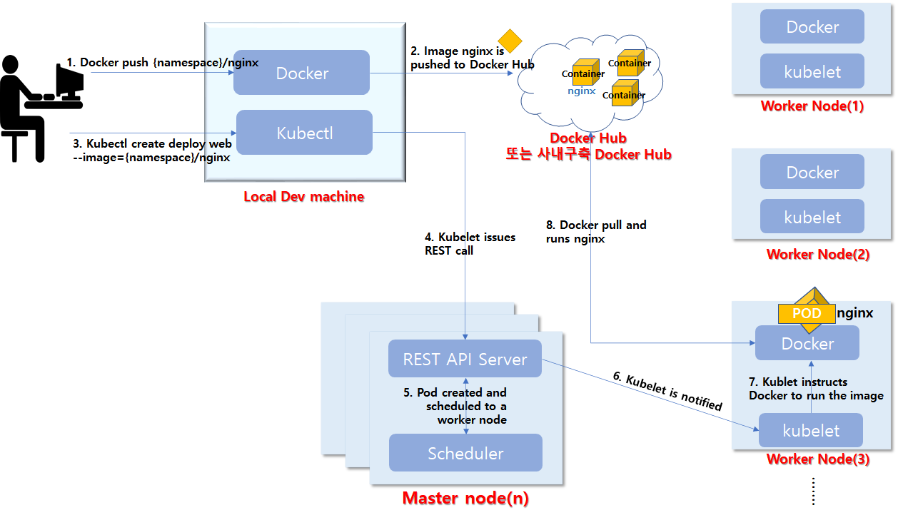
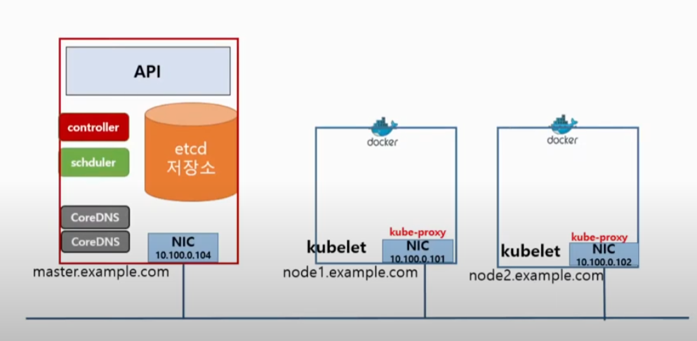

[뒤로가기](../../README.md) 

# Kubernetes

초창기 웹의 문제

- 하나의 서버가 모든 요청을 처리
- 하나의 서버로 감당이 어려워짐
- 하나의 단일 서비스로 구성이 힘듬

1. 여러대의 서버를 똑같은 형상으로 관리하는데 시간이 너무 많이 듬 
2. 오류가 발생하면 대응하기도 힘듬 

-> 결국 서버 증설을 직접하는데 한계를 느낌

이 문제를 해결하기 위해 처음 등장한게 VM(가상머신)
VM의 등장으로 형상 관리가 편해졌고 Hypervisor 기술 발달로 클라우드 컴퓨팅 시대가 열림 
[Hypervisor로 OS와 하드웨어를 분리시킴] 

-> 한대의 PC로 여러개의 서버를 가상 머신으로 구성할 수 있게 된 거임 

VM등장이후 컨테이너가 등장함 
-> 이미지를 통한 컨테이너 구성으로 관리가 더 편해짐 

### VM vs 컨테이너

VM은 OS와 하드웨어 사이의 Hypervisor로 추상화 연결을 제공하지만 여러 OS를 설치한다면 그만큼 시스템이 무거워지고 느려진다. 
하지만 컨테이너는 OS위에서 프로그램들을 격리시키므로 가볍고 속도가 빠르지만,  다른 OS전용 컨테이너를 사용할수 없고, 보안에도 VM보다는 취약하다. 

-> 컨테이너의 도입으로 편해졌지만, 컨테이너를 관리하는 것도 일이 커졌다. 

1. 장애 처리
2. 디버깅
3. 모니터링, 로그 수집 등등...

### 그래서 쿠버네티스로 컨테이너를 관리하게 되었다. 

## 특징

1. 클라우드 컴퓨팅에 종속적이지 않다.
2. 복잡하다. -> 프로그램마다의 요구 사항으로 제공하는 서비스가 너무 많다.
3. 보안이 취약하면 안된다.
4. 워크로드 분리(컨테이너들을 분리)
5. 선언적 API : k8s운영자는 K8s에게 요청만하면 된다. 
   웹서버 2개를 실행해달라 요청하면 K8s가 알아서 서버2개를 실행하고 관리한다.

## [k8s 설치](../Document/k8s%20%EC%84%A4%EC%B9%98.md)

## [kubectl 명령어](../Document/kubectl%EB%AA%85%EB%A0%B9%EC%96%B4.md)

## K8s 아키텍쳐

### [동작 과정]

 

1. 개발자가 컨테이너를 생성한다.
2. 컨테이너를 Hub에 저장한다.
3. 개발자가 k8s에게 Hub에 저장된 컨테이너를 실행 요청한다.
4. k8s에는 control_plane(master node)에게 요청을 보낸다.
5. master에는 API SERVER가 있어 해당 요청을 받아준다.
6. master의 API는 해당 요청에따라 etcd를 검사한뒤  Scehduler에게 어떤 WorkNode에서 실행하면 될지 요청한다.
7. Scehduler는 전달받은 etcd정보를 바탕으로 모든 노드의 상태를 검사한뒤 master에게 응답해준다.
8. API는 해당 응답에따라 해당 WorkNode의 kubelet에게 요청한다.
9. WorkNode의 kubelet은 Docker데몬에게 실행 요청을 한다.
10. Docker데몬은 허브에 컨테이너가 있으며 실행해준다.
11. 실행이되면 k8s는 Pod형태로 관리하게 된다.

 

### [Master Compnent]

etcd : key-value 타입의 저장소(worker노드들의 상태 정보를 저장) 
kube-apiserver : k8s API를 사용하도록 요청을 받고 요청이 유효한지 검사 
kube-scheduler : Pod를 실행할 노드 선택 
kube-controller-manager : pod를 관리하며 개수를 보장 

### [Worker Compnent]

kubelet : 모든 노드에서 실행되는 k8s agent(데몬형태로 동작) 
컨테이너 모니터링 툴인 CAdviosr가 상태 정보를 수집해 Master의 ectd에게 전달한다. 
kube-proxy : k8s의 네트워크를 관리
iptables rule을 구성 
컨테이너 런타임 : 컨테이너를 실행하는 엔진
(docker, containerd, runc) 

coreDNS, CNI, Cadvisor, 클러스터 로깅,
대쉬보드등은 애드온이다. 

k8s를 배운다는건 k8s의 API를 배우는것이다. 

## [namespace](../Document/k8s_namespace.md)

## [yaml 템플릿](../Document/k8s_yaml.md)

## [Pod](../Document/k8s_Pod.md)

## [livenessProbe](../Document/k8s_livenessProbe.md)

## [init container](../Document/k8s_init%20container.md)

## [infra container (pause)](../Document/k8s_infra%20container.md)
