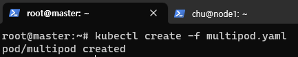
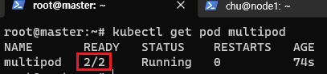
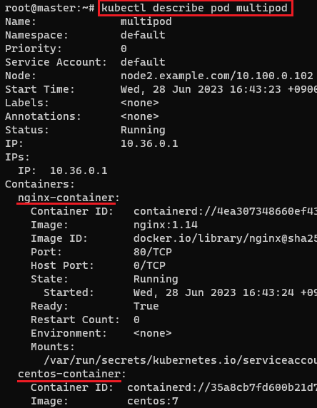
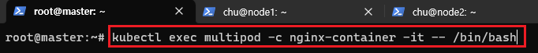
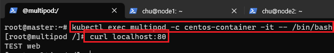

[뒤로가기](../../README.md)<br>

# Pod

컨테이너를 표현하는 k8s API의 최소 단위<br>
Pod에는 여러 개의 컨테이너가 포함될 수 있음

## Pod 생성

### CLI 방식

> kubectl run webserver --image=nginx:1.14

### yaml 방식

(pod-ngnix.yaml파일이 있다 가정)<br>

> kubectl create -f pod-nginx.yaml

Pod yaml 파일 구조

```
apiVersion: v1
kind: Pod
metadata:
  name: nginxserver
spec:
  containers:
  - name: nginx
     image: nginx:1.14
     ports:
     - containerPort: 80
        protocol: TCP
```

## 멀티 컨테이너 Pod생성

Pod안에 여러개의 컨테이너를 구성해
각 컨테이너간의 <br>유기적인 관계로 연동이 되도록 구성하기 위함<br>

[yaml 예시]

```
apiVersion: v1
kind: Pod
metadata:
  name: multipod
spec:
  containers:
  - name: nginx-container
    image: nginx:1.14
    ports:
    - containerPort: 80
  - name: centos-container
    image: centos:7
    command:
     - sleep
     - "10000"
```

[생성 방법]

<br>

> kubectl create -f multipod.yaml

<br>

컨테이너 개수가 두개로 표시된다.<br>

<br>

> kubectl describe pod multipod

자세히 보면 두개의 컨테이너가 존재한다.

<br>

> kubectl exec multipod -c nginx-container -it -- /bin/bash

pod중에 특정 컨테이너에 접근하는 법<br>

<br>

재밌는건 centos에 접근한뒤 localhost 서버를 실행해보면
nginx가 구동되는 서버가 출력된다.<br>
(같은 IP를 가지기 때문에)<br>
