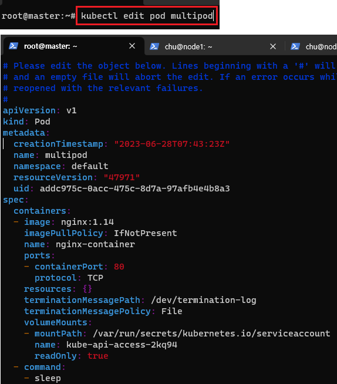
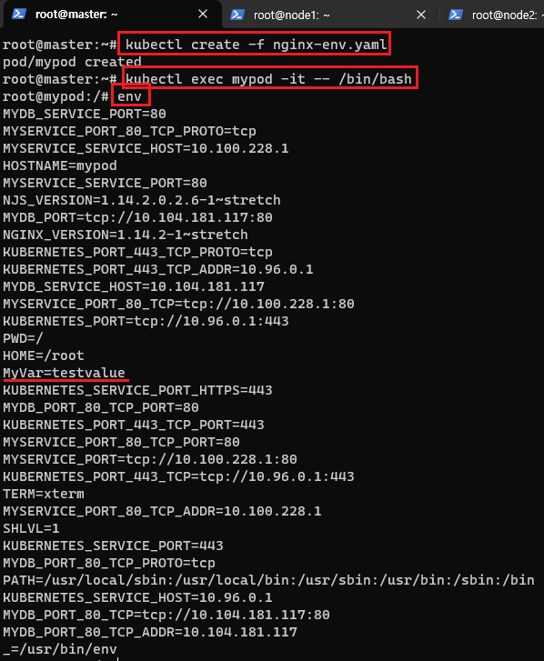
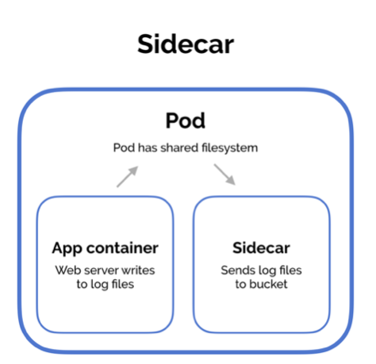
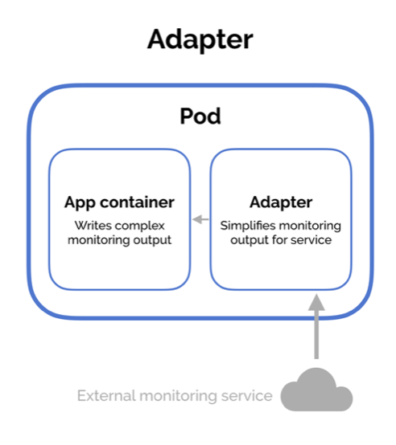
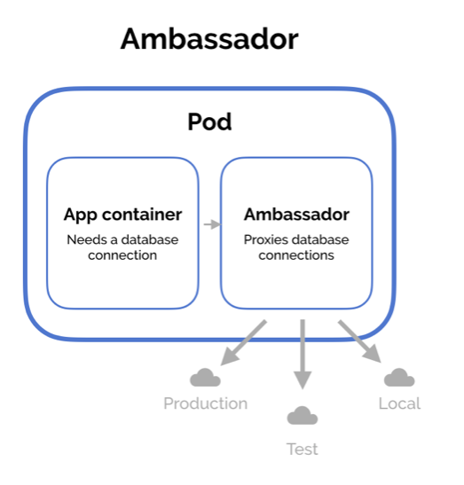

[뒤로가기](../../README.md)<br>

# Pod

컨테이너를 표현하는 k8s API의 최소 단위<br>
Pod에는 여러 개의 컨테이너가 포함될 수 있음

## [Pod 생성]

### CLI 방식

> kubectl run webserver --image=nginx:1.14

### yaml 방식

(pod-ngnix.yaml파일이 있다 가정)<br>

> kubectl create -f pod-nginx.yaml

Pod yaml 파일 구조

```
apiVersion: v1
kind: Pod
metadata:
  name: nginxserver
spec:
  containers:
  - name: nginx
     image: nginx:1.14
     ports:
     - containerPort: 80
        protocol: TCP
```

## [멀티 컨테이너 Pod생성]

Pod안에 여러개의 컨테이너를 구성해
각 컨테이너간의 <br>유기적인 관계로 연동이 되도록 구성하기 위함<br>

[yaml 예시]

```
apiVersion: v1
kind: Pod
metadata:
  name: multipod
spec:
  containers:
  - name: nginx-container
    image: nginx:1.14
    ports:
    - containerPort: 80
  - name: centos-container
    image: centos:7
    command:
     - sleep
     - "10000"
```

[생성 방법]

<br>

> kubectl create -f multipod.yaml

<br>

컨테이너 개수가 두개로 표시된다.<br>

<br>

> kubectl describe pod multipod

자세히 보면 두개의 컨테이너가 존재한다.

<br>

> kubectl exec multipod -c nginx-container -it -- /bin/bash

pod중에 특정 컨테이너에 접근하는 법<br>

<br>

재밌는건 centos에 접근한뒤 localhost 서버를 실행해보면
nginx가 구동되는 서버가 출력된다.<br>
(같은 IP를 가지기 때문에)<br>

## [Pod 수정]

<br>

> kubectl edit pod multipod

실행중인 pod를 직접 수정할 수 있다.

## [Pod환경 변수 설정]

환경 변수 : Pod내의 컨테이너가 실행될 때 필요로 하는 변수<br>
예시) NGNIX Dockerfile일경우<br>
ENV NGNIX_VERSION 1.19.2<br>

Pod 실행 시 미리 정의된 컨테이너 환경변수를 변경할 수 있다.<br>

```
apiVersion: v1
kind: Pod
metadata:
  name: mypod
spec:
  containers:
  - image: nginx:1.14
    name: nginx
    ports:
    - containerPort: 80
    env:
    - name: MyVar
      value: "testvalue"
```

nginx를 포함해서 testvalue값을 가진 MyVar도 환경 변수도 할당해달라 요청하게된다.<br>

<br>
Pod를 생성한뒤 컨테이너 내부로 들어가 환경 변수를 확인하면<br> 내가 설정한 환경 변수가 보인다.<br>

## [Pod 디자인 패턴의 종류]

실제로는 Single Pod가 아닌 multi Pod를 많이 사용한다.<br>

### [Sidecar]

<br>
Pod안에 컨테이너 두개를 생성한뒤
AppContainer[Web Server]가 로그를 만들면<br>
해당 로그를 분석하거나 관리하는 Sidecar를가진다.<br>

### [Adapter]

<br>
외부의 데이터를 Adapter가 받아와 분석한뒤
결과를<br> AppContainer[Web Server]에게 전달한다.<br>

### [Ambassador]

<br>
고객이 AppContainer[Web Server]에 접속하면<br>
Ambassador가 로드밸런서 역할을 하며
각 서비스들을 이용할 수 있게 한다.
