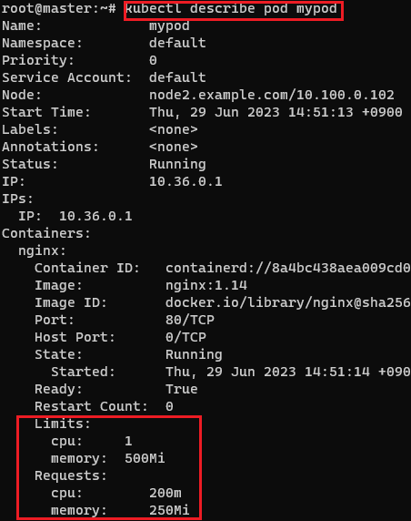

[뒤로가기](../../README.md)<br>

# Pod Resource 할당

K8s에 관리하는 리소스는 CPU와 메모리다.<br>
Pod에 리소스 제한을 걸지않으면 worker노드의
모든 리소스를 사용할 수도 있다.<br>
다른 Pod가 동작이 안되거나 보안적으로도 치명적이다.<br>
그래서, Pod를 생성할때 대체적으로 리소스 제한을 걸어 여유 자원을 확보한다.<br>

그리고 Scheduler는 해당 자원으로 구동이 가능한
worker노드에 Pod를 실행하게 된다.

Resource Requests<br>
Pod를 실행하기 위한 최소 리소스 양을 요청<br>

Resource Limits<br>
Pod가 사용할 수 있는 최대 리소스 양을 제한<br>
Memory limit을 초과해서 사용하면 Pod는 자동으로 종료되어 다시 Scheduling하게 된다.<br>

### 예시

```
apiVersion: v1
kind: Pod
metadata:
  name: mypod
spec:
  containers:
  - image: nginx:1.14
    name: nginx
    ports:
    - containerPort: 80
    resources:
      requests:
        cpu: 200m
        memory: 250Mi
      limits:
        cpu: 1
        memory: 500Mi
```

Pod의 리소스 설정을 하는게 아닌
컨테이너별로 리소스를 설정한다.

```
requests:
        cpu: 200m
        memory: 250Mi
```

CPU는 Core수나 m로 표현한다.<br>
1core당 1000m로 표현한다.<br>

메모리는<br>
1MB = 1000KB<br>
1Mi = 1024KiB<br>
1Gi = 1024MB<br>

<br>

Pod를 실행해보면 잘 설정된것을 볼 수 있다.

참고로, limits만 설정하면 requests가 자동으로 limits과 같은 수치로 적용된다.<br>

### 리소스 설정은 보안과 관련 있어 중요하다.
