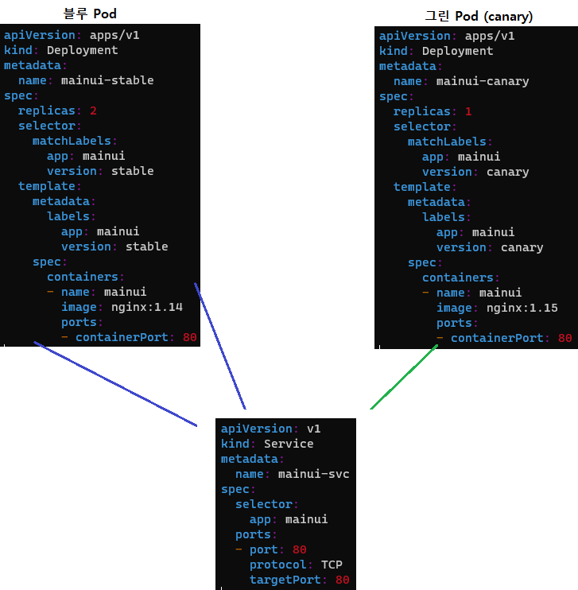
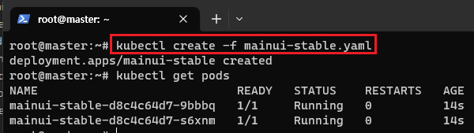
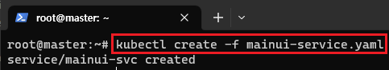
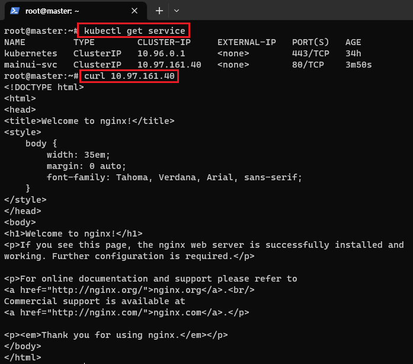
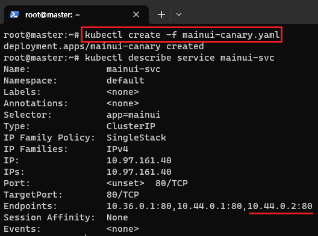
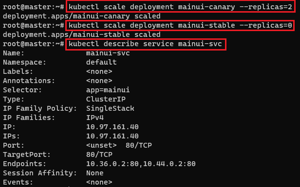

[뒤로가기](../../README.md)<br>

# Label을 활용한 Canary 배포

보통 Pod를 업데이트 하는 방법

- 블루 그린 업데이트 [블루: oldVersion, 그린: newVersion]
- Canary 업데이트
- Rolling 업데이트

## [Canary 업데이트]

기존 버전을 유지한체로 일부 버전만 신규 버전으로 바꾸고<br> 신규 버전에 버그나 이상은 없는지 확인<br>

Canary 업데이트 방식



블루 Pod 2개로 서비스를 진행하면서
업데이트가 필요할 경우<br> 그린 Pod 1개를 추가해 기존 Pod 2개+ 새 Pod 1개로 서비스를 진행한다.<br>

그리고 서비스에 문제가 없을경우 새 Pod 1개를 더 추가하면서<br>
기존 Pod 2개 + 새 Pod 2개로 운영하고
문제가 없을 경우<br> 기존 Pod 2개를 빼버리며
업데이트를 진행한다.<br>

여기서 Label의 version 정보에 따라 Pod를 삭제, 추가한다.<br>

Blue Pod

```
apiVersion: apps/v1
kind: Deployment
metadata:
  name: mainui-stable
spec:
  replicas: 2
  selector:
    matchLabels:
      app: mainui
      version: stable
  template:
    metadata:
      labels:
        app: mainui
        version: stable
    spec:
      containers:
      - name: mainui
        image: nginx:1.14
        ports:
        - containerPort: 80
```

<br>
기존 Pod가 실행되어 있다 가정<br>

Service Pod

```
apiVersion: v1
kind: Service
metadata:
  name: mainui-svc
spec:
  selector:
    app: mainui
  ports:
  - port: 80
    protocol: TCP
    targetPort: 80
```

<br>
또한, 서비스를 통해 mainui의 단일 진입점을 구성한다.<br>

<br>
서비스가 잘 운영되는지 확인한다.<br>

Green Pod

```
apiVersion: apps/v1
kind: Deployment
metadata:
  name: mainui-canary
spec:
  replicas: 1
  selector:
    matchLabels:
      app: mainui
      version: canary
  template:
    metadata:
      labels:
        app: mainui
        version: canary
    spec:
      containers:
      - name: mainui
        image: nginx:1.15
        ports:
        - containerPort: 80
```

<br>

새 버전의 Pod를 생성하자마자 서비스가 mainui기준으로<br> 자동으로 새로운 Pod에대한 진입점을 구성한다.

<br>

그리고 운영에 이상이 없을 경우 기존 버전의 Pod갯수를 줄여 업데이트를 한다.<br>
