[뒤로가기](../../README.md)<br>

# ConfigMap

컨테이너 구성 정보를 한곳에 모아서 관리하는 API

컨테이너가 많을 경우 하나하나 관리하는것은 쉽지 않다.<br>
그래서 ConfigMap을 활용해서 모든 컨테이너의 구성 정보를 관리한다.<br>

key-value값으로 관리를 하며
file도 configmap에 저장할 수 있다.

## Literal 방식

> kubectl create configmap NAME [--from-literal=key1=value1]

### [cofigmap을 안쓴 mysql yaml 파일]

```
apiVersion: apps/v1
kind: Deployment
metadata:
  name: mysql
spec:
  selector:
    matchLabels:
      app: mysql
  template:
    metadata:
      name: mysql
      labels:
        app: mysql
    spec:
      containers:
      - name: mysql
        image: mysql
        env:
        - name: MYSQL_ROOT_PASSWORD
          value: 1q2w3e4r
        - name: MYSQL_DATABASE
          value: testdb
        ports:
        - name: http
          containerPort: 3306
          protocol: TCP
```

configmap을 안쓰면 env 환경 변수를 통해 직접 yaml파일에 해당 정보를 <br>작성해 구성하게 된다.

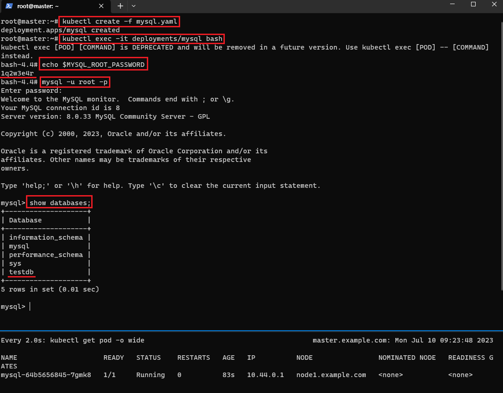

mysql Pod를 생성하면 환경변수와 DB가 제대로 구성이된것을 확인할 수 있다.<br>

하지만, 이렇게 매번 환경 구성을 Pod의 yaml파일에 작성하면 구성하는데 불편하다.<br>

### [Configmap CLI 방식]

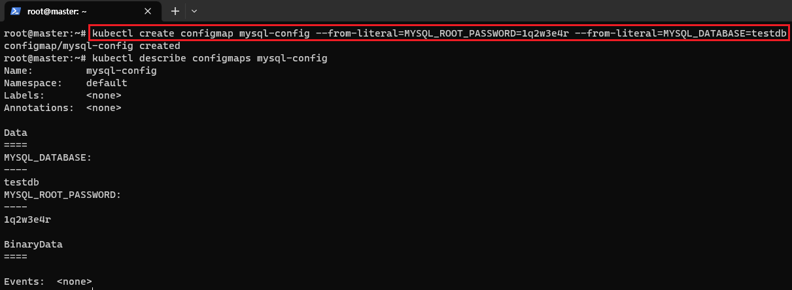<br>

> kubectl create configmap mysql-config --from-literal=MYSQL_ROOT_PASSWORD=1q2w3e4r --from-literal=MYSQL_DATABASE=testdb

### [Configmap Yaml 파일 방식]

```
apiVersion: v1
kind: ConfigMap
metadata:
  name: mysql-config
data:
  MYSQL_ROOT_PASSWORD: 1q2w3e4r
  MYSQL_DATABASE: testdb
```

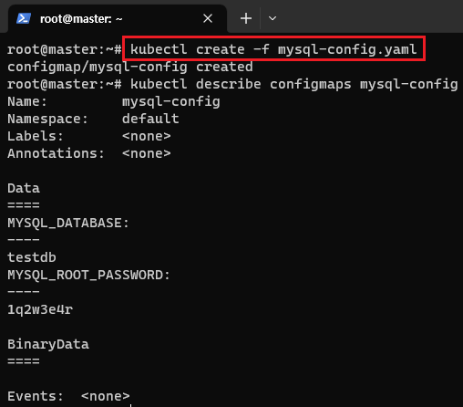<br>

### [cofigmap을 적용한 mysql yaml 파일]

```
apiVersion: apps/v1
kind: Deployment
metadata:
  name: mysql
spec:
  selector:
    matchLabels:
      app: mysql
  template:
    metadata:
      name: mysql
      labels:
        app: mysql
    spec:
      containers:
      - name: mysql
        image: mysql
        envFrom:
        - configMapRef:
            name: mysql-config
        ports:
        - name: http
          containerPort: 3306
          protocol: TCP
```

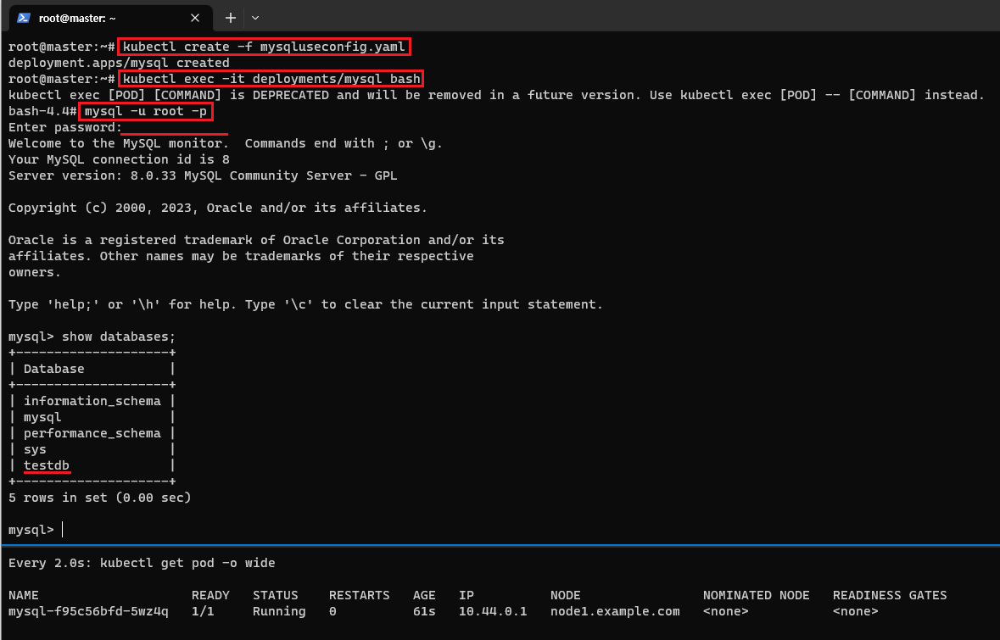<br>

### [Configmap에 PASSWORD값만 받아옴]

```
apiVersion: apps/v1
kind: Deployment
metadata:
  name: mysql
spec:
  selector:
    matchLabels:
      app: mysql
  template:
    metadata:
      name: mysql
      labels:
        app: mysql
    spec:
      containers:
      - name: mysql
        image: mysql
        env:
        - name: MYSQL_ROOT_PASSWORD
          valueFrom:
            configMapKeyRef:
              name: mysql-config
              key: MYSQL_ROOT_PASSWORD
        ports:
        - name: http
          containerPort: 3306
          protocol: TCP
```

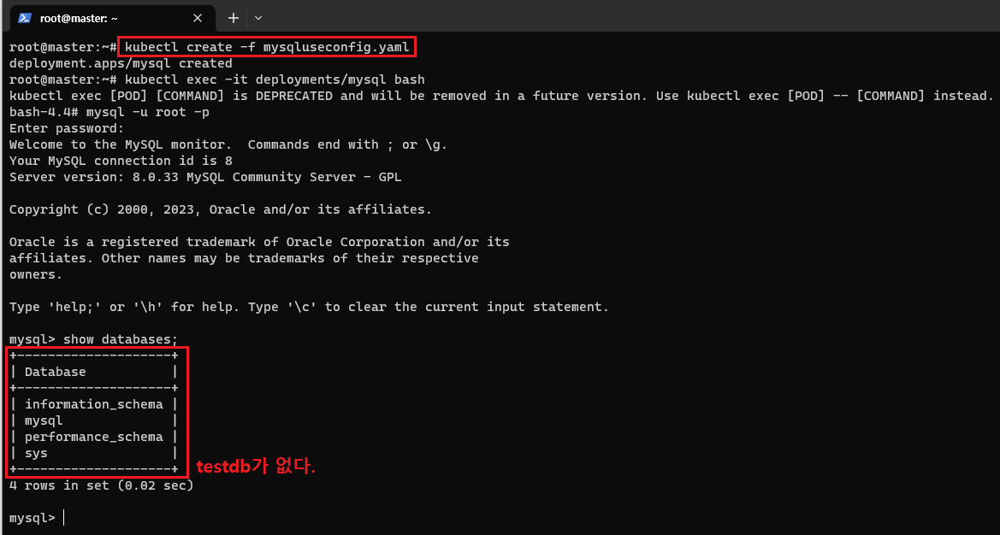

이처럼 mysql-config에서 특정 값만 받아 올 수도 있다.<br>
그래서 testdb는 생성되지 않았다.<br>

## File 방식

> kubectl create configmap NAME [--from-file=source]

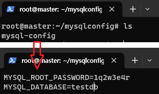

mysql의 정보를 mysql-config 파일을 만들어 저장해둔다.<br>

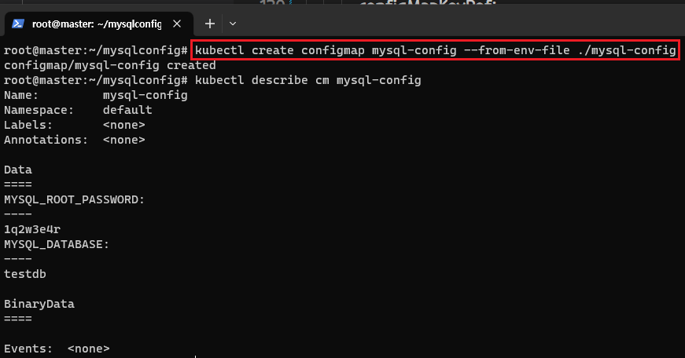

> kubectl create configmap mysql-config --from-env-file ./mysql-config

configmap을 생성한다.<br>

### [주의점]<br>

--from-file로 생성하면<br>
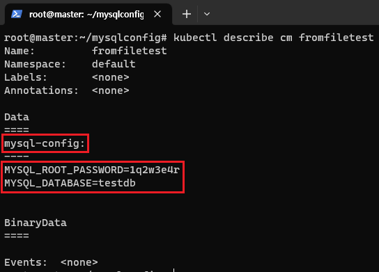
파일명이 Key가 되고 파일의 내용이 value가 되어
mysql에서 인식이 안된다.<br>

그래서 --from-env-file로 작성해<br>
파일의 내용중에 key=value값을
key:value로 인식하게 한다.<br>

[From-file 방식의 Mysql 파일]<br>

```
          env:
          - name: MYSQL_ROOT_PASSWORD
            valueFrom:
              configMapKeyRef:
                name: fromfiletest
                key: mysql-config
```

From-file방식으로 인식하도록 했는데 안된다...<br>

### File-env 방식 Mysql 파일

```
apiVersion: apps/v1
kind: Deployment
metadata:
  name: mysql
spec:
  selector:
    matchLabels:
      app: mysql
  template:
    metadata:
      name: mysql
      labels:
        app: mysql
    spec:
      containers:
      - name: mysql
        image: mysql
        envFrom:
        - configMapRef:
            name: mysql-config
        ports:
        - name: http
          containerPort: 3306
          protocol: TCP
```

Literal과 똑같다.<br>
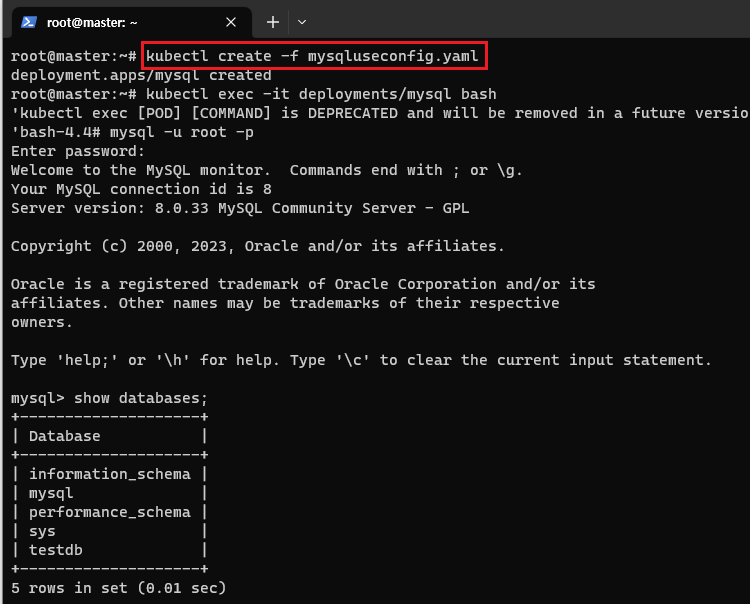<br>

## Configmap Volume

생성한 Configmap의 데이터를 Volume으로 마운트 할 수 있다.
즉, 특정 디렉토리에 ConfigMap의 데이터를 저장한다.

### Volume Mysql 파일

```
apiVersion: apps/v1
kind: Deployment
metadata:
  name: mysql
spec:
  selector:
    matchLabels:
      app: mysql
  template:
    metadata:
      name: mysql
      labels:
        app: mysql
    spec:
      containers:
      - name: mysql
        image: mysql
        envFrom:
        - configMapRef:
            name: mysql-config
        volumeMounts:
        - mountPath: /tmp/config
          name: mysql-config
      volumes:
      - name: mysql-config
        configMap:
          name: mysql-config
```

mysql-config 파일 정보가 해당 Container의 /tmp/config에 저장된다.
<br>

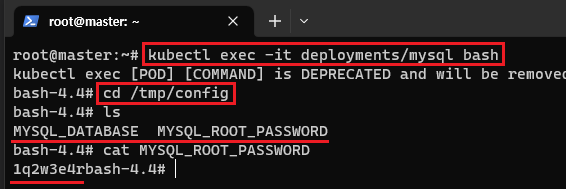<br>
실제로 생성한뒤 컨테이너 내부에서 이동하면 파일이 생성된것을 볼 수 있다.<br>

# Secret

컨테이너가 사용하는 Password, AuthToken, ssh key와 같은 중요한 정보를 저장<br>
해당 구성 정보는 base64로 인코딩되어 한곳에 모아서 정리가 됨

ConfigMap과 같지만 보안이 적용된 서비스

## [사용 방법]

> kubectl create secret \<Available Commends> name [flags] [options]

\<Available Commends> 에따라 명령 방식이 다르다.

1. tls : Pod나 Service와 같은 오브젝트에서 TLS 인증서 정보를 통해 통신 암호화를 수행한다

> kubectl create secret tls my-secret --cert=path/to/cert/file --key=path/to/key/file

2. docker-registry : 도커 이미지 저장소 인증 정보

> kubectl create secret docker-registry reg-secret --docker-username=tiger \\ --docker-password=pass --docker-email=name@examples.com

3. generic : 일반적인 용도의 시크릿 Configmap과 동일한 목적으로 사용

> kubectl create secret generic my-secret \\
> --from-literal=INTERVAL=2 --from-file=./mysql-config/

그래서 Mysql DB의 패스워드 정보도 사실은 Secret을 통해 관리해야된다.

### [configmap Mysql yaml]

```
apiVersion: v1
kind: ConfigMap
metadata:
  name: mysql-config
data:
  MYSQL_DATABASE: testdb
```

### [secret Mysql yaml]

```
apiVersion: v1
kind: Secret
metadata:
  name: my-secret
stringData:
  MYSQL_ROOT_PASSWORD: 1q2w3e4r
```

### [Mysql yaml]

```
apiVersion: apps/v1
kind: Deployment
metadata:
  name: mysql
spec:
  selector:
    matchLabels:
      app: mysql
  template:
    metadata:
      name: mysql
      labels:
        app: mysql
    spec:
      containers:
      - name: mysql
        image: mysql
        envFrom:
        - configMapRef:
            name: mysql-config
        - secretRef:
            name: mysql-secret
```

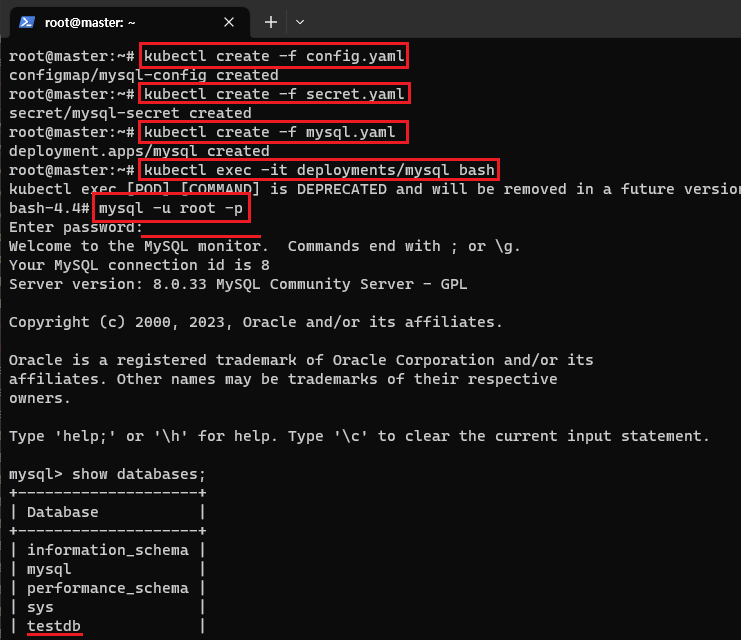<br>

### [Secret 데이터 용량 제한]

Secret 데이터는 etcd에 암호화 하지 않는 텍스트로 <br>저장되므로 secret valut가 커지면 메모리 용량을 많이 쓰게된다.<br>
그래서 secret의 최대 크기는 1MB이다.<br>
