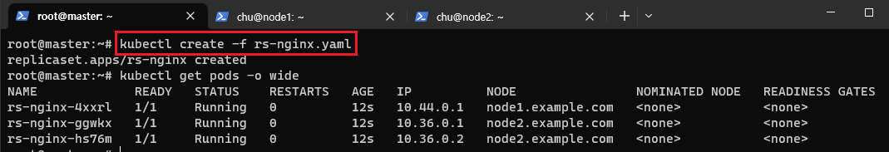
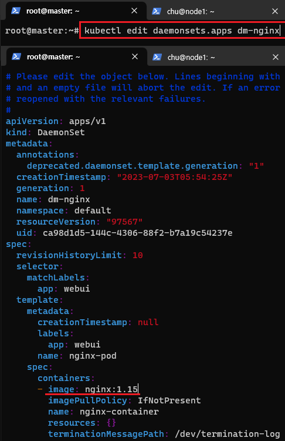
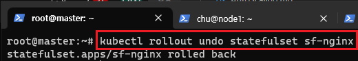

[뒤로가기](../../README.md)<br>

<<<<<<< HEAD
[뒤로가기](../../)\


## Controller
=======
# Controller
>>>>>>> parent of 4d4a984 (GITBOOK-5: change request with no subject merged in GitBook)

Pod의 개수를 보장

> kubectl create deployment webui --image=nginx --replicas=3

nginx 웹서버 3개를 실행 요청하고 Controller는 nginx 웹서버 3개를 보장하게 된다.
<br>

## [Controller 종류]

1. REPLICATION CONTROLLER
2. REPLICASET + [DEPLOYMENT]
3. DEAMONSET
4. STATFULSET
5. JOB + [CRONJOB]

---

## [1] Replication Controller

요구하는 Pod의 개수를 보장하며 Pod의 실행을 항상 안정적으로 유지하는것이 목표

- 요구하는 Pod의 개수가 부족하면 템플릿을 이용해 Pod를 추가
- 요구하는 Pod 수 보다 많으면 최근에 생성된 Pod를 삭제

### [기본 구성]

- replicas [배포갯수]
- template [배포하려는 Pod의 템플릿]
- selector [배포기준]

### [명령어 예시]

> kubectl create rc-exam --image=nginx --replicas=3 --selector=app==webui

nginx 이미지를 가진 webui라는 app 3개를 생성해달라 요청한다.<br>
그리고 Controller는 selector를 통해 webui라는 app의 갯수를 체크한뒤<br> 많으면 삭제하거나 부족하면 템플릿을 활용해 Pod 갯수를 채워넣는다.<br>

### [ReplicationController yaml 파일]

```
apiVersion: v1
kind: ReplicationController
metadata:
  name: rc-nginx
spec:
  replicas: 3
  selector:
    app: webui
  template:
    metadata:
       name: nginx-pod
       labels:
         app: webui
    spec:
       containers:
       - name: nginx-container
          image: nginx:1.14
```

<<<<<<< HEAD


> kubectl create -f rc-nginx.yaml


=======


> kubectl create -f rc-nginx.yaml


>>>>>>> parent of 4d4a984 (GITBOOK-5: change request with no subject merged in GitBook)

Controller는 webui label의 Pod 3개를 보장한다.<br>
하지만 만약

<<<<<<< HEAD

=======

>>>>>>> parent of 4d4a984 (GITBOOK-5: change request with no subject merged in GitBook)

> kubectl run http-web --image=httpd --dry-run -o yaml > httpd-pod.yaml

httpd pod yaml파일을 생성했다.

```
apiVersion: v1
kind: Pod
metadata:
  labels:
    app: webui
  name: http-web
spec:
  containers:
  - image: httpd
    name: http-web
```

그리고 이렇게 동일한 webui lable을 사용하는 Pod를 실행할 수 있을까?

<<<<<<< HEAD

=======

>>>>>>> parent of 4d4a984 (GITBOOK-5: change request with no subject merged in GitBook)

실제로 실행한 결과 안되는것을 볼 수 있다.<br>
webui 라벨인 Pod 3개를 보장하기에 자동으로 중지된다.<br>

<<<<<<< HEAD


=======

>>>>>>> parent of 4d4a984 (GITBOOK-5: change request with no subject merged in GitBook)

> kubectl edit rc rc-nginx

현재 실행중인 rc의 환경을 편집할 수 있다.<br>
또한,

> kubectl scale rc rc-nginx --replicas=2

<<<<<<< HEAD
edit없이 scale명령어로 갯수 조정이 가능하다.\


\
=======
edit없이 scale명령어로 갯수 조정이 가능하다.<br>
>>>>>>> parent of 4d4a984 (GITBOOK-5: change request with no subject merged in GitBook)

<br>

> kubectl delete rc rc-nginx --cascade=false

controller를 삭제하면 Pod도 같이 삭제되지만,
cascaed=false를 하면<br> 연쇄삭제를 막아 Controller만 삭제하게 된다.<br>

### [주의사항]

<br>
nginx1.14버전을 1.15버전으로 바꿔본다.<br>

<<<<<<< HEAD
\
nginx1.14버전을 1.15버전으로 바꿔본다.\
=======
<br>
바꾸고 저장한다.<br>
>>>>>>> parent of 4d4a984 (GITBOOK-5: change request with no subject merged in GitBook)

<br>
하지만, 변경되지 않는다.<br>

<<<<<<< HEAD
\
바꾸고 저장한다.\
=======
ReplicationController는 selector정보만을 보며 Pod의 개수를 조정한다.<br>
>>>>>>> parent of 4d4a984 (GITBOOK-5: change request with no subject merged in GitBook)

그래서, selector이 label를 정할때 주의해야한다.<br>

<<<<<<< HEAD
\
하지만, 변경되지 않는다.\
=======
---
>>>>>>> parent of 4d4a984 (GITBOOK-5: change request with no subject merged in GitBook)

## [2] ReplicaSet

ReplicationController와 같은 역할을 하지만,<br>
ReplicationController보다 다양한 selector를 지원한다.<br>

### [selector]

matchLables: -> 기존 Lable가 똑같음<br>
matchExpressions 연산자<br>

- In : key와 value를 지정해 key,value가 일치하는 Pod만 연결
- NotIn: key는 일치하고 value는 일치하지 않는 Pod에 연결
- Exists: key에 맞는 lable의 Pod를 연결
- DoesNotExist: key와 다른 lable의 Pod를 연결

### [예시]

```
spec:
  replicas: 3
  selector:
    matchLables:
      app: webui
    matchExpressions:
    - {key: version, operator: In, value:["2.1","2.2"]}
  template:
    metadata:
       name: nginx-pod
       labels:
         app: webui
    spec:
       containers:
       - name: nginx-container
          image: nginx:1.14
```

> - {key: version, operator: In, value:["2.1","2.2"]}

version 2.1 or 2.2면 Pod를 생성한다.

> - {key: version, operator: NotIn, value:["2.1","2.2"]}

version 2.1 or 2.2가 아니면 Pod를 생성한다.

> - {key: version, operator: Exists}

version이 존재하기라도 하면 Pod를 생성한다.

> - {key: version, operator: DoesNotExist}

version이 존재하지않으면 Pod를 생성한다

### [ReplicaSet yaml 파일]

```
apiVersion: apps/v1
kind: ReplicaSet
metadata:
  name: rs-nginx
spec:
  replicas: 3
  selector:
    matchLabels:
      app: webui
  template:
    metadata:
       name: nginx-pod
       labels:
         app: webui
    spec:
      containers:
      - name: nginx-container
        image: nginx:1.14
```

<<<<<<< HEAD
\


> kubectl create -f rs-nginx.yaml

\

=======
<br>

> kubectl create -f rs-nginx.yaml

<br>
>>>>>>> parent of 4d4a984 (GITBOOK-5: change request with no subject merged in GitBook)

> kubectl get rs

rs는 ReplicaSet 약어, rc는 ReplicationController

사실 select 기능 빼고 둘의 차이점이 없다.<br>

## [3] Deployment

ReplicaSet을 컨트롤해서 Pod수를 조절한다.

### [Rolling Update & Rolling Back]

<<<<<<< HEAD
\
=======
<br>
>>>>>>> parent of 4d4a984 (GITBOOK-5: change request with no subject merged in GitBook)

Pod를 점진적으로 새로운 버전으로 업데이트할때 <br>Deployment 업데이트가 서비스 중단없이 이루어지도록 하는것<br>
(무중단 서비스)
<br>

### [Deployment yaml 파일]

```
apiVersion: apps/v1
kind: Deployment
metadata:
  name: deploy-nginx
  annotations:
    kubernetes.io/change-cause: version 1.14
spec:
  progressDeadlineSeconds: 600
  revisionHistoryLimit: 10
  strategy:
     rollingUpdate:
         maxSurge: 25%
         maxUnavailable: 25%
     type: RollingUpdate
  replicas: 3
  selector:
    matchLabels:
      app: webui
  template:
    metadata:
       name: nginx-pod
       labels:
         app: webui
    spec:
      containers:
      - name: nginx-container
        image: nginx:1.14
```

> progressDeadlineSeconds: 600

10분안에 업데이트가 완료가 안되면 이전을 되돌린다.

> revisionHistoryLimit: 10

업데이트 기록이 10줄씩 기록된다.

```
rollingUpdate:
         maxSurge: 25%
         maxUnavailable: 25%

replicas가 3일때 25%는 0.75인데 반올림해서 1이면 3+1 = 4이다.
rollingupdate를 진행할때 Pod를 몇개 생성하면서 진행할지 정하는 것
```

<<<<<<< HEAD
\


> kubectl create -f deploy-nginx.yaml

\
=======
<br>

> kubectl create -f deploy-nginx.yaml

<br>
>>>>>>> parent of 4d4a984 (GITBOOK-5: change request with no subject merged in GitBook)

보면 Deploy가 Replicaset을 만들어 Pod 생성을 지시한것을 볼 수 있다.<br>
여기서 9cc457697이 ReplicaSet이다.<br>

<<<<<<< HEAD
보면 Deploy가 Replicaset을 만들어 Pod 생성을 지시한것을 볼 수 있다.\
여기서 9cc457697이 ReplicaSet이다.\


#### Rolling Update

\
=======
### Rolling Update
>>>>>>> parent of 4d4a984 (GITBOOK-5: change request with no subject merged in GitBook)

<br>

> kubectl describe deployments.apps deploy-nginx

<<<<<<< HEAD
\


> kubectl set image deploy deploy-nginx webui=nginx:1.15 --record

\
업데이트를 진행하면서 새로운 컨테이너를 생성하고 바꿔가는 것을 볼 수 있다.\
=======
<br>

> kubectl set image deploy deploy-nginx webui=nginx:1.15 --record

<br>
업데이트를 진행하면서 새로운 컨테이너를 생성하고 바꿔가는 것을 볼 수 있다.<br>
>>>>>>> parent of 4d4a984 (GITBOOK-5: change request with no subject merged in GitBook)

참고로 record는 해당 Deployment에 대한 업데이트를 기록하는 것이다.<br>

<<<<<<< HEAD
참고로 record는 해당 Deployment에 대한 업데이트를 기록하는 것이다.\


\


> kubectl rollout history deployment deploy-nginx

\

=======
<br>

> kubectl rollout history deployment deploy-nginx

<br>
>>>>>>> parent of 4d4a984 (GITBOOK-5: change request with no subject merged in GitBook)

> kubectl rollout undo deployment deploy-nginx

histroy 기준 이전 버전으로 되돌린다.<br>
하지만, undo를 연속해서 쓰면 결국 원상태로 된다.<br>

> kubectl rollout undo deployment deploy-nginx --to-revision=1

histroy 기준 --to-revision기록의 버전으로 되롤린다.<br>

### [annotations: kubernetes.io/change-cause: version 1.14]

k8s의 동작 방식을 컨트롤할 수 있다.<br>

예를 들어,

<<<<<<< HEAD
\

=======
<br>
>>>>>>> parent of 4d4a984 (GITBOOK-5: change request with no subject merged in GitBook)

> kubectl apply -f deploy-nginx.yaml

apply 방식으로 deploy를 생성한뒤

<<<<<<< HEAD
\
=======
<br>
>>>>>>> parent of 4d4a984 (GITBOOK-5: change request with no subject merged in GitBook)
해당 yaml파일을 1.15로 수정한뒤 다시

> kubectl apply -f deploy-nginx.yaml

apply한다.

<<<<<<< HEAD
\
자동으로 update를 진행하고 있다.

\
=======
<br>
자동으로 update를 진행하고 있다.

<br>
>>>>>>> parent of 4d4a984 (GITBOOK-5: change request with no subject merged in GitBook)
또한, history도 직관적이여서 좋다.

## [4] DaemonSet

노드당 1개씩의 Pod가 실행되도록 보장

노드의 로그를 수집하는 log-agent나
모니터링하는 moniter-agent는<br> 노드당 한개씩 Pod가 실행되야한다.<br> 그때 DaemonSet을 사용한다.<br>

또한, RollingUpdate와 RollBack을 지원한다.

### [DeamonSet yaml 파일]

```
apiVersion: apps/v1
kind: DaemonSet
metadata:
  name: dm-nginx
spec:
  selector:
    matchLabels:
      app: webui
  template:
    metadata:
       name: nginx-pod
       labels:
         app: webui
    spec:
      containers:
      - name: nginx-container
        image: nginx:1.14
```

<<<<<<< HEAD
replicas가 필요없이 모든 노드마다 1개씩 Pod가 생성된다.\


\
=======
replicas가 필요없이 모든 노드마다 1개씩 Pod가 생성된다.<br>
>>>>>>> parent of 4d4a984 (GITBOOK-5: change request with no subject merged in GitBook)

<br>

> kubectl create -f dm-nginx.yaml

<<<<<<< HEAD
만약 workernode가 추가되면 추가된 node에도 자동으로 Pod를 생성하게된다.\


\
=======
만약 workernode가 추가되면 추가된 node에도 자동으로 Pod를 생성하게된다.<br>
>>>>>>> parent of 4d4a984 (GITBOOK-5: change request with no subject merged in GitBook)

<br>

> kubectl edit daemonsets.apps dm-nginx

DaemonSet은 edit로 편집하면 자동으로 RollingUpdate가 발생한다.

<<<<<<< HEAD
\

=======
<br>
>>>>>>> parent of 4d4a984 (GITBOOK-5: change request with no subject merged in GitBook)

> kubectl rollout undo daemonset dm-nginx

RollBack도 가능하다.

## [5] StatefulSet

Pod의 상태를 유지해주는 컨트롤러<br>

- Pod의 이름
- Pod의 스토리지

<br>

<<<<<<< HEAD
\
=======
Pod이름은 Random Hash값으로 자동으로 만들어진다.<br>
>>>>>>> parent of 4d4a984 (GITBOOK-5: change request with no subject merged in GitBook)

### [StatefulSet yaml 파일]

```
apiVersion: apps/v1
kind: StatefulSet
metadata:
  name: sf-nginx
spec:
  replicas: 3
  serviceName: sf-nginx-service
  podManagementPolicy: Parallel
  selector:
    matchLabels:
      app: webui
  template:
    metadata:
       name: nginx-pod
       labels:
         app: webui
    spec:
      containers:
      - name: nginx-container
        image: nginx:1.14
```

<<<<<<< HEAD
\
0번부터 순서대로 이름이 설정되어 생성된다.

\

=======
<br>
0번부터 순서대로 이름이 설정되어 생성된다.

<br>
>>>>>>> parent of 4d4a984 (GITBOOK-5: change request with no subject merged in GitBook)

> kubectl scale statefulset sf-nginx --replicas=4

replicas 갯수를 줄였더니 순서대로 2번이 삭제된다.

<<<<<<< HEAD
\
=======
<br>
>>>>>>> parent of 4d4a984 (GITBOOK-5: change request with no subject merged in GitBook)

StatefulSet도 edit로 버전을 바꾸니 RollingUpdate가 된다.<br>

<br>
Rollback도 된다.<br>

<<<<<<< HEAD
<<<<<<< HEAD
<<<<<<< HEAD

\
Rollback도 된다.\
=======
## [6] JOB Controller
<<<<<<< HEAD
<<<<<<< HEAD
<<<<<<< HEAD

K8s는 기본적으로 Pod의 Running 상태를 보장한다.<br>
그리고 Job은 Pod의 Batch 처리 작업을 보장하기위한 기능이다.<br>
>>>>>>> parent of 4d4a984 (GITBOOK-5: change request with no subject merged in GitBook)

- 비정상 종료시 다시 실행
- 정상 종료시 Job 완료

백업, 가비지 Clear, 로그를 보내는 등 Batch 작업에 필요한 일들을 관리하기 위한 Controller<br>

### [Job yaml 파일]

```
apiVersion: batch/v1
kind: Job
metadata:
  name: job-example
spec:
# completions: 5 실행할 job의 수가 몇개인지 지정 [순차적으로 실행한다.]

# parallelism: 2 병렬성 동시에 running되는 Pod 수 지정

# activeDeadlineSeconds: 15 지정 시간 내에 Job이 완료안되면 강제로 완료시킨다.

  template:
    spec:
      containers:
      - name: centos-container
        image: centos:7
        command: ["bash"]
        args:
        - "-c"
        - "echo 'Hello World'; sleep 50; echo 'Bye' "
      restartPolicy: Never
      # 비정상 종료 되면 Pod를 재시작한다.
      # OnFailure는 비정상 종료 되면 컨테이너를 재시작한다.

  backoffLimit:3 # 3번까지 재시작하고 안되면 작업을 아예 없애버린다. (Default = 6)
```

Hello World를 한뒤 50초 뒤 Bye를 출력하고 작업이 완료된다.

<<<<<<< HEAD
\


> kubectl create -f job-exam.yaml

job 실행\


\
=======
<br>

> kubectl create -f job-exam.yaml

job 실행<br>
>>>>>>> parent of 4d4a984 (GITBOOK-5: change request with no subject merged in GitBook)

<br>

> kubectl delete pod job-example-d89q5

Job이 완료되기 (50초)전에 해당 Pod를 삭제하니 다시 Pod를 생성하면서<br> 작업을 하려는 것을 볼 수 있다.

<<<<<<< HEAD
\
Pod의 작업이 완료되어도 삭제되지 않고 남아있다.\
Pod가 어떤 작업을 했고 로그를 남겼는지 확인하기위해 자동으로 보존이 된다.\


\
=======
<br>
Pod의 작업이 완료되어도 삭제되지 않고 남아있다.<br>
Pod가 어떤 작업을 했고 로그를 남겼는지 확인하기위해 자동으로 보존이 된다.<br>
>>>>>>> parent of 4d4a984 (GITBOOK-5: change request with no subject merged in GitBook)

<br>

> kubectl delete jobs.batch job-example

job을 삭제하니 해당 Pod도 자동으로 삭제된다.

## [7] Cron Job

원하는 시간에 Job 실행 예약을 지원한다.<br>
Job controller로 실행할 Pod를 주기적으로 반복해서 실행시켜준다.<br>
Data Backup, Send email, task Clean등 주기적으로 해야되는 작업에 활용된다.<br>

### CronJob Schedule : " 0 3 1 \* \* "

- Minutes: 0~59
- Hours: 0~23
- Day of the month: 1~31
- Month: 1~12
- Day of the week: 0~6 (일요일 ~ 토요일)

\*는 반복을 의미

ex)

- 매주 일요일 새벽 3시 Job을 실행 = 0 3 \* \* 0
- 주중 새벽 3시 = 0 3 \* \* 1-5
- 주말 새벽 3시 = 0 3 \* \* 0,6
- 5분 마다 실행 = \*/5 \* \* \* \*
- 2시간 마다 실행 = 0 \*/2 \* \* \*

### [CronJob yaml 파일]

```
apiVersion: batch/v1
kind: CronJob
metadata:
  name: cronjob-example
spec:
  schedule: "* * * * *"

  # startingDeadlineSeconds: 300
  # 300초안에 jobTemplate을 실행하지 못하면 해당 Job을 취소한다.

  # concurrencyPolicy: Forbid or Allow
  # Allow는 한번에 여러 Job의 실행을 허용한다. Forbid는 거부

  # successfulJobHistoryLimit: 3
  # 성공한 Job에 대한 Job Pod를 3개로 제한한다.

  jobTemplate:
    spec:
      template:
        spec:
          containers:
          - name: centos-container
            image: centos:7
            command: ["bash"]
            args:
            - "-c"
            - "echo 'Hello World'; sleep 50; echo 'Bye' "
          restartPolicy: Never
```

<<<<<<< HEAD
\

=======
<br>
>>>>>>> parent of 4d4a984 (GITBOOK-5: change request with no subject merged in GitBook)

> kubectl create -f cronjob-exam.yaml

1분마다 Job을 실행하는것을 볼 수 있다
=======
## [6] JOB Controller
>>>>>>> parent of 8308464 (controller 정리)
=======
## [6] JOB Controller
>>>>>>> parent of 8308464 (controller 정리)
=======
>>>>>>> parent of 8308464 (controller 정리)
=======
>>>>>>> parent of 8308464 (controller 정리)
=======
>>>>>>> parent of 8308464 (controller 정리)
