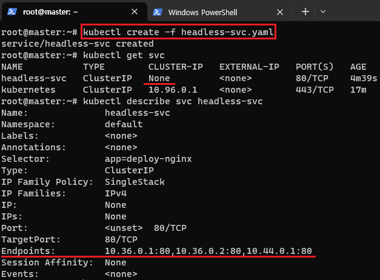
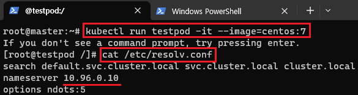
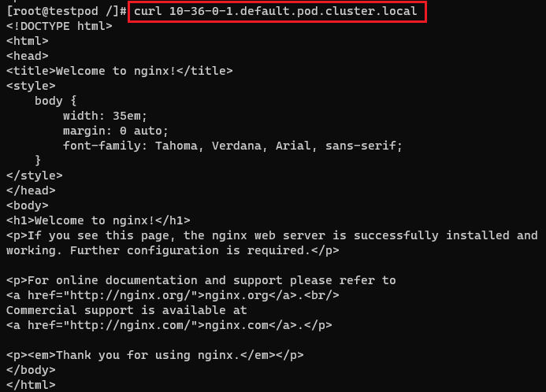

[뒤로가기](../../README.md)<br>

# Headless Service

단일 진입점을 만들어주지만 ClusterIP를 생성하지 않고<br>
대신 Service와 연결된 Pod의 endpoint로 DNS 레코드가 생성됨<br>
Pod의 DNS 주소 : pod-ip-addr.namespace.pod.cluster.local<br>

Pod들의 endpoint에 DNS resolving service를 지원<br>

### headless yaml 파일

```
apiVersion: v1
kind: Service
metadata:
  name: headless-svc
spec:
  type: ClusterIP
  clusterIP: None
  selector:
    app: deploy-nginx
  ports:
  - protocol: TCP
    port: 80
    targetPort: 80
```



> kubectl create -f headless-svc.yaml

clutserIP는 없지만 endpoint로 Pod들이
묶인것을 볼 수 있다.<br>



> kubectl run testpod -it --image=centos:7

새로운 Pod를 생성한뒤 다른 Pod에 DNS로 접속해본다.



> curl 10-36-0-1.default.pod.cluster.local
