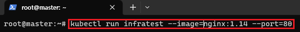
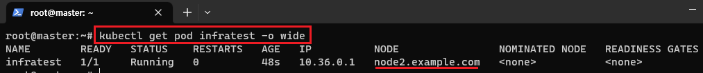
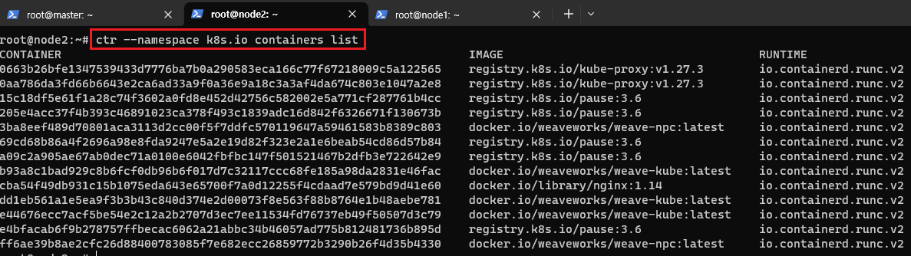

[뒤로가기](../../README.md) 

<<<<<<< HEAD
[뒤로가기](../../)\
=======
# infra container (pause)
>>>>>>> parent of 4d4a984 (GITBOOK-5: change request with no subject merged in GitBook)

Pod를 생성하면 pause 컨테이너가 자동으로 생성된다. 
pause 컨테이터는 해당 Pod에대한 ip, 호스트등을 관리해주는 컨테이너이다. 

## 예시

<<<<<<< HEAD
Pod를 생성하면 pause 컨테이너가 자동으로 생성된다.\
pause 컨테이터는 해당 Pod에대한 ip, 호스트등을 관리해주는 컨테이너이다.\

### 예시

=======

>>>>>>> parent of 4d4a984 (GITBOOK-5: change request with no subject merged in GitBook)

> kubectl run infratest --image:nginx:1.14 --port=80

nginx이미지를 사용하는 Pod를 생성했다.

<<<<<<< HEAD

=======

>>>>>>> parent of 4d4a984 (GITBOOK-5: change request with no subject merged in GitBook)

> kubectl get pod infratest -o wide

Pod를 확인하면 node2에서 실행한다. 
node2에 들어가본다. 

<<<<<<< HEAD

=======

>>>>>>> parent of 4d4a984 (GITBOOK-5: change request with no subject merged in GitBook)

> ctr --namespace k8s.io containers list

실제로 node2에 pause들이 생성되있는것을 볼 수 있다.
