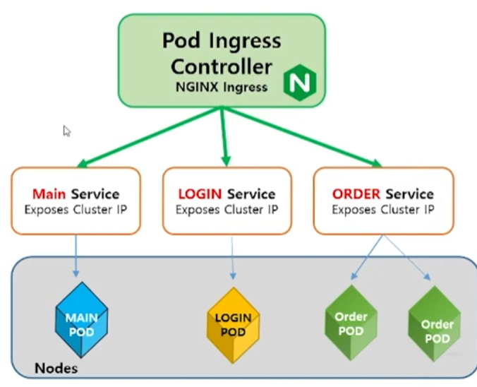
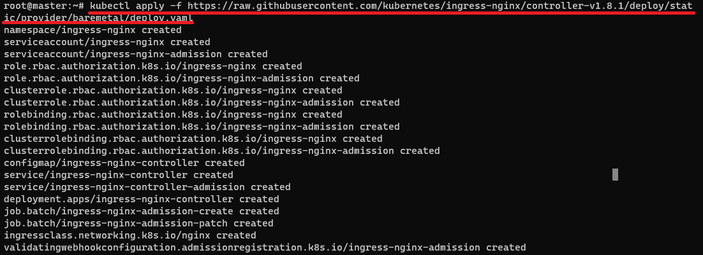
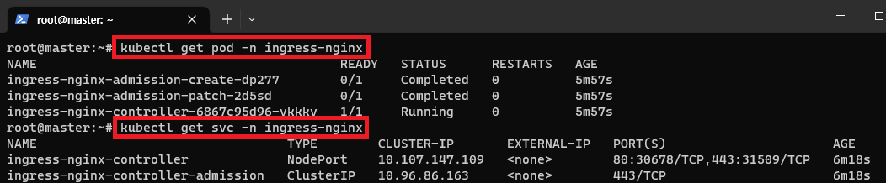

[뒤로가기](../../README.md) 

# Ingress

HTTP,HTTPS를 통해 클러스트 내부의 서비스를 외부로 노출시키는 기능

- Service에 외부 URL을 제공
- 트래픽을 LoadBalancing
- SSL 인증서 처리
- Virtual hosting 지정

### 동작 방식

ClusterIP로 Pod를 묶으면 내부에서 연결은 되지만, 외부에서 접근이 불가능하다. 
 

> www.example.com/main  www.example.com/login  www.example.com/order 

이런식으로 MainPage, LoginPage등 여러 Pod들이 구성되어 각자 ClusterIP로 묶여 서비스가 되고 있을때
해당 기능들을 통합해서 외부 접속을 처리해준다. 

## Ingress Controller 설치

Ingress Controller의 종류는 많다. 
그중에서 k8s에서 프로젝트관련해서 지원해주는 서비스중에 AWS, GCE, NGINX가 있다. 
여기서 NGINX를 사용한다.

[Nginx Ingress](https://github.com/kubernetes/ingress-nginx/blob/main/README.md#readme)

Private 환경일 경우 Bare-metal을 사용한다. 
[Nginx Bare-Metal](https://kubernetes.github.io/ingress-nginx/deploy/#bare-metal-clusters)

 

> kubectl apply -f https://raw.githubusercontent.com/kubernetes/ingress-nginx/controller-v1.8.1/deploy/static/provider/baremetal/deploy.yaml

 
정삭적으로 설치되어 ingress Controller와
Service가 실행중인것을 확인할 수 있다. 
