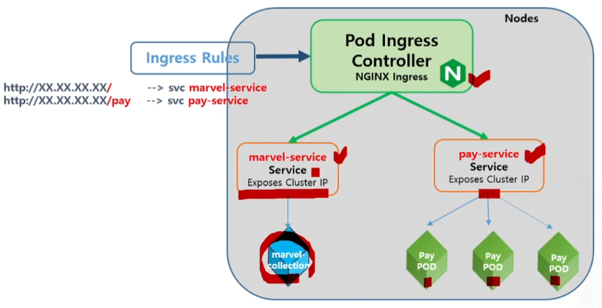
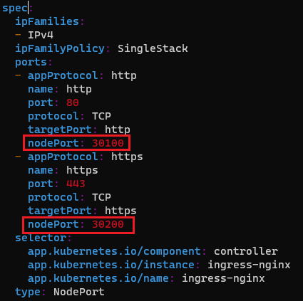
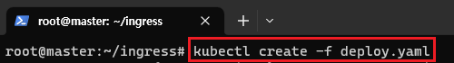
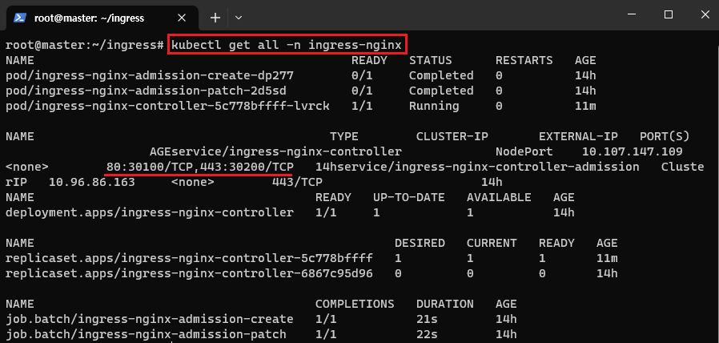
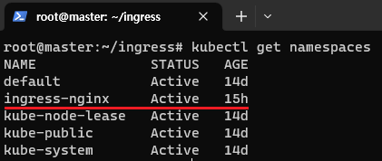
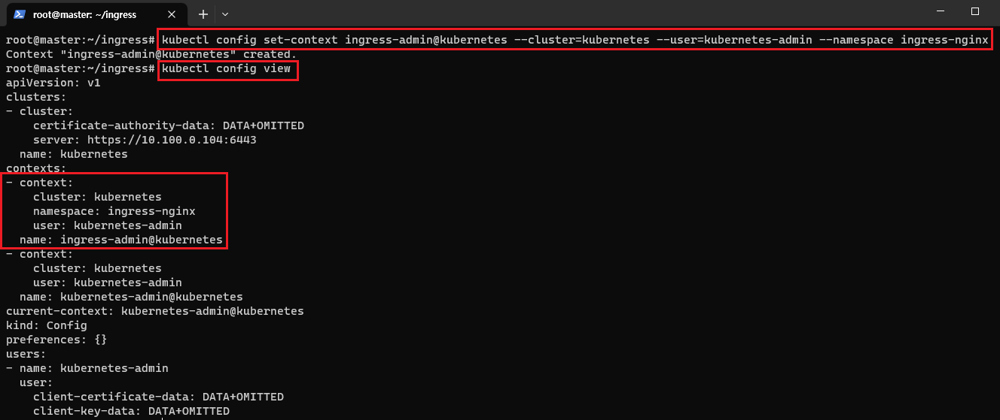
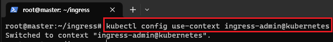
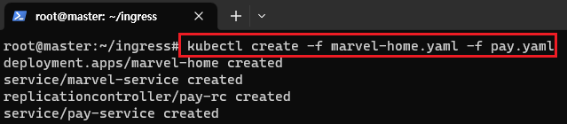
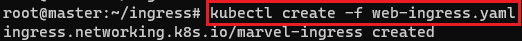
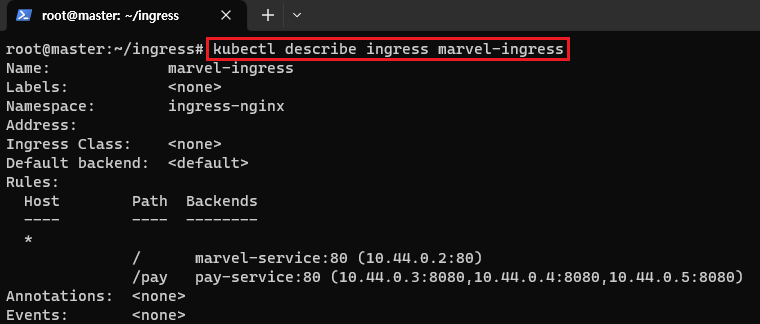

[뒤로가기](../../README.md)<br>

# Ingress WebService

## 구성도



## 시작

### (1) 고정 NodePort



ingress Controller 관련 설정 파일인 deploy.yaml에서 nodePort를 두개 추가했다.<br>

> wget https://raw.githubusercontent.com/kubernetes/ingress-nginx/controller-v1.8.1/deploy/static/provider/baremetal/deploy.yaml



> kubectl create -f deploy.yaml

or

> kubectl apply deploy.yaml

외부에서 포트포워딩하려면 Port가 정해져 있어야한다.<br>



30100Port로 들어오면 80 Port로 이동<br>
30200Port로 들어오면 443 Port로 이동하도록 고정 NodePort를 생성했다.<br>

### (2) NameSpace 변경



Default NameSpace에서 ingress로 변경한다.<br>



> kubectl config set-context ingress-admin@kubernetes --cluster=kubernetes --user=kubernetes-admin --namespace ingress-nginx

우선 config에 ingress-nginx namespaces를 사용하는 Context를 추가해야한다.



> kubectl config use-context ingress-admin@kubernetes

그리고 방금 생성한 context로 전환한다.

### Ingress yaml 파일

```
apiVersion: networking.k8s.io/v1
kind: Ingress
metadata:
  name: marvel-ingress
spec:
  rules:
    - http:
        paths:
          - path: /
            pathType: Prefix
            backend:
              service:
                name: marvel-service
                port:
                  number: 80
          - path: /pay
            pathType: Prefix
            backend:
              service:
                name: pay-service
                port:
                  number: 80
```

### marvel-home yaml 파일

```
apiVersion: apps/v1
kind: Deployment
metadata:
  name: marvel-home
spec:
  replicas: 1
  selector:
    matchLabels:
      name: marvel
  template:
    metadata:
      labels:
        name: marvel
    spec:
      containers:
      - image: smlinux/marvel-collection
        name: marvel-container
        ports:
        - containerPort: 80
---
apiVersion: v1
kind: Service
metadata:
  name: marvel-service
spec:
  ports:
  - port: 80
    protocol: TCP
    targetPort: 80
  selector:
    name: marvel
```

### pay yaml 파일

```
apiVersion: v1
kind: ReplicationController
metadata:
  name: pay-rc
spec:
  replicas: 3
  template:
    metadata:
      labels:
        app: pay
    spec:
      containers:
      - image: smlinux/pay
        name: pay
        ports:
        - containerPort: 8080
---
apiVersion: v1
kind: Service
metadata:
  name: pay-service
spec:
  ports:
  - port: 80
    targetPort: 8080
  selector:
    app: pay
```



> kubectl create -f marvel-home.yaml -f pay.yaml

marvle과 pay yaml을 실행한다.



> kubectl create -f web-ingress.yaml

ingress도 실행한다.



> kubectl describe ingress marvel-ingress

동작이 되는것을 확인한다.

### 현재 포트포워딩이 안되어 서버 배포가 안된다...

