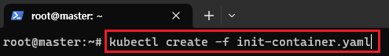
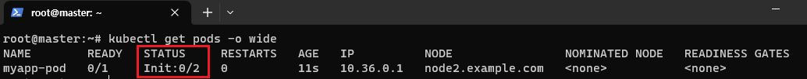
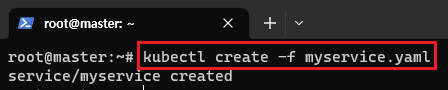
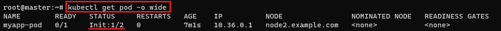
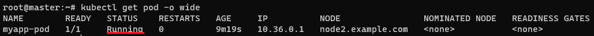
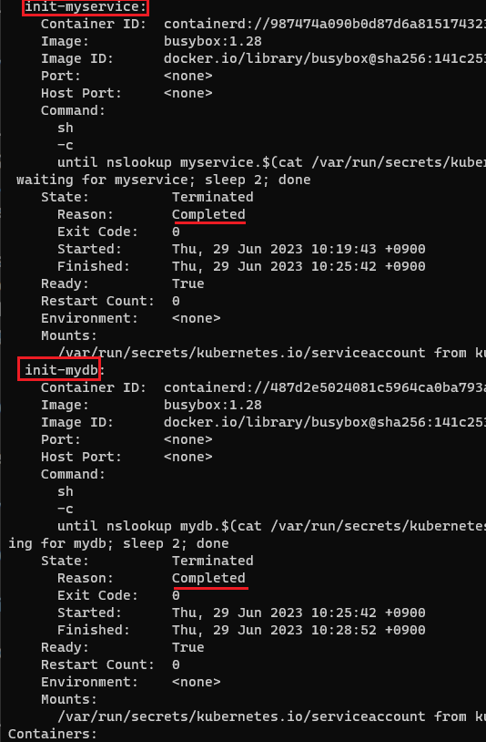

[뒤로가기](../../README.md)<br>

<<<<<<< HEAD
[뒤로가기](../../)\
=======
# init container
>>>>>>> parent of 4d4a984 (GITBOOK-5: change request with no subject merged in GitBook)

main 컨테이너를 실행하기 전에 필요한 초기 세팅을 구동하는 컨테이너<br>
main 컨테이너 실행전에 사전 작업이 필요할 경우 사용한다.<br>

### 예시

[init container 문서](https://kubernetes.io/ko/docs/concepts/workloads/pods/init-containers/)

실행할 pod.yaml 파일

```
apiVersion: v1
kind: Pod
metadata:
  name: myapp-pod
  labels:
    app.kubernetes.io/name: MyApp
spec:
  containers:
  - name: myapp-container
    image: busybox:1.28
    command: ['sh', '-c', 'echo The app is running! && sleep 3600']
  initContainers:
  - name: init-myservice
    image: busybox:1.28
    command: ['sh', '-c', "until nslookup myservice.$(cat /var/run/secrets/kubernetes.io/serviceaccount/namespace).svc.cluster.local; do echo waiting for myservice; sleep 2; done"]
  - name: init-mydb
    image: busybox:1.28
    command: ['sh', '-c', "until nslookup mydb.$(cat /var/run/secrets/kubernetes.io/serviceaccount/namespace).svc.cluster.local; do echo waiting for mydb; sleep 2; done"]
```

> ['sh', '-c', "until nslookup myservice.$(cat /var/run/secrets/kubernetes.io/serviceaccount/namespace).svc.cluster.local; do echo waiting for myservice; sleep 2; done"]

myservice가 실행되지 않으면 $(cat /var/run/secrets/kubernetes....local; 해당 명령어를 계속 실행한다.

> ['sh', '-c', "until nslookup mydb.$(cat /var/run/secrets/kubernetes.io/serviceaccount/namespace).svc.cluster.local; do echo waiting for mydb; sleep 2; done"]

mydb가 실행되지 않으면 $(cat /var/run/secrets/kubernetes....local; 해당 명령어를 계속 실행한다.

두개의 init Container가 모두 실행되야 myapp-container가 실행된다.

<<<<<<< HEAD

=======

>>>>>>> parent of 4d4a984 (GITBOOK-5: change request with no subject merged in GitBook)

> kubectl create -f init-container.yaml

해당 yaml파일을 실행한다.

<<<<<<< HEAD

=======

>>>>>>> parent of 4d4a984 (GITBOOK-5: change request with no subject merged in GitBook)

> kubectl get pods -o wide

pod를 확인하면 init이 생겼다.<br>
그리고 init이 실행이 안되니 main도 실행이 안되는것을 확인할 수 있다.<br>

그리고 myservice와 mydb를 실행한뒤에 결과도 보겠다.<br>

myservice에 대한 pod yaml파일이다.

```
apiVersion: v1
kind: Service
metadata:
  name: myservice
spec:
  ports:
  - protocol: TCP
    port: 80
    targetPort: 9376
```

<<<<<<< HEAD

=======

>>>>>>> parent of 4d4a984 (GITBOOK-5: change request with no subject merged in GitBook)

> kubectl create -f myservice.yaml

myservice를 실행했다.<br>



<<<<<<< HEAD


실제로 init에서 1개가 완료된것을 볼 수 있다.\

=======
실제로 init에서 1개가 완료된것을 볼 수 있다.<br>
>>>>>>> parent of 4d4a984 (GITBOOK-5: change request with no subject merged in GitBook)

mydb에 대한 pod yaml파일이다.

```
apiVersion: v1
kind: Service
metadata:
  name: mydb
spec:
  ports:
  - protocol: TCP
    port: 80
    targetPort: 9377
```

<<<<<<< HEAD

=======

>>>>>>> parent of 4d4a984 (GITBOOK-5: change request with no subject merged in GitBook)

mydb도 실행하면 이렇게 main 컨테이너가 실행되는것을 볼 수 있다.<br>



<<<<<<< HEAD


실제로 init 컨테이너들이 completed가 된것을 볼 수있다.\
=======
실제로 init 컨테이너들이 completed가 된것을 볼 수있다.<br>
>>>>>>> parent of 4d4a984 (GITBOOK-5: change request with no subject merged in GitBook)
