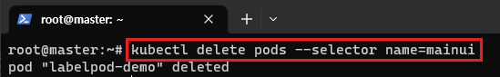

[뒤로가기](../../README.md)<br>

# label

- Node를 포함하여 Pod, Deployment등 모든 리소스에 할당
- 리소스의 특성을 분류하고 Selector로 선택
- key-value로 적용

실제 현장에서는 많은 Pod들이 사용된다.<br>
그리고 해당 Pod들의 목적에 맞게 분류하기 위해서 Lable을 사용한다.<br>

Lable의 종류

rel = stable, beta, canary<br>
name = mainui, product, order, account, shopingcart 등등 원하는 이름으로 설정하면 된다.<br>

예들들어 rel=stable, name=product인 Pod만 선택하는 방식<br>

적어도 두개 이상의 lable을 사용해야된다.<br>

```
metadata:
   lables:
      rel: stable
      name: mainui
```

```
selector:
   matchLables: # label로 표현
       key: value
    matchExpressions: # 수식으로 표현
       - {key: name, operator: In, values: [mainui]}
       - {key: rel, operator: NotIn, values: ["beta","canary"]}
```

다음과 같이 selector에서 lable을 기준으로 검색할 수 있다.<br>


[k8s 공식 문서](https://kubernetes.io/ko/docs/concepts/overview/working-with-objects/labels/)를 확인하면 다양한 label를 사용할 수 있다.<br>

Label 예시 yaml 파일

```
apiVersion: v1
kind: Pod
metadata:
  name: label-demo
  labels:
    environment: production
    app: nginx
spec:
  containers:
  - name: nginx
    image: nginx:1.14.2
    ports:
    - containerPort: 80
```

<br>

> kubectl get pod --show-labels

run으로 만든 Pod는 label이 자동으로 붙여진다.<br>

<br>

> kubectl get pods --selector name=mainui

다음과 같이 selector 명령어로 해당 label이 붙여진 Pod를 검색할 수 있다.<br>

<br>

> kubectl delete pods --selector name=mainui

그래서 selector를 통해 해당 label이 포함된 Pod들을 모두 찾아 관리할 수 있다.<br>

<br>

> kubectl label pod pod-demo name=test

또한, Pod, Deploy, Service, Node등에 CMD로 label을 추가할 수 있다.<br>

<br>

> kubectl label pod pod-demo name=mainui --overwrite

이미 존재하는 label을 수정할때는 똑같은 명령어로
overwrtie을 붙여 덧붙여 써야한다.<br>

<br>

> kubectl label pod pod-demo name-

label을 삭제할때는 key- 로 삭제하면 된다.

---

## WorkerNode Label

WorkerNode의 특성을 Label로 설정<br>
Node를 선택해서 Pod를 배치할 수 있다.<br>

각 WorkerNode의 사양이 다르면 각 Node별로 관리할 필요가 있다.<br>
그때 Label를 사용해 관리한다.<br>

예를들어 AI 모델학습을 하는 Pod를 실행할때<br>
고사양 GPU가 있는 WorkerNode에 Pod 실행을 요청해야한다.<br>
그때 Label을 사용한다.<br>

<br>

> kubectl get nodes --show-labels

k8s가 각 Node들의 사양에 맞춰 이미 Label을 설정해놨다.<br>

여기서 Node1은 gpu: true, disk: ssd
Node2는 gpu:true Label을 설정해본다.<br>

<br>

> kubectl label node node1.example.com gpu=true disk=ssd<br>
> kubectl label node node2.example.com gpu=true<br>

<br>

> kubectl get nodes -L disk,gpu

보기 불편하면 Label의 Key에 대한 Node들의 정보를 확인하면 된다.<br>

```
apiVersion: v1
kind: Pod
metadata:
  name: gpussd-pod
spec:
  containers:
  - name: nginx
    image: nginx:1.14
    ports:
    - containerPort: 80
  nodeSelector:
   gpu: true
   disk: ssd
```

해당 yaml을 실행하면 nodeSelector 기준에 따라 Node1에 실행된다.

<br>

# annotation

Label과는 달리 릴리즈, 로깅, 모니터링등 관리에 필요한 정보를 기록할 용도로 사용<br>
Label과 동일하게 key-value를 통해 리소스의 특성을 기록<br>

예를 들어 Deployment의 rolling update에 정보를 기록

```
apiVersion: v1
kind: Pod
metadata:
  name: annotation-pod
  annotations:
    imageregistry: "https://hub.docker.com/"
    bulider: "Chuhuiwon"
    buildDate: "20230706"
spec:
  containers:
  - name: nginx
    image: nginx:1.14
    ports:
    - containerPort: 80
```

<br>

보통<br>
kubernetes.io/change-cause: version 1.17<br>
imageregistry: "https://hub.docker.com/"<br>
bulider: "Chuhuiwon"<br>
buildDate: "20230706"<br>

이런식으로 기록한다.
