[뒤로가기](../../README.md)<br>

# Service

Pod를 묶어주는 Virtual IP

Deploy Controller로 동일한 Pod를 실행했을때<br>
<br>
서로 다른 IP를 가지며 배포가 된다.<br>
하지만, 만약 한 Pod에만 집중적으로 사용되게 되면
성능이 좋지 않다.<br>
동일한 Pod에 대해서는 균등하게 처리할 수 있도록
분산처리가 되게 해야한다.<br>

해당 분산 처리를 서비스를 통해 요청하게 된다.<br>
3개의 Pod에 대한 IP를 묶어 관리해 단일 진입점을 제공한다.<br>

<br>
LoadBalancer 기능을 하는 가상 IP를 생성한뒤<br>
해당 IP들을 묶어 균등하게 처리할 수 있도록 관리하게 된다.

## kube-proxy

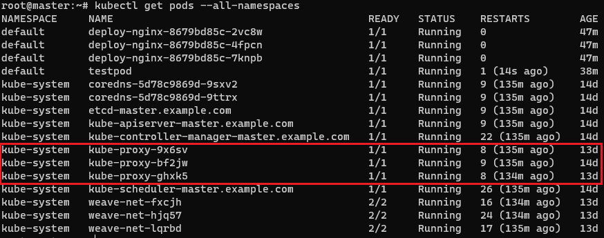<br>

master, workernode에는 모두 kube-porxy가 있다.
kube-porxy는 clusterIP 서비스와 같은 서비스를 요청하게되면 kube-porxy가 동작하여
node에 iptables의 rule을 만든다.

그리고 접속하게되면 iptables rule에따라 접속하게 된다.

> iptables -t nat -S | grep 80

1. Service를 만들게 되면 iptables rule을 만든다.
2. NodePort에 대한 응답에 대기하며 접속하면 pod와 연결 시켜준다.

## kube-proxy mode

### userspace

클라이언트의 서비스 요청을 iptables를 거쳐 kube-proxy가 받아서 연결<br>
초기 버전에 사용했음<br>

### iptables

default k8s 네트워크 모드<br>
service API 요청시 iptables rule이 생성<br>
클라이언트 연결은 kube-proxy가 받아서 iptables rule을 통해 연결<br>

### IPVS

리눅스 커널이 지원하는 L4 LoadBalance 기술을 이용<br>
별도의 ipvs 지원 모듈을 설정한 후 적용 가능<br>

## Service Type

### (1) ClusterIP(default)

selector의 label이 동일한 Pod들의 그룹을 묶어
단일 진입점(Virtual IP) 생성<br>
클러스터 내부에서만 사용 가능<br>
type 생략시 default값으로 10.96.0.0/12 범위에서 할당<br>
충돌을 예방하기위해 대체로 clusterIP는 랜덤값을 받기위해 생략한다.<br>

### deployment yaml 파일 예시

<br>

### ClusterIP yaml 파일

```
apiVersion: v1
kind: Service
metadata:
  name: deploy-svc
spec:
  type: ClusterIP
  clusterIP: 10.96.100.100
  selector:
    app: deploy-nginx # 해당 app명을 기준으로 Pod를 묶는다.
  ports:
  - protocol: TCP
    port: 80 # clusterIP의 Port
    targetPort: 80 # Pod들의 Port
```

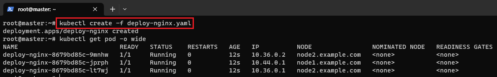<br>

> kubectl create -f deploy-nginx.yaml

Deploy로 Pod들을 생성한다.

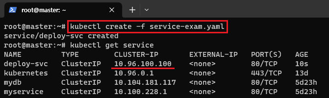<br>

> kubectl create -f service-exam.yaml

서비스를 생성하자 등록된것을 볼 수 있다.

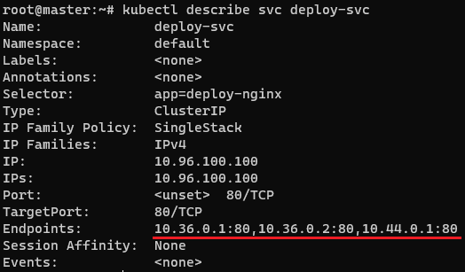<br>

> kubectl describe svc deploy-svc

Deploy Pod들의 IP들이 등록된것을 볼 수 있다.

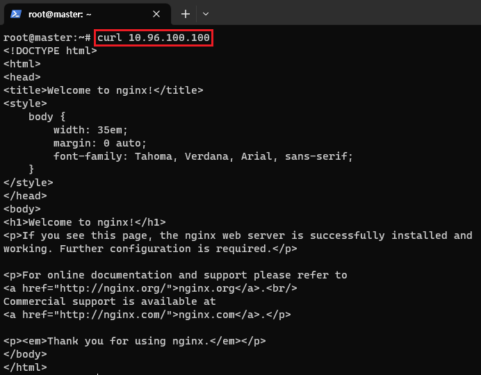<br>

> curl 10.96.100.100

접속도 잘된다.<br>

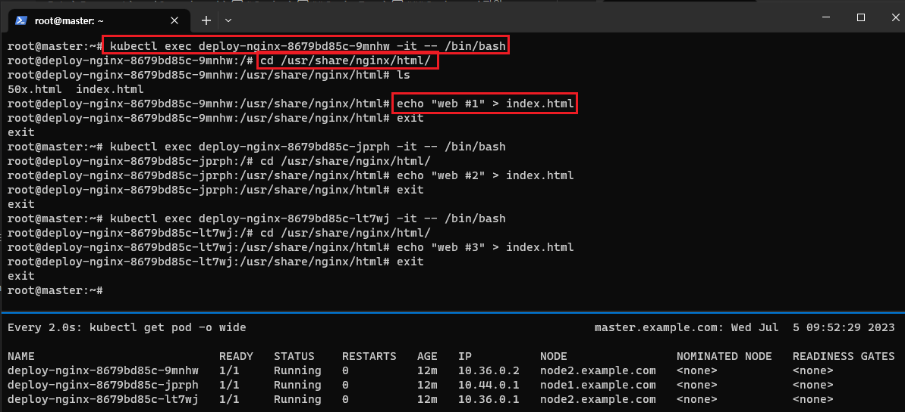<br>

테스트를 위해 각 Pod들에 접속해 html을 변경했다.<br>

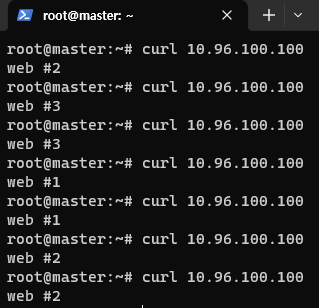<br>

LoadBalance같이 랜덤하게 동작하는 것을 볼 수 있다.<br>

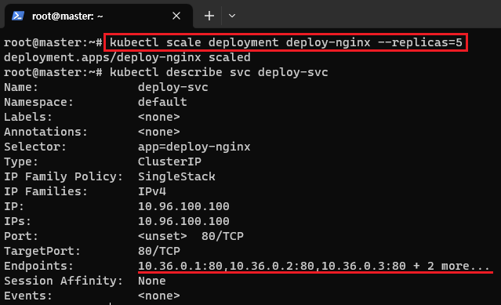<br>

또한, Deploy의 갯수를 늘리자 service도 자동으로 갯수가 늘어난다.<br>

### (2) NodePort

모든 Worknode를 대상으로 외부 접속 가능한 Port를 예약<br>
Default NodePort 범위 : 30000 - 32767<br>
ClusterIP를 생성 후 NodePort를 예약한다.<br>

외부에 접속이 가능하도록 Port 번호를 할당한다.

### NodePort yaml 파일

```
apiVersion: v1
kind: Service
metadata:
  name: deploy-svc
spec:
  type: NodePort
  clusterIP: 10.96.100.100
  selector:
    app: deploy-nginx
  ports:
  - protocol: TCP
    port: 80 # clusterIP의 Port
    targetPort: 80
    nodePort: 30200 # 생략가능
```

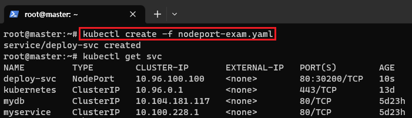<br>

> kubectl create -f nodeport-exam.yaml

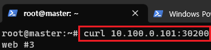<br>

(3) LoadBalancer<br>
AWS, Azure, GCP, OpenStack 등의 Public Cloud에서 적용<br>
NodePort를 예약 후 해당 Nodeport로 외부 접근을 허용한다.<br>

해당 외부 접근이 가능한 LoadBalancer를 구성하게된다.<br>

### LoadBalancer yaml 파일

```
apiVersion: v1
kind: Service
metadata:
  name: deploy-svc
spec:
  type: LoadBalancer
  selector:
    app: deploy-nginx
  ports:
  - protocol: TCP
    port: 80
    targetPort: 80
```

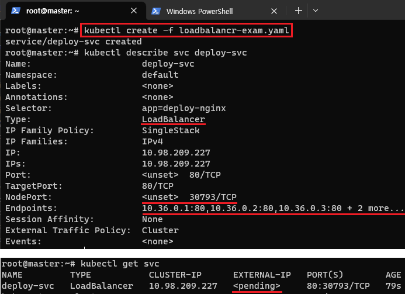<br>

> kubectl create -f loadbalancr-exam.yaml

LoadBalancer를 통해 CluseterIP, NodePort를 자동으로 구성해주고<br> 외부에 접속가능하게 LoadBalancer까지 구성해준다.<br>
하지만, public 환경이 아니라서 외부 IP는 보류중으로 뜬다.<br>

(4) ExternalName<br>
클러스터 내부에서 외부에 접속시 사용할 도메인 등록<br>
클러스터 도메인이 실제 외부 도메인으로 치환되어 동작<br>

### ExternalName yaml 파일

```
apiVersion: v1
kind: Service
metadata:
  name: external-svc
spec:
  type: ExternalName
  externalName: google.com
```

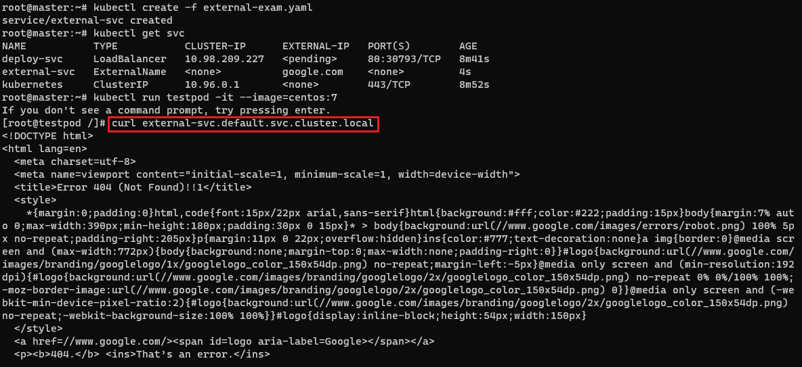<br>

> curl external-svc.default.svc.cluster.local

실제 google 사이트로 등록한 도메인으로 포워딩되어 들어가게된다.<br>
