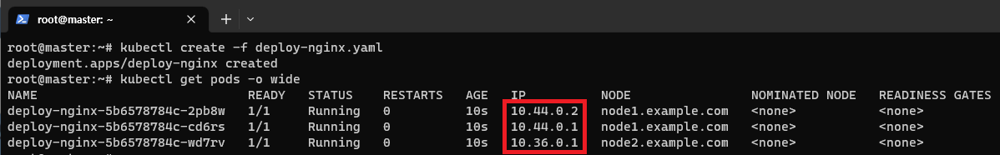
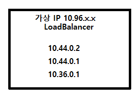
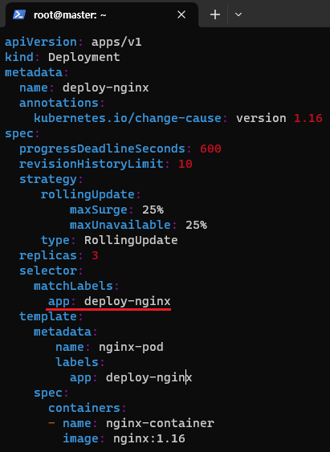

[뒤로가기](../../README.md)<br>

# Service

동일한 서비스를 제공하는 Pod 그룹의 단일 진입점을 제공

Deploy Controller로 동일한 Pod를 실행했을때<br>
<br>
서로 다른 IP를 가지며 배포가 된다.<br>
하지만, 만약 한 Pod에만 집중적으로 사용되게 되면
성능이 좋지 않다.<br>
동일한 Pod에 대해서는 균등하게 처리할 수 있도록
분산처리가 되게 해야한다.<br>

해당 분산 처리를 서비스를 통해 요청하게 된다.<br>
3개의 Pod에 대한 IP를 묶어 관리해 단일 진입점을 제공한다.<br>

<br>
LoadBalancer 기능을 하는 가상 IP를 생성한뒤<br>
해당 IP들을 묶어 균등하게 처리할 수 있도록 관리하게 된다.

## Service Type

### (1) ClusterIP(default)

Pod 그룹의 단일 진입점(Virtual IP) 생성<br>

(2) NodePort<br>
ClusterIP가 생성된 후 모든 worker Node에 접속가능한 Port 예약<br>

(3) LoadBalancer<br>
AWS, Azure, GCP, OpenStack 클라우드에 적용<br>
LB를 자동으로 프로 비전하는 기능 지원<br>

(4) ExternalName<br>
클러스터 안에서 외부에 접속시 사용할 도메인 등록<br>
클러스터 도메인이 실제 외부 도메인으로 치환되어 동작<br>

### deployment Yaml 파일 예시

<br>

### Service Yaml 파일

```
apiVersion: v1
kind: Service
metadata:
  name: deploy-svc
spec:
  clusterIP: 10.96.100.100 # 가상 IP로 대체로 생략한다.
  selector:
    app: deploy-nginx # 해당 app명을 기준으로 Pod를 묶는다.
  ports:
  - protocol: TCP
    port: 80
    targetPort: 80
```
