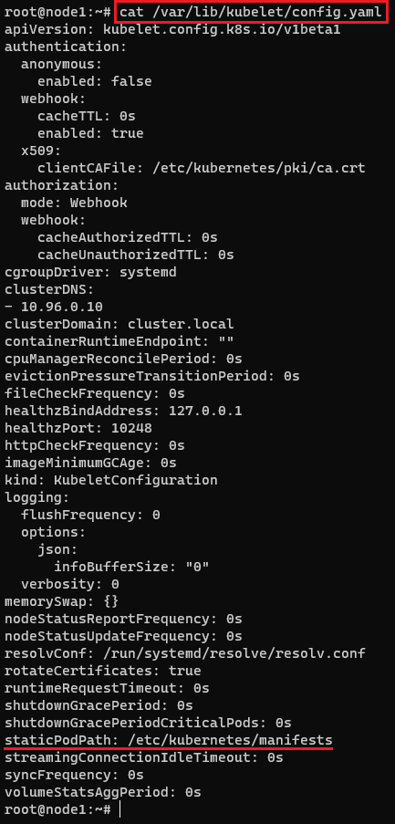

[뒤로가기](../../README.md)<br>

# Static Pod

Static Pod는 기존 Pod와 같이 API 서버 요청을 보내지 않는다.<br>
대신, workernode에는 kubelet이 관리하는 Static Pod 폴더가 있다.<br>
그리고 해당 폴더에 yaml파일이 있으면
해당 yaml파일로 Pod를 실행해준다.<br>

kubelet 데몬으로 실행되는 Pod를 Static Pod라 한다.



> cat /var/lib/kubelet/config.yaml

node1의 kubelet 환경 구성을 보면
staticPod의 폴더 경로가 나온다.<br>

이전에는 scheduler가 알아서 적절한 Node를 선택해 Pod를 생성했다.<br>
하지만 staticPod를 사용해 원하는 Node에 Pod를 생성할 수 있다.<br>

## [예시]

사용되는 Pod.yaml 파일

```
apiVersion: v1
kind: Pod
metadata:
  name: mypod
spec:
  containers:
  - image: nginx:1.14
    name: nginx
    ports:
    - containerPort: 80
```

<br>
Node1의 StaticPod 폴더로 이동한다.<br>

<br>
Pod.yaml파일을 StaticPod폴더에 생성했다.<br>

<br>
저장하는 순간 자동으로 Pod가 생성된다.<br>

또한, yaml파일을 삭제하면 자동으로 Pod가 삭제된다.

## [임의로 Static폴더 경로를 변경하는 법]

<br>

> vi /var/lib/kubelet/config.yaml

kubelete config파일을 수정한뒤 kubelet을 재시작하면 된다.<br>
