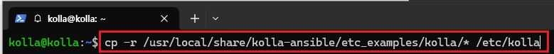
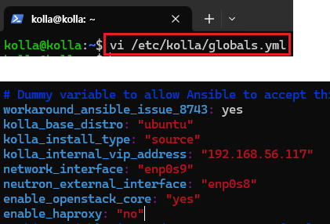
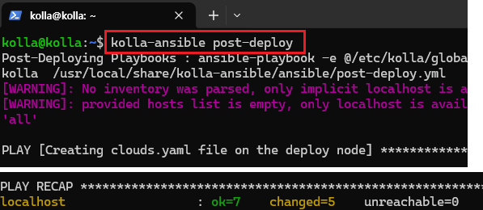

# Kolla Ansible
OpenStack 클라우드 운영을 위한 Docker 컨테이너 및 ansible 플레이북을 제공한다. <br>
기본적으로 매우 독립적이고 자유로운 커스텀마이징이 가능하다. <br>

## 기본 환경 설치 시작
kolla-ansible을 통해 기본적인 Openstack 환경을 구축한다.<br>
자세한 설정 과정은 추후 분석하면서 작성한다.<br>

### 설치 환경

HyperVisor : VirtualBox <br>
CPU : 2<br>
Memory : 10GB<br>
Network Device : enp0s3 - NAT, enp0s8 - External(Bridge), enp0s9 - Management(Host)<br>
Storage : SATA 50GB<br>
Ubuntu : ubuntu-22.04.4-live-server-amd64<br>

### 0. VM 설치 생략

### 1. 네트워크 설정
enp0s3은 패키지 설치용이고,<br>
enp0s8는 인터넷 통신을 위한 Provider 네트워크이다.<br>
enp0s9는 관리용 네트워크이며 각 컴포넌트가 서로 API 호출을 하는데 사용한다.<br>

<br>
네트워크 설정을 위해 netplan의 00-installer-config.yaml를 편집한다.<br>
```
sudo vi /etc/netplan/00-installer-config.yaml
```
<br>
enp0s8 : provider 네트워크이기에 IP 주소를 생략한다.<br>
(추후, neutron 구성시 설정한다.)<br>
enp0s9 : 관리용 네트워크이기에 고정 IP로 설정한다.<br>
```
network:
  version: 2
  renderer: networkd
  ethernets:
    enp0s3:
      dhcp4: true
    enp0s8:
      dhcp4: false
      dhcp6: false
    enp0s9:
      dhcp4: false
      dhcp6: false
      addresses:
        - 192.168.56.117/24
```
<br>
설정한 네트워크를 적용한다.<br>
(SSH 통신이 끊어질것이다. 192.168.56.117로 다시 접속한다.)
```
sudo netplan apply
```
<br>
통신을 체크한다.
```
ping 8.8.8.8
```

### 2. 패키지 설치

<br>
패키지를 업데이트 한다.
```
sudo apt update
```
<br>
환경 구성에 필요한 패키지들을 설치한다.
```
sudo apt-get install git python3-dev libffi-dev gcc libssl-dev python3-pip
```
<br>
파이썬 패키지 관리 시스템인 pip를 최신 버전으로 업그레이드 한다.
```
sudo pip install -U pip
```
### 2. ansible 설치 및 환경 구성

<br>
ansible을 설치한다.
```
sudo apt install ansible
```
<br>
현재 kolla-ansible은 ansible-core 2.14 ~ 2.16까지 지원한다.<br>
그러니 버전을 꼭 확인한다.<br>
(버전 관련해서 pip install 'ansible==7.0'를 설치하고<br>
pip uninstall ansible을해서 ansible-core의 버전을 맞췄다.)<br>
```
ansible --version
```
또한, ansible 구성 파일인 cfg파일 등록이 안되어 있다. (config file = None)<br>
기본적으로 ansible은 /etc/ansible/ansible.cfg를 먼저 적용한다.<br>
ansible.cfg를 생성하기위해 ansible 폴더를 생성한다.<br>

<br>
```
sudo mkdir /etc/ansible
```
<br>
ansible.cfg를 생성하고 다음과 같이 입력한다.<br>
```
sudo vi /etc/ansible/ansible.cfg
```

```
[defaults]
host_key_checking=False
pipelining=True
forks=100
```
<br>
다시 버전을 확인하면서 생성한 ansible.cfg가 등록되었는지 확인하다.<br>
```
ansible --version
```
### 3. kolla-ansible 설치 및 구성

<br>
kolla-ansible 최신 버전을 설치한다.<br>
```
sudo pip install git+https://opendev.org/openstack/kolla-ansible@master
```
<br>
kolla-ansible에서 기본적인 openstack 구축을 위한 all-in-one 인벤토리 파일을 적용해 구축한다.<br>
그래서, 해당 설정 파일들을 복사하기 위해 kolla 폴더를 생성한다.<br>
```
sudo mkdir -p /etc/kolla
```
<br>
접근 권한도 수정해준다.<br>
```
sudo chown $USER:$USER /etc/kolla
```
<br>
오픈스택 환경 구성 파일인 globals.yml과 패스워드 관련 파일인 yml이 저장된
폴더를 복사한다.<br>
```
cp -r /usr/local/share/kolla-ansible/etc_examples/kolla/* /etc/kolla
```

<br>
인벤토리 폴더도 복사해 저장한다.

```
cp /usr/local/share/kolla-ansible/ansible/inventory/* /etc/kolla
```
<br>
kolla-ansible 관련 종속 모듈을 설치한다.<br>
```
kolla-ansible install-deps
```
<br>
오픈스택의 모든 비밀번호는 /etc/kolla/passwords.yml에 저장된다.<br>
하지만, 기본적으로 비어있기에 임의의 비밀번호를 생성한다.<br>
또한, database와 admin 따로 비밀번호를 수정한다.<br>
(admin은 대시보드 접근을 위한 설정)<br>
```
kolla-genpwd
```
<br>
passwords.yml를 편집해 각 항목들의 비밀번호를 수정한다.
```
vi /etc/kolla/passwords.yml

database_password: 1q2w3e4r

keystone_admin_password: 1q2w3e4r
```
<br>
실제 openstack의 구성 요소를 설정하는 파일이다.<br>
다음과 같이 입력하고 저장한다.<br>
```
vi /etc/kolla/globals.yml

workaround_ansible_issue_8743: yes
kolla_base_distro: "ubuntu"
kolla_install_type: "source"
kolla_internal_vip_address: "192.168.56.117"
network_interface: "enp0s9"
neutron_external_interface: "enp0s8"
enable_openstack_core: "yes"
enable_haproxy: "no"
```
### 4. 구성 설치 및 배포
----
설치를 진행하기전에 만약 오류가 발생하면,<br>
```
kolla-ansible destroy -i all-in-one --yes-i-really-really-mean-it
```
해당 명령어로 설치 모듈을 삭제한뒤, 재부팅하여 진행하자.<br>

----

<br>
kolla 배포에 필요한 종속 모듈을 설치한다.<br>
```
kolla-ansible -i /etc/kolla/all-in-one bootstrap-servers
```
<br>
설치가 완료되면 다음과 같이 출력된다.<br><br>

<br>
구성 파일인 globals.yml의 설정 오류가 있는지 체크한다.<br>

```
kolla-ansible -i /etc/kolla/all-in-one prechecks
```
<br>
이상이 없으면 다음과 같이 출력된다.<br><br>

<br>
배포를 시작한다.<br>
```
kolla-ansible -i /etc/kolla/all-in-one deploy
```
<br>
배포가 완료되면 다음과 같이 출력된다.<br>

### 5. 테스트
<br>
기본적인 CLI 인증 쉘을 생성한다. (admin-openrc.sh)<br>
```
kolla-ansible post-deploy
```
<br>
openstack API 명령어 사용을 위해 openstack client을 설치한다.<br>
```
sudo apt install python3-openstackclient -y
```
<br>
아까 생성한 인증쉘을 적용한다. (환경 변수 설정)<br>
```
source /etc/kolla/admin-openrc.sh
```
<br>
openstack에 구성된 컴포넌트를 출력한다.<br>
heat-cfn을 제외한 기본적인 환경이 구성되었다.<br>
```
openstack endpoint list
```
<br>
대시보드 접속을 위해 horizon의 URL을 확인한다.<br>
192.168.56.117:80에 접속해보자.
```
sudo cat /etc/kolla/horizon/horizon.conf
```
<br>
접속한뒤, 사용자 이름은 admin, 아까 작성한 admin 비밀번호를 입력한다.

<br>
접속이 잘되는것을 확인할 수 있다.


