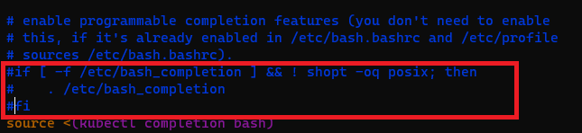

[뒤로가기](../../README.md)

# kubectl 명령어

k8s 클러스터를 제어하기위한 커맨드 라인 도구

## 명령어 기본 구조

### kubectl [command] [type] [name] [flags]

command : obj에 실행할 명령어 (create, get, delete, edit....) 
type : obj 종류 (node, pod, service....) 
name : obj 이름 (웹서버같은 이름) 
flags : 부가적인 옵션 (-o options) 
예시) kubectl get pod webserver -o wide 
webserver의 pod정보를 자세하고 보여주는 요청 

## kubectl 명령어 자동 완성

kubectl은 명령어에 대한 자동 완성 기능을 제공하지 않는다. 
자동 완성 기능을 추가해주자. 

### [kubectl cheatsheet](https://kubernetes.io/docs/reference/kubectl/cheatsheet/)

 
해당 부분들을 복사한다. 

> source <(kubectl completion bash) 
> echo "source <(kubectl completion bash)" >> ~/.bashrc 

 
master node에 입력한다. 

 
하지만, tab으로 자동 완성을 하면 에러가 난다. 

 

> type \_init_completion

으로 자동 완성 기능이 활성화되어 있는지 확인한다.
안되어있다.

 

> vi ~/.bashrc

bash 설정 파일에 들어간다.

 
해당 부분의 주석을 모두 풀고 저장한다. 

 

> exit 
> sudo su 
> kubectl api-re \<tab\> 

관리자 계정으로 재로그인 하면 잘 된다. 

### [명령어 약어 정보]

> kubectl api-resources

### [노드 정보 보기]

> kubectl get nodes

> kubectl get nodes -o wide

> kubectl describe node master.example.com

### [pod 정보 보기]

> kubectl get pods

> kubectl describe pods webserver

### [컨테이너 pod 만들기]

> kubectl run webserver --image=nginx:1.14 --port 80

run : 1개의 컨테이너 pod를 실행하거나 만드는 명령어 
nginx 이미지를 쓰고 80 port를 사용하는 webserver 컨테이너 생성 

 
실행중이다. 

 

> apt-get install elinks

elinks : 터미널에서 웹 브라우저를 볼 수 있는 패키지

 

> elinks 생성된 서버 IP

 
터미널에서 웹 브라우저를 볼 수 있다.

> kubectl create deployment mainui --image=httpd --replicas=3

create : 여러개를 만들때 사용한다. 
httpd 서버를 사용하고 mainui라는 이름의 웹서버를 3개 만든다. 

 
node1과 node2에 k8s가 알아서 제어하며 생성한다. 

 

> kubectl edit deployments.apps mainui

pod 환경을 설정할 수 있다. 

 

> kubectl run webserver --image=nginx:1.14 --port 80 --dry-run -o yaml > webserver-pod.yaml

--dry-run은 실행이 되는지 테스트를 한다. 

-o yaml > webserver-pod.yaml: 실행이 된다면
해당 pod의 정보를 저장하는 yaml파일을 만든다. 

 

> kubectl delete pod webserver

pod를 삭제한다.

 

> kubectl create -f webserver-pod.yaml

방금 생성한 yaml파일을 컨테이너 pod로 생성한다. 

### [컨테이너 내부 제어]

 

> kubectl exec webserver -it -- /bin/bash

 

> kubectl port-forward webserver 8080:80

포트포워드도 된다. 

